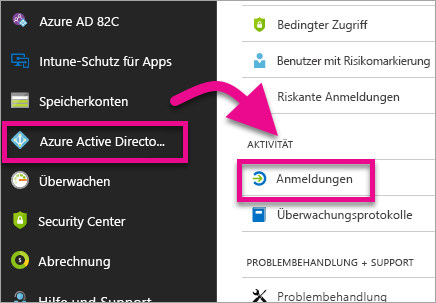
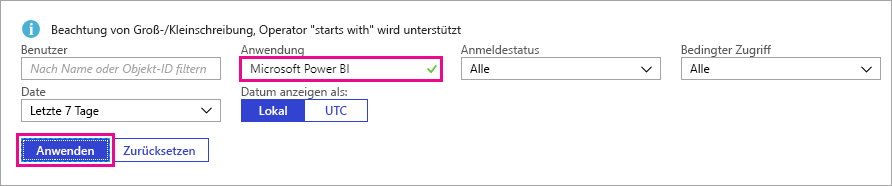
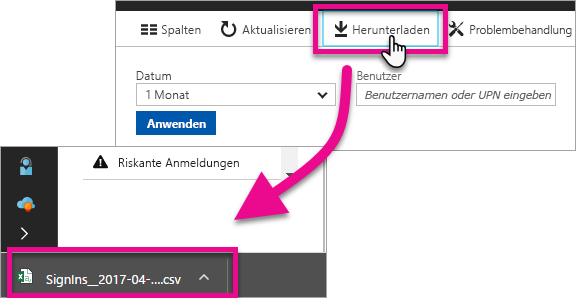

# Suchen nach angemeldeten Power BI-Benutzern
Wenn Sie Mandantenadministrator sind und sehen möchten, wer sich bei Power BI angemeldet hat, können Sie dazu die Azure Active Directory-Zugriffs- und -Verwendungsberichte verwenden.

<iframe width="640" height="360" src="https://www.youtube.com/embed/1AVgh9w9VM8?showinfo=0" frameborder="0" allowfullscreen></iframe>

Auf den Aktivitätsbericht können Sie sowohl aus dem [neuen](https://docs.microsoft.com/azure/active-directory/active-directory-reporting-activity-sign-ins) als auch aus dem [klassischen](https://docs.microsoft.com/azure/active-directory/active-directory-view-access-usage-reports) Azure AD-Portal (Azure Active Directory) zugreifen. Während im vorliegenden Video das klassische Portal als Beispiel verwendet wird, erfolgt die Beschreibung in diesem Artikel anhand des neuen Portals.

> [!NOTE]
> Dieser Aktivitätsbericht umfasst Power BI Free- und Pro-Benutzer, die Benutzer werden im Bericht jedoch nicht danach gekennzeichnet, welche Lizenz sie haben.
> 
> 

## Anforderungen
Die folgenden Anforderungen müssen erfüllt sein, um den Bericht über Anmeldeaktivitäten anzeigen zu können.

* Benutzer, die die Rolle „Globaler Administrator“, „Sicherheitsadministrator“ oder „Benutzer mit Leseberechtigung für Sicherheitsfunktionen“ haben, können auf die Daten zugreifen.
* Jeder Benutzer (Nicht-Administrator) kann auf seine eigenen Anmeldungen zugreifen.
* Für Ihren Mandanten ist eine ihm zugeordnete Azure AD Premium-Lizenz erforderlich, um den gesamten Bericht über Anmeldeaktivitäten anzeigen zu können.

## Verwenden des Azure-Portals, um Anmeldungen anzuzeigen
Sie können das Azure AD-Portal verwenden, um Anmeldeaktivitäten anzuzeigen.

1. Navigieren Sie zum **Azure-Portal**, und wählen Sie **Azure Active Directory** aus.
2. Wählen Sie unter **Aktivität** die Option **Anmeldungen** aus.
   
    
3. Filtern Sie die Anwendung entweder nach **Microsoft Power BI** oder nach **Power BI Gateway**, und wählen Sie **Übernehmen** aus.
   
    **Microsoft Power BI** kann für Anmeldeaktivitäten verwendet werden, die sich auf den Dienst beziehen, während **Power BI Gateway** für bestimmte Anmeldungen für das lokale Datengateway verwendet werden kann.
   
    

## Exportieren der Daten
Sie haben zwei Optionen zum Exportieren der Anmeldedaten. Sie können dazu entweder eine CSV-Datei herunterladen oder PowerShell verwenden.

### Herunterladen einer CSV-Datei
Auf dem Bildschirm „Aktivität“ können Sie **Herunterladen** auf der Symbolleiste auswählen. Dadurch wird eine CSV-Datei für die derzeit gefilterten Daten heruntergeladen.

### PowerShell
Sie können PowerShell verwenden, um die Anmeldedaten zu exportieren. Ein [Beispiel](https://docs.microsoft.com/azure/active-directory/active-directory-reporting-api-sign-in-activity-samples#powershell-script) ist in der Azure AD-Dokumentation verfügbar.

> [!NOTE]
> Damit das PowerShell-Beispiel funktioniert, müssen Sie die Schritte ausführen, die unter [Voraussetzungen für den Zugriff auf die Azure AD-Berichterstellungs-API](https://docs.microsoft.com/en-us/azure/active-directory/active-directory-reporting-api-prerequisites) aufgeführt sind.
> 
> 

## Datenaufbewahrung
Daten zu Anmeldungen sind bis zu 30 Tage lang verfügbar. Weitere Informationen finden Sie unter [Aufbewahrungsrichtlinien für Azure Active Directory-Berichte](https://docs.microsoft.com/azure/active-directory/active-directory-reporting-retention).

## Nächste Schritte
[Berichte zu Anmeldeaktivitäten im Azure Active Directory-Portal (neues Portal)](https://docs.microsoft.com/azure/active-directory/active-directory-reporting-activity-sign-ins)  
[Anzeigen Ihrer Zugriffs- und Nutzungsberichte (klassisches Portal)](https://docs.microsoft.com/azure/active-directory/active-directory-view-access-usage-reports#view-or-download-a-report)  
[PowerShell-Beispielskript für Anmeldungen](https://docs.microsoft.com/azure/active-directory/active-directory-reporting-api-sign-in-activity-samples#powershell-script)  
[Aufbewahrungsrichtlinien für Azure Active Directory-Berichte](https://docs.microsoft.com/azure/active-directory/active-directory-reporting-retention)  
[Verwenden von Überwachung in der Organisation](service-admin-auditing.md)  
[Aktivierung der erweiterten Pro-Testversion](service-extended-pro-trial.md)

Weitere Fragen? [Stellen Sie Ihre Frage in der Power BI-Community.](https://community.powerbi.com/)

