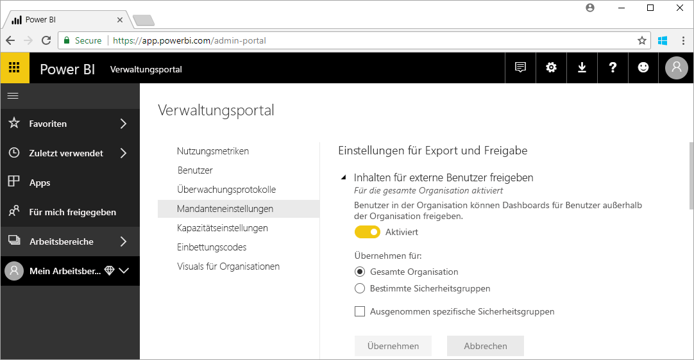

# Was ist die Power BI-Verwaltung?

Mit Power BI verwalten Sie einen Power BI-Mandanten – dies umfasst die Konfiguration von Governancerichtlinien, die Überwachung der Nutzung sowie die Bereitstellung von Lizenzen, Kapazitäten und Organisationsressourcen. Dieser Artikel bietet einen Überblick über die Rollen, Aufgaben und Tools für die Verwaltung sowie Links zu weiterführenden Artikeln.

Power BI ist für Self-Service-Business Intelligence (BI) konzipiert, und der Administrator überwacht die Daten, Prozesse und Richtlinien im Power BI-Mandanten. Ein Power BI-Administrator ist ein wichtiges Mitglied eines Teams, das BI-Entwickler, Analysten und weitere Rollen umfasst. Der Administrator unterstützt eine Organisation, um sicherzustellen, dass wichtige Ziele erreicht werden:

- Kenntnis der KPIs und Metriken, die Benutzer _tatsächlich_ benötigen
- Schnellere Bereitstellung für IT-geführte unternehmensweite Berichterstellung
- Erhöhen der Akzeptanz und Rendite einer Power BI-Bereitstellung

Die Aufgabe besteht darin, Geschäftsbenutzern ein produktives Arbeiten zu ermöglichen, für Sicherheit zu sorgen und die Einhaltung von Gesetzen und Bestimmungen sicherzustellen. Administratoren sind ggf. auch für Support zuständig und helfen Benutzern in vielen Fällen dabei, die richtige Entscheidung zu treffen.

## Administratorrollen in Zusammenhang mit Power BI

In der Power BI-Verwaltung gibt es verschiedene Rollen, die in der folgenden Tabelle beschrieben werden.

| **Art des Administrators** | **Geltungsbereich** | **Zuständigkeit in Power BI** |
| --- | --- | --- |
| Globaler Office 365-Administrator | Office 365 | Kann alle Aspekte eines Power BI-Mandanten und weitere Dienste verwalten. |
| Office 365-Abrechnungsadministrator | Office 365 | Kann über Office 365-Abonnements Power BI-Lizenzen erwerben. |
| Power BI-Dienstadministrator | Power BI-Mandant | Verfügt über vollständige Kontrolle über einen Power BI-Mandanten und die zugehörigen Verwaltungsfunktionen (mit Ausnahme der Lizenzierung). |
| Power BI Premium-Kapazitätsadministrator | Eine einzelne Premium-Kapazität | Verfügt über vollständige Kontrolle über eine Premium-Kapazität und die zugehörigen Verwaltungsfunktionen. |
| Power BI Embedded-Kapazitätsadministrator | Eine einzelne Embedded-Kapazität | Verfügt über vollständige Kontrolle über eine Embedded-Kapazität und die zugehörigen Verwaltungsfunktionen. |

Globale Administratoren in Office 365 oder Azure Active Directory besitzen Administratorrechte in Power BI. Ein globaler Office 365-Administrator kann andere Benutzer zur Power BI-Dienstadministratorrolle zuweisen, die Administratorrechte ausschließlich für Power BI-Funktionen gewährt.

Power BI-Dienstadministratoren haben Zugriff auf das Power BI-Verwaltungsportal, das verschiedene Einstellungen auf Mandantenebene für Funktionalität, Sicherheit und Überwachung umfasst. Dienstadministratoren haben vollständigen Zugriff auf alle Ressourcen eines Power BI-Mandanten. In den meisten Fällen identifizieren Dienstadministratoren Probleme und setzen sich mit den Ressourcenbesitzern in Verbindung, um Korrekturmaßnahmen zu ergreifen.

Die Rolle eines Power BI-Dienstadministrators gewährt nicht die Berechtigung, Benutzern Lizenzen zuzuweisen oder Überwachungsprotokolle in Office 365 anzuzeigen. Daher kann Power BI derzeit nicht von Benutzern verwaltet werden, die nur Mitglieder der Power BI-Dienstadministratorrolle sind.

## Verwaltungsaufgaben

Administratoren können verschiedene Aufgaben ausführen, um den Power BI-Mandanten ihrer Organisation zu unterstützen. Diese Aufgaben sind in der folgenden Tabelle aufgelistet.

| **Aufgabenbereich** | **Typische Aufgaben** |
| --- | --- |
| Verwalten des Power BI-Mandanten |<ul><li>Aktivieren und Deaktivieren wichtiger Power BI-Funktionen <li>Erstellen von Berichten zu Nutzung und Leistung <li>Überprüfen und Verwalten der Ereignisüberwachung</ul>|
| Erwerben und Zuweisen von Power BI-Lizenzen |<ul><li>Verwalten der Benutzerregistrierung <li>Erwerben und Zuweisen von Pro-Lizenzen <li>Sperren des Zugriffs auf Power BI für Benutzer</ul>|
| Verwalten der Premium-Kapazität |<ul><li>Erwerben von und Arbeiten mit der Premium-Kapazität <li>Sicherstellen der Dienstqualität|
| Verwalten der Embedded-Kapazität |<ul><li>Erwerben von Embedded-Kapazität, um unabhängigen Dienstanbietern und Entwicklern die Verwendung von Power BI-Funktionen zu vereinfachen</ul>|
| Sicherstellen der Einhaltung von internen Richtlinien sowie Gesetzen und Bestimmungen | <ul><li>Verwalten der Klassifizierung von Geschäftsdaten <li>Durchsetzen von Richtlinien zur Veröffentlichung und Freigabe von Inhalten</ul>|
| Verwalten von Power BI-Ressourcen |<ul><li>Verwalten von Arbeitsbereichen <li>Veröffentlichen von benutzerdefinierten Visuals <li>Überprüfen von Code zum Einbetten von Power BI in anderen Anwendungen|
| Bereitstellen von Hilfe und Support für Mandantenbenutzer |<ul><li>Beheben von Datenzugriffs- und anderen Problemen</ul>|
| Weitere Aufgaben |<ul><li>Bereitstellen von Power BI Desktop z.B. mit dem System Center Configuration Manager <li>Verwalten der Bereitstellung von mobilen Power BI-Apps mit Intune <li>Verwalten von Datenschutz und -sicherheit, z.B. der Quelldatensicherheit</ul>|

## Verwaltungstools

In der Power BI-Verwaltung gibt es verschiedene Tools, die in der folgenden Tabelle beschrieben werden. Administratoren arbeiten in der Regel im Power BI-Verwaltungsportal und verwenden andere Tools nach Bedarf.

| **Tool** | **Typische Aufgaben** |
| --- | --- |
| Power BI-Verwaltungsportal |<ul><li>Erwerben von und Arbeiten mit der Premium-Kapazität</li><li>Sicherstellen der Dienstqualität</li><li>Verwalten der Klassifizierung von Geschäftsdaten</li><li>Durchsetzen von Richtlinien zur Veröffentlichung und Freigabe von Inhalten</li><li>Verwalten von Arbeitsbereichen <li>Veröffentlichen von benutzerdefinierten Visuals</li><li>Überprüfen von Code zum Einbetten von Power BI in anderen Anwendungen</li><li>Beheben von Datenzugriffs- und anderen Problemen</li></ul>|
| Office 365 Admin Center |<ul><li>Verwalten der Benutzerregistrierung</li><li>Erwerben und Zuweisen von Pro-Lizenzen</li><li>Sperren des Zugriffs auf Power BI für Benutzer</li></ul>|
| Office 365 Security & Compliance Center |<ul><li>Überprüfen und Verwalten der Ereignisüberwachung</li></ul>|
| Azure Active Directory (AAD) im Azure-Portal |<ul><li>Konfigurieren des bedingten Zugriffs auf Power BI-Ressourcen über AAD</li><li>Bereitstellen von Power BI Embedded-Kapazität</li></ul>|
| PowerShell-Cmdlets |<ul><li>Verwalten von Arbeitsbereichen und anderen Power BI-Aspekten über Skripts</li></ul>|
| Verwaltungs-APIs und SDK |<ul><li>Erstellen Sie benutzerdefinierte Verwaltungstools, um Power BI-Administratoren die Arbeit zu erleichtern. Power BI Desktop kann diese APIs z.B. verwenden, um Berichte basierend auf Daten zur Verwaltung zu erstellen.</li></ul>|

## Nächste Schritte

In diesem Artikel haben Sie einige kurze Einblicke in den Arbeit eines Power BI-Administrators sowie die zugehörigen Rollen, Aufgaben und Tools erhalten. Um Ihre Kenntnisse zu vertiefen, empfehlen wir die folgenden Artikel.

[Verwenden des Power BI-Verwaltungsportals](service-admin-portal.md)

[Verwenden von PowerShell-Cmdlets](/powershell/power-bi/overview?toc=%2Fen-us%2Fpower-bi%2FTOC.json&bc=%2Fen-us%2Fpower-bi%2Fbreadcrumb%2Ftoc.json&view=powerbi-ps)

[Häufig gestellte Fragen zur Power BI-Verwaltung](service-admin-faq.md)

Weitere Fragen? [Stellen Sie Ihre Frage in der Power BI-Community.](http://community.powerbi.com/)