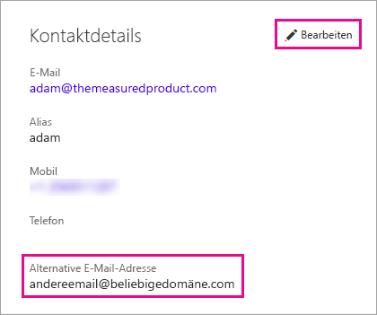

# <a name="using-an-alternate-email-address"></a>Verwenden einer alternativen E-Mail-Adresse
Die E-Mail-Adresse, die Sie für die Registrierung bei Power BI verwendet haben, wird standardmäßig verwendet, um Ihnen Updates über die Aktivität in Power BI zu senden.  Wenn Ihnen beispielsweise ein Benutzer eine Freigabeeinladung sendet, wird diese Adresse verwendet.

Manchmal möchten Sie möglicherweise, dass diese E-Mails an eine andere Adresse gesendet werden und nicht an die Adresse, mit der Sie sich ursprünglich bei Power BI registriert haben.

## <a name="updating-through-office-365-personal-info-page"></a>Aktualisieren über die persönliche Office 365-Informationsseite
1. Wechseln Sie zu Ihrer [persönlichen Office 365-Informationsseite](https://portal.office.com/account/#personalinfo).  Wenn Sie dazu aufgefordert werden, melden Sie sich mit der E-Mail-Adresse und dem Kennwort an, die Sie für Power BI verwenden.
2. Klicken Sie im Abschnitt mit den Kontaktdetails auf den Link „Bearbeiten“.  
   
   > [!NOTE]
   > Wenn der Link "Bearbeiten" nicht angezeigt wird, bedeutet dies, dass Ihre E-Mail-Adresse von Ihrem Office 365-Administrator verwaltet wird und Sie diesen kontaktieren müssen, um Ihre E-Mail-Adresse zu aktualisieren.
   > 
   > 
   
   
3. Geben Sie im Feld „Alternative E-Mail-Adresse“ die E-Mail-Adresse ein, an die Power BI-Updates gesendet werden sollen.

> [!NOTE]
> Das Ändern dieser Einstellung hat keinen Einfluss darauf, welche E-Mail-Adresse zum Senden von Dienstupdates, Newslettern und anderen Werbeinformationen verwendet wird.  Diese werden immer an die e-Mail-Adresse gesendet, die Sie ursprünglich für Ihre Registrierung bei Power BI verwendet haben.
> 
> 

## <a name="updating-through-azure-active-directory"></a>Aktualisieren über Azure Active Directory
Bei der Erfassung eines integrierten AAD-Token (AAD = Active Azure Directory) für Power BI können Sie drei unterschiedliche E-Mail-Typen verwenden. Dabei handelt es sich um folgende drei Typen:

* Die Haupt-E-Mail-Adresse, die dem AAD-Konto eines Benutzers zugeordnet ist
* Die UPN-E-Mail-Adresse (UPN = UserPrincipalName)
* Das Attribut für das „andere“ E-Mail-Adressfeld

Power BI wählt anhand der folgenden Kriterien aus, welche E-Mail-Adresse verwendet werden soll:
1.  Wenn das E-Mail-Attribut im Benutzerobjekt des AAD-Mandanten vorhanden ist, verwendet Power BI dieses E-Mail-Attribut für die E-Mail-Adresse
2.  Wenn es sich bei der UPN-E-Mail-Adresse *nicht* um eine E-Mail-Adresse der Domäne **\*.onmicrosoft.com** handelt (die Informationen hinter dem Symbol „\@“), verwendet Power BI dieses E-Mail-Attribut für die E-Mail-Adresse
3.  Wenn das Attribut für das „andere“ E-Mail-Adressfeld im AAD-Benutzerobjekt vorhanden ist, wird die erste E-Mail-Adresse in dieser Liste verwendet (dieses Attribut kann eine Liste mit E-Mail-Adressen umfassen)
4. Wenn keine der oben genannten Bedingungen erfüllt wird, wird die UPN-Adresse verwendet

## <a name="updating-with-powershell"></a>Aktualisieren mit PowerShell
Stattdessen können Sie auch die alternative E-Mail-Adresse über PowerShell für Azure Active Directory aktualisieren. Dies erfolgt mit dem Befehl [Set-AzureADUser](https://docs.microsoft.com/powershell/module/azuread/set-azureaduser).

```
Set-AzureADUser -ObjectId john@contoso.com -OtherMails "otheremail@somedomain.com"
```

Weitere Informationen finden Sie unter [Azure Active Directory PowerShell Version 2](https://docs.microsoft.com/powershell/azure/active-directory/install-adv2) (Azure Active Directory-PowerShell in Version 2) (in englischer Sprache).

Weitere Fragen? [Wenden Sie sich an die Power BI-Community](http://community.powerbi.com/)

