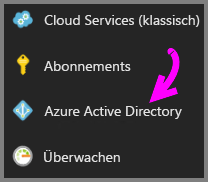
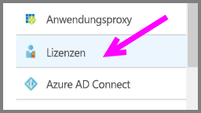
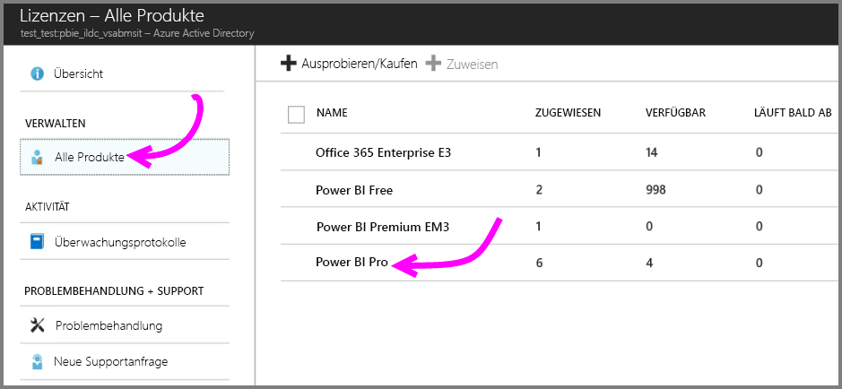
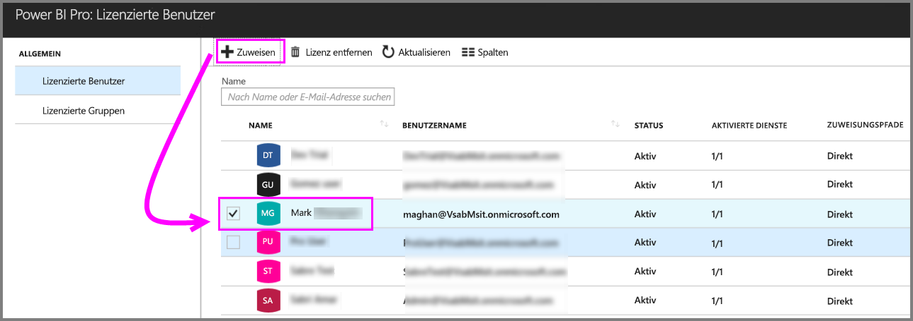

# Schnellstart: Zuweisen von Power BI Pro-Lizenzen in Azure

Power BI Pro ist eine Einzellizenz, die Zugriff auf alle Inhalte und Funktionen im Power BI-Dienst ermöglicht, z.B. zur Freigabe von Inhalten und zur Zusammenarbeit mit anderen Benutzern mit Pro-Lizenz. Nur Pro-Benutzer können Inhalte in App-Arbeitsbereichen veröffentlichen und nutzen, Dashboards freigeben sowie Dashboards und Berichte abonnieren. Dieser Artikel erläutert, wie Sie Power BI Pro-Lizenzen in Azure zuweisen. Sie können auch [Lizenzen in Office 365 zuweisen](service-admin-assigning-power-bi-pro-licenses.md).

## Voraussetzungen

Sie müssen Besitzer des Azure-Abonnements sein, das Power BI für Suchvorgänge in Active Directory verwendet.

Sie müssen [mindestens eine Lizenz erwerben](service-admin-purchasing-power-bi-pro.md), bevor Sie beginnen.

## Zuweisen von Lizenzen zu einzelnen Benutzerkonten

Führen Sie folgende Schritte aus, um einzelnen Benutzerkonten Power BI Pro-Lizenzen zuzuweisen:

1. Öffnen Sie das [Azure-Portal](https://ms.portal.azure.com/#@microsoft.onmicrosoft.com/dashboard/private/39bc3cf7-31a4-43f6-954c-f2d69ca2f0). 

2. Wählen Sie in der linken Navigationsleiste **Azure Active Directory** aus.

    

3. Wählen Sie unter **Azure Active Directory** die Option **Lizenzen** aus.

    

4. Wählen Sie unter **Lizenzen** die Option **Alle Produkte** und dann **Power BI Pro** aus, um die Liste der lizenzierten Benutzer anzuzeigen.

    

5. Klicken Sie auf **Zuweisen**, um einem weiteren Benutzerkonto eine Power BI Pro-Lizenz hinzuzufügen.

    

## Nächste Schritte

Nachdem Sie die Lizenzen zugewiesen haben, informieren Sie sich eingehend über Power BI Pro.

[Power BI Pro in Ihrer Organisation](service-admin-power-bi-pro-in-your-organization.md)

[Suchen von Power BI-Benutzer, die sich angemeldet haben](service-admin-access-usage.md)

Weitere Fragen? [Stellen Sie Ihre Frage in der Power BI-Community.](https://community.powerbi.com/)