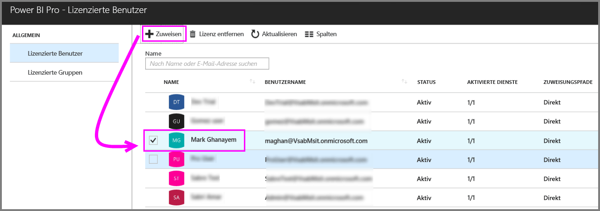
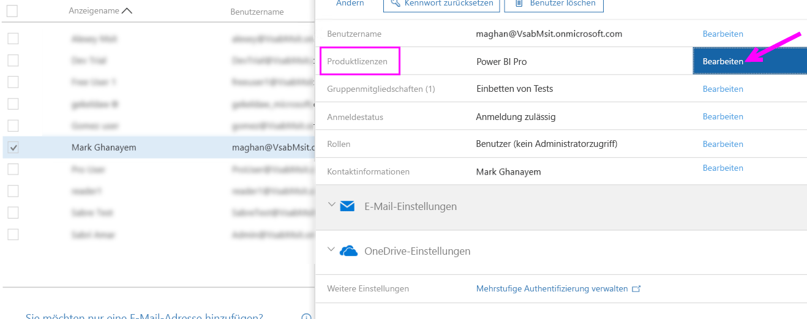
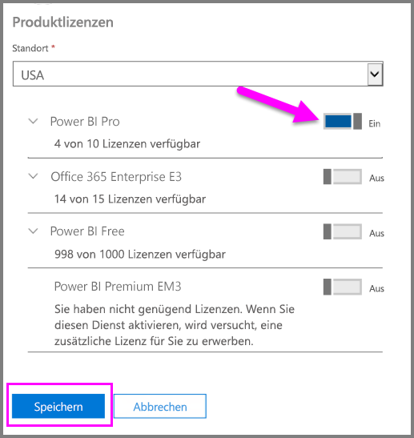

# Zuweisen von Power BI Pro-Lizenzen

Administratoren können aus einer Vielzahl von Verwaltungsportalen und PowerShell-Cmdlets auswählen, um Benutzern Power BI Pro-Lizenzen zuzuordnen. Die Verwaltung von Power BI-Lizenzen wird durch Azure Active Directory (Azure AD) gesichert.

* Besitzer eines Azure-Abonnements können das Blatt „Azure Active Directory“ im [Azure-Portal](https://ms.portal.azure.com/#@microsoft.onmicrosoft.com/dashboard/private/39bc3cf7-31a4-43f6-954c-f2d69ca2f0) verwenden. 

* Globale Administratoren und Administratoren eines Benutzerkontos können das [Office 365 Admin Center](https://portal.office.com/AdminPortal/Home#/homepage) verwenden.

## Verwalten von Power BI Pro-Lizenzen im Azure-Portal

Power BI verwendet Azure AD als grundlegenden Dienst. Neben Benutzerkonten und -gruppen speichert Azure AD auch andere Einstellungen, wie z.B. Informationen über erworbene Produkte.

### Zuweisen von Lizenzen an einzelne Benutzerkonten

Führen Sie als Besitzer eines Azure-Abonnements die folgenden Schritte aus, um einzelnen Benutzerkonten Pro-Lizenzen zuzuweisen:

1. Navigieren Sie zum [Azure-Portal](https://ms.portal.azure.com/#@microsoft.onmicrosoft.com/dashboard/private/39bc3cf7-31a4-43f6-954c-f2d69ca2f0). 

2. Klicken Sie in der linken Navigationsleiste auf „Azure Active Directory“.

    

3. Klicken Sie auf dem Blatt „Azure Active Directory“ auf „Lizenzen“.

    

4. Klicken Sie auf dem Blatt „Lizenzen“ auf „Alle Produkte“ und anschließend auf „Power BI Pro“, um die Liste der lizenzierten Benutzer anzuzeigen.

    

5. Klicken Sie auf „Zuordnen“, um einem zusätzlichen Benutzerkonto eine Power BI Pro-Lizenz zuzuordnen.

    

> [!NOTE]
> Obwohl die Verwaltung der meisten Lizenzaspekte möglich ist, ist es nicht möglich, Power BI Pro-Lizenzen im Azure-Portal zu erwerben. Verwenden Sie zum Erwerb eines Power BI Pro-Abonnements das Office 365 Admin Center. Weitere Informationen finden Sie unter [Erwerb von Power BI Pro](https://docs.microsoft.com/en-us/power-bi/service-admin-purchasing-power-bi-pro).
>

## Verwalten von Power BI Pro-Lizenzen im Office 365 Admin Center

Als globaler Administrator können Sie im Office 365 Admin Center ein Power BI Pro-Abonnement erwerben und die zugeordneten Lizenzen für die Organisation verwalten.

Führen Sie als Office 365-Administrator diese Schritte aus, um einzelnen Benutzerkonten Pro-Lizenzen zuzuweisen:

1. Navigieren Sie zum Office 365 Admin Center.

2. Erweitern Sie „Benutzer“ im linken Navigationsbereich, und klicken Sie dann auf „Aktive Benutzer“.

    

3. Wählen Sie mindestens einen Benutzer aus, und klicken Sie dann auf „Produktlizenzen bearbeiten“.

    

4. Legen Sie in Power BI Pro die Einstellung auf „Ein“ fest, und klicken Sie dann auf „Speichern“.

    

5. Überprüfen Sie, ob die Power BI Pro-Lizenz für das ausgewählte Konto unter „Status“ erfolgreich zugewiesen wurde.

    

> [!NOTE]
> Wenn die Lizenz Ihres Abonnements abgelaufen ist, können Sie eine neue Lizenz hinzufügen, indem Sie „Abrechnung“ im linken Navigationsbereich erweitern und dann auf „Abonnements“ klicken. Klicken Sie auf der Seite „Abonnements“ auf „Power BI Pro“ und anschließend auf „Hinzufügen oder Entfernen von Lizenzen“.
>

## Nächste Schritte
[Power BI Pro in Ihrer Organisation](service-admin-power-bi-pro-in-your-organization.md)
 
[Aktivierung der erweiterten Pro-Testversion](service-extended-pro-trial.md)
 
[Power BI-Servicevertrag für Einzelbenutzer](https://powerbi.microsoft.com/terms-of-service/)
 
[Ankündigung von Power BI Premium](https://aka.ms/pbipremium-announcement)
 
[Suchen von Power BI-Benutzer, die sich angemeldet haben](service-admin-access-usage.md)

Weitere Fragen? [Stellen Sie Ihre Frage in der Power BI-Community.](https://community.powerbi.com/)