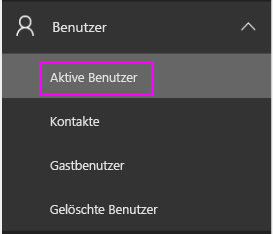
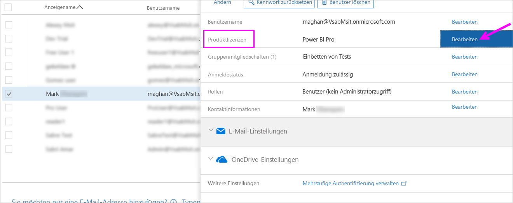
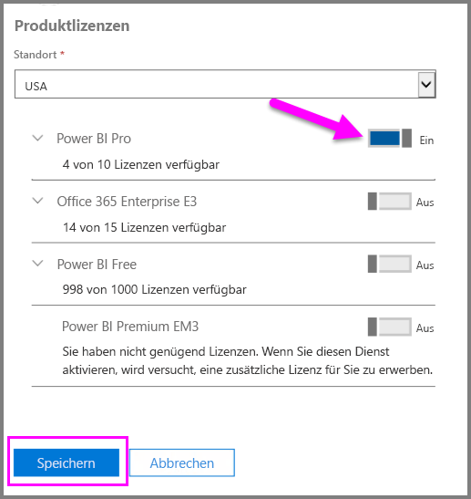
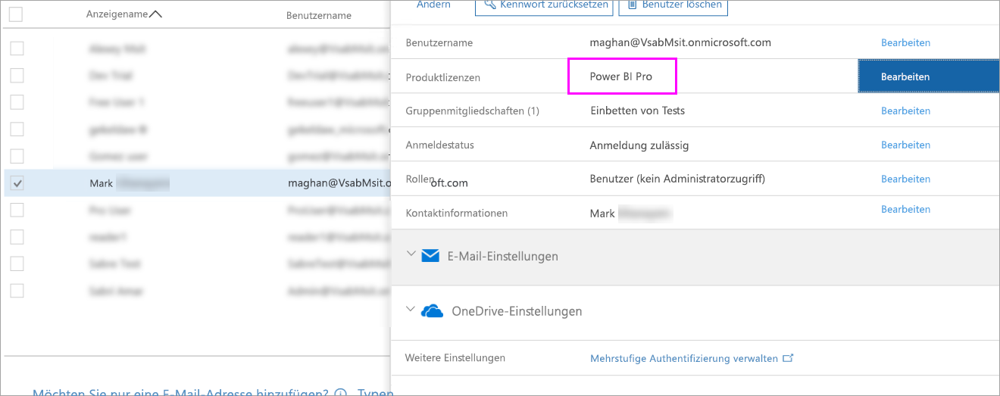

# Schnellstart: Zuweisen von Power BI Pro-Lizenzen in Office 365

Power BI Pro ist eine Einzellizenz, die Zugriff auf alle Inhalte und Funktionen im Power BI-Dienst ermöglicht, z.B. zur Freigabe von Inhalten und zur Zusammenarbeit mit anderen Benutzern mit Pro-Lizenz. Nur Pro-Benutzer können Inhalte in App-Arbeitsbereichen veröffentlichen und nutzen, Dashboards freigeben sowie Dashboards und Berichte abonnieren. Dieser Artikel erläutert, wie Sie Power BI Pro-Lizenzen in Office 365 zuweisen. Sie können auch [Lizenzen in Azure zuweisen](service-admin-assigning-power-bi-pro-licenses-azure.md).

## Voraussetzungen

Sie müssen Mitglied der Rolle [**Globaler Administrator** oder **Benutzerkontoadministrator**](https://support.office.com/article/about-office-365-admin-roles-da585eea-f576-4f55-a1e0-87090b6aaa9d?ui=en-US&rs=en-US&ad=US) in Office 365 sein.

Sie müssen [mindestens eine Lizenz erwerben](service-admin-purchasing-power-bi-pro.md), bevor Sie beginnen.

## Zuweisen von Lizenzen zu einzelnen Benutzerkonten

Führen Sie folgende Schritte aus, um einzelnen Benutzerkonten Power BI Pro-Lizenzen zuzuweisen:

1. Öffnen Sie das [Office 365 Admin Center](https://portal.office.com/adminportal/home#/homepage).

2. Erweitern Sie im linken Navigationsbereich **Benutzer**, und wählen Sie dann **Aktive Benutzer** aus.

    

3. Wählen Sie einen Benutzer aus, und klicken Sie dann unter **Produktlizenzen** auf **Bearbeiten**.

    

4. Legen Sie in **Power BI Pro** die Einstellung auf **Ein** fest, und klicken Sie dann auf **Speichern**.

    

5. Überprüfen Sie unter **Status** für das ausgewählte Konto, ob die Power BI Pro-Lizenz erfolgreich zugewiesen wurde.

    

## Nächste Schritte

Nachdem Sie die Lizenzen zugewiesen haben, informieren Sie sich eingehend über Power BI Pro.

[Power BI Pro in Ihrer Organisation](service-admin-power-bi-pro-in-your-organization.md)

[Suchen von Power BI-Benutzer, die sich angemeldet haben](service-admin-access-usage.md)

Weitere Fragen? [Stellen Sie Ihre Frage in der Power BI-Community.](https://community.powerbi.com/)