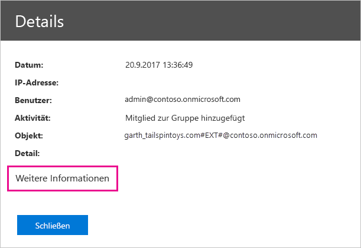

# <a name="use-auditing-within-your-organization"></a>Verwenden Sie die Überwachung in Ihrer Organisation

Zu wissen, wer welche Aktion ausgeführt wird, auf welches Element in die Power BI-möglich Mandant Ihres Unternehmens erfüllen die Anforderungen, wie die Einhaltung gesetzlicher Bestimmungen und datensatzverwaltung kritische. Verwenden Sie Power BI-Überwachung, um die Aktionen, die Benutzer, z. B. "Bericht anzeigen" und "Dashboard anzeigen" überwachen. Sie können nicht die Überwachung verwenden, um Berechtigungen zu überwachen.

Sie arbeiten mit der Überwachung im Office 365 Security & Compliance Center oder verwenden PowerShell. Die Überwachung baut auf in Exchange Online enthaltener Funktionalität auf, die zur Unterstützung von Power BI automatisch bereitgestellt wird.

Sie können die Überwachungsdaten nach Datumsbereich, Benutzer, Dashboard, Bericht, Dataset und Aktivitätstyp filtern. Sie können auch die Aktivitäten in einer CSV (durch Trennzeichen getrennte Werte), um die Analyse offline herunterladen.

## <a name="requirements"></a>Anforderungen

Die folgenden Anforderungen müssen erfüllt sein, um auf Überwachungsprotokolle zugreifen zu können:

* Sie müssen entweder globaler Administrator sein, oder der Rolle Überwachungsprotokolle oder Postfachzugriffskonto-Überwachungsprotokolle in Exchange Online auf das Überwachungsprotokoll zugreifen. In der Standardeinstellung die Rollengruppen Compliance-Verwaltung und Organisation stammen, mit diesen Rollen zugewiesen werden, auf die **Berechtigungen** Seite im Exchange Administrationscenter.

    Um nicht-Administratorkonten mit Zugriff auf das Überwachungsprotokoll zu gewährleisten, müssen Sie den Benutzer als Mitglied einer dieser Rollengruppen hinzufügen. Wenn Sie sie möchten eine andere Möglichkeit, Sie erstellen eine benutzerdefinierte Rolle-Gruppe im Exchange Administrationscenter, weisen die Überwachungsprotokolle "oder" Postfachzugriffskonto Audit Logs "dieser Gruppe, und fügen Sie das Konto ohne Administratorrechte auf die neue Rollengruppe. Weitere Informationen finden Sie unter [Verwalten von Rollengruppen in Exchange Online](/Exchange/permissions-exo/role-groups).

    Wenn Sie über das Microsoft 365 Admin Center nicht auf das Exchange Admin Center zugreifen können, navigieren Sie zu https://outlook.office365.com/ecp, und melden Sie sich mit Ihren Anmeldeinformationen an.

* Wenn Sie auf das Überwachungsprotokoll Zugriff, aber nicht, ein globaler Administrator oder den Power BI-Dienst-Administrator sind, wird nicht den Zugriff auf das Power BI-Verwaltungsportal haben. In diesem Fall müssen Sie einen direkten Link zum [Office 365 Security & Compliance Center](https://sip.protection.office.com/#/unifiedauditlog) verwenden.

## <a name="access-your-audit-logs"></a>Zugriff auf Ihre Überwachungsprotokolle

Um die Protokolle zugreifen zu können, stellen Sie zunächst sicher, zum Aktivieren der Protokollierung in Power BI. Weitere Informationen finden Sie unter [Überwachungsprotokolle](service-admin-portal.md#audit-logs) in der Dokumentation zum Verwaltungsportal. Es kann bis zu einer Verzögerung von 48 Stunden zwischen dem Zeitpunkt, die Sie die Überwachung aktivieren und beim Überwachungsdaten anzeigen können. Wenn Sie nicht umgehend Daten sehen, überprüfen Sie die Überwachungsprotokolle später noch einmal. Es kann zu einer ähnlichen Verzögerung kommen, nachdem Ihnen die Leseberechtigung für Überwachungsprotokolle erteilt wurde und bis Sie die Protokolle ansehen können.

Die Power BI-Überwachungsprotokolle sind direkt über das [Office 365 Security & Compliance Center](https://sip.protection.office.com/#/unifiedauditlog) verfügbar. Es gibt auch ein Link aus dem Power BI-Verwaltungsportal:

1. Wählen Sie in Power BI die **Zahnradsymbol** in der oberen rechten Ecke, und wählen Sie dann **Verwaltungsportal**.

   

1. Wählen Sie **Azure-Überwachungsprotokolle** aus.

1. Wählen Sie **Zum O365 Admin Center wechseln** aus.

   

## <a name="search-only-power-bi-activities"></a>Nur nach Power BI-Aktivitäten suchen

Sie können die Ergebnisse mithilfe dieser Schritte auf Power BI-Aktivitäten einschränken. Eine Liste der [Aktivitäten, die von Power BI überwacht werden](#activities-audited-by-power-bi) finden Sie weiter unten in diesem Artikel.

1. Auf der **überwachungsprotokollsuche** Seite **Suche**, wählen Sie die Dropdownliste für **Aktivitäten**.

2. Wählen Sie **Power BI-Aktivitäten** aus.

   

3. Klicken oder tippen Sie auf eine beliebige Stelle neben dem Auswahlfeld, um es zu schließen.

Ihre Suche gibt nur Power BI-Aktivitäten zurück.

## <a name="search-the-audit-logs-by-date"></a>Überwachungsprotokolle nach Datum durchsuchen

Sie können die Protokolle mit den Feldern für das **Startdatum** und das **Enddatum** nach Datumsbereichen durchsuchen. Die Standardauswahl ist die letzten sieben Tage. Die Anzeige zeigt das Datum und Uhrzeit im Format der koordinierten Weltzeit (Coordinated Universal Time, UTC). Der Datumsbereich kann maximal 90 Tage umfassen. 

Sie erhalten einen Fehler, wenn der ausgewählte Datumsbereich größer als 90 Tage ist. Wenn Sie den maximalen Datumsbereich von 90 Tagen verwenden, wählen Sie die aktuelle Uhrzeit als **Startdatum** aus. Andernfalls erhalten Sie die Fehlermeldung, dass das Startdatum vor dem Enddatum liegt. Wenn Sie die Überwachung innerhalb der letzten 90 Tage aktiviert haben, kann der Datumsbereich nicht vor dem Datum beginnen, an dem die Überwachung aktiviert wurde.


## <a name="search-the-audit-logs-by-users"></a>Überwachungsprotokolle nach Benutzern durchsuchen

Sie können nach Einträgen im Überwachungsprotokoll für Aktivitäten, die von bestimmten Benutzern suchen. Geben Sie einen oder mehrere Benutzernamen in der **Benutzer** Feld. Der Benutzername sieht wie eine e-Mail-Adresse. Es ist das Konto, das Benutzer sich bei Power BI anmelden. Lassen Sie dieses Feld leer, um Einträge für alle Benutzer (und Dienstkonten) in Ihrer Organisation abzurufen.


## <a name="view-search-results"></a>Anzeigen der Suchergebnisse

Nach der Auswahl **Suche**, laden Sie die Ergebnisse der Suche. Nach einigen Augenblicken wird sie unter anzeigen **Ergebnisse**. Wenn die Suche abgeschlossen ist, zeigt die Anzeige der Anzahl der Ergebnisse an. **Überwachungsprotokollsuche** maximal 1000-Ereignissen angezeigt. Wenn mehr als 1000 Ereignisse die Suchkriterien entsprechen, wird die app die 1000 neuesten Ereignisse angezeigt.

### <a name="view-the-main-results"></a>Anzeigen der wichtigsten Ergebnisse

Die **Ergebnisse** Bereich enthält die folgenden Informationen für jedes Ereignis, das von der Suche zurückgegeben. Wählen Sie unter **Ergebnisse** eine Spaltenüberschrift aus, um die Ergebnisse zu sortieren.

| **Spalte** | **Definition** |
| --- | --- |
| Datum (Date) |Datum und Uhrzeit des Ereignisses (im UTC-Format). |
| IP-Adresse |Die IP-Adresse des Geräts verwendet werden, für die Aktivität protokolliert. Die app zeigt die IP-Adresse in IPv4- oder IPv6-Adressformat. |
| Benutzer |Der Benutzer (oder das Dienstkonto), der die Aktion ausgeführt hat, die das Ereignis ausgelöst hat. |
| Activity |Die Aktivität, die vom Benutzer ausgeführt wurde. Dieser Wert entspricht den Aktivitäten, die Sie in der Dropdownliste **Aktivitäten** ausgewählt haben. Bei Ereignissen aus dem Überwachungsprotokoll für Exchange-Administratoren ist der Wert in dieser Spalte ein Exchange-Cmdlet. |
| Artikel |Das Objekt erstellt oder geändert werden, da die entsprechende Aktivität. Z. B. die angezeigten oder geänderten Datei oder das aktualisierte Benutzerkonto. Nicht alle Aktivitäten verfügen über einen Wert in dieser Spalte. |
| Detail |Weitere Details zu einer Aktivität. Nicht alle Aktivitäten werden in diesem Fall einen Wert aufweisen. |

### <a name="view-the-details-for-an-event"></a>Anzeigen von Ereignisdetails

Um weitere Details zu einem Ereignis anzuzeigen, wählen Sie den Ereignisdatensatz in der Liste der Suchergebnisse. Ein **Details** Seite wird angezeigt, die die genauen Eigenschaften des Ereignisses aufgerufen wurde. Die **Details** Eigenschaften abhängig von der Office 365-Dienst, in dem das Ereignis tritt auf, wird angezeigt.

Um diese Details anzuzeigen, wählen Sie **Weitere Informationen** aus. Alle Power BI-Einträge weisen einen Wert von 20 für die RecordType-Eigenschaft auf. Informationen zu weiteren Eigenschaften finden Sie unter [Detaillierte Eigenschaften im Überwachungsprotokoll](/office365/securitycompliance/detailed-properties-in-the-office-365-audit-log/).

   

## <a name="export-search-results"></a>Exportieren der Suchergebnisse

Gehen Sie folgendermaßen vor, um das Power BI-Überwachungsprotokoll in eine CSV-Datei zu exportieren.

1. Wählen Sie **Ergebnisse exportieren** aus.

1. Wählen Sie entweder **Geladene Ergebnisse speichern** oder **Alle Ergebnisse herunterladen** aus.

    

## <a name="use-powershell-to-search-audit-logs"></a>Verwenden von PowerShell zum Suchen nach Überwachungsprotokollen

Sie können auch mit PowerShell basierend auf Ihrer Anmeldung auf die Überwachungsprotokolle zugreifen. Das folgende Beispiel zeigt, wie Sie eine Verbindung mit Exchange Online PowerShell herstellen und dann den Befehl [Search-UnifiedAuditLog](/powershell/module/exchange/policy-and-compliance-audit/search-unifiedauditlog?view=exchange-ps/) verwenden, um Power BI-Überwachungsprotokolleinträge abzurufen. Um das Skript auszuführen, ein Administrator muss weisen Sie die entsprechenden Berechtigungen, unter dem [Anforderungen](#requirements) Abschnitt.

```powershell
Set-ExecutionPolicy RemoteSigned

$UserCredential = Get-Credential

$Session = New-PSSession -ConfigurationName Microsoft.Exchange -ConnectionUri https://outlook.office365.com/powershell-liveid/ -Credential $UserCredential -Authentication Basic -AllowRedirection

Import-PSSession $Session
Search-UnifiedAuditLog -StartDate 9/11/2018 -EndDate 9/15/2018 -RecordType PowerBI -ResultSize 1000 | Format-Table | More
```

Weitere Informationen zum Verbinden mit Exchange Online finden Sie unter [Herstellen einer Verbindung mit Exchange Online mithilfe der Remote-PowerShell](/powershell/exchange/exchange-online/connect-to-exchange-online-powershell/connect-to-exchange-online-powershell/). Ein weiteres Beispiel für die Verwendung von PowerShell mit Überwachungsprotokollen finden Sie unter [Verwenden des Power BI-Überwachungsprotokolls und von PowerShell zum Zuweisen von Power BI Pro-Lizenzen](https://powerbi.microsoft.com/blog/using-power-bi-audit-log-and-powershell-to-assign-power-bi-pro-licenses/).

## <a name="activities-audited-by-power-bi"></a>Von Power BI überwachte Aktivitäten

Die folgenden Aktivitäten werden von Power BI überwacht:

| Anzeigename                                     | Vorgangsname                              | Hinweise                                  |
|---------------------------------------------------|---------------------------------------------|------------------------------------------|
| Added Data source to Power BI gateway (Datenquelle zu Power BI-Gateway hinzugefügt)             | AddDatasourceToGateway                      |                                          |
| Added Power BI folder access (Ordnerzugriff für Power BI hinzugefügt)                      | AddFolderAccess                             | Derzeit nicht verwendet                       |
| Power BI-Gruppenmitglieder hinzugefügt                      | AddGroupMembers                             |                                          |
| Admin attached dataflow storage account to tenant (Administrator hat Dataflow-Speicherkonten zum Mandanten hinzugefügt) | AdminAttachedDataflowStorageAccountToTenant | Derzeit nicht verwendet                       |
| Analyzed Power BI dataset (Power BI-Dataset analysiert)                         | AnalyzedByExternalApplication               |                                          |
| Analyzed Power BI report (Power BI-Bericht analysiert)                          | AnalyzeInExcel                              |                                          |
| Binden von Power BI-Datasets an Gateways                | BindToGateway                               |                                          |
| Changed capacity state (Kapazitätsstatus geändert)                            | ChangeCapacityState                         |                                          |
| Changed capacity user assignment (Benutzerzuweisung für die Kapazität geändert)                  | UpdateCapacityUsersAssignment               |                                          |
| Changed Power BI dataset connections (Power BI-Verbindungen mit Datasets geändert)              | SetAllConnections                           |                                          |
| Changed Power BI gateway admins (Power BI-Gatewayadministratoren geändert)                   | ChangeGatewayAdministrators                 |                                          |
| Benutzer der Power BI-Gatewaydatenquelle geändert        | ChangeGatewayDatasourceUsers                |                                          |
| Power BI-Organisationsinhaltspaket erstellt      | CreateOrgApp                                |                                          |
| Created Power BI app (Power BI-App erstellt)                              | CreateApp                                   |                                          |
| Power BI-Dashboard erstellt                        | CreateDashboard                             |                                          |
| Created Power BI dataflow (Power BI-Dataflow erstellt)                         | CreateDataflow                              |                                          |
| Power BI-Dataset erstellt                          | CreateDataflow                               |                                          |
| Created Power BI email subscription (Power BI-E-Mail-Abonnement erstellt)               | CreateEmailSubscription                     |                                          |
| Created Power BI folder (Power BI-Ordner erstellt)                           | CreateFolder                                |                                          |
| Created Power BI gateway (Power BI-Gateway erstellt)                          | CreateGateway                               |                                          |
| Power BI-Gruppe erstellt                            | CreateGroup                                 |                                          |
| Power BI-Bericht erstellt                           | CreateReport                                |                                          |
| Dataflow migrated to external storage account (Dataflow in externes Speicherkonto migriert)     | DataflowMigratedToExternalStorageAccount    | Derzeit nicht verwendet                       |
| Dataflow-Berechtigungen hinzugefügt                        | DataflowPermissionsAdded                    | Derzeit nicht verwendet                       |
| Dataflow-Berechtigungen entfernt                      | DataflowPermissionsRemoved                  | Derzeit nicht verwendet                       |
| Deleted organizational Power BI content pack (Power BI-Organisationsinhaltspaket gelöscht)      | DeleteOrgApp                                |                                          |
| Deleted Power BI comment (Power BI-Kommentar gelöscht)                          | DeleteComment                               |                                          |
| Power BI-Dashboard gelöscht                        | DeleteDashboard                             | Derzeit nicht verwendet                       |
| Deleted Power BI dataflow (Power BI-Dataflow gelöscht)                         | DeleteDataflow                              | Derzeit nicht verwendet                       |
| Power BI-Dataset gelöscht                          | DeleteDataset                               |                                          |
| Deleted Power BI email subscription (Power BI-E-Mail-Abonnement gelöscht)               | DeleteEmailSubscription                     |                                          |
| Deleted Power BI folder (Power BI-Ordner gelöscht)                           | DeleteFolder                                |                                          |
| Deleted Power BI folder access (Ordnerzugriff für Power BI gelöscht)                    | DeleteFolderAccess                          | Derzeit nicht verwendet                       |
| Deleted Power BI gateway (Power BI-Gateway gelöscht)                          | DeleteGateway                               |                                          |
| Deleted Power BI group (Power BI-Gruppe gelöscht)                            | DeleteGroup                                 |                                          |
| Power BI-Bericht gelöscht                           | DeleteReport                                |                                          |
| Discovered Power BI dataset data sources (Datenquellen für Power BI-Datasets ermittelt)          | GetDatasources                              |                                          |
| Downloaded Power BI report (Power BI-Bericht herunterladen)                        | DownloadReport                              |                                          |
| Edited Power BI certification permission (Power BI-Zertifikatsberechtigung bearbeitet)          | EditCertificationPermission                 | Derzeit nicht verwendet                       |
| Power BI-Dashboard bearbeitet                         | EditDashboard                               | Derzeit nicht verwendet                       |
| Edited Power BI dataset (Power BI-Dataset bearbeitet)                           | EditDataset                                 |                                          |
| Edited Power BI dataset properties (Eigenschaften von Power BI-Datasets bearbeitet)                | EditDatasetProperties                       | Derzeit nicht verwendet                       |
| Power BI-Bericht bearbeitet                            | EditReport                                  |                                          |
| Exported Power BI dataflow (Power BI-Dataflow exportiert)                        | ExportDataflow                              |                                          |
| Visuelle Power BI-Berichtsdaten exportiert              | ExportReport                                |                                          |
| Power BI-Kacheldaten exportiert                       | ExportTile                                  |                                          |
| Failed to add dataflow permissions (Dataflow-Berechtigungen konnten nicht hinzugefügt werden)                | FailedToAddDataflowPermissions              | Derzeit nicht verwendet                       |
| Failed to remove dataflow permissions (Dataflow-Berechtigungen konnten nicht entfernt werden)             | FailedToRemoveDataflowPermissions           | Derzeit nicht verwendet                       |
| Generated Power BI dataflow SAS token (SAS-Token für Power BI-Dataflow generiert)             | GenerateDataflowSasToken                    |                                          |
| Generated Power BI Embed Token (Einbettungstoken für Power BI generiert)                    | GenerateEmbedToken                          |                                          |
| Imported file to Power BI (Datei in Power BI importiert)                         | Importieren                                      |                                          |
| Installed Power BI app (Power BI-App installiert)                            | InstallApp                                  |                                          |
| Migrated workspace to a capacity (Arbeitsbereich zu einer Kapazität migriert)                  | MigrateWorkspaceIntoCapacity                |                                          |
| Posted Power BI comment (Power BI-Kommentar veröffentlicht)                           | PostComment                                 |                                          |
| Power BI-Dashboard gedruckt                        | PrintDashboard                              |                                          |
| Power BI-Berichtseite gedruckt                      | PrintReport                                 |                                          |
| Published Power BI report to web (Power BI-Bericht im Web veröffentlicht)                  | PublishToWebReport                          |                                          |
| Received Power BI dataflow secret from Key Vault (Geheimnis für Power BI-Dataflow von Key Vault empfangen)  | ReceiveDataflowSecretFromKeyVault           | Derzeit nicht verwendet                       |
| Removed data source from Power BI gateway (Datenquelle aus Power BI-Gateway entfernt)         | RemoveDatasourceFromGateway                 |                                          |
| Removed Power BI group members (Power BI-Gruppenmitglieder entfernt)                    | DeleteGroupMembers                          |                                          |
| Removed workspace from a capacity (Arbeitsbereich aus einer Kapazität entfernt)                 | RemoveWorkspacesFromCapacity                |                                          |
| Renamed Power BI dashboard (Power BI-Dashboard umbenannt)                        | RenameDashboard                             |                                          |
| Requested Power BI dataflow refresh (Aktualisierung von Power BI-Dataflow angefordert)               | RequestDataflowRefresh                      | Derzeit nicht verwendet                       |
| Requested Power BI dataflow refresh (Aktualisierung von Power BI-Dataset angefordert)                | RefreshDataset                              |                                          |
| Retrieved Power BI workspaces (Power BI-Arbeitsbereiche abgerufen)                     | GetWorkspaces                               |                                          |
| Set scheduled refresh on Power BI dataflow (Geplante Aktualisierung des Power BI-Dataflow festgelegt)        | SetScheduledRefreshOnDataflow               |                                          |
| Set scheduled refresh on Power BI dataset (Geplante Aktualisierung des Power BI-Dataset festgelegt)         | SetScheduledRefresh                         |                                          |
| Power BI-Dashboard geteilt                         | ShareDashboard                              |                                          |
| Shared Power BI report (Power BI-Bericht geteilt)                            | ShareReport                                 |                                          |
| Started Power BI extended trial (Erweiterten Power BI-Test begonnen)                   | OptInForExtendedProTrial                    | Derzeit nicht verwendet                       |
| Power BI-Testversion gestartet                            | OptInForProTrial                            |                                          |
| Took over a Power BI datasource (Power BI-Datenquellen übernommen)                   | TakeOverDataset                          |                                          |
| Took over Power BI dataset (Power BI-Dataset übernommen)                        | TakeOverDataset                             |                                          |
| Unpublished Power BI app (Veröffentlichung der Power BI-App aufgehoben)                          | UnpublishApp                                |                                          |
| Update capacity resource governance settings (Governanceeinstellungen für Kapazitätsressourcen aktualisiert)      | UpdateCapacityResourceGovernanceSettings    | Derzeit nicht im Microsoft 365 Admin Center verwendet |
| Updated capacity admin (Administrator der Kapazität aktualisiert)                            | UpdateCapacityAdmins                        |                                          |
| Updated capacity display name (Anzeigename der Kapazität aktualisiert)                     | UpdateCapacityDisplayName                   |                                          |
| Updated organization's Power BI settings (Power BI-Einstellungen der Organisation aktualisiert)          | UpdatedAdminFeatureSwitch                   |                                          |
| Updated Power BI app (Power BI-App aktualisiert)                              | UpdateApp                                   |                                          |
| Updated Power BI dataflow (Power BI-Dataflow aktualisiert)                         | UpdateDataflow                              |                                          |
| Updated Power BI dataset data sources (Datenquellen für Power BI-Datasets aktualisiert)             | UpdateDatasources                           |                                          |
| Updated Power BI dataset parameters (Parameter für Power BI-Datasets aktualisiert)               | UpdateDatasetParameters                     |                                          |
| Updated Power BI email subscription (Power BI-E-Mail-Abonnement aktualisiert)               | UpdateEmailSubscription                     |                                          |
| Updated Power BI folder (Power BI-Ordner aktualisiert)                           | UpdateFolder                                |                                          |
| Updated Power BI folder access (Ordnerzugriff für Power BI aktualisiert)                    | UpdateFolderAccess                          |                                          |
| Updated Power BI gateway data source credentials (Anmeldeinformationen der Power BI-Gatewaydatenquelle aktualisiert)  | UpdateDatasourceCredentials                 |                                          |
| Power BI-Dashboard angezeigt                         | ViewDashboard                               |                                          |
| Viewed Power BI dataflow (Power BI-Dataflow angezeigt)                          | ViewDataflow                                |                                          |
| Power BI-Bericht angezeigt                            | ViewReport                                  |                                          |
| Viewed Power BI tile (Power BI-Kachel angezeigt)                              | ViewTile                                    |                                          |
| Viewed Power BI usage metrics (Power BI-Nutzungsmetriken angezeigt)                     | ViewUsageMetrics                            |                                          |
|                                                   |                                             |                                          |

## <a name="next-steps"></a>Nächste Schritte

[Was ist die Power BI-Verwaltung?](service-admin-administering-power-bi-in-your-organization.md)  

[Power BI-Verwaltungsportal](service-admin-portal.md)  

Weitere Fragen? [Stellen Sie Ihre Frage in der Power BI-Community.](http://community.powerbi.com/)
