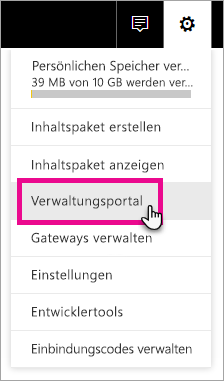
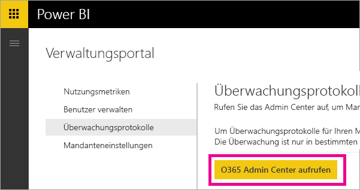
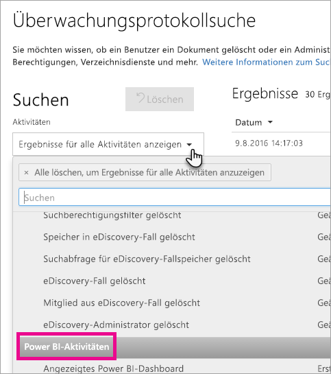
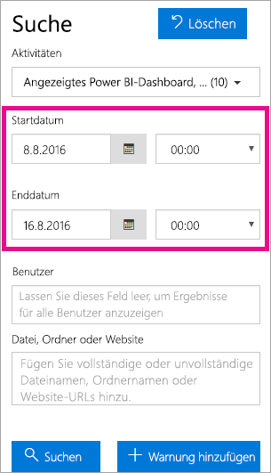
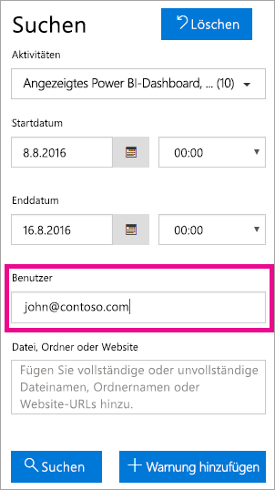
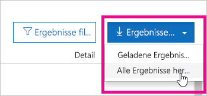

# <a name="using-auditing-within-your-organization"></a>Verwenden von Überwachung in der Organisation

Erfahren Sie, wie Sie mit der Überwachung in Power BI ergriffene Maßnahmen überwachen und untersuchen können. Sie können das Security & Compliance Center oder PowerShell verwenden.

Es kann wichtig sein zu wissen, wer welche Aktion für welches Element im Power BI-Mandanten ausführt. Dies kann Ihrer Organisation bei der Einhaltung von Anforderungen helfen, was beispielsweise die Einhaltung gesetzlicher Bestimmungen und die Dokumentverwaltung betrifft.

Sie können die Überwachungsdaten nach Datumsbereich, Benutzer, Dashboard, Bericht, Dataset und Aktivitätstyp filtern. Sie können die Aktivitäten auch als CSV-Datei (durch Trennzeichen getrennte Datei) herunterladen, um die Analyse offline durchzuführen.

## <a name="requirements"></a>Anforderungen
Die folgenden Anforderungen müssen erfüllt sein, um auf Überwachungsprotokolle zugreifen zu können:

- Für den Zugriff auf den Überwachungsbereich des Office 365 Security & Compliance Center benötigen Sie eine Exchange Online-Lizenz (in Office 365 Enterprise E3- und E5-Abonnements enthalten).
- Sie müssen globaler Administrator sein oder die Exchange-Administratorrolle besitzen, die den Zugriff auf das Überwachungsprotokoll ermöglicht. 

  Exchange-Administratorrollen werden über das Exchange Admin Center gesteuert. Weitere Informationen finden Sie unter [Berechtigungen in Exchange Online](https://technet.microsoft.com/library/jj200692(v=exchg.150).aspx).

- Wenn Sie Zugriff auf das Überwachungsprotokoll haben, aber kein globaler Administrator oder Power BI-Dienst-Administrator sind, haben Sie keinen Zugriff auf das Power BI-Verwaltungsportal. In diesem Fall müssen Sie einen direkten Link zum Office 365 Security & Compliance Center abrufen.

> [!NOTE]
> Um die Power BI-Überwachungsprotokolle in Ihrem Mandanten anzuzeigen, ist mindestens eine Exchange-Postfachlizenz im Mandanten erforderlich.

## <a name="accessing-your-audit-logs"></a>Zugriff auf Überwachungsprotokolle

Um Ihre Power BI-Protokolle zu überwachen, müssen Sie das O365 Security & Compliance Center aufrufen.

1. Wählen Sie das **Zahnradsymbol** in der rechten oberen Ecke aus.

2. Wählen Sie **Verwaltungsportal** aus.
   
   

3. Wählen Sie **Azure-Überwachungsprotokolle** aus.
 
4. Wählen Sie **Zum O365 Admin Center wechseln** aus.
   
   

Alternativ können sie zu [Office 365 | Sicherheit und Compliance](https://protection.office.com/#/unifiedauditlog) wechseln.

> [!NOTE]
> Damit Nicht-Administratorkonten auf das Überwachungsprotokoll zugreifen können, müssen Sie Berechtigungen im Exchange Online Admin Center zuweisen. Sie können z. B. einen Benutzer einer vorhandenen Rollengruppe wie „Organisationsverwaltung“ zuweisen oder eine neue Rollengruppe mit der Rolle „Überwachungsprotokolle“ erstellen. Weitere Informationen finden Sie unter [Berechtigungen in Exchange Online](https://technet.microsoft.com/library/jj200692\(v=exchg.150\).aspx).

## <a name="search-only-power-bi-activities"></a>Nur nach Power BI-Aktivitäten suchen

Sie können die Ergebnisse auf Power BI-Aktivitäten einschränken. Gehen Sie dazu so vor:

1. Wählen Sie auf der Seite **Überwachungsprotokollsuche** unter **Suche** das Dropdownfeld **Aktivitäten** aus.

2. Wählen Sie **Power BI-Aktivitäten** aus.
   
   

3. Klicken oder tippen Sie auf eine beliebige Stelle neben dem Auswahlfeld, um es zu schließen.

Bei Suchvorgängen werden jetzt ausschließlich Power BI-Aktivitäten berücksichtigt.

## <a name="search-the-audit-logs-by-date"></a>Überwachungsprotokolle nach Datum durchsuchen

Sie können die Protokolle mittels der Felder für das Startdatum und das Enddatum nach Datumsbereichen durchsuchen. Standardmäßig ist der Datumsbereich auf die letzten sieben Tage festgelegt. Datum und Uhrzeit werden in koordinierter Weltzeit (UTC) angezeigt. Der Datumsbereich kann maximal 90 Tage umfassen. Wenn der ausgewählte Datumsbereich größer als 90 Tage ist, wird ein Fehler angezeigt.

> [!NOTE]
> Wenn Sie den maximalen Datumsbereich von 90 Tagen verwenden, wählen Sie die aktuelle Uhrzeit als Startdatum. Andernfalls erhalten Sie die Fehlermeldung, dass das Startdatum vor dem Enddatum liegt. Wenn Sie die Überwachung während der letzten 90 Tage aktiviert haben, wird als Startdatum kein Zeitpunkt vor der Aktivierung akzeptiert.



## <a name="search-the-audit-logs-by-users"></a>Überwachungsprotokolle nach Benutzern durchsuchen

Sie können nach Einträgen im Überwachungsprotokoll suchen, die Aktivitäten bestimmter Benutzer betreffen. Geben Sie hierzu einen oder mehrere Benutzernamen im Feld „Benutzer“ ein.  Verwenden Sie hierbei die Benutzernamen, mit denen sich die Benutzer bei Power BI anmelden. Diese Benutzernamen sehen wie E-Mail-Adressen aus.
Lassen Sie dieses Feld leer, um Einträge für alle Benutzer (und Dienstkonten) in Ihrer Organisation abzurufen.



## <a name="viewing-search-results"></a>Suchergebnisse anzeigen

Sobald Sie die Suchschaltfläche drücken, werden die Suchergebnisse geladen und nach einigen Momenten angezeigt. Dann wird auch die Anzahl der Ergebnisse angegeben. 

> [!NOTE]
> Es werden maximal 1000 Ereignisse dargestellt. Wenn mehr als 1000 Ereignisse den Suchkriterien entsprechen, werden die 1000 neuesten Ereignisse angezeigt.

Die Ergebnisse enthalten zu jedem Ereignis, das bei der Suche zurückgegeben wurde, die folgenden Informationen.

| **Spalte** | **Definition** |
| --- | --- |
| Datum (Date) |Datum und Uhrzeit des Ereignisses (im UTC-Format). |
| IP-Adresse |Die IP-Adresse des während der Erfassung verwendeten Geräts. Die IP-Adresse wird als IPv4- oder IPv6-Adresse angezeigt. |
| User |Der Benutzer (oder das Dienstkonto), der die Aktion ausgeführt hat, die das Ereignis ausgelöst hat. |
| Activity |Die Aktivität, die vom Benutzer ausgeführt wurde. Dieser Wert entspricht den Aktivitäten, die Sie in der Dropdownliste „Aktivitäten“ festgelegt haben. Bei Ereignissen aus dem Überwachungsprotokoll für Exchange-Administratoren ist der Wert in dieser Spalte ein Exchange-Cmdlet. |
| Item |Das Objekt, das durch die entsprechende Aktivität erstellt oder verändert wurde. Dies ist beispielsweise eine Datei, die der Benutzer aufgerufen oder bearbeitet hat, oder ein Benutzerkonto, das aktualisiert wurde. Nicht alle Aktivitäten verfügen über einen Wert in dieser Spalte. |
| Detail |Weitere Details zu einer Aktivität. Auch hier besitzen nicht alle Aktivitäten einen Wert. |

> [!NOTE]
> Klicken oder tippen Sie in den Ergebnissen auf eine Spaltenüberschrift, um die Ergebnisse zu sortieren. Sie können die Ergebnisse alphabetisch von A nach Z oder von Z nach A sortieren. Über den Datumsheader können Sie die Ergebnisse aufsteigend oder absteigend nach Datum sortieren.

## <a name="view-the-details-for-an-event"></a>Anzeigen von Ereignisdetails

Wenn Sie in den Suchergebnissen den Eintrag eines Ereignisses auswählen, können Sie weitere Einzelheiten anzeigen. Dadurch wird eine Detailseite mit den genauen Eigenschaften des Ereignisses aufgerufen. Welche Eigenschaften angezeigt werden, hängt von dem Office 365-Dienst ab, bei dessen Verwendung das Ereignis aufgetreten ist. Um zusätzliche Details anzuzeigen, wählen Sie **Weitere Informationen** aus.

Die folgende Tabelle enthält Informationen zu den möglicherweise angezeigten Parametern.

| **Parameter oder Ereignis** | **Beschreibung** | **Weitere Informationen** |
| --- | --- | --- |
| Downloaded Power BI report (Power BI-Bericht herunterladen) |Diese Aktivität wird bei jedem Herunterladen eines Berichts protokolliert. |Berichtsname, Datasetname |
| Create report (Bericht erstellen) |Diese Aktivität wird bei jedem Erstellen eines neuen Berichts protokolliert. |Berichtsname, Datasetname |
| Bericht bearbeiten |Jedes Mal, wenn ein Bericht bearbeitet wird, wird diese Aktivität protokolliert. |Berichtsname, Datasetname |
| Create dataset (Dataset erstellen) |Diese Aktivität wird bei jedem Erstellen eines Datasets protokolliert. |Datasetname, DataConnectivityMode |
| Delete Dataset (Dataset löschen) |Diese Aktivität wird bei jedem Löschen eines Datasets protokolliert. |Datasetname, DataConnectivityMode |
| Create Power BI app (Power BI-App erstellen) |Diese Aktivität wird bei jedem Erstellen einer Power BI-App protokolliert. |App-Name, Berechtigungen, Arbeitsbereichsname |
| Install Power BI app (Power BI-App installieren) |Diese Aktivität wird bei jedem Installieren einer Power BI-App protokolliert. |App-Name |
| Update Power BI app (Power BI-App aktualisieren) |Diese Aktivität wird bei jedem Aktualisieren einer Power BI-App protokolliert. |App-Name, Berechtigungen, Arbeitsbereichsname |
| Started Power BI extended trial (Erweiterten Power BI-Test begonnen) |Diese Aktivität wird immer protokolliert, wenn ein Benutzer die erweiterte Pro-Testversion akzeptiert, die am 31. Mai 2018 endet. | |
| Analyzed Power BI dataset (Power BI-Dataset analysiert) |Diese Aktivität wird jedes Mal protokolliert, wenn ein Power BI-Dataset in Excel analysiert wird. | |
| Created Power BI gateway (Power BI-Gateway erstellt) |Diese Aktivität wird bei jedem Erstellen eines neuen Gateways protokolliert. |Gatewayname, Gatewaytyp |
| Deleted Power BI gateway (Power BI-Gateway gelöscht) |Diese Aktivität wird bei jedem Löschen eines Gateways protokolliert. |Gatewayname, Gatewaytyp |
| Added Data source to Power BI gateway (Datenquelle zu Power BI-Gateway hinzugefügt) |Diese Aktivität wird bei jedem Hinzufügen einer Datenquelle zum Gateway protokolliert. |Gatewayname, Gatewaytyp, Datenquellenname, Datenquellentyp |
| Removed data source from Power BI gateway (Datenquelle aus Power BI-Gateway entfernt) |Diese Aktivität wird bei jedem Entfernen einer Datenquelle aus einem Gateway protokolliert. |Gatewayname, Gatewaytyp, Datenquellenname, Datenquellentyp |
| Changed Power BI gateway admins (Power BI-Gatewayadministratoren geändert) |Diese Aktivität wird jedes Mal protokolliert, wenn die Administratoren eines Gateways geändert (hinzugefügt/entfernt) werden. |Gatewayname, hinzugefügte Benutzer, entfernte Benutzer |
| Changed Power BI gateway data source users (Benutzer der Power BI-Gatewaydatenquelle geändert) |Diese Aktivität wird jedes Mal protokolliert, wenn die Benutzer eines Gateways geändert (hinzugefügt/entfernt) werden. |Gatewayname, hinzugefügte Benutzer, entfernte Benutzer |
| SetScheduledRefresh |Diese Aktivität wird jedes Mal protokolliert, wenn für ein Dataset eine neue Aktualisierung geplant wird. |Datasetname, Aktualisierungshäufigkeit (in Minuten) |

## <a name="using-powershell-to-search"></a>Suche mithilfe von PowerShell

Sie können mit PowerShell abhängig von Ihren Anmeldeinformationen auf die Überwachungsprotokolle zugreifen. Dies erfolgt durch den Zugriff auf Exchange Online. Im Folgenden finden Sie ein Beispiel für einen Befehl zum Abrufen von Einträgen aus dem Power BI-Überwachungsprotokoll.

> [!NOTE]
> Zum Verwenden des Befehls „New-PSSession“ muss Ihrem Konto eine Exchange Online-Lizenz zugewiesen sein, und Sie benötigen Zugriff auf das Überwachungsprotokoll für den Mandanten.

```
Set-ExecutionPolicy RemoteSigned

$UserCredential = Get-Credential

$Session = New-PSSession -ConfigurationName Microsoft.Exchange -ConnectionUri https://outlook.office365.com/powershell-liveid/ -Credential $UserCredential -Authentication Basic -AllowRedirection

Import-PSSession $Session
Search-UnifiedAuditLog -StartDate 9/11/2016 -EndDate 9/15/2016 -RecordType PowerBI -ResultSize 1000 | Format-Table | More
```

Weitere Informationen zum Verbinden mit Exchange Online finden Sie unter [Herstellen einer Verbindung mit Exchange Online mithilfe der Remote-PowerShell](https://technet.microsoft.com/library/jj984289\(v=exchg.160\).aspx).

Weitere Informationen zu Parametern und Syntax des Befehls Search-UnifiedAuditLog finden Sie unter [Search-UnifiedAuditLog](https://technet.microsoft.com/library/mt238501\(v=exchg.160\).aspx).

Ein Beispiel für die Verwendung von PowerShell zum Suchen des Überwachungsprotokolls und anschließenden Zuweisen von Power BI Pro-Lizenzen auf Grundlage der Einträge finden Sie unter [Zuweisen von Power BI Pro-Lizenzen mit dem Power BI-Überwachungsprotokoll und PowerShell](https://powerbi.microsoft.com/blog/using-power-bi-audit-log-and-powershell-to-assign-power-bi-pro-licenses/).

## <a name="export-the-power-bi-audit-log"></a>Exportieren des Power BI-Überwachungsprotokolls

Sie können das Power BI-Überwachungsprotokoll als CSV-Datei exportieren.

1. Wählen Sie **Ergebnisse exportieren** aus.

2. Wählen Sie entweder **Geladene Ergebnisse speichern** oder **Alle Ergebnisse herunterladen** aus.
   
   

## <a name="record-and-user-types"></a>Datensatz- und Benutzertypen

Überwachungsprotokolleinträge enthalten als Teil des Eintrags „RecordType“ und „UserType“. Alle Power BI-Einträge weisen als „RecordType“ 20 auf.

Eine vollständige Liste finden Sie unter [Detaillierte Eigenschaften im Office 365-Überwachungsprotokoll](https://support.office.com/article/Detailed-properties-in-the-Office-365-audit-log-ce004100-9e7f-443e-942b-9b04098fcfc3).

## <a name="list-of-activities-audited-by-power-bi"></a>Liste der in Power BI überwachten Aktivitäten

| Activity | Beschreibung | Weitere Informationen |
| --- | --- | --- |
| CreateDashboard |Jedes Mal, wenn ein neues Dashboard erstellt wird, wird diese Aktivität protokolliert. |– Dashboardname. |
| EditDashboard |Jedes Mal, wenn ein Dashboard umbenannt wird, wird diese Aktivität protokolliert. |– Dashboardname. |
| DeleteDashboard |Jedes Mal, wenn ein Dashboard gelöscht wird, wird diese Aktivität protokolliert. |– Dashboardname. |
| PrintDashboard |Dieses Ereignis wird jedes Mal protokolliert, wenn ein Dashboard gedruckt wird. |– Dashboardname.<br/>– Datasetname |
| ShareDashboard |Jedes Mal, wenn ein Dashboard freigegeben wird, wird diese Aktivität protokolliert. |– Dashboardname.<br/>– Empfänger-E-Mail.<br/>– Datasetname.<br>– Erneutes Freigeben von Berechtigungen. |
| ViewDashboard |Jedes Mal, wenn ein Dashboard angezeigt wird, wird diese Aktivität protokolliert. |– Dashboardname. |
| ExportTile |Dieses Ereignis wird jedes Mal protokolliert, wenn Daten aus einer Dashboardkachel exportiert werden. |– Kachelname.<br/>– Datasetname. |
| DeleteReport |Jedes Mal, wenn ein Bericht gelöscht wird, wird diese Aktivität protokolliert. |– Berichtsname. |
| ExportReport |Dieses Ereignis wird jedes Mal protokolliert, wenn Daten aus einer Berichtskachel exportiert werden. |– Berichtsname.<br/>– Datasetname. |
| PrintReport |Dieses Ereignis wird jedes Mal protokolliert, wenn ein Bericht gedruckt wird. |– Berichtsname.<br/>– Datasetname. |
| PublishToWebReport |Dieses Ereignis wird jedes Mal protokolliert, wenn ein Bericht im Web veröffentlicht wird. |– Berichtsname.<br/>– Datasetname. |
| ViewReport |Jedes Mal, wenn ein Bericht angezeigt wird, wird diese Aktivität protokolliert. |– Berichtsname. |
| ExploreDataset |Dieses Ereignis wird jedes Mal protokolliert, wenn Sie ein Dataset auswählen und untersuchen. |– Datasetname |
| DeleteDataset |Dieses Ereignis wird jedes Mal protokolliert, wenn ein Dataset gelöscht wird. |– Datasetname. |
| CreateOrgApp |Jedes Mal, wenn ein Inhaltspaket der Organisation erstellt wird, wird diese Aktivität protokolliert. |– Name des organisationsbezogenen Inhaltspakets.<br/>– Dashboardnamen.<br/>– Berichtsnamen.<br/>– Datasetnamen. |
| CreateGroup |Diese Aktivität wird bei jedem Erstellen einer Gruppe ausgelöst. |– Gruppenname. |
| AddGroupMembers |Jedes Mal, wenn einem Power BI-Gruppenarbeitsbereich ein Mitglied hinzugefügt wird, wird diese Aktivität protokolliert. |– Gruppenname.<br/>– E-Mail-Adressen. |
| UpdatedAdminFeatureSwitch |Dieses Ereignis wird jedes Mal protokolliert, wenn ein Schalter für ein Verwaltungsfeature geändert wird. |– Der Name des Schalters.<br/>– Neuer Status des Schalters. |
| OptInForProTrial |Dieses Ereignis protokolliert, wenn ein Benutzer Power BI Pro innerhalb des Diensts testen möchte. |– E-Mail-Adresse |

## <a name="next-steps"></a>Nächste Schritte

[Power BI-Verwaltungsportal](service-admin-portal.md)  
[Power BI Premium – Beschreibung](service-premium.md)  
[Erwerb von Power BI Pro](service-admin-purchasing-power-bi-pro.md)  
[Berechtigungen in Exchange Online](https://technet.microsoft.com/library/jj200692\(v=exchg.150\).aspx)  
[Herstellen einer Verbindung mit Exchange Online mithilfe der Remote-PowerShell](https://technet.microsoft.com/library/jj984289\(v=exchg.160\).aspx)  
[Search-UnifiedAuditLog](https://technet.microsoft.com/library/mt238501\(v=exchg.160\).aspx)  
[Detaillierte Eigenschaften im Office 365-Überwachungsprotokoll](https://support.office.com/article/Detailed-properties-in-the-Office-365-audit-log-ce004100-9e7f-443e-942b-9b04098fcfc3)  

Weitere Fragen? [Stellen Sie Ihre Frage in der Power BI-Community.](http://community.powerbi.com/)