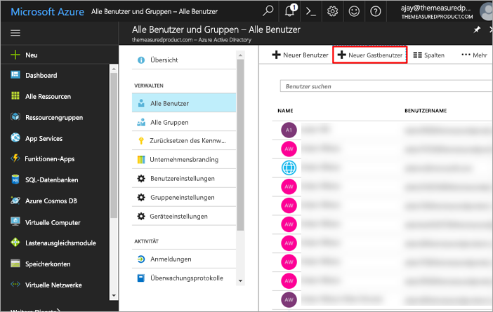
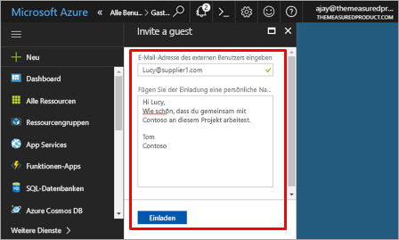
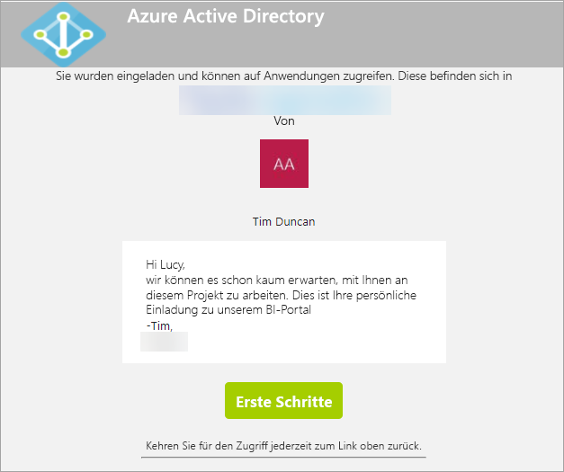
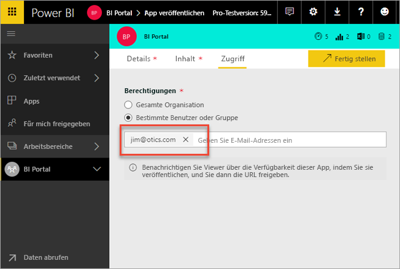
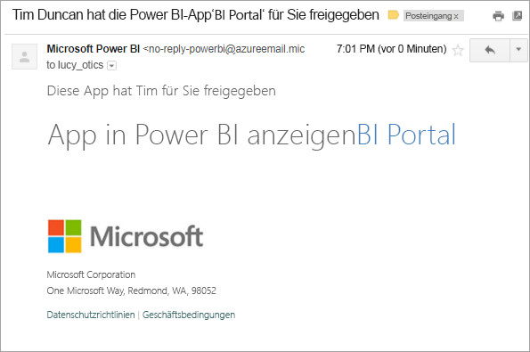
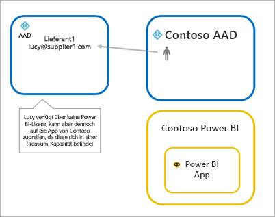
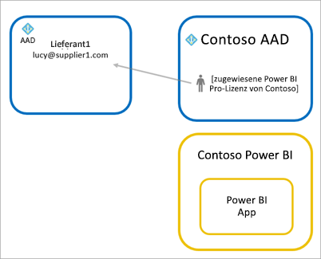
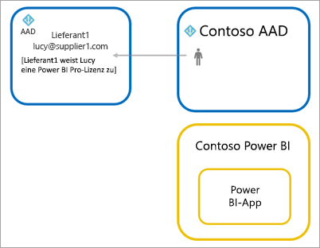

# Verteilen von Power BI-Inhalten an externe Gastbenutzer mit Azure AD B2B

Power BI ist in Azure Active Directory Business-to-Business (Azure AD B2B) integriert, um die sichere Verteilung von Power BI-Inhalten an Gastbenutzer außerhalb Ihrer Organisation zu ermöglichen, während Sie weiterhin die Kontrolle über die internen Daten zu behalten.

## Aktivieren des Zugriffs

Bevor Sie Gastbenutzer einladen, stellen Sie sicher, dass das Feature [Einstellungen für Export und Freigabe](service-admin-portal.md#export-and-sharing-settings) im Power BI-Verwaltungsportal aktiviert ist.

## Wen können Sie einladen?

Sie können Gastbenutzer einladen, die eine E-Mail-Adresse mit einem privaten Konto verwenden, wie z.B. gmail.com, outlook.com und hotmail.com. In Azure AD B2B werden diese Adressen als *soziale Identitäten* bezeichnet.

## Einladen von Gastbenutzern

Einladungen sind nur erforderlich, wenn ein externer Gast zum ersten Mal in Ihre Organisation eingeladen wird. Es gibt zwei Möglichkeiten, um Benutzer einzuladen: geplante Einladungen und Ad-hoc-Einladungen.

### Geplante Einladungen

Verwenden Sie eine geplante Einladung, wenn Sie wissen, welche Benutzer Sie einladen möchten. Sie können die Einladung über das Azure-Portal oder PowerShell senden. Sie müssen Mandantenadministrator sein, um Personen einzuladen.

Führen Sie die folgenden Schritte aus, um eine Einladung über das Azure-Portal zu senden.

1. Wählen Sie im [Azure-Portal](https://portal.azure.com) den Eintrag **Azure Active Directory** aus.

1. Wechseln Sie unter **Verwalten** zu **Benutzer** > **Alle Benutzer** > **Neuer Gastbenutzer**.

    

1. Geben Sie eine **E-Mail-Adresse** und eine **persönliche Nachricht** ein.

    

1. Wählen Sie **Einladen** aus.

Verwenden Sie PowerShell, um mehrere Gastbenutzer einzuladen. Weitere Informationen finden Sie unter [Azure Active Directory B2B-Zusammenarbeit: Code- und PowerShell-Beispiele](/azure/active-directory/b2b/code-samples/).

Der Gastbenutzer muss in der empfangenen E-Mail-Einladung **Erste Schritte** auswählen. Anschließend wird der Gastbenutzer dem Mandanten hinzugefügt.

### Ad-hoc-Einladungen

Um eine Einladung zu einem beliebigen Zeitpunkt auszuführen, fügen Sie den externen Benutzer über die freigegebene Benutzeroberfläche dem Dashboard oder dem Bericht hinzu, bzw. fügen Sie den externen Benutzer über die Zugriffsseite Ihrer App hinzu. Das folgende Beispiel zeigt, wie Sie einen externen Benutzer zur Verwendung einer App einladen.

Der Gastbenutzer erhält eine E-Mail mit der Mitteilung, dass die App für ihn freigegeben wurde.

Der Gastbenutzer muss sich mit seiner Organisations-E-Mail-Adresse anmelden. Nach dem Anmelden wird er aufgefordert, die Einladung anzunehmen. Der Gastbenutzer wird nach dem Anmelden zu den App-Inhalten umgeleitet. Um zur App zurückzukehren, kann der Benutzer den Link als Lesezeichen festlegen oder die E-Mail speichern.

## Lizenzierung

Der Gastbenutzer benötigt eine entsprechende Lizenz, um die freigegebene App anzuzeigen. Es gibt drei Optionen, um dies zu erreichen: Verwenden von Power BI Premium, Zuweisen einer Power BI Pro-Lizenz oder Verwenden der Power BI Pro-Lizenz des Gasts.

### Verwenden von Power BI Premium

Durch Zuweisen des App-Arbeitsbereichs zu [Power BI Premium-Kapazität](service-premium.md) kann der Gastbenutzer die App verwenden, ohne dass eine Power BI Pro-Lizenz erforderlich ist. Mithilfe von Power BI Premium können Apps zudem weitere Leistungsmerkmale nutzen, z.B. höhere Aktualisierungsraten, dedizierte Kapazität und große Modelle.

### Zuweisen einer Power BI Pro-Lizenz zu einem Gastbenutzer

Wenn Sie dem Gastbenutzer eine Power BI Pro-Lizenz in Ihrem Mandanten zuweisen, kann dieser die Inhalte des Mandanten anzeigen.

### Der Gastbenutzer verfügt über eine eigene Power BI Pro-Lizenz.

Dem Gastbenutzer ist in seinem Mandanten bereits eine Power BI Pro-Lizenz zugewiesen.

## Überlegungen und Einschränkungen

* Externe B2B-Gäste können lediglich Inhalte abrufen. Externe B2B-Gäste können Apps, Dashboards und Berichte anzeigen, Daten exportieren und E-Mail-Abonnements für Dashboards und Berichte erstellen. Der Zugriff auf Arbeitsbereiche und die Veröffentlichung eigener Inhalte sind hingegen nicht möglich.

* Diese Funktion ist für die mobilen Power BI-Apps derzeit nicht verfügbar. Auf Mobilgeräten können Sie die freigegebenen Power BI-Inhalte über Azure AD B2B im Browser anzeigen.

* Diese Funktion ist für den Onlinebericht-Webpart von Power BI SharePoint derzeit nicht verfügbar.

## Nächste Schritte

Ausführlichere Informationen, z.B. zur Funktionsweise der Sicherheit auf Zeilenebene, finden Sie in diesem Whitepaper: [Distribute Power BI content to external guest users using Azure AD B2B](https://aka.ms/powerbi-b2b-whitepaper) (Verteilen von Power BI-Inhalten an externe Gastbenutzer mithilfe von Azure AD B2B).

Informationen zu Azure Active Directory B2B finden Sie unter [Was ist die Azure AD B2B-Zusammenarbeit?](/azure/active-directory/active-directory-b2b-what-is-azure-ad-b2b/).
