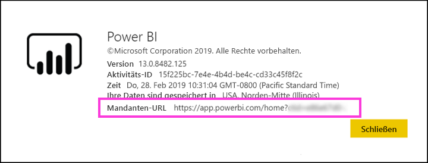

# Verteilen von Power BI-Inhalten an externe Gastbenutzer mit Azure AD B2B

Power BI ist in Azure Active Directory Business-to-Business (Azure AD B2B) integriert, um die sichere Verteilung von Power BI-Inhalten an Gastbenutzer außerhalb Ihrer Organisation zu ermöglichen, während Sie weiterhin die Kontrolle über die internen Daten zu behalten.  

Des Weiteren können Sie Gastbenutzern außerhalb Ihrer Organisation das Bearbeiten und Verwalten von Inhalten in Ihrer Organisation ermöglichen.

## Aktivieren des Zugriffs

Bevor Sie Gastbenutzer einladen, stellen Sie sicher, dass das Feature [Inhalte für externe Benutzer freigeben](service-admin-portal.md#export-and-sharing-settings) im Power BI-Verwaltungsportal aktiviert ist.

Darüber hinaus können Sie über das Feature [Externen Gastbenutzern das Bearbeiten und Verwalten von Inhalten in der Organisation erlauben](service-admin-portal.md#export-and-sharing-settings) auswählen, welcher Gastbenutzer Inhalte in Arbeitsbereichen sehen und erstellen sowie Power BI für Ihre Organisation durchsuchen kann.

## Wen können Sie einladen?

Sie können Gastbenutzer einladen, die eine E-Mail-Adresse mit einem privaten Konto verwenden, wie z.B. gmail.com, outlook.com und hotmail.com. In Azure AD B2B werden diese Adressen als *soziale Identitäten* bezeichnet.

## Einladen von Gastbenutzern

Einladungen sind nur erforderlich, wenn ein externer Gast zum ersten Mal in Ihre Organisation eingeladen wird. Es gibt zwei Möglichkeiten, um Benutzer einzuladen: geplante Einladungen und Ad-hoc-Einladungen.

### Geplante Einladungen

Verwenden Sie eine geplante Einladung, wenn Sie wissen, welche Benutzer Sie einladen möchten. Sie können die Einladung über das Azure-Portal oder PowerShell senden. Sie müssen Mandantenadministrator sein, um Personen einzuladen.

Führen Sie die folgenden Schritte aus, um eine Einladung über das Azure-Portal zu senden.

1. Wählen Sie im [Azure-Portal](https://portal.azure.com) den Eintrag **Azure Active Directory** aus.

1. Wechseln Sie unter **Verwalten** zu **Benutzer** > **Alle Benutzer** > **Neuer Gastbenutzer**.

    

1. Geben Sie eine **E-Mail-Adresse** und eine **persönliche Nachricht** ein.

    

1. Wählen Sie **Einladen** aus.

Verwenden Sie PowerShell, um mehrere Gastbenutzer einzuladen. Weitere Informationen finden Sie unter [Azure Active Directory B2B-Zusammenarbeit: Code- und PowerShell-Beispiele](/azure/active-directory/b2b/code-samples/).

Der Gastbenutzer muss in der empfangenen E-Mail-Einladung **Erste Schritte** auswählen. Anschließend wird der Gastbenutzer dem Mandanten hinzugefügt.

### Ad-hoc-Einladungen

Um eine Einladung zu einem beliebigen Zeitpunkt auszuführen, fügen Sie den externen Benutzer über die freigegebene Benutzeroberfläche dem Dashboard oder dem Bericht hinzu, bzw. fügen Sie den externen Benutzer über die Zugriffsseite Ihrer App hinzu. Das folgende Beispiel zeigt, wie Sie einen externen Benutzer zur Verwendung einer App einladen.

Der Gastbenutzer erhält eine E-Mail mit der Mitteilung, dass die App für ihn freigegeben wurde.

Der Gastbenutzer muss sich mit seiner Organisations-E-Mail-Adresse anmelden. Nach dem Anmelden wird er aufgefordert, die Einladung anzunehmen. Der Gastbenutzer wird nach dem Anmelden zu den App-Inhalten umgeleitet. Um zur App zurückzukehren, kann der Benutzer den Link als Lesezeichen festlegen oder die E-Mail speichern.

## Lizenzierung

Der Gastbenutzer benötigt eine entsprechende Lizenz, um die freigegebenen Inhalte anzuzeigen. Es gibt drei Optionen, um dies zu erreichen: Verwenden von Power BI Premium, Zuweisen einer Power BI Pro-Lizenz oder Verwenden der Power BI Pro-Lizenz des Gasts.

Wenn das Feature [Externen Gastbenutzern das Bearbeiten und Verwalten von Inhalten in der Organisation erlauben](service-admin-portal.md#export-and-sharing-settings) verwendet wird, benötigen Gastbenutzer, die Inhalte in Arbeitsbereichen beisteuern oder Inhalte für Andere freigeben, eine Power BI Pro-Lizenz.

### Verwenden von Power BI Premium

Durch Zuweisen des App-Arbeitsbereichs zu [Power BI Premium-Kapazität](service-premium.md) kann der Gastbenutzer die App verwenden, ohne dass eine Power BI Pro-Lizenz erforderlich ist. Mithilfe von Power BI Premium können Apps zudem weitere Leistungsmerkmale nutzen, z.B. höhere Aktualisierungsraten, dedizierte Kapazität und große Modelle.

### Zuweisen einer Power BI Pro-Lizenz zu einem Gastbenutzer

Wenn Sie dem Gastbenutzer eine Power BI Pro-Lizenz in Ihrem Mandanten zuweisen, kann dieser die Inhalte des Mandanten anzeigen.

### Der Gastbenutzer verfügt über eine eigene Power BI Pro-Lizenz.

Dem Gastbenutzer ist in seinem Mandanten bereits eine Power BI Pro-Lizenz zugewiesen.

## Gastbenutzer, die Inhalte bearbeiten und verwalten können. 

Wenn das Feature [Externen Gastbenutzern das Bearbeiten und Verwalten von Inhalten in der Organisation erlauben](service-admin-portal.md#export-and-sharing-settings) verwendet wird, erhalten die angegebenen Gastbenutzer Zugriff auf Power BI in Ihrer Organisation, und sie können alle Inhalte sehen, für die sie über eine Berechtigung verfügen. Sie können auf Power BI Home zugreifen, Arbeitsbereiche durchsuchen, Apps installieren, die in der Zugriffsliste enthalten sind, und in Arbeitsbereichen Inhalte beisteuern. Sie können einen Administrator für Arbeitsbereiche erstellen, der die neue Arbeitsbereichsoberfläche verwendet, oder sie können selbst ein Administrator für diese Bereiche sein. Es gelten einige Einschränkungen, die im Abschnitt „Überlegungen und Einschränkungen“ aufgelistet sind.

Damit sich diese Benutzer bei Power BI anmelden können, stellen Sie ihnen die Mandanten-URL zur Verfügung. Gehen Sie wie folgt vor, um die Mandanten-URL zu finden:

1. Klicken Sie im Power BI-Dienst im oberen Menü auf das Hilfesymbol (**?**) und dann auf **Info zu Power BI**.

2. Suchen Sie nach dem Wert neben **Tenant URL** (Mandanten-URL). Dies ist die Mandanten-URL, die Sie für Ihre Gastbenutzer freigeben können.

## Überlegungen und Einschränkungen

* Standardmäßig können externe B2B-Gäste lediglich Inhalte abrufen. Externe B2B-Gäste können Apps, Dashboards und Berichte anzeigen, Daten exportieren und E-Mail-Abonnements für Dashboards und Berichte erstellen. Der Zugriff auf Arbeitsbereiche und die Veröffentlichung eigener Inhalte sind hingegen nicht möglich. Diese Einschränkungen gelten jedoch nicht für Gastbenutzer, die durch die Mandanteneinstellung [Externen Gastbenutzern das Bearbeiten und Verwalten von Inhalten in der Organisation erlauben](service-admin-portal.md#export-and-sharing-settings) berechtigt sind.

* Für Gastbenutzer, die durch die Mandanteneinstellung [Externen Gastbenutzern das Bearbeiten und Verwalten von Inhalten in der Organisation erlauben](service-admin-portal.md#export-and-sharing-settings) berechtigt sind, ist die Nutzung einiger Benutzeroberflächen nicht möglich. Zum Aktualisieren oder Veröffentlichen von Berichten müssen sie die Webbenutzeroberfläche des Power BI-Diensts verwenden, einschließlich des Befehls „Daten abrufen“ zum Hochladen von Power BI Desktop-Dateien.  Die folgenden Funktionen werden nicht unterstützt:
    * Direktes Veröffentlichen aus Power BI Desktop im Power BI-Dienst
    * Gastbenutzer können Power BI Desktop nicht dazu verwenden, eine Verbindung mit Dienstdatasets im Power BI-Dienst herzustellen.
    * Klassische Arbeitsbereiche, die mit Office 365-Gruppen verknüpft sind: Gastbenutzer können keine Administratoren für diese Arbeitsbereiche erstellen oder selbst Administratoren sein. Sie können Mitglieder sein.
    * Das Senden von Ad-hoc-Einladungen wird für Arbeitsbereichszugriffslisten nicht unterstützt.
    * Power BI Publisher für Excel wird für Gastbenutzer nicht unterstützt.
    * Gastbenutzer können nicht Power BI Gateway installieren und eine Verbindung von Power BI Gateway mit Ihrer Organisation herstellen.
    * Gastbenutzer können keine Apps installieren und diese für die gesamte Organisation freigeben.
    * Gastbenutzer können keine Organisationsinhaltspakete verwenden, erstellen, aktualisieren oder installieren.
    * Gastbenutzer können nicht „In Excel analysieren“ verwenden.
    * Gastbenutzer können beim Kommentieren nicht @erwähnt werden.
    * Gastbenutzer können keine Abonnements verwenden.
    * Gastbenutzer, die diese Funktion verwenden, sollten ein Geschäfts-, Schul- oder Unikonto besitzen. Für Gastbenutzer, die persönliche Konten verwenden, gelten mehr Einschränkungen aufgrund von Anmeldeeinschränkungen.

* Diese Funktion ist für den Onlinebericht-Webpart von Power BI SharePoint derzeit nicht verfügbar.

* Mit einigen Active Directory-Einstellungen, die auch für Ihre Power BI-Umgebung gelten, kann eingeschränkt werden, über welche Berechtigungen externe Gastbenutzer in Ihrer gesamten Organisation verfügen. In der folgenden Dokumentation werden die Einstellungen erläutert:
    * [Manage External Collaboration Settings](https://docs.microsoft.com/azure/active-directory/b2b/delegate-invitations#control-who-can-invite) (Einstellungen für externe Zusammenarbeit verwalten)
    * [Zulassen oder Blockieren von Einladungen für B2B-Benutzer von bestimmten Organisationen](https://docs.microsoft.com/azure/active-directory/b2b/allow-deny-list)  

## Nächste Schritte

Ausführlichere Informationen, darunter zur Funktionsweise von Sicherheit auf Zeilenebene, finden Sie im Whitepaper: [Verteilen von Power BI-Inhalten an externe Gastbenutzer mit Azure AD B2B](https://aka.ms/powerbi-b2b-whitepaper).

Informationen zu Azure Active Directory B2B finden Sie unter [Was ist die Azure AD B2B-Zusammenarbeit?](/azure/active-directory/active-directory-b2b-what-is-azure-ad-b2b/).
