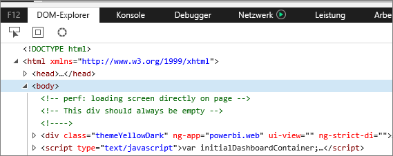
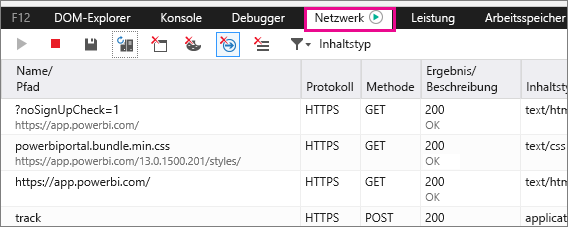
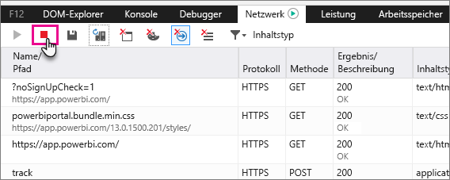
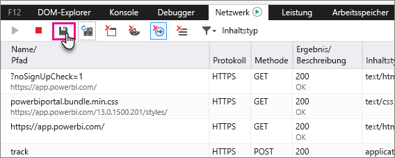

# Erfassen von zusätzlichen Diagnoseinformationen
## Erfassen von zusätzlichen Diagnoseinformationen für Power BI
Diese Anweisungen bieten zwei mögliche Optionen für die manuelle Erfassung von zusätzlichen Diagnoseinformationen aus dem Webclient von Power BI.  Nur eine dieser Optionen muss angewendet werden.

## Netzwerkerfassung – Edge & Internet Explorer
1. Rufen Sie [Power BI](https://app.powerbi.com) mit Microsoft Edge oder Internet Explorer auf.
2. Öffnen Sie die Edge-Entwicklertools, indem Sie F12 drücken.
3. Daraufhin wird das Fenster „Entwicklungstools“ aufgerufen: 
   
   
4. Wechseln Sie zur Registerkarte „Netzwerk“. Es wird der Datenverkehr aufgelistet, der bereits erfasst wurde. 
   
   
5. Sie können ihn Fenster durchsuchen und jedes Problem, das auftritt, reproduzieren. Sie können das Fenster „Entwicklertools“ während der Sitzung beliebig oft durch Drücken von F12 ausblenden und anzeigen.
6. Um die Aufzeichnung zu beenden, können Sie das rote Quadrat auf der Registerkarte „Netzwerk“ des Entwicklertoolbereichs auswählen.
   
   
7. Klicken Sie auf das Diskettensymbol, um die Aufzeichnung **nach HAR zu exportieren**.
   
   
8. Geben Sie einen Dateinamen ein, und speichern Sie die HAR-Datei.
   
    Die HAR-Datei enthält alle Informationen über Netzwerkanforderungen zwischen dem Browserfenster und Power BI.  Dazu gehören die Aktivitäts-IDs für jede Anforderung, der genaue Zeitstempel für jede Anforderung sowie alle an den Client zurückgegebenen Fehlerinformationen.  Diese Ablaufverfolgung enthält außerdem die Daten, die zum Füllen der auf dem Bildschirm angezeigten visuellen Objekte verwendet werden.
9. Sie können die HAR-Datei angeben, um die Überprüfung zu unterstützen.

Weitere Fragen? [Stellen Sie Ihre Frage in der Power BI-Community.](http://community.powerbi.com/)

