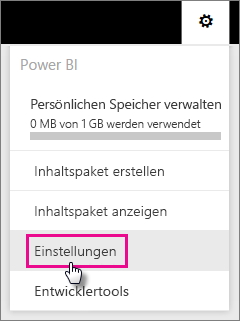
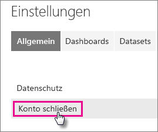
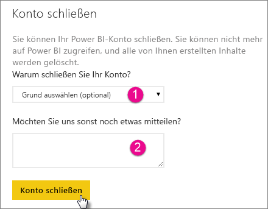

# Schließen des Power BI-Kontos
Wenn Sie Power BI nicht mehr verwenden möchten, bitten Sie uns, Ihr Power BI-Konto zu schließen.  Nachdem Ihr Konto geschlossen wurde, können Sie sich nicht mehr bei Power BI anmelden.  Außerdem werden alle von Ihnen in Power BI hochgeladenen oder erstellten Kundendaten gemäß der Datenaufbewahrungsrichtlinie in den Vertragsbedingungen für Power BI gelöscht.

## Einzelne Power BI-Benutzer
Sie können im Bildschirm „Einstellungen“ Ihr Konto schließen.

1. Wählen Sie das Zahnrad  in der rechten oberen Ecke aus.
2. Wählen Sie **Einstellungen**aus.
   
    
3. **Allgemein** > **Konto schließen**
   
    
4. Wählen Sie in der Dropdownliste **Warum schließen Sie Ihr Konto?** (1) einen Grund aus.  Sie können auch optional weitere Informationen (2) angeben. Wählen Sie dann **Konto schließen**aus.
   
    
5. Bestätigen Sie, dass Sie Ihr Konto schließen möchten.
   
    
6. Sie sehen eine Bestätigung, dass Ihr Konto geschlossen wird. Sie erhalten außerdem einen Link, über den Sie Ihr Konto wieder öffnen können.
   
    

## Benutzer von verwalteten Mandanten
Sie müssen sich an Ihren Mandantenadministrator wenden und diesen darum bitten, die Lizenz von Ihrem Konto aufzuheben.

Weitere Fragen? [Stellen Sie Ihre Frage in der Power BI-Community.](http://community.powerbi.com/)

