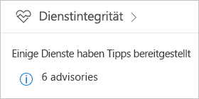
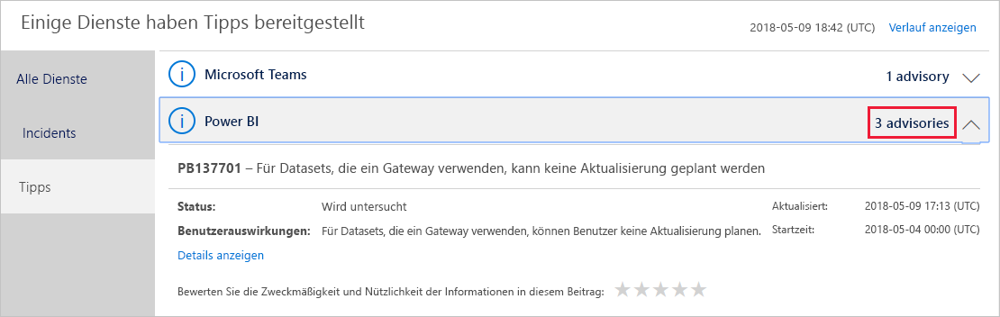

# Nachverfolgen des Power BI-Dienststatus in Office 365

Das Office 365 Admin Center bietet Power BI-Administratoren wichtige Tools, z.B. zur Ermittlung und Anzeige von Informationen zu aktuellen und vergangenen Dienststatus. Um auf diese Informationen zuzugreifen, müssen Sie einer der folgenden Rollen angehören: Power BI-Dienstadministrator oder globaler Office 365-Administrator. Weitere Informationen zu Rollen finden Sie unter [Administratorrollen in Zusammenhang mit Power BI](service-admin-administering-power-bi-in-your-organization.md#administrator-roles-related-to-power-bi).

1. Melden Sie sich beim [Office 365 Admin Center](https://portal.office.com/adminportal) an.

2. Wählen Sie die Kachel **Dienststatus** aus.

    

3. Wählen Sie in der aktuellen Liste **N Ratgeber** oder **N Incidents** aus, und sehen Sie sich die Ergebnisse an. In der folgenden Abbildung sehen Sie einen der drei aktiven Ratgeber.

    

4. Um weitere Informationen zu einem Element anzuzeigen, wählen Sie **Details anzeigen** aus. In der folgenden Abbildung sehen Sie zusätzliche Details, einschließlich kürzlich erfolgter Statusupdates.

    

    Scrollen Sie nach unten, um weitere Informationen anzuzeigen, und schließen Sie den Bereich, wenn Sie fertig sind.

5. Um Verlaufsinformationen für alle Dienste anzuzeigen, klicken Sie oben rechts in der Hauptliste auf **Verlauf anzeigen**. Wählen Sie dann **Letzte 7 Tage** oder **Letzte 30 Tage** aus. Um zum aktuellen Dienststatus zurückzukehren, wählen Sie **Aktuellen Status anzeigen** aus.