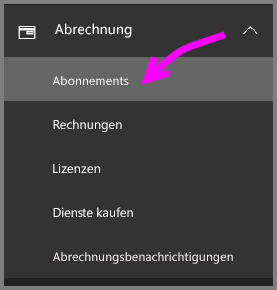
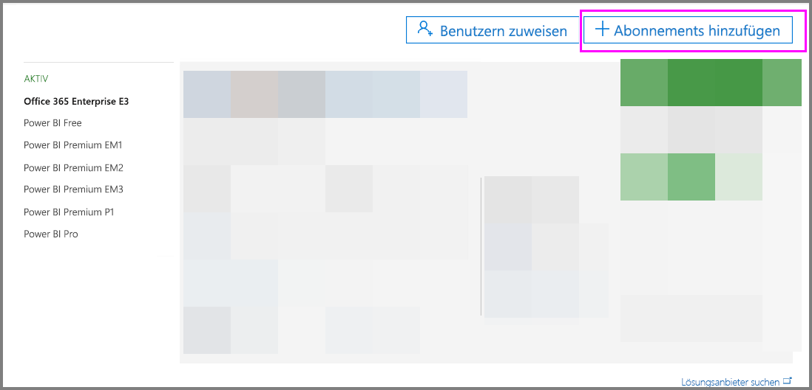
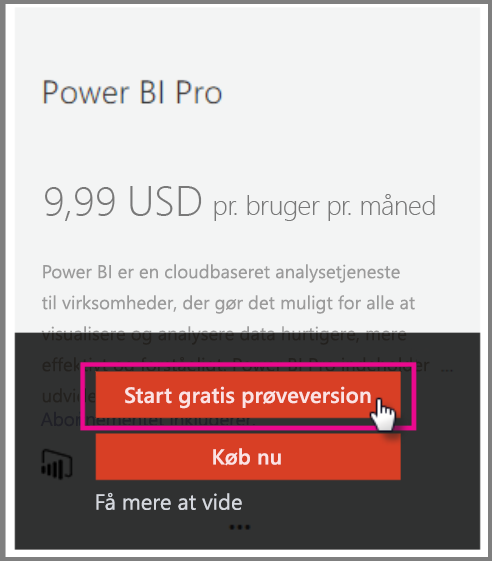
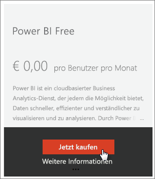
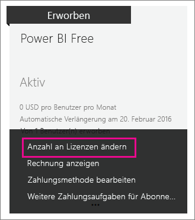

# <a name="power-bi-licensing-in-your-organization"></a>Power BI-Lizenzierung in Ihrem Unternehmen

[!INCLUDE [license-capabilities](includes/license-capabilities.md)]

Dieser Artikel konzentriert sich auf die Lizenzierung pro Benutzer aus Administratorsicht.

## <a name="manage-power-bi-pro-licenses"></a>Verwalten von Power BI Pro-Lizenzen

Als Administrator können Sie Power BI Pro-Lizenzen erwerben und zuweisen, und Sie können sich für eine Power BI Pro-Testversion für Ihre Organisation registrieren. Einzelpersonen können sich ebenfalls für eine Power BI Pro-Testversion registrieren.

### <a name="purchasing-power-bi-pro"></a>Erwerb von Power BI Pro

Sie können Power BI Pro-Lizenzen über Microsoft Office 365 oder einen zertifizierten Microsoft-Partner erwerben. Nach dem Erwerb weisen Sie die Lizenzen einzelnen Benutzern zu. Weitere Informationen finden Sie unter [Purchase and assign Power BI Pro licenses](service-admin-purchasing-power-bi-pro.md) (Erwerben und Zuweisen von Power BI Pro-Lizenzen).

### <a name="power-bi-pro-trial-for-individuals"></a>Power BI Pro-Testversion für Einzelpersonen

Einzelpersonen in Ihrer Organisation können sich für eine Power BI Pro-Testversion registrieren. Weitere Informationen finden Sie unter [Signing up for Power BI as an individual](service-self-service-signup-for-power-bi.md) (Registrieren für Power BI als Einzelperson).

Benutzer, die das ins Produkt integrierte Power BI Pro-Testangebot nutzen, werden im Office 365-Administratorportal nicht als Power BI Pro-Testbenutzer aufgeführt (sie werden als Benutzer der kostenlosen Power BI-Version angezeigt). Allerdings werden sie auf der Seite „Speicher verwalten“ in Power BI als Benutzer der Power BI Pro-Testversion angezeigt.

### <a name="power-bi-pro-trial-for-organizations"></a>Power BI Pro-Testversion für Organisationen

Wenn Sie Power BI-Testlizenzen für mehrere Benutzer in Ihrer Organisation erwerben und bereitstellen möchten, ohne dass die Benutzer den Testbedingungen einzeln zustimmen müssen, registrieren Sie sich für eine Power BI Pro-Testversion für Ihre Organisation.

Bedenken Sie Folgendes, bevor Sie die Schritte zum Registrieren ausführen:

* Für die Registrierung müssen Sie Mitglied der Rolle [**Globaler Administrator** oder **Abrechnungsadministrator**](https://support.office.com/article/about-office-365-admin-roles-da585eea-f576-4f55-a1e0-87090b6aaa9d?ui=en-US&rs=en-US&ad=US) in Office 365 sein.

* Es gibt eine Beschränkung auf maximal eine Testversion für Organisationseinheiten pro Mandant. Wenn also die Power BI Pro – Testversion bereits auf Ihrem Mandanten angewendet wurde, kann dies nicht erneut durchgeführt werden. Wenn Sie Hilfe benötigen, wenden Sie sich an den [Office 365-Abrechnungssupport](https://support.office.microsoft.com/article/contact-support-for-business-products-admin-help-32a17ca7-6fa0-4870-8a8d-e25ba4ccfd4b?CorrelationId=552bbf37-214f-4202-80cb-b94240dcd671&ui=en-US&rs=en-US&ad=US).

1. Navigieren Sie zum [Office 365 Admin Center](https://portal.office.com/adminportal/home#/homepage).

1. Wählen Sie im linken Navigationsbereich **Abrechnung** und dann **Abonnements** aus.

   

1. Wählen Sie auf der rechten Seite **Abonnements hinzufügen** aus.

   

1. Zeigen Sie unter **Andere Pläne** auf die Auslassungspunkte (**...**) für Power BI Pro, und wählen Sie **Kostenlosen Test starten** aus.

    

1. Wählen Sie auf dem Bestätigungsbildschirm für die Bestellung **Jetzt testen** aus.

1. Wählen Sie auf der Bestellbestätigung **Weiter** aus.

Jetzt können Sie [Lizenzen in Office 365 zuweisen](https://support.office.com/article/assign-licenses-to-users-in-office-365-for-business-997596b5-4173-4627-b915-36abac6786dc).

## <a name="manage-power-bi-free-licenses"></a>Verwalten von kostenlosen Power BI-Lizenzen

Die Benutzer in Ihrer Organisation können auf zwei verschiedene Arten auf kostenlose Power BI-Lizenzen zugreifen:

* Sie können ihnen im Office 365-Administratorportal eine Power BI-Lizenz zuweisen.

* Wenn sich ein Benutzer [für eine Power BI Pro-Testversion registriert](service-self-service-signup-for-power-bi.md) und diese Testversion abläuft, wird ihm eine kostenlose Lizenz zugewiesen.

### <a name="requesting-and-assigning-free-licenses"></a>Anfordern und Zuweisen von kostenlosen Lizenzen

Wenn Sie Lizenzanforderungen und -zuweisungen zentral verwalten möchten, überprüfen Sie zuerst, ob Sie bereits über den unbeschränkten Lizenzblock für Power BI Free verfügen.

Dieser Lizenzblock steht zur Verfügung, nachdem sich jemand erstmalig als Einzelperson für Power BI registriert hat. Im Zuge dieses Vorgangs wird Ihrer Organisation dieser Lizenzblock zugeordnet, und dem Benutzer, der sich registriert, wird seine Lizenz zugewiesen.

1. Aktivieren Sie im Office 365 Admin Center unter **Abrechnung** > **Lizenzen** die Option für **unbegrenzt**.

    

1. Wenn der Block verfügbar ist, können Sie jetzt [Lizenzen in Office 365 zuweisen](https://support.office.com/article/assign-licenses-to-users-in-office-365-for-business-997596b5-4173-4627-b915-36abac6786dc). Wenn der Block nicht verfügbar ist, haben Sie zwei Möglichkeiten:

    * Lassen Sie ein Mitglied Ihrer Organisation sich individuell registrieren, wodurch die Erstellung des unbeschränkten Blocks ausgelöst wird.

    * Fahren Sie mit der nächsten Prozedur fort, bei der Sie sich für eine feste Anzahl Lizenzen registrieren können.

Wenn der unbeschränkte Power BI Free-Lizenzblock nicht verfügbar ist und Sie eine individuelle Registrierung vermeiden möchten, befolgen Sie diese Vorgehensweise.

1. Navigieren Sie zum [Office 365 Admin Center](https://portal.office.com/admin/default.aspx).

1. Wählen Sie im linken Navigationsbereich **Abrechnung** > **Abonnements** aus.

1. Wählen Sie auf der rechten Seite **Abonnements hinzufügen +** aus.

1. Zeigen Sie unter **Andere Pläne** auf die Auslassungspunkte (**...**) für Power BI Free, und wählen Sie **Jetzt kaufen** aus.

    

1. Geben Sie die Anzahl der Lizenzen ein, die Sie hinzufügen möchten, und wählen Sie **Zur Kasse gehen** oder **In den Einkaufswagen** aus.

1. Geben Sie die benötigten Informationen im Abschlussvorgang ein.

    Bei dieser Vorgehensweise erfolgt kein Kauf, obwohl Sie Kreditkarteninformationen oder Daten für den Rechnungsversand angeben müssen.

1. Jetzt können Sie [Lizenzen in Office 365 zuweisen](https://support.office.com/article/assign-licenses-to-users-in-office-365-for-business-997596b5-4173-4627-b915-36abac6786dc).

1. Wenn Sie später mehr Lizenzen hinzufügen möchten, können Sie zu **Abonnements hinzufügen** zurückkehren und für Power BI (Free) **Change license quantity** (Lizenzanzahl ändern) auswählen.

    

### <a name="enable-or-disable-individual-user-sign-up-in-azure-active-directory"></a>Aktivieren oder Deaktivieren der individuellen Benutzerregistrierung in Azure Active Directory

Als Administrator können Sie die individuelle Registrierung der Benutzer mithilfe von Azure Active Directory (AAD) aktivieren oder deaktivieren. In diesem Abschnitt des Artikels erfahren Sie, wie Sie Registrierungen mithilfe von PowerShell-Befehlen verwalten. Weitere Informationen zu Azure PowerShell finden Sie unter [Übersicht zu Azure PowerShell](/powershell/azure/overview).

Die AAD-Einstellung, die die Registrierung steuert, heißt **AllowAdHocSubscriptions**. Bei den meisten Mandanten ist diese Einstellung auf *true* festgelegt. Das bedeutet, dass sie aktiviert ist. Wenn Sie Power BI über einen Partner erworben haben, kann die Einstellung jedoch auf *false* festgelegt sein, was bedeutet, dass sie deaktiviert ist. Wenn Sie die Einstellung von *"true"* zu *"false"* ändern, können sich neue Benutzer in Ihrer Organisation nicht mehr individuell registrieren. Benutzer, die sich vor dem Ändern der Einstellung für Power BI registriert haben, behalten ihre Lizenzen.

1. Melden Sie sich mithilfe Ihrer Office 365-Anmeldeinformationen bei Azure Active Directory an. In der ersten Zeile des folgenden PowerShell-Skripts werden Sie aufgefordert, Ihre Anmeldeinformationen einzugeben. Die zweite Zeile stellt die Verbindung mit Azure Active Directory her.

    ```powershell
     $msolcred = get-credential
     connect-msolservice -credential $msolcred
    ```

   

1. Nachdem Sie sich angemeldet haben, führen Sie den folgenden Befehl aus, um festzustellen, wie Ihr Mandant derzeit konfiguriert ist.

    ```powershell
     Get-MsolCompanyInformation | fl AllowAdHocSubscriptions
    ```
1. Führen Sie den folgenden Befehl aus, um **AllowAdHocSubscriptions** zu aktivieren ($true) oder zu deaktivieren ($false).

    ```powershell
     Set-MsolCompanySettings -AllowAdHocSubscriptions $true
    ```

> [!NOTE]
> Das Flag AllowAdHocSubscriptions wird verwendet, um verschiedene Benutzeroptionen in Ihrer Organisation zu steuern, einschließlich der Möglichkeit, dass Benutzer sich beim Azure Rights Management Service registrieren können. Das Ändern dieses Flags wirkt sich auf all diese Optionen aus.

## <a name="next-steps"></a>Nächste Schritte

[Self-Service-Registrierung für Power BI](service-self-service-signup-for-power-bi.md)  

[Erwerben und Zuweisen von Power BI Pro-Lizenzen](service-admin-purchasing-power-bi-pro.md)

Weitere Fragen? [Stellen Sie Ihre Frage in der Power BI-Community.](http://community.powerbi.com/)