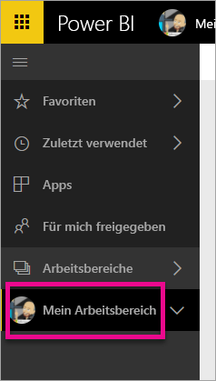
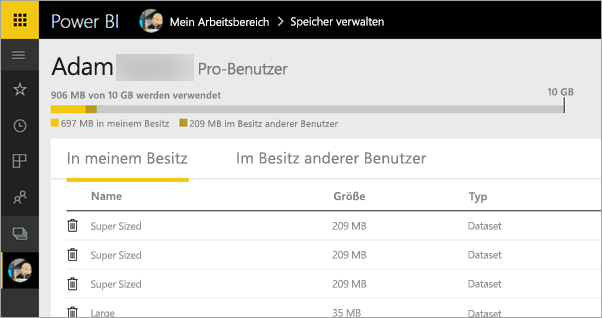
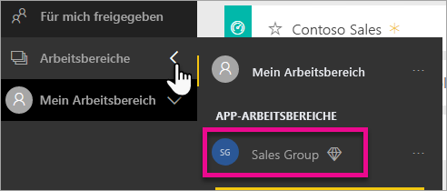
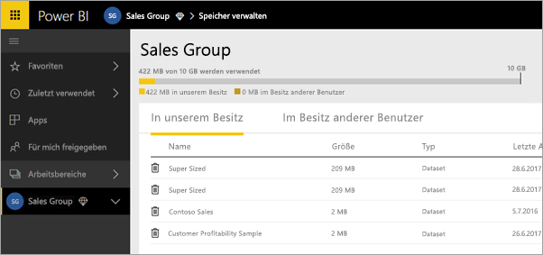
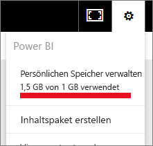
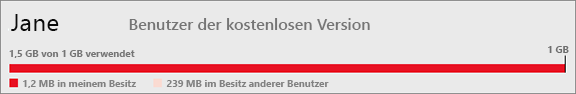

# Verwalten Ihres Datenspeichers
Hier erfahren Sie, wie Sie Ihren individuellen Datenspeicher oder den Datenspeicher Ihres App-Arbeitsbereichs verwalten, um sicherzustellen, dass Sie weiterhin Berichte und Datasets veröffentlichen können.

Benutzer- und App-Arbeitsbereiche weisen jeweils eigene Datenkapazitäten auf.

* Free- und Pro-Benutzer verfügen über maximal 10 GB Datenspeicher.
* Pro-Benutzer können App-Arbeitsbereiche mit jeweils maximal 10 GB Datenspeicher erstellen.

Auf Mandantenebene darf der gesamte genutzte Datenspeicher für alle Pro-Benutzer und App-Arbeitsbereiche im Mandanten 10 GB pro Pro-Benutzer nicht überschreiten.

Informieren Sie sich über weitere Funktionen des [Power BI-Preismodells](https://powerbi.microsoft.com/pricing).

Ihr Datenspeicher umfasst die eigenen Datasets und Excel-Berichte sowie diejenigen, die andere Benutzer für Sie freigegeben haben. Datasets sind alle Datenquellen, die Sie hochgeladen oder mit denen Sie eine Verbindung hergestellt haben, einschließlich verwendeter Power BI-Desktopdateien und Excel-Arbeitsmappen. Folgende Elemente sind ebenfalls in der Datenkapazität enthalten:

* Excel-Bereiche, die an Dashboards angeheftet sind.
* Lokale Reporting Services-Visualisierungen, die an Power BI-Dashboards angeheftet sind.
* Hochgeladene Bilder.

Die Größe des freigegebenen Dashboards hängt von den angehefteten Elementen ab. Wenn Sie beispielsweise Elemente aus zwei Berichten anheften, die auf zwei verschiedenen Datasets basieren, wird die Größe von beiden Datasets bestimmt.

<a name="manage"/>

## Verwalten von Elementen, deren Besitzer Sie sind
Prüfen Sie den in Ihrem Power BI-Konto genutzten Datenspeicher, und verwalten Sie das Konto.

1. Um den eigenen Speicher zu verwalten, wechseln Sie im linken Navigationsbereich zu **Mein Arbeitsbereich**.
   
    
2. Wählen Sie das Zahnradsymbol () in der rechten oberen Ecke und dann \>**Persönlichen Speicher verwalten** aus.
   
    Die obere Leiste zeigt, wie viel Ihres Speicherlimits Sie verwendet haben.
   
    
   
    Die Datasets und Berichte werden auf zwei Registerkarten unterteilt:
   
    **In meinem Besitz:** Dies sind Berichte und Datasets, die Sie in Ihr Power BI-Konto hochgeladen haben, darunter Datasets wie Salesforce und Dynamics CRM.  
    **Im Besitz anderer Benutzer:** Andere Benutzer haben diese Berichte und Datasets für Sie freigegeben.
3. Um ein Dataset oder einen Bericht zu löschen, wählen Sie das Papierkorbsymbol  aus.

Bedenken Sie, dass Sie oder andere Benutzer über Berichte und Dashboards verfügen können, die auf einem Dataset basieren. Wenn Sie das Dataset löschen, funktionieren diese Berichte und Dashboards nicht mehr.

## Verwalten Ihres App-Arbeitsbereichs
1. Wählen Sie den Pfeil neben **Arbeitsbereiche** \> Name des App-Arbeitsbereichs aus.
   
    
2. Wählen Sie das Zahnradsymbol () in der rechten oberen Ecke und dann \>**Gruppenspeicher verwalten** aus.
   
    Die obere Leiste zeigt, wie viel des Speicherlimits der Gruppe verwendet wurde.
   
    
   
    Die Datasets und Berichte werden auf zwei Registerkarten unterteilt:
   
    **In meinem Besitz:** Dies sind Berichte und Datasets, die Sie oder ein anderer Benutzer in das Power BI-Konto der Gruppe hochgeladen haben, darunter Datasets wie Salesforce und Dynamics CRM.
    **Im Besitz anderer Benutzer:** Andere Benutzer haben diese Berichte und Datasets für Ihre Gruppe freigegeben.
3. Um ein Dataset oder einen Bericht zu löschen, wählen Sie das Papierkorbsymbol  aus.
   
   > [!NOTE]
   > Jedes Mitglied eines App-Arbeitsbereichs, das über Bearbeitungsberechtigungen verfügt, ist zum Löschen von Datasets und Berichten im App-Arbeitsbereich berechtigt.
   > 
   > 

Bedenken Sie, dass Sie oder andere Benutzer in der Gruppe über Berichte und Dashboards verfügen können, die auf einem Dataset basieren. Wenn Sie das Dataset löschen, funktionieren diese Berichte und Dashboards nicht mehr.

## Dataset-Beschränkungen
Es besteht eine Beschränkung von 1 GB pro Dataset, das in Power BI importiert wird. Wenn Sie sich für die Excel-Benutzeroberfläche entschieden haben, anstatt die Daten zu importieren, beträgt die Obergrenze für das Dataset 250 MB.

## Was geschieht, wenn der Grenzwert der Beschränkung erreicht wird?
Wenn Sie den Grenzwert der Datenkapazität erreichen, werden entsprechende Hinweise des Diensts angezeigt. 

Wenn Sie das Zahnradsymbol  auswählen, sehen Sie einen roten Balken, der das Überschreiten des Kapazitätsgrenzwerts angibt.

Ein solcher Hinweis wird auch in **Persönlichen Speicher verwalten**angezeigt.

 

 Wenn Sie versuchen, einen Vorgang durchzuführen, bei dem ein Grenzwert erreicht wird, sehen Sie eine entsprechende Meldung. Sie können Ihren Speicher [verwalten](#manage), um den Betrag der gespeicherten Daten zu verringern und den Grenzwert zu unterschreiten.

 

 Weitere Fragen? [Stellen Sie Ihre Frage in der Power BI-Community.](http://community.powerbi.com/)

