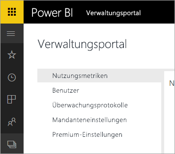

# Power BI für Office 365 wird eingestellt
Power BI für Office 365, eine frühere Version von Power BI, wurde auf die aktuelle Version von [Power BI](https://powerbi.microsoft.com) umgestellt. Benutzer, die **Power BI für Office 365** verwendet haben, können jetzt die aktuelle Version von Power BI verwenden. Weitere Informationen über [Power BI](service-get-started.md)

## Das Verwaltungsportal
Der Zugriff auf das Verwaltungsportal von **Power BI für Office 365** ist nicht mehr verfügbar. Administratoren können das neue [Verwaltungsportal](https://app.powerbi.com/admin-portal) verwenden, um das Power BI-Abonnement ihrer Organisation zu verwalten.

Weitere Informationen finden Sie unter [Power BI – Verwaltungsportal](service-admin-portal.md).

## Nächste Schritte
[Erste Schritte mit Power BI](service-get-started.md)

[Erste Schritte mit Power BI Desktop](desktop-getting-started.md)

[Verwalten von Power BI in Ihrer Organisation](service-admin-administering-power-bi-in-your-organization.md)