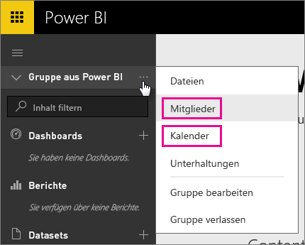
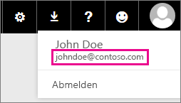

# Office 365 dediziert-Kunden – bekannte Probleme
Power BI wird jetzt für dedizierte Office 365-Kunden unterstützt.  Wenn Sie dedizierter O365-Kunde sind, können Sie sich mit einem Konto aus diesem Mandanten anmelden und Power BI verwenden. Es gibt derzeit zwei bekannte Probleme.

## Gruppen
Bei der Auswahl von **Mitglieder** oder **Kalender** im Kontextmenü "Gruppe" werden Sie stattdessen zur Mail-App umgeleitet.  **Dateien** und **Unterhaltungen** funktionieren wie erwartet.

## iPhone App – Anmeldung über die Vanity-Domäne führt zu einem Fehler.
Wenn Sie sich auf der iPhone-App anmelden und für die Anmeldung eine Vanity-Domäne verwenden, kann ein Fehler auftreten.

*Anmeldefehler*  
*Es ist ein unerwarteter Fehler aufgetreten. Versuchen Sie es erneut.*

Um dieses Problem zu umgehen, melden Sie sich mit der E-Mail-Adresse an, die aufgeführt wird, wenn Sie auf das Benutzersymbol innerhalb des Power BI-Diensts klicken und nicht auf das für die Vanity-Domäne.

Weitere Fragen? [Wenden Sie sich an die Power BI-Community](http://community.powerbi.com/)

