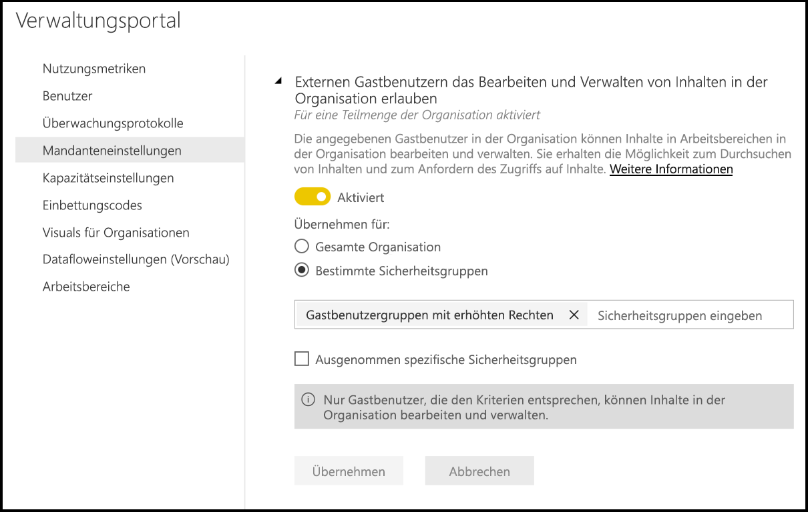
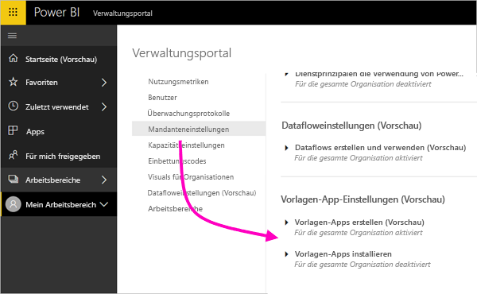
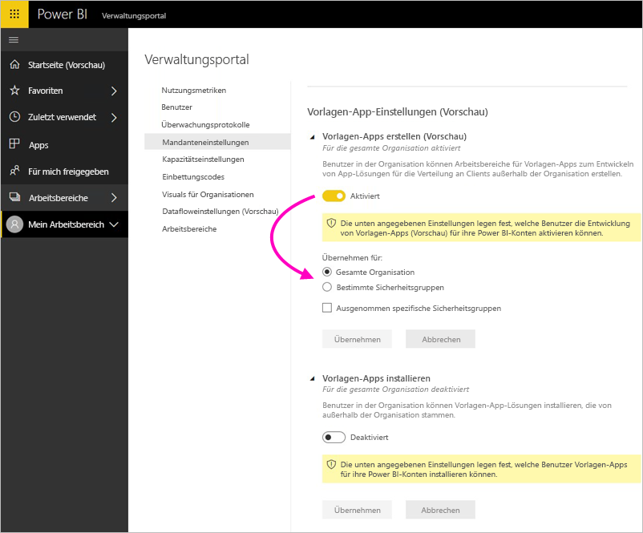

# Verwalten von Power BI im Verwaltungsportal

Mit dem Verwaltungsportal können Sie einen Power BI-*Mandanten* für Ihre Organisation verwalten. Es enthält Elemente wie z. B. Nutzungsmetriken und Zugriff auf das Microsoft 365 Admin Center sowie auf die Einstellungen.

Auf das vollständige Verwaltungsportal können alle Benutzer zugreifen, die globale Administratoren in Office 365 sind oder der Power BI-Dienstadministratorrolle zugewiesen wurden. Wenn Sie keiner dieser Rollen angehören, können Sie im Portal nur die **Kapazitätseinstellungen** anzeigen. Weitere Informationen zur Power BI-Dienstadministratorrolle finden Sie unter [Grundlegendes zur Power BI-Administratorrolle](service-admin-role.md).

## Gewusst wie: Anzeigen des Verwaltungsportals

Ihr Konto muss in Office 365 oder Azure Active Directory als **Globaler Administrator** markiert oder der Power BI-Dienstadministratorrolle zugewiesen sein, damit Sie Zugriff auf das Power BI-Verwaltungsportal erhalten. Weitere Informationen zur Power BI-Dienstadministratorrolle finden Sie unter [Grundlegendes zur Power BI-Administratorrolle](service-admin-role.md). Führen Sie zum Zugreifen auf das Power BI-Verwaltungsportal die folgenden Schritte aus.

1. Wählen Sie das Zahnradsymbol für die Einstellungen oben rechts im Power BI-Dienst aus.

1. Wählen Sie **Verwaltungsportal** aus.

    

Es gibt neun Registerkarten im Portal ein. In den verbleibenden Abschnitten dieses Artikels erhalten Sie Informationen zu jeder dieser Registerkarten.

* [Nutzungsmetriken](#usage-metrics)
* [Benutzer](#users)
* [Überwachungsprotokolle](#audit-logs)
* [Mandanteneinstellungen](#tenant-settings)
* [Kapazitätseinstellungen](#capacity-settings)
* [Einbindungscodes](#embed-codes)
* [Visuals für Organisationen](#organization-visuals)
* [Datenfluss Storage (Vorschau)](#dataflowStorage)
* [Arbeitsbereiche](#workspaces)

## Nutzungsmetriken

Mithilfe der **Nutzungsmetriken** können Sie die Power BI-Nutzung für Ihre Organisation überwachen. Außerdem können Sie darüber feststellen, welche Benutzer und Gruppen in Power BI für Ihre Organisation am aktivsten sind.

> [!NOTE]
> Beim ersten Zugriff auf das Dashboard oder beim Anzeigen des Dashboards nach einem längeren Zeitraum wird zunächst wahrscheinlich ein Ladebildschirm angezeigt, während das Dashboard geladen wird.

Nachdem das Dashboard geladen wurde, werden zwei Abschnitte mit Kacheln angezeigt. Der erste Abschnitt umfasst Nutzungsdaten für einzelne Benutzer, der zweite Abschnitt enthält ähnliche Informationen für die Gruppen in Ihrer Organisation.

Im Folgenden sehen Sie, was in den einzelnen Kacheln angezeigt wird:

* Anzahl der verschiedenen Dashboards, Berichte und Datasets im Arbeitsbereich eines Benutzers
  
    

* Das am häufigsten verwendete Dashboard nach Anzahl von Benutzern, die darauf zugreifen können. Wenn Sie z.B. ein Dashboard für drei Benutzer freigegeben und dieses auch einem Inhaltspaket hinzugefügt haben, mit dem zwei weitere Benutzer verbunden sind, beträgt die Anzahl 6 (1 + 3 + 2).
  
    

* Der beliebteste Inhalt, mit dem Benutzer Verbindungen herstellen. Dies kann alles sein, worauf Benutzer durch den Vorgang zum Abrufen von Daten zugreifen können, z. B. SaaS-Pakete, organisationsbezogene Inhaltspakete, Dateien oder Datenbanken.
  
    

* Eine Ansicht der aktivsten Benutzer basierend auf der Anzahl von Dashboards. Dies können von den Benutzern selbst erstellte Dashboards sein, aber auch Dashboards, die für sie freigegeben wurden.
  
    

* Eine Ansicht der aktivsten Benutzer basierend auf der Anzahl von Berichten
  
    

Der zweite Abschnitt zeigt dieselben Informationen basierend auf Gruppen an. So können Sie sehen, welche Gruppen in Ihrer Organisation besonders aktiv sind und welche Art von Inhalten sie verwenden.

Anhand dieser Informationen gewinnen Sie wichtige Erkenntnisse zur Verwendung von Power BI in Ihrer Organisation. Außerdem können Sie ermitteln, welche Benutzer und Gruppen in Ihrer Organisation besonders aktiv sind.

## Benutzer

Power BI-Benutzer, -Gruppen und -Administratoren verwalten Sie im Microsoft 365 Admin Center. Die Registerkarte **Benutzer** umfasst einen Link zum Admin Center für Ihren Mandanten.

## Überwachungsprotokolle

Sie verwalten Power BI-Überwachungsprotokolle im Office 365 Security & Compliance Center. Die Registerkarte **Überwachungsprotokolle** umfasst einen Link zum Security & Compliance Center für Ihren Mandanten. [Weitere Informationen](service-admin-auditing.md)

Um Überwachungsprotokolle zu verwenden, stellen Sie sicher, dass die Einstellung [**Überwachungsprotokolle für interne Aktivitätsüberwachung und Compliance erstellen**](#create-audit-logs-for-internal-activity-auditing-and-compliance) aktiviert ist.

## Mandanteneinstellungen

Die Registerkarte **Mandanteneinstellungen** ermöglicht eine fein abgestufte Steuerung der Features, die für Ihre Organisation zur Verfügung stehen. Wenn Sie über vertrauliche Daten verfügen, die besonders geschützt werden müssen, sind einige der Features möglicherweise nicht für Ihre Organisation geeignet bzw. bestimmte Funktionen sollten nur für eine bestimme Gruppe bereitgestellt werden.

Die folgende Abbildung zeigt die ersten beiden Abschnitte der Registerkarte **Mandanteneinstellungen**.

> [!NOTE]
> Es kann bis zu zehn Minuten dauern, bis eine Einstellungsänderung für alle Benutzer in Ihrem Mandanten wirksam wird.

Einstellungen können drei Zustände aufweisen:

* **Für die gesamte Organisation deaktiviert:** Keine Person in Ihrer Organisation kann dieses Feature verwenden.

    

* **Für die gesamte Organisation aktiviert:** Jede Person in Ihrer Organisation kann dieses Feature verwenden.

    

* **Für eine Teilmenge der Organisation aktiviert:** Eine bestimmte Teilmenge der Benutzer oder Gruppen in Ihrer Organisation kann dieses Feature verwenden.

    Sie können das Feature für die gesamte Organisation mit Ausnahme einer bestimmten Gruppe von Benutzern aktivieren.

    

    Sie können das Feature auch für eine bestimmte Gruppe von Benutzern aktivieren und gleichzeitig für eine Gruppe von Benutzern deaktivieren. So stellen Sie sicher, dass bestimmte Benutzer auch dann keinen Zugriff auf das Feature erhalten, wenn sie Mitglied der Gruppe sind, für die der Zugriff aktiviert ist.

    

Die nächsten Abschnitte bieten einen Überblick über die verschiedenen Arten von Mandanteneinstellungen.

## Hilfe und support – Einstellungen

### Informationen über "Get-Help" Veröffentlichen

Benutzer in der Organisation können interne Hilfe finden Sie unter und unterstützen von Ressourcen aus der Power BI-Menü "Hilfe". Dieser Parameter wird insbesondere das Verhalten von die Menüelemente erfahren Sie mehr, zur Community und Get-Help ändern.

Es ist auch möglich, eine URL zur Weiterleitung von Benutzern, eine benutzerdefinierte Lösung für lizenzierungsanforderungen an. Dieser Parameter passt die Ziel-URL der Schaltfläche mit den Upgrade-Konto, den ein Benutzer ohne Power BI Pro-Lizenz finden Sie in das Update zu Power BI Pro (Dialogfeld), sowie auf persönlichen Speicher verwalten kann.

## Arbeitsbereichseinstellungen

### Erstellen von Arbeitsbereichen

Administratoren verwenden die **Arbeitsbereiche erstellen** Einstellung, um anzugeben, welche Benutzer in der Organisation app-Arbeitsbereiche für die Zusammenarbeit auf Dashboards, Berichte und andere Inhalte erstellen können. Erfahren Sie mehr über [app-Arbeitsbereiche](service-create-the-new-workspaces.md).

Das Verwaltungsportal ist einem anderen Bereich der Einstellungen über die Arbeitsbereiche in Ihrem Mandanten. In diesem Abschnitt können Sie sortieren und Filtern Sie die Liste der Arbeitsbereiche und die Details für jeden Arbeitsbereich angezeigt. Finden Sie unter [Arbeitsbereiche](#workspaces) Details.

Im Verwaltungsportal steuern Sie auch die Benutzer über Berechtigungen zum Verteilen von apps für die Organisation verfügen. Finden Sie unter [Inhaltspakete und apps für die gesamte Organisation veröffentlichen](#publish-content-packs-and-apps-to-the-entire-organization) in diesem Artikel Weitere Informationen.

## Einstellungen für Export und Freigabe

### Inhalten für externe Benutzer freigeben

Benutzer in der Organisation können Dashboards für Benutzer außerhalb der Organisation freigeben. [Weitere Informationen](service-share-dashboards.md#share-a-dashboard-or-report-with-people-outside-your-organization)

Die folgende Abbildung zeigt die Meldung, die bei der Freigabe für einen externen Benutzer angezeigt wird.

  

### Im Web veröffentlichen

Benutzer in der Organisation können Berichte im Web veröffentlichen. [Weitere Informationen](service-publish-to-web.md)

Die folgende Abbildung zeigt das Menü **Datei** für einen Bericht an, wenn die Einstellung **Im Web veröffentlichen** aktiviert ist.

Den Benutzer werden basierend auf der Einstellung **Im Web veröffentlichen** unterschiedliche Optionen in der Benutzeroberfläche angezeigt.

|Feature |Für die gesamte Organisation aktiviert |Für die gesamte Organisation deaktiviert |Bestimmte Sicherheitsgruppen   |
|---------|---------|---------|---------|
|**Im Web veröffentlichen** im Menü **Datei** des Berichts.|Für alle aktiviert|Nicht für alle sichtbar|Nur für autorisierte Benutzer oder Gruppen sichtbar|
|**Einbindungscodes verwalten** unter **Einstellungen**|Für alle aktiviert|Für alle aktiviert|Für alle aktiviert  Option * **Löschen** nur für autorisierte Benutzer oder Gruppen * **Codes abrufen** für alle aktiviert|
|**Einbindungscodes** im Verwaltungsportal|Es wird einer der folgenden Statuswerte angezeigt: * Aktiv * Nicht unterstützt * Blockiert|Angezeigter Status **Deaktiviert**|Es wird einer der folgenden Statuswerte angezeigt: * Aktiv * Nicht unterstützt * Blockiert  Wenn ein Benutzer gemäß den Mandanteneinstellungen nicht autorisiert ist, wird als Status **Verletzt** angezeigt.|
|Vorhandene veröffentlichte Berichte|Alle aktiviert|Alle deaktiviert|Berichte werden weiterhin für alle gerendert.|

### Daten exportieren

Benutzer in der Organisation können Daten aus einer Kachel oder Visualisierung exportieren. [Weitere Informationen](visuals/power-bi-visualization-export-data.md)

Die folgende Abbildung zeigt die Option zum Exportieren von Daten aus einer Kachel.

> [!NOTE]
> Durch das Deaktivieren von **Daten exportieren** wird zudem verhindert, dass Benutzer das Feature **In Excel analysieren** sowie die Liveverbindung des Power BI-Diensts verwenden können.

### Exportieren von Berichten als PowerPoint-Präsentationen oder PDF-Dokumente

Benutzer in der Organisation können Power BI-Berichte als PowerPoint-Dateien oder PDF-Dokumente exportieren. [Weitere Informationen](consumer/end-user-powerpoint.md)

In der folgenden Abbildung wird das Menü **Datei** für einen Bericht gezeigt, wenn die Einstellung **Berichte als PowerPoint-Präsentationen oder PDF-Dokumente exportieren** aktiviert ist.

### Dashboards und Berichte drucken

Benutzer in der Organisation können Dashboards und Berichte drucken. [Weitere Informationen](consumer/end-user-print.md)

Die folgende Abbildung zeigt die Option zum Drucken eines Dashboards.

Die folgende Abbildung zeigt das Menü **Datei** für einen Bericht, wenn die Einstellung **Dashboards und Berichte drucken** aktiviert ist.

### Externen Gastbenutzern das Bearbeiten und Verwalten von Inhalten in der Organisation erlauben
Azure AD-B2B-Gastbenutzer können Inhalte in der Organisation bearbeiten und verwalten. [Weitere Informationen](service-admin-azure-ad-b2b.md)

In der folgenden Abbildung wird die Option „Allow external guest users to edit and manage content in the organization“ (Externen Gastbenutzern das Bearbeiten und Verwalten von Inhalten in der Organisation erlauben) angezeigt.

## Einstellungen für das Inhaltspaket und die App

### Inhaltspakete und Apps für die gesamte Organisation veröffentlichen

Administratoren verwenden Sie diese Einstellung um zu entscheiden, welche Benutzer auf die gesamte Organisation und nicht nur bestimmte Gruppen Inhaltspakete und apps veröffentlichen können. Erfahren Sie mehr über [Veröffentlichen von apps](service-create-distribute-apps.md).

Die folgende Abbildung zeigt die Option **Meine gesamte Organisation** beim Erstellen eines Inhaltspakets.

### Vorlage-apps und organisationsbezogene Inhaltspakete erstellen

Vorlage-apps und organisationsbezogene Inhaltspakete, die auf einer Datenquelle in Power BI Desktop basierende Datasets verwenden, können Benutzer in der Organisation erstellen. Erfahren Sie mehr über [Vorlage apps](template-content-pack-authoring.md).

### Apps mithilfe von Push an Endbenutzer übertragen

Berichtersteller können apps direkt mit Benutzern teilen, ohne Installation aus [AppSource](https://appsource.microsoft.com). Erfahren Sie mehr über [automatischen Installieren von apps für Endbenutzer](service-create-distribute-apps.md#automatically-install-apps-for-end-users).

## Integrationseinstellungen

### Stellen von Fragen zu Daten mithilfe von Cortana

Benutzer in der Organisation können mithilfe von Cortana Fragen zu ihren Daten stellen. [Weitere Informationen](service-cortana-enable.md)

> [!NOTE]
> Diese Einstellung gilt für die gesamte Organisation und kann nicht auf bestimmte Gruppen beschränkt werden.

### Verwenden von In Excel analysieren mit lokalen Datasets

Benutzer in der Organisation können Excel verwenden, um lokale Power BI-Datasets anzuzeigen und mit ihnen zu interagieren. [Weitere Informationen](service-analyze-in-excel.md)

> [!NOTE]
> Durch das Deaktivieren von **Daten exportieren** wird außerdem verhindert, dass Benutzer das Feature **In Excel analysieren** verwenden.

### ArcGIS Maps for Power BI verwenden

Benutzer in der Organisation können die Visualisierung ArcGIS Maps for Power BI von Esri verwenden. [Weitere Informationen](visuals/power-bi-visualization-arcgis.md)

### Verwenden der globalen Suche für Power BI (Vorschau)

Benutzer in der Organisation können externe Suchfeatures verwenden, die auf Azure Search basieren. Benutzer können beispielsweise Cortana zum Abrufen wichtiger Informationen direkt aus Power BI-Dashboards und -Berichten verwenden. [Weitere Informationen](service-cortana-intro.md)

## Einstellungen für benutzerdefinierte Visuals

### Benutzerdefinierte Visuals hinzufügen und verwenden

Benutzer in der Organisation können mit benutzerdefinierten Visuals interagieren und diese freigeben. [Weitere Informationen](power-bi-custom-visuals.md)

> [!NOTE]
> Diese Einstellung kann für die gesamte Organisation gelten oder auf bestimmte Gruppen beschränkt werden.

Power BI Desktop unterstützt (ab der Version vom März 2019) die Verwendung des Tools **Gruppenrichtlinie**, um die Verwendung von benutzerdefinierten Visuals auf allen in einer Organisation bereitgestellten Computern zu deaktivieren.

<table>
<tr><th>Attribut</th><th>Wert</th>
</tr>
<td>Schlüssel</td>
    <td>Software\Policies\Microsoft\Power BI Desktop\</td>
<tr>
<td>valueName</td>
<td>EnableCustomVisuals</td>
</tr>
</table>

Mit Wert 1 (dezimal) wird die Verwendung von benutzerdefinierten Visuals in Power BI aktiviert (Standardeinstellung).

Mit Wert 0 (dezimal) wird die Verwendung von benutzerdefinierten Visuals in Power BI deaktiviert.

### Ausschließlich zertifizierte Visuals zulassen

Benutzer in der Organisation, denen Berechtigungen zum Hinzufügen und Verwenden benutzerdefinierter Visuals gewährt wurden, gekennzeichnet durch die Einstellung „Benutzerdefinierte Visuals hinzufügen und verwenden“, können nur [zertifizierte benutzerdefinierte Visuals](https://go.microsoft.com/fwlink/?linkid=2002010) verwenden (nicht zertifizierte Visuals werden blockiert, und es wird eine Fehlermeldung angezeigt, wenn diese verwendet werden). 

Power BI Desktop unterstützt (ab der Version vom März 2019) die Verwendung des Tools **Gruppenrichtlinie**, um die Verwendung von nicht zertifizierten benutzerdefinierten Visuals auf allen in einer Organisation bereitgestellten Computern zu deaktivieren.

<table>
<tr><th>Attribut</th><th>Wert</th>
</tr>
<td>Schlüssel</td>
    <td>Software\Policies\Microsoft\Power BI Desktop\</td>
<tr>
<td>valueName</td>
<td>EnableUncertifiedVisuals</td>
</tr>
</table>

Mit Wert 1 (dezimal) wird die Verwendung von nicht zertifizierten benutzerdefinierten Visuals in Power BI aktiviert (Standardeinstellung).

Mit Wert 0 (dezimal) wird die Verwendung von nicht zertifizierten benutzerdefinierten Visuals in Power BI deaktiviert. Diese Option aktiviert nur die Verwendung von [zertifizierten benutzerdefinierten Visuals](https://go.microsoft.com/fwlink/?linkid=2002010).

## Einstellungen für R-Visualisierungen

### Mit visuellen R-Elementen interagieren und diese freigeben

Benutzer in der Organisation können mit visuellen Elementen, die mit R-Skripts erstellt wurden, interagieren und diese freigeben. [Weitere Informationen](visuals/service-r-visuals.md)

> [!NOTE]
> Diese Einstellung gilt für die gesamte Organisation und kann nicht auf bestimmte Gruppen beschränkt werden.

## Überwachungs- und Nutzungseinstellungen

### Überwachungsprotokolle für interne Aktivitätsüberwachung und Compliance erstellen

Benutzer in der Organisation können Aktionen überwachen, die in Power BI von anderen Benutzern in der Organisation ausgeführt werden. [Weitere Informationen](service-admin-auditing.md)

Diese Einstellung muss aktiviert sein, damit Überwachungsprotokolleinträge aufgezeichnet werden. Es kann bis zu 48 Stunden nach der Aktivierung der Überwachung dauern, bis Sie Überwachungsdaten einsehen können. Wenn Sie nicht umgehend Daten sehen, überprüfen Sie die Überwachungsprotokolle später noch einmal. Es kann zu einer ähnlichen Verzögerung kommen, nachdem Ihnen die Leseberechtigung für Überwachungsprotokolle erteilt wurde und bis Sie die Protokolle ansehen können.

> [!NOTE]
> Diese Einstellung gilt für die gesamte Organisation und kann nicht auf bestimmte Gruppen beschränkt werden.

### Nutzungsmetriken für Inhaltsersteller

Benutzer in der Organisation können Nutzungsmetriken für von ihnen erstellte Dashboards und Berichte anzeigen. [Weitere Informationen](service-usage-metrics.md)

### Benutzerspezifische Daten in Nutzungsmetriken für Inhaltsersteller

Nutzungsmetriken für Inhaltsersteller machen Anzeigenamen und E-Mail-Adressen von Benutzern verfügbar, die auf Inhalte zugreifen. [Weitere Informationen](service-usage-metrics.md)

Die benutzerspezifischen Daten sind standardmäßig für die Nutzungsmetriken aktiviert, und die Kontoinformationen vom Ersteller des Inhalts sind im Bericht zu den Nutzungsmetriken enthalten. Wenn Sie diese Informationen für einige oder alle Benutzer nicht miteinbeziehen möchten, deaktivieren Sie das Feature für angegebene Sicherheitsgruppen oder eine gesamte Organisation. Die Kontoinformationen werden im Bericht dann als *Unnamed* (Unbenannt) angezeigt.

## Dashboardeinstellungen

### Datenklassifizierung für Dashboards

Benutzer in der Organisation können Dashboards mit Klassifizierungen markieren, die Dashboardsicherheitsstufen angeben. [Weitere Informationen](service-data-classification.md)

> [!NOTE]
> Diese Einstellung gilt für die gesamte Organisation und kann nicht auf bestimmte Gruppen beschränkt werden.

## Entwicklereinstellungen

### Inhalt in Apps einbetten

Benutzer in der Organisation können Power BI-Dashboards und -Berichte in SaaS-Anwendungen (Software as a Service) einbetten. Ist diese Einstellung deaktiviert, können Benutzer die REST-APIs nicht dazu verwenden, um Power BI-Inhalt in ihre Anwendungen einzubetten. [Weitere Informationen](developer/embedding.md)

### Dienstprinzipalen die Verwendung von Power BI-APIs gestatten

Web-apps in Azure Active Directory (Azure AD) registriert werden einen zugewiesenen Dienstprinzipal verwenden, um Power BI-APIs, die ohne einen angemeldeten Benutzer darauf zugreifen. Damit einer app, die dienstprinzipalauthentifizierung verwenden ihres dienstprinzipals kann müssen in einer zulässigen Sicherheitsgruppe enthalten sein. [Weitere Informationen](developer/embed-service-principal.md)

> [!NOTE]
> Dienstprinzipale erben die Berechtigungen für alle Power BI-Mandanteneinstellungen von ihrer Sicherheitsgruppe. Wenn Berechtigungen eingeschränkt werden sollen, erstellen Sie eine dedizierte Sicherheitsgruppe für Dienstprinzipale und fügen diese der Liste „Ausgenommen spezifische Sicherheitsgruppen“ für die relevanten, aktivierten Power BI-Einstellungen hinzu.

## Datafloweinstellungen

### Erstellen und Verwenden von Dataflows

Benutzer in der Organisation können Dataflows erstellen und verwenden. Einen Überblick über die Datenflüsse, finden Sie unter [in Power BI für die Vorbereitung von Self-service-](service-dataflows-overview.md). Informationen zum Aktivieren von Dataflows in einer Premium-Kapazität finden Sie im Abschnitt „Konfigurieren von Workloads“ unter [Verwalten von Kapazitäten in Power BI Premium und Power BI Embedded](service-admin-premium-workloads.md).

> [!NOTE]
> Diese Einstellung gilt für die gesamte Organisation und kann nicht auf bestimmte Gruppen beschränkt werden.

## Einstellungen für Vorlagen-Apps (Vorschau)

Es gibt zwei Einstellungen für Vorlagen-Apps. 

### Vorlagen-Apps erstellen (Vorschau)

Benutzer in der Organisation können die Vorlage apps erstellen. App-Ersteller der Vorlage können sie dann für Clients außerhalb Ihrer Organisation mithilfe von verteilen [AppSource](https://appsource.microsoft.com) oder anderen Verteilungsmethoden.

### Installieren Sie die Vorlage apps (Vorschau)

Benutzer in der Organisation können apps heruntergeladen und installiert Vorlage aus [AppSource](https://appsource.microsoft.com) oder einer anderen Quelle.

> [!NOTE]
> Diese Einstellung bestimmt, welche Benutzer die Vorlage-apps in ihren Power BI-Konten installieren können.

## Kapazitätseinstellungen

### Power BI Premium

Über die Registerkarte **Power BI Premium** können Sie jede Power BI Premium-Kapazität (EM- oder P-SKU) verwalten, die für Ihre Organisation erworben wurde. Alle Benutzer in Ihrer Organisation sehen die Registerkarte **Power BI Premium**, können deren Inhalt aber nur anzeigen, wenn sie entweder als *Kapazitätsadministrator* oder als Benutzer mit Zuweisungsberechtigungen konfiguriert sind. Hat ein Benutzer keine Berechtigungen, wird die folgende Meldung angezeigt.

### Power BI Embedded

Auf der Registerkarte **Power BI Embedded** können Sie die Power BI Embedded-Kapazitäten (A-SKU) anzeigen, die Sie für Ihren Kunden erworben haben. Da Sie nur A-SKUs von Azure erwerben können Sie [eingebundene Kapazitäten in Azure verwalten](developer/azure-pbie-create-capacity.md) aus **im Azure-Portal**.

Weitere Informationen zum Verwalten von Power BI Embedded-Einstellungen (A-SKU) finden Sie unter [Was ist Power BI Embedded?](developer/azure-pbie-what-is-power-bi-embedded.md).

## Einbindungscodes

Als Administrator können Sie die Einbindungscodes anzeigen, die für Ihren Mandanten generiert werden. Sie können Codes auch widerrufen oder löschen. [Weitere Informationen](service-publish-to-web.md)

## <a name="organizational-visuals">Visuals für Organisationen</a>

Auf der Registerkarte **Organisationsvisuals** können Sie benutzerdefinierte Visuals in Ihrer Organisation bereitstellen und verwalten. Mit Organisationsvisuals können Sie ganz einfach proprietäre Visuals in Ihrer Organisation bereitstellen. Berichtsautoren können diese Visuals dann erkunden und in ihre Berichte in Power BI Desktop importieren. [Weitere Informationen](power-bi-custom-visuals-organization.md)

> [!WARNING]
> Ein benutzerdefiniertes Visual kann Code mit Sicherheits- oder Datenschutzrisiken enthalten. Stellen Sie sicher, dass Sie dem Autor und der Quelle des benutzerdefinierten Visuals vertrauen können, bevor Sie dieses im Repository der Organisation bereitstellen.

Die folgende Seite zeigt alle benutzerdefinierten Visuals an, die derzeit im Repository der Organisation bereitgestellt sind.

### Hinzufügen eines neuen benutzerdefinierten Visuals

Um der Liste ein neues benutzerdefiniertes Visual hinzufügen, führen Sie die folgenden Schritte aus. 

1. Wählen Sie auf der rechten Seite den Eintrag **Benutzerdefiniertes Visual hinzufügen**.

    

1. Füllen Sie das Formular **Benutzerdefiniertes Visual hinzufügen** aus:

    * **PBIVIZ-Datei auswählen** (erforderlich): Wählen Sie eine benutzerdefinierte Visualdatei zum Hochladen aus. Nur benutzerdefinierte Visuals mit API-Versionsangabe werden unterstützt (lesen Sie hier nach, was dies bedeutet).

    Bevor Sie ein benutzerdefiniertes Visual hochladen, sollten Sie dieses auf Sicherheit und Datenschutz überprüfen, um sicherzustellen, dass das Visual die Standards Ihrer Organisation erfüllt.

    * **Benutzerdefiniertes Visual benennen** (erforderlich): Geben Sie dem Visual einen kurzen Titel, damit die Benutzer von Power BI Desktop den Zweck leichter nachvollziehen können.

    * **Symbol:** Die Symboldatei, die auf der Benutzeroberfläche von Power BI Desktop angezeigt wird.

    * **Beschreibung**: Eine kurze Beschreibung des Visuals, um den Benutzern zusätzlichen Kontext bereitzustellen

1. Klicken Sie auf **Hinzufügen**, um die Uploadanforderung zu initiieren. Wenn der Upload erfolgreich ist, wird das neue Element in der Liste angezeigt. Ist der Vorgang nicht erfolgreich, erhalten Sie eine entsprechende Fehlermeldung.

### Löschen eines benutzerdefinierten Visuals aus der Liste

Klicken Sie im Repository beim Visual auf das Papierkorbsymbol, um das Visual dauerhaft zu löschen.

> [!IMPORTANT]
> Der Löschvorgang ist nicht umkehrbar. Sobald das Visual gelöscht wurde, wird es in vorhandenen Berichten nicht mehr gerendert. Selbst wenn Sie das gleiche Visual erneut hochladen, ersetzt es nicht das vorherige Visual, das gelöscht wurde. Benutzer können jedoch das neue Visual erneut importieren und die Instanz in ihren Berichten ersetzen.

### Deaktivieren eines benutzerdefinierten Visuals in der Liste

Um das Visual im Organisationsspeicher zu deaktivieren, wählen Sie das Zahnradsymbol aus. Deaktivieren Sie das benutzerdefinierte Visual im Abschnitt **Zugriff**.

Nachdem Sie das Visual deaktiviert haben, wird es in vorhandenen Berichten nicht mehr gerendert, und es wird die nachstehende Fehlermeldung angezeigt.

*Dieses benutzerdefinierte Visual ist nicht mehr verfügbar. Wenden Sie sich an Ihren Administrator, um Einzelheiten zu erfahren.*

Visuals, für die ein Lesezeichen festgelegt wurde, funktionieren jedoch weiterhin.

Power BI Desktop-Benutzer müssen die Anwendung nach einem Update oder einer Administratoränderung neu starten oder den Browser im Power BI-Dienst aktualisieren, um die Aktualisierungen anzuzeigen.

### Aktualisieren eines Visuals

Um das Visual im Store der Organisation zu aktualisieren, wählen Sie das Zahnradsymbol aus. Suchen Sie nach einer neuen Version des Visuals, und laden Sie diese hoch.

Stellen Sie sicher, dass die Visual-ID unverändert bleibt. Die neue Datei ersetzt die vorherige Datei für alle Berichte in der gesamten Organisation. Wenn jedoch die neue Version des Visuals irgendeine Verwendung oder Datenstruktur der vorherigen Version des Visuals beeinträchtigen könnte, ersetzen Sie die vorherige Version nicht. Stattdessen sollten Sie einen neuen Eintrag für die neue Version des Visuals erstellen. Fügen Sie beispielsweise eine neue Versionsnummer (Version X.X) zum Titel des neuen gelisteten Visuals hinzu. Auf diese Weise wird deutlich, dass es sich nur um das gleiche Visual mit einer aktualisierten Versionsnummer handelt, sodass die Funktionalität bestehender Berichte nicht beeinträchtigt wird. Stellen Sie erneut sicher, dass die Visual-ID unverändert bleibt. Wenn die Benutzer das Repository der Organisation das nächste Mal über Power BI Desktop verwenden, können sie die neue Version importieren. Sie werden in diesem Fall aufgefordert, die aktuelle Version zu ersetzen, die sich im Bericht befindet.

Weitere Informationen finden Sie in den [häufig gestellten Fragen zu benutzerdefinierten Visuals in Organisationen](https://docs.microsoft.com/power-bi/power-bi-custom-visuals-faq#organizational-custom-visuals).

## <a name="dataflowStorage">Datenfluss Storage (Vorschau)</a>

Mit Power BI verwendete Daten werden standardmäßig im internen Speicher von Power BI gespeichert. Mit der Integration von Dataflows und Azure Data Lake Storage Gen2 (ADLS Gen2) können Sie Ihre Dataflows im Azure Data Lake Storage Gen2-Konto Ihrer Organisation speichern. Weitere Informationen finden Sie unter [Dataflows und Azure Data Lake-Integration (Vorschauversion)](service-dataflows-azure-data-lake-integration.md).

## Arbeitsbereiche

Als Administrator können Sie die Arbeitsbereiche anzeigen, die in Ihrem Mandanten vorhanden sind. Sie können die Liste der Arbeitsbereiche sortieren und filtern und die Details zu jedem Arbeitsbereich anzeigen. Spalten der Tabelle entsprechen den Eigenschaften, die zurückgegeben werden, indem die [Power BI-Administrator-Rest-API](/rest/api/power-bi/admin) für Arbeitsbereiche. Persönlichen Arbeitsbereiche sind vom Typ **PersonalGroup**, klassischen Arbeitsbereiche sind vom Typ **Gruppe**, und der neue Arbeitsbereich Erfahrung Arbeitsbereiche vom Typ **Arbeitsbereich**. Weitere Informationen finden Sie unter [erstellen Sie die neue Arbeitsbereiche in Power BI](service-create-the-new-workspaces.md).

## Nächste Schritte

[Verwalten von Power BI in Ihrer Organisation](service-admin-administering-power-bi-in-your-organization.md)  
[Grundlegendes zur Power BI-Administratorrolle](service-admin-role.md)  
[Überwachen von Power BI in Ihrer Organisation](service-admin-auditing.md)  

Weitere Fragen? [Stellen Sie Ihre Frage in der Power BI-Community.](https://community.powerbi.com/)
