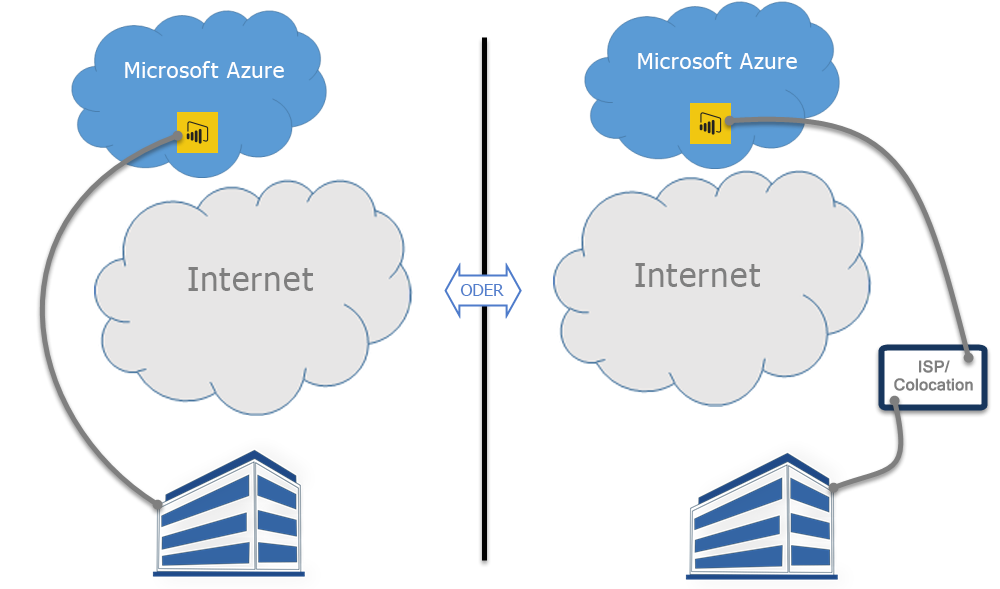

# Power BI und ExpressRoute
Mit **Power BI** und **ExpressRoute** können Sie auch eine private Netzwerkverbindung zwischen Ihrer Organisation oder dem Standort Ihres Servers bei Ihrem Internetdienstanbieter und Power BI einrichten. Dabei umgehen Sie das Internet, um Ihre sensiblen Power BI-Daten und Verbindungen besser zu schützen.

**ExpressRoute** ist ein Azure-Dienst der Ihnen ermöglicht, private Verbindungen zwischen Azure-Datencentern (wo sich Power BI befindet) und Ihrer lokalen Infrastruktur herzustellen. Alternativ können Sie private Verbindungen zwischen Azure-Datencentern und dem Standort Ihres Servers bei Ihrem Internetdienstanbieter herstellen.

Sie können [Weitere Informationen über ExpressRoute](https://azure.microsoft.com/services/expressroute/) erhalten oder [Herausfinden, wie Sie sich anmelden](https://azure.microsoft.com/pricing/details/expressroute/).

> [!NOTE]
> Power BI wird im Modus „Öffentliches Peering“ unterstützt, wie in [diesem Artikel mit häufig gestellten Fragen](https://docs.microsoft.com/azure/expressroute/expressroute-faqs) beschrieben.
> 
> 

## Power BI ExpressRoute-Ausnahmen
Power BI ist bis auf wenige Ausnahmen zu ExpressRoute konform, bei denen Power BI Daten über das öffentliche Internet abruft oder verschickt. Diese spezifischen Ausnahmen beinhalten oft statische Daten, z.B. Browser-Konfigurationsdateien, die vom nächstgelegenen **Content Delivery Network (CDN)**-Knoten heruntergeladen werden. Es gibt einige umfassende Ausnahmen, die für Power BI als Ganzes gelten, und es gibt einige dienst- oder funktionsspezifische Ausnahmen, die jeweils in den folgenden Abschnitten beschrieben werden.

### Allgemeine Ausnahmen für Power BI und ExpressRoute
Eine Ausnahme für **Power BI** und **ExpressRoute** bedeutet, dass die Daten, die zu oder von Power BI übertragen werden, über das öffentliche Internet übermittelt werden, anstatt über den privaten ExpressRoute-Link.

Die beiden allgemeinen Ausnahmen für die Verwendung von Power BI und ExpressRoute sind:

* Statische Dateien, die von dem **Content Delivery Network (CDN)** und Websites heruntergeladen werden
* **Telemetrie**-Daten, die über das öffentliche Internet verschickt werden

Power BI verwendet mehrere **Content Delivery Networks (CDNs)** oder Websites, um die erforderlichen statischen Inhalte und Dateien effizient über das öffentliche Internet an die Benutzer, basierend auf einem Gebietsschema, zu verteilen. Diese statischen Dateien umfassen Downloads von Produkten (wie **Power BI Desktop**, dem **lokalen Datengateway** oder **Power BI-Inhaltspaketen** von verschiedenen unabhängigen Dienstanbietern), Browserkonfigurationsdateien, mit denen alle darauffolgenden Verbindungen mit Power BI initiiert und hergestellt werden, sowie die sichere erste Anmeldeseite für Power BI. Die eigentlichen Anmeldeinformationen werden nur über ExpressRoute gesendet.   

Bestimmte **Telemetriedaten** werden auch über das öffentliche Internet und über ExpressRoute gesendet. Telemetriedaten beinhaltet Verwendungsstatistiken und ähnliche Daten, die an Dienste übermittelt werden, die verwendet werden, um die Verwendung und Aktivität zu überwachen.

### Power BI SaaS-Anwendung und ExpressRoute
Wenn ein Benutzer eine Verbindung mit dem Power BI-Dienst initiiert (über powerbi.com oder über Cortana), werden die Power BI-Landing Page, die Anmeldeseite, und statische Daten, die den Browser darauf vorbereiten, mit Power BI in Verbindung zu treten und zu interagieren, von einem CDN oder von Websites abgerufen, welche sich über das öffentliche Internet verbinden.

Sobald die Anmeldung eingerichtet wurde, erfolgen die nachfolgenden Power BI-Dateninteraktionen über ExpressRoute, mit Ausnahme bestimmter Dienste und Funktionen, die von öffentlichen Internetdaten abhängig sind:

* **Kartenvisualisierungen** erfordert eine Verbindung mit dem Bing Virtual Earth-Dienst oder dem Bing-Geocodierungsdienst sowie eine Übertragung an diese Dienste. Die Verbindung und Übertragung wird dabei jeweils über das öffentliche Internet hergestellt.
* Power BI-Integration mit **Cortana** erfordert den Zugriff auf Bing über das öffentliche Internet.
* Wenn **benutzerdefinierte Links** von einem Benutzer hinzugefügt werden, wie z.B. ein Widget für Bilder oder ein Video, fordert Power BI basierend auf dem Link, der durch den Benutzer bereitgestellt wurde, Daten an. Dabei wird möglicherweise ExpressRoute verwendet.
* Benutzer können über den UserVoice Feedbackmechanismus **Feedback an Power BI** als Text (oder optional als Abbildungen) schicken, wobei das öffentliche Internet für die Übertragung verwendet wird.
* Der **Bing News-Inhaltsanbieter** lädt Inhalt von Bing über das öffentliche Internet herunter.
* Beim Herstellen einer Verbindung mit **Apps** (z.B. Inhaltspaketen), ist es oft erforderlich, dass die Benutzer Anmeldeinformationen und Einstellungen eingeben, und dabei Seiten verwenden, die vom SaaS-Anbieter bereitgestellt werden. Solche Seiten verwenden möglicherweise ExpressRoute.

| Benutzeraktivität | Ziel |
| --- | --- |
| Landing Page (vor der Anmeldung) |`maxcdn.bootstrapcdn.com ; ajax.aspnetcdn.com ; netdna.bootstrapcdn.com ; cdn.optimizely.com; google-analytics.com ` |
| Anmeldung |`*.mktoresp.com ; *.aadcdn.microsoftonline-p.com ; *.msecnd.com ; *.localytics.com ; ajax.aspnetcdn.com` |
| Dashboard, Bericht, Datasetverwaltung (einschließlich Karten und Geocodierungen) |`*.localytics.com ; *.virtualearth.net ; platform.bing.com; powerbi.microsoft.com; c.microsoft.com; app.powerbi.com; *.powerbi.com; dc.services.visualstudio.com ` |
| Support |`support.powerbi.com ; powerbi.uservoice.com ; go.microsoft.com ` |

### Power BI Desktop und ExpressRoute
Power BI Desktop ist auch mit wenigen Ausnahmen zu ExpressRoute konform, die in der folgenden Liste beschrieben werden:

* **Aktualisierungsbenachrichtigungen**, die verwendet werden, um zu erkennen, ob die Benutzer über die neueste Version von Power BI Desktop verfügen, werden über das öffentliche Internet verschickt.
* Bestimmte **Telemetriedaten** werden über das öffentliche Internet verschickt.
* **Visualisierungen zuordnen** erfordert eine Verbindung mit dem **Bing Virtual Earth**-Dienst oder dem **Bing-Geocodierungs**-Dienst sowie eine Übertragung an diese Dienste. Die Verbindung und Übertragung wird dabei jeweils über das öffentliche Internet hergestellt.
* Das **Abrufen von Daten** aus mehreren verschiedenen Datenquellen, wie z.B. **Web** oder Drittanbieter von SaaS-Leistungen, erfolgt über das öffentliche Internet.

### Power BI PaaS und ExpressRoute
Power BI bietet APIs und andere plattformbasierte Funktionen, die Entwicklern ermöglichen, benutzerdefinierte Power BI-Lösungen und Apps zu erstellen. Die folgenden Dienste werden zusätzlich zu der Telemetrie und den weiter oben in diesem Thema besprochenen CDN-Daten verwendet, wenn Power BI PaaS-Daten über das öffentliche Internet verschickt:

| PaaS-Aktivität | Verwendete zusätzliche Ziele |
| --- | --- |
| Öffentlich einbinden (Telemetrie) |`c1.microsoft.com` |
| Benutzerdefinierte Visualisierungen (CDN) |`*.azureedge.net` |

Einige **benutzerdefinierte Visualisierungen** werden von Drittanbietern erstellt, einige von Microsoft. Diese verwenden möglicherweise ExpressRoute.

### Power BI Mobile und ExpressRoute
Dieses Dokument deckt die Verwendung von Power BI-Mobile Apps nicht ab.  

### Lokales Datengateway und ExpressRoute
Wenn ein **lokales Datengateway** mit Power BI verwendet wird, sind Datenübertragungen zu ExpressRoute konform. Ausnahmen gibt es für Benutzeraktivitäten, die im Abschnitt **Power BI SaaS-Anwendung und ExpressRoute** weiter oben in diesem Thema beschrieben werden.  

