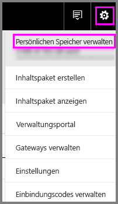
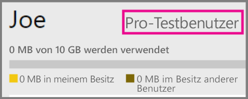
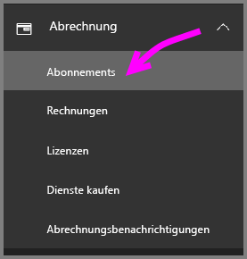
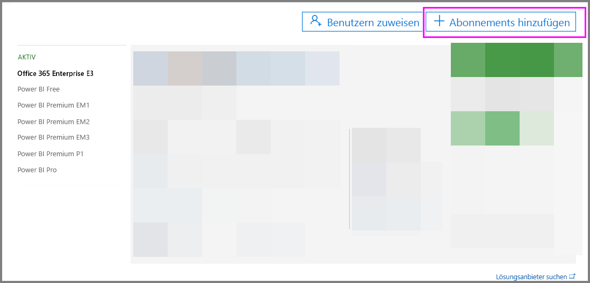
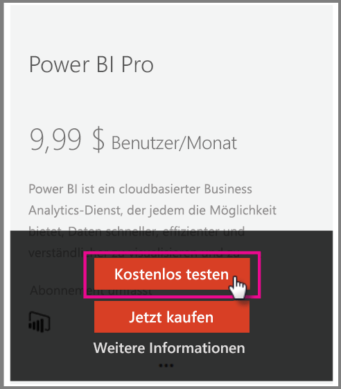

# Power BI Pro in Ihrer Organisation

Power BI Pro ist eine kostenpflichtige Lizenz, die weitere Funktionen aktiviert. Power BI Pro-Lizenzen sind für Teams geeignet, die zusammen mit anderen Teams datengesteuerte Entscheidungen treffen und diese dann teilen möchten.  Jedes Teammitglied, das freigegebenen Power BI-Inhalt erstellt oder anschaut, benötigt eine Pro-Lizenz, es sei denn der Inhalt ist einem Power BI Premium-Konto mit dedizierter Kapazität zugeordnet.

Für diese Features ist eine Power BI Pro-Lizenz erforderlich.

* **Analysieren von Daten in Excel oder Power BI Desktop**: Verwenden Sie Excel oder Power BI Desktop, um ein in Power BI veröffentlichtes Dataset anzuzeigen und mit diesem zu interagieren. Weitere Informationen finden Sie unter [In Excel analysieren](service-analyze-in-excel.md).

* **Freigeben von Dashboards und Zusammenarbeit mit Arbeitsbereichen**: Power BI-Arbeitsbereiche vereinfachen die Zusammenarbeit mit Kollegen an Dashboards, Berichten und Datasets. Weitere Informationen finden Sie unter [Zusammenarbeit in Ihrem Power BI-App-Arbeitsbereich](service-collaborate-power-bi-workspace.md).

* **Anzeigen freigegebener Inhalte**: Pro-User können für sie freigegebene Dashboards und Berichte anzeigen, damit interagieren und (mit einer Erlaubnis) wiederum selbst freigeben. Allerdings kann ein Pro-Benutzer diese Dashboards oder Berichte nicht bearbeiten. Weitere Informationen finden Sie unter [Freigeben Ihrer Power BI-Dashboards und -Berichte für Kollegen und andere](service-share-dashboards.md).

* **Integrieren von Inhalt in Microsoft Teams**: Sie können auf einem Microsoft Teams-Kanal (MS) eine Power BI-Registerkarte hinzufügen. MS Teams erkennt automatisch alle Berichte im Arbeitsbereich. Weitere Informationen finden Sie unter [Power BI teams up with Microsoft Teams (Power BI und Microsoft Teams)](https://powerbi.microsoft.com/en-us/blog/power-bi-teams-up-with-microsoft-teams/). 

## Power BI Pro als 60-Tage-Testversion für Einzelpersonen

Nachdem Sie sich für ein kostenloses Konto registriert haben, erhalten Sie die Möglichkeit, die Pro-Version 60 Tage lang kostenlos zu testen. Während des Testzeitraums haben Sie Zugriff auf alle Pro-Features. Power BI Pro hat alle Features der kostenlosen Version von Power BI sowie zusätzliche Features für Freigeben und Zusammenarbeit. Weitere Informationen finden Sie unter [Power BI – Preise](https://powerbi.microsoft.com/en-us/pricing/). Um eine 60 Tage lang gültige kostenlose Testversion von Power BI Pro auszuprobieren, melden Sie sich bei Power BI an, und testen Sie eins dieser Features von Power BI Pro:

* [Erstellen eines Arbeitsbereichs](service-create-distribute-apps.md)
* [Freigeben eines Dashboards](service-share-dashboards.md)

Wenn Sie eins dieser Features ausprobieren, werden Sie aufgefordert, Ihren kostenlosen Testzeitraum zu beginnen. Sie können die Testversion auch starten, indem Sie auf das Zahnradsymbol klicken und „Persönlichen Speicher verwalten“ auswählen. Klicken Sie anschließend rechts auf „Pro kostenlos testen“.

   
    
   

Klicken Sie dann auf „Test starten“.

   

> [!NOTE]
> Benutzer, die dieses ins Produkt integrierte Power BI Pro-Testangebot nutzen, werden im Office 365-Administratorportal nicht als Power BI Pro-Testbenutzer aufgeführt (sie werden als Benutzer der kostenlosen Power BI-Version angezeigt). Allerdings werden sie auf der Seite „Speicher verwalten“ in Power BI als Benutzer der Power BI Pro-Testversion angezeigt.
>

> [!NOTE]
> Wenn Sie IT-Administrator sind und Power BI-Testlizenzen für mehrere Benutzer in Ihrer Organisation erwerben und bereitstellen möchten, ohne dass die einzelnen Benutzer den Testbedingungen einzeln zustimmen müssen, können Sie sich für eine Power BI Pro-Testversion im Abonnement registrieren. Sie müssen ein globaler Office 365-Administrator oder ein Abrechnungsadministrator sein oder einen neuen Mandanten erstellen, um sich für eine Administratortestversion zu registrieren. Weitere Informationen finden Sie unter [Erwerb von Power BI Pro](service-admin-purchasing-power-bi-pro.md).
>

Bei geöffnetem Dienst können Sie überprüfen, ob Sie über ein Pro-Testkonto verfügen. Klicken Sie dazu zunächst auf das Zahnradsymbol und anschließend auf „Persönlichen Speicher verwalten“.

   

## Testversion als Office 365-Abonnement

Sie können Power BI als Testversion für Ihre Organisation beziehen. Sobald das Abonnement für Sie nutzbar ist, können Sie Ihren Benutzern Power BI-Lizenzen zuweisen. Weitere Informationen zum Zuweisen von Lizenzen finden Sie unter [Assign licenses to users in Office 365 (Zuweisen von Lizenzen zu Benutzern in Office 365)](https://support.office.com/en-us/article/assign-licenses-to-users-in-office-365-for-business-997596b5-4173-4627-b915-36abac6786dc?ui=en-US&rs=en-US&ad=US).

> [!NOTE]
> Es gibt eine Beschränkung auf maximal eine Testversion für Organisationseinheiten pro Mandant. Wenn also die Power BI Pro – Testversion bereits auf Ihrem Mandanten angewendet wurde, kann dies nicht erneut durchgeführt werden. Wenn Sie Hilfe benötigen, können Sie sich an den [Office 365-Abrechnungssupport](https://support.office.microsoft.com/en-us/article/contact-support-for-business-products-admin-help-32a17ca7-6fa0-4870-8a8d-e25ba4ccfd4b?CorrelationId=552bbf37-214f-4202-80cb-b94240dcd671&ui=en-US&rs=en-US&ad=US) wenden.
>

Führen Sie die folgenden Schritte aus, um ein kostenloses Testabonnement in Office 365 zu erhalten:

1. Navigieren Sie zum [Office 365 Admin Center](https://portal.office.com/adminportal/home#/homepage).
2. Klicken Sie im linken Navigationsbereich auf „Abrechnung“ und anschließend auf „Abonnements“.

   

3. Klicken Sie auf der rechten Seite auf „Abonnements hinzufügen“.

   

4. Zeigen Sie unter „Andere Pläne“ auf die Auslassungspunkte („...“) für Power BI Free, und wählen Sie „Kostenlosen Test starten“.

    

5. Klicken Sie auf dem Bildschirm „Bestellung bestätigen“ auf „Jetzt testen“.
6. Klicken Sie auf der Bestellbestätigung auf „Weiter“.

## Erwerb von Power BI Pro

Sie können Power BI Pro über Microsoft Office 365 oder einen zertifizierten Microsoft-Partner erwerben. Weitere Informationen zum Erwerb von Power BI Pro finden Sie unter [Erwerb von Power BI Pro](service-admin-purchasing-power-bi-pro.md).

## Nächste Schritte
[Self-Service-Registrierung für Power BI](service-admin-signing-up-for-power-bi-with-a-new-office-365-trial.md)
 
[Power BI Free in Ihrer Organisation](service-admin-service-free-in-your-organization.md)
 
[Erwerb von Power BI Pro](service-admin-purchasing-power-bi-pro.md)
 
[Aktivierung der erweiterten Pro-Testversion](service-extended-pro-trial.md)
 
[Assigning Power BI Pro licenses (Zuweisen von Power BI Pro-Lizenzen)](service-admin-assigning-power-bi-pro-licenses.md)
 
[Power BI Premium – Beschreibung](service-admin-premium-manage.md)
 
[Erwerben von Power BI Premium](service-admin-premium-purchase.md)
 
[Power BI Premium-Whitepaper](https://aka.ms/pbipremiumwhitepaper)

Weitere Fragen? [Stellen Sie Ihre Frage in der Power BI-Community.](https://community.powerbi.com/)