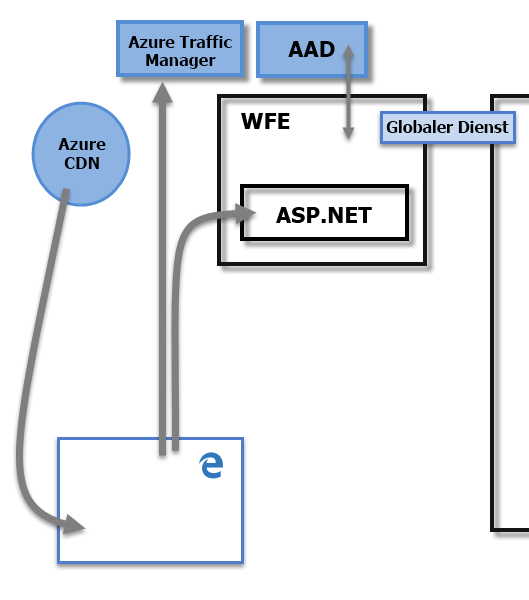
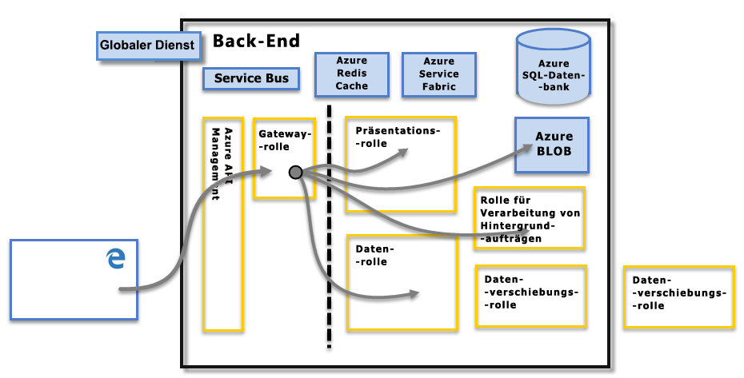

# Sicherheit in Power BI
Um eine ausführliche Erläuterung der Sicherheit in Power BI zu erhalten, [laden Sie das Whitepaper „Sicherheit in Power BI“ herunter](http://go.microsoft.com/fwlink/?LinkId=829185):

Der Power BI-Dienst basiert auf **Azure**, der Infrastruktur und Plattform für Cloud-Computing von Microsoft. Die Power BI-Dienstarchitektur basiert auf zwei Clustern – dem Web-Front-End (**WFE**)-Cluster und dem **Back-End**-Cluster. Das WFE-Cluster ist zuständig für die Erstverbindung und Authentifizierung beim Power BI-Dienst. Nach erfolgter Authentifizierung steuert dann das Back-End-Cluster alle weiteren Benutzerinteraktionen. Power BI verwendet Azure Active Directory (AAD) zum Speichern und Verwalten von Benutzeridentitäten. Zum Speichern von Daten und Metadaten verwendet es Azure-BLOB bzw. die Azure SQL-Datenbank.

## Architektur von Power BI
Jede Power BI-Bereitstellung umfasst zwei Cluster – ein Web-Front-End (**WFE**)-Cluster und ein **-Back-End** -Cluster.

Das **WFE** Cluster steuert die Erstverbindung und den Authentifizierungsvorgang für Power BI und verwendet dabei AAD zum Authentifizieren von Clients und Token für nachfolgende Client Verbindungen mit dem Power BI-Dienst. Für den Authentifizierungsvorgang und zum Herunterladen von statischen Inhalten und Dateien verwendet Power BI außerdem den **Azure Traffic Manager** (ATM), um den Benutzerverkehr zum nächstgelegenen Datencenter weiterzuleiten, das durch den DNS-Eintrag des Clients bestimmt wird, der eine Verbindung herstellen möchte. Power BI verwendet **Azure Content Delivery Network** (CDN für die effiziente Verteilung der erforderlichen statischen Inhalte und Dateien an Benutzer basierend auf einem Gebietsschema.

Das **Back-End** -Cluster zeigt, wie authentifizierte Clients mit dem Power BI-Dienst interagieren. Die **Back-End** -Cluster steuert Visualisierungen, Benutzer-Dashboards, Datasets, Berichte, Datenspeicher, Datenverbindungen, Datenaktualisierungen und andere Aspekte der Interaktion mit dem Power BI-Dienst. Die **Gateway-Rolle** fungiert als Gateway zwischen Benutzeranforderungen und dem Power BI-Dienst. Benutzer interagieren nicht direkt mit Rollen mit Ausnahme der **Gateway-Rolle**. Letztendlich verwaltet **Azure API Management** die **Gateway-Rolle**.

> [!IMPORTANT]
> Es ist unbedingt zu beachten, dass nur **Azure API Management** (APIM) und **Gateway**-Rollen (GW) über das öffentliche Internet zugänglich sind. Sie bieten Authentifizierung, Autorisierung, DDoS-Schutz, Einschränkung, Lastenausgleich, Routing und andere Funktionen.
> 
> 

## Datenspeichersicherheit 
Power BI verwendet zwei primäre Repositorys zum Speichern und Verwalten von Daten: Daten, die von Benutzern hochgeladen werden, werden in der Regel an den **Azure-BLOB** Speicher gesendet, und alle Metadaten sowie Artefakte des Systems selbst werden in der **Azure SQL-Datenbank**gespeichert.

Die gepunktete Linie im Bild des **-Back-End** -Clusters oben verdeutlicht die Grenze zwischen den beiden einzigen Komponenten, die für Benutzer (links neben der gepunkteten Linie) zugänglich sind, und Rollen, die nur für das System zugänglich sind. Wenn ein authentifizierter Benutzer eine Verbindung mit dem Power BI-Dienst herstellt, werden die Verbindung und jede Anforderung vom Client von der **Gateway-Rolle** akzeptiert und verwaltet (um schließlich von **Azure API Management**verwaltet zu werden), welche dann im Namen des Benutzers mit dem übrigen Power BI-Dienst interagiert. Wenn beispielsweise ein Client versucht, ein Dashboard anzuzeigen, akzeptiert die **Gateway-Rolle** die Anforderung und sendet dann separat eine Anforderung an die **Präsentationsrolle** , um die vom Browser benötigten Daten zum Rendern des Dashboards abzurufen.

## Benutzerauthentifizierung
Power BI verwendet Azure Active Directory ([AAD](http://azure.microsoft.com/services/active-directory/)) zum Authentifizieren von Benutzern, die sich beim Power BI-Dienst anmelden, und verwendet wiederum die Power BI-Anmeldeinformationen, wann immer ein Benutzer versucht, auf Ressourcen zuzugreifen, die eine Authentifizierung erfordern. Benutzer melden sich beim Power BI-Dienst mit der E-Mail-Adresse an, die sie zum Einrichten ihres Power BI-Kontos verwendet haben. Power BI verwendet diese zur Anmeldung verwendete E-Mail- Adresse als den *effektiven Benutzernamen*, der an Ressourcen übergeben wird, wann immer ein Benutzer versucht, eine Verbindung mit Daten herzustellen. Der *effektive Benutzername* wird dann einem *Benutzerprinzipalnamen* ([UPN](https://msdn.microsoft.com/library/windows/desktop/aa380525\(v=vs.85\).aspx)) zugeordnet, und für das zugehörige Windows-Domänenkonto aufgelöst, mit dem die Authentifizierung erfolgt.

Für Organisationen, die Unternehmens-E-Mail-Adressen für die Anmeldung bei Power BI verwendet haben (wie z. B. *david@contoso.com*), ist die Zuordnung von *effektivem Benutzernamen* zum Benutzerprinzipalnamen (UPN) einfach. Für Organisationen, die keine Unternehmens-E-Mail-Adressen für die Anmeldung bei Power BI verwendet haben (wie z. B. *david@contoso.onmicrosoft.com*), erfordert die Zuordnung zwischen AAD und lokalen Anmeldeinformationen eine [Verzeichnissynchronisierung](https://technet.microsoft.com/library/jj573653.aspx), um ordnungsgemäß zu funktionieren.

Die Plattformsicherheit für Power BI umfasst auch die Sicherheit der mehrinstanzenfähigen Umgebung sowie Netzwerksicherheit und die Möglichkeit zum Hinzufügen von zusätzlichen AAD-basierten Sicherheitsmaßnahmen.

## Daten- und Dienstsicherheit
Weitere Informationen finden Sie im [Microsoft Trust Center](https://www.microsoft.com/trustcenter).

Wie weiter oben in diesem Artikel beschrieben, wird die Anmeldung eines Benutzers bei Power BI von lokalen Active Directory-Servern zur Zuordnung zu einem Benutzerprinzipalnamen (UPN) als Anmeldeinformationen verwendet. Es ist jedoch **wichtig** zu beachten, dass Benutzer für die von ihnen freigegebenen Daten verantwortlich sind: Wenn ein Benutzer mithilfe seiner Anmeldeinformationen eine Verbindung zu Datenquellen herstellt, dann einen Bericht (oder ein Dashboard oder ein Dataset) basierend auf diesen Daten freigibt, sind Benutzer, für die das Dashboard freigegeben wird, für die ursprüngliche Datenquelle nicht authentifiziert und erhalten Zugriff auf den Bericht.

Eine Ausnahme stellen Verbindungen mit **SQL Server Analysis Services** über das **lokale Datengateway** dar. Dabei werden Dashboards in Power BI zwischengespeichert. Beim Zugreifen auf zugrunde liegende Berichte oder Datasets wird jedoch von dem Benutzer, der auf den Bericht (oder das Dataset) zugreifen möchte, eine Authentifizierung angefordert, und der Zugriff wird nur dann gewährt, wenn der Benutzer über ausreichende Anmeldeinformationen für den Zugriff auf die Daten verfügt. Weitere Informationen finden Sie unter [On-premises Data Gateway deep dive](service-gateway-onprem-indepth.md) (Lokales Datengateway im Detail).

