# Verwalten von Kapazitäten in Power BI Premium und Power BI Embedded
Hier erfahren Sie, wie Sie Power BI Premium- und Power BI Embedded-Kapazitäten verwalten können, um dedizierte Ressourcen für Ihre Inhalte bereitzustellen.

Kapazität ist der Kern von Power BI Premium und Power BI Embedded.

## Was ist Kapazität?
Kapazität bezeichnet die Gruppe von Ressourcen, die für die ausschließliche Verwendung durch Sie reserviert ist. Wenn Sie über Kapazität verfügen, können Sie Dashboards, Berichte und Datasets für Benutzer in Ihrer Organisation veröffentlichen, ohne Lizenzen für diese erwerben zu müssen. Außerdem gewährleistet sie eine zuverlässige, beständige Leistung für die in der Kapazität gehosteten Inhalte.

Kapazität ist für die Endbenutzer vollkommen transparent. Diese verwenden Power BI oder Ihre Anwendung weiterhin wie gewohnt. Die Endbenutzer müssen nicht wissen, dass Teile des Inhalts (oder der gesamte Inhalt) in Ihrer dedizierten Kapazität gehostet werden. Für Ihre Benutzer hat sich nichts verändert.

[!INCLUDE [powerbi-premium-illustration](./includes/powerbi-premium-illustration.md)]

Weitere Informationen finden Sie unter [What is Power BI Premium? (Was ist Power BI Premium?)](service-premium.md).

### Kapazitätsadministratoren
> [!NOTE]
> Kapazitätsadministratoren für Power BI Embedded-Kapazität werden im Microsoft Azure-Portal definiert.

Wenn Sie einer Kapazität als Kapazitätsadministrator zugewiesen werden, haben Sie die volle Kontrolle über die Kapazität und deren Verwaltungsfeatures. Sie können über das Power BI-Verwaltungsportal weitere Kapazitätsadministratoren hinzufügen (nur in Power BI Premium) oder Benutzern Kapazitätszuweisungsberechtigungen erteilen. Sie können eine Massenzuweisung von Arbeitsbereichen zu einer Kapazität durchführen und sich Nutzungsmetriken einer Kapazität anzeigen lassen.

Jede Kapazität verfügt über ihre eigenen Administratoren. Wenn Sie einen Kapazitätsadministrator für eine Kapazität definieren, erhält dieser dadurch nicht Zugriff auf alle Kapazitäten in Ihrer Organisation. Kapazitätsadministratoren haben nicht standardmäßig Zugriff auf alle Power BI-Administrationsbereiche, z.B. Nutzungsmetriken, Überwachungsprotokolle oder Mandanteneinstellungen. Kapazitätsadministratoren sind auch nicht berechtigt, neue Kapazitäten einzurichten oder die SKU vorhandener Kapazitäten zu ändern. Nur globale Administratoren oder Power BI-Dienstadministratoren haben Zugriff auf diese Elemente.

Alle globalen Office 365-Administratoren und Power BI-Administratoren sind automatisch Kapazitätsadministratoren von Power BI Premium- und Power BI Embedded-Kapazität.

## Erwerben von Kapazität
Damit Sie von dedizierter Kapazität profitieren können, müssen Sie im Office 365 Admin Center ein Abonnement von Power BI Premium erwerben oder im Microsoft Azure-Portal eine Power BI Embedded-Ressource erstellen. Weitere Informationen finden Sie in den folgenden Artikeln:

* **Power BI Premium:** [Erwerben von Power BI Premium](service-admin-premium-purchase.md)
* **Power BI Embedded:** [Einrichten von Power BI Embedded-Kapazität im Azure-Portal](https://docs.microsoft.com/en-us/azure/power-bi-embedded/create-capacity)

Wenn Sie Power BI Premium-SKUs erwerben, erhält Ihr Mandant die entsprechende Anzahl von V-Kernen zur Verwendung in Kapazitäten, die ausgeführt werden. Beispielsweise erhält der Mandant durch den Erwerb einer Power BI Premium P3-SKU 32 V-Kerne.

> [!NOTE]
> Nach Ablauf Ihres Abonnements erhalten Sie 30 Tage lang kostenlos Zugriff. Anschließend wird für Ihre Inhalte wieder eine gemeinsam genutzte Kapazität verwendet. Modelle, die größer als 1 GB sind, werden bei Nutzung einer üblichen gemeinsamen Lizenz nicht unterstützt.

## Verwalten der Kapazität
Nachdem Sie in Office 365 Kapazitätsknoten erworben haben, müssen Sie eine neue Kapazität einrichten. Dieser Vorgang wird über das [Power BI-Verwaltungsportal](service-admin-portal.md) ausgeführt. Im Verwaltungsportal gibt es den Bereich **Kapazitätseinstellungen**. Dort können Sie Premium-Kapazitäten Ihrer Organisation von Power BI verwalten.

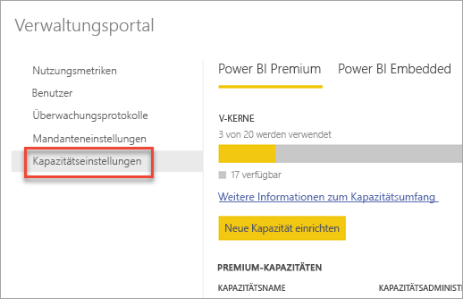

Durch Auswahl von **Kapazitätseinstellungen** gelangen Sie zum Kapazitätsverwaltungsbildschirm für Power BI Premium.

### Einrichten einer neuen Kapazität (Power BI Premium)
Die Anzahl der verwendeten und die Anzahl der zum Erstellen von Kapazitäten verfügbaren V-Kerne werden angezeigt. Die Anzahl der für Ihre Organisation verfügbaren V-Kerne basiert auf den Premium-SKUs, die Sie erworben haben. Wenn Sie beispielsweise eine P3- und eine P2-SKU erwerben, sind 48 Kerne verfügbar – 32 aus P3 und 16 aus P2.

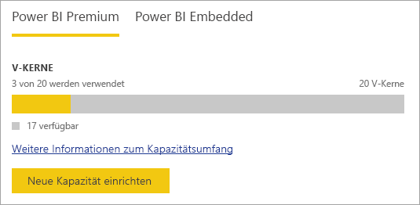

Wenn Sie verfügbare V-Kerne haben, können Sie Ihre neue Kapazität mit den folgenden Schritten einrichten.

1. Klicken Sie auf **Set up new capacity** (Neue Kapazität einrichten).
2. **Benennen** Sie Ihre Kapazität.
3. Legen Sie einen Kapazitätsadministrator fest.

    Kapazitätsadministratoren müssen nicht Administratoren von Power BI oder globale Administratoren von Office 365 sein. Weitere Informationen finden Sie unter [Power BI Premium capacity admins (Kapazitätsadministratoren von Power BI Premium)](#capacity-admins).
4. Wählen Sie den Kapazitätsumfang aus. Die verfügbaren Optionen hängen von der Anzahl der verfügbaren V-Kerne ab. Sie können keine Option mit einer Anzahl wählen, die größer als die verfügbare Anzahl ist.

    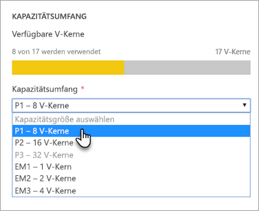
5. Klicken Sie auf **Einrichten**.

    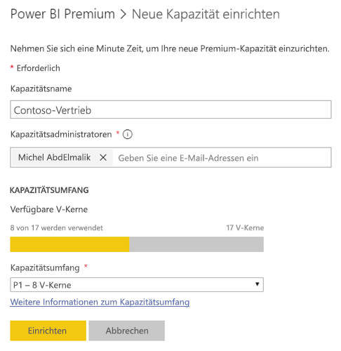

Die Kapazität wird Kapazitätsadministratoren sowie Administratoren von Power BI und globale Administratoren von Office 365 im Verwaltungsportal angezeigt.

### Kapazitätseinstellungen
Sie können auf der Verwaltungsseite für Premium-Kapazitäten unter „Actions“ (Aktionen) auf das **Zahnradsymbol (Einstellungen)** klicken. Dort können Sie eine Kapazität umbenennen oder löschen. Außerdem können Sie die jeweiligen Dienstadministratoren, die SKU/Größe und Region der Kapazität sehen.

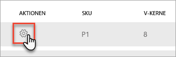

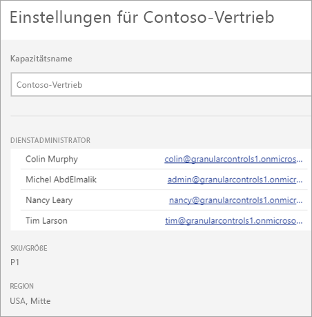

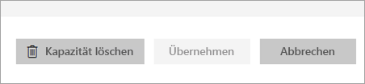

> [!NOTE]
> Power BI Embedded-Kapazitätseinstellungen werden im Microsoft Azure-Portal verwaltet.

### Ändern des Kapazitätsumfangs (Power BI Premium)
Power BI-Administratoren und globale Office 365-Administratoren ändern den Power BI Premium-Kapazitätsumfang, indem sie **Kapazitätsumfang ändern** auswählen. Kapazitätsadministratoren, die keine Power BI- oder globale Office 365-Administratoren sind, verfügen nicht über diese Option.

Im Bildschirm **Kapazitätsumfang ändern** können Sie ein Upgrade oder Downgrade des Kapazitätsumfangs ausführen, wenn die entsprechenden Ressourcen verfügbar sind. Administratoren können Knoten erstellen, löschen und ihre Größe ändern, solange sie über die erforderliche Anzahl von V-Kernen verfügen.

P-SKUs können nicht auf EM-SKUs herabgestuft werden. Sie können auf deaktivierte Optionen zeigen, um ihre Erläuterung anzuzeigen.

### Kapazitätszuweisung
Sie können eine Kapazität verwalten, indem Sie deren Namen auswählen. Dadurch werden Sie zur Kapazitätsverwaltungsseite weitergeleitet.

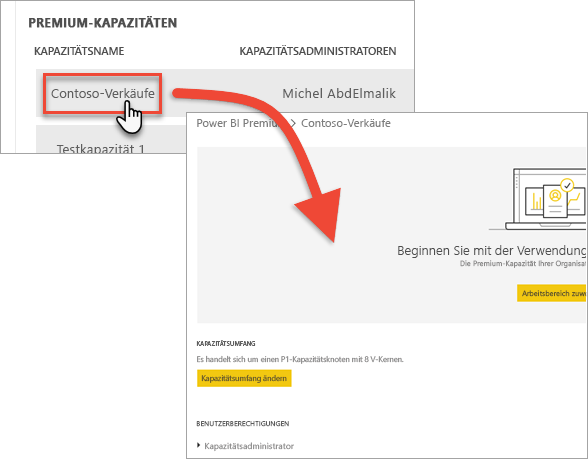

Wenn der Kapazität keine Arbeitsbereiche zugewiesen wurden, wird die Meldung **Arbeitsbereiche zuweisen** angezeigt.

#### Benutzerberechtigungen
Sie können zusätzliche **Kapazitätsadministratoren** für Power BI Premium-Kapazitäten zuweisen sowie Benutzer mit Berechtigung zur **Kapazitätszuweisung**. Benutzer mit Zuweisungsberechtigung können einer Kapazität einen App-Arbeitsbereich zuweisen, wenn sie ein Administrator dieses Arbeitsbereichs sind. Außerdem können sie der Kapazität ihren persönlichen Arbeitsbereich (*Mein Arbeitsbereich*) zuweisen. Benutzer mit Zuweisungsberechtigung haben keinen Zugang zum Verwaltungsportal.

> [!NOTE]
> Kapazitätsadministratoren für Power BI Embedded-Kapazität werden im Microsoft Azure-Portal zugewiesen.
>
>

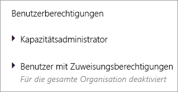

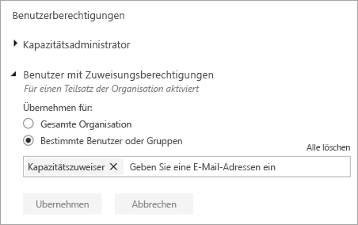

## Zuweisen eines Arbeitsbereichs zu einer Kapazität
Sie haben mehrere Möglichkeiten, einer Kapazität einen Arbeitsbereich zuzuweisen.

### Verwaltung von Kapazitäten im Verwaltungsportal
Kapazitätsadministratoren können, genauso wie Administratoren von Power BI und globale Administratoren von Office 365, Massenzuweisungen von Arbeitsbereichen im Verwaltungsbereich für Premium-Kapazitäten im Verwaltungsportal durchführen. Beim Verwalten einer Kapazität wird Ihnen der Bereich **Workspaces** (Arbeitsbereiche) angezeigt, in dem Sie Arbeitsbereiche zuweisen können.

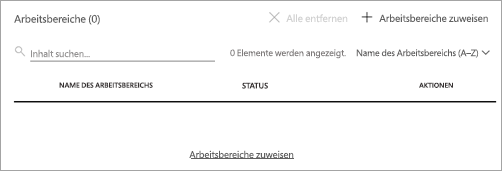

1. Klicken Sie auf **Arbeitsbereiche zuweisen**. Dies wird an mehreren Stellen angezeigt und führt die gleiche Aufgabe durch.
2. Klicken Sie entweder auf **The entire organization's workspaces** (Arbeitsbereiche der gesamten Organisation) oder auf **Specific workspaces by user** (Bestimmte Arbeitsbereiche nach Benutzer).

   | Auswahl (Selection) | Beschreibung |
   | --- | --- |
   | **Arbeitsbereiche der gesamten Organisation** |Wenn Sie die Arbeitsbereiche der gesamten Organisation einer Premium-Kapazität zuweisen, werden alle App-Arbeitsbereiche und Meine Arbeitsbereiche, die sich in Ihrer Organisation befinden, dieser Premium-Kapazität zugewiesen. Des Weiteren erhalten alle aktuellen und zukünftigen Benutzer die Berechtigung, einzelne Arbeitsbereiche erneut dieser Kapazität zuzuweisen. |
   | **Bestimmte Arbeitsbereiche nach Benutzer** |Wenn Sie Ihre Arbeitsbereiche nach Benutzern oder Gruppen zuweisen, werden alle Arbeitsbereiche dieses Benutzers einer Premium-Kapazität zugewiesen, einschließlich seiner der persönlichen Arbeitsbereiche. Diese Benutzer erhalten automatisch Berechtigung zur Zuweisung von Arbeitsbereichen. Dies gilt auch für Arbeitsbereiche, die bereits einer anderen Kapazität zugewiesen wurden. |
3. Klicken Sie auf **Übernehmen**.

Mit dieser Option können Sie einer Kapazität keine bestimmten Arbeitsbereiche zuweisen.

### Einstellungen von App-Arbeitsbereichen
Sie können einer Premium-Kapazität auch einen App-Arbeitsbereich über die Einstellungen dieses Arbeitsbereichs zuweisen. Um einer Premium-Kapazität einen App-Arbeitsbereich zuzuweisen, führen Sie folgende Schritte durch.

Um einen Arbeitsbereich in eine Kapazität zu verschieben, müssen Sie über Administratorberechtigungen für diesen Arbeitsbereich verfügen sowie über Berechtigungen zu Kapazitätszuweisung für diese Kapazität. Beachten Sie, dass Arbeitsbereichsadministratoren einen Arbeitsbereich jederzeit aus einer Premium-Kapazität entfernen können.

1. Sie können einen App-Arbeitsbereich bearbeiten, indem Sie auf die **Auslassungspunkte (...)** und dann auf **Edit workspace** (Arbeitsbereich bearbeiten) klicken.

    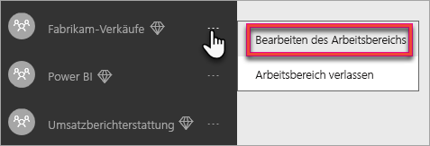
2. Erweitern Sie unter **Edit workspace** (Arbeitsbereich bearbeiten) **Erweitert**.
3. Wenn Ihnen die Berechtigung zur Kapazitätszuweisung für eine Kapazität erteilt wurde, haben Sie die Option, **Premium** für diesen Arbeitsbereich zu aktivieren.
4. Wählen Sie die Kapazität aus, die Sie diesem App-Arbeitsbereich zuweisen möchten.

    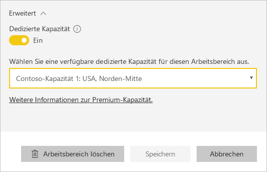
5. Wählen Sie **Speichern**.

Sobald Sie die Änderungen speichern, wird der Arbeitsbereich mitsamt seinen Inhalten in die Premium-Kapazität verschoben, ohne dass die Benutzererfahrung der Endbenutzer beeinträchtigt wird.

## Überwachen der Kapazitätsnutzung
Für jede Kapazität werden Nutzungsmessungen für „CPU“, „Speicherauslastung“, „Speicherüberlastung“ und „Direkte Abfrage“ angezeigt. Wir empfehlen, diese Metriken im Auge zu behalten, um sicherzustellen, dass Ihre Benutzer eine gute Leistung für Ihre Kapazität erhalten:

> [!NOTE]
> Die Power BI Embedded-Kapazitätsauslastung wird im Azure-Portal überwacht.

| Metrik | Beschreibung |
| --- | --- |
| CPU |Häufigkeit, mit der die CPU eine Auslastung von 80 % überschritten hat. |
| Speicherüberlastung |Zeigt die Speicherauslastung Ihrer Back-End-Kerne. Dies ist insbesondere eine Metrik dazu, wie oft Datasets aufgrund hoher Speicherauslastung bei Verwenden mehrerer Datasets aus dem Arbeitsspeicher entfernt werden. |
| Memory Usage |Durchschnittliche Arbeitsspeicherauslastung in Gigabytes (GB). |
| DQ/s | Häufigkeit, mit der die Anzahl von „Direkte Abfrage“- und Liveverbindungen 80 % des Grenzwerts überschritten hat.     * Die Gesamtzahl von Abfragen mit DirectQuery und Liveverbindungen pro Sekunde ist eingeschränkt.  * Die Grenzwerte betragen 30/s für P1, 60/s für P2 und 120/s für P3.   * Die Anzahl von Abfragen des Typs „Direkte Abfrage“ und „Liveverbindung“ werden zur Drosselung hinzu gerechnet. Wenn Sie z.B. 15 direkte Abfragen und 15 Liveverbindungen in einer Sekunde haben, ist die Begrenzung erreicht.  * Dies gilt sowohl für lokale als auch Cloudverbindungen. |

Metriken spiegeln die Auslastung in der letzten Woche wider.  Wenn Sie eine detailliertere Ansicht der Metriken wünschen, können Sie dies tun, indem Sie auf eine der Zusammenfassungskacheln klicken.  Sie gelangen zu detaillierten Diagrammen für jede der Metriken für Ihre Premium-Kapazität.  Diese Diagramme sind für die letzte Woche stündlich zusammengefasst und können Ihnen helfen zu ermitteln, wann bestimmte leistungsbezogene Ereignisse in Ihrer Premium-Kapazität aufgetreten sind.  

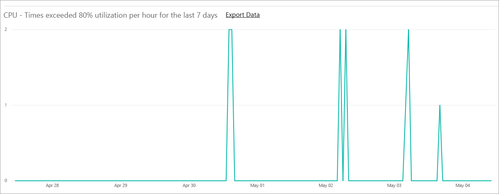

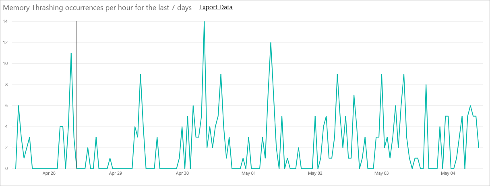

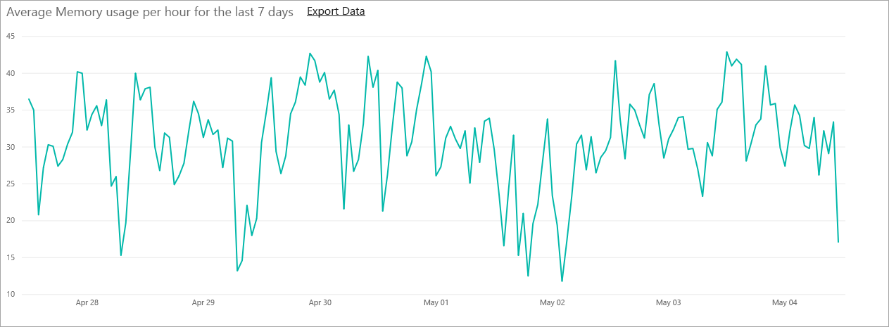

Sie können auch die für jede der Metriken zugrunde liegenden Daten in eine CSV-Datei exportieren.  Dieser Export liefert Ihnen im Drei-Minuten-Takt detaillierte Informationen für jeden Tag der vergangenen Woche.

## So sieht Premium für Benutzer aus
Meistens ist es nicht vonnöten, dass Benutzern überhaupt bewusst ist, dass sie sich in einer Premium-Kapazität befinden. Die Dashboards und Berichte der Benutzer funktionieren einfach wie gewohnt. Arbeitsbereiche, die sich in einer Premium-Kapazität befinden, sind durch ein Diamantsymbol optisch markiert.

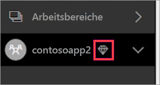

## Product Key für den Power BI-Berichtsserver
Auf der Registerkarte **Kapazitätseinstellungen** im Verwaltungsportal von Power BI haben Sie Zugang zum Product Key für den Power BI-Berichtsserver. Dieser steht nur globalen Administratoren oder Benutzern zur Verfügung, denen die Administratorrolle für den Power BI-Dienst zugewiesen wurde. Voraussetzung ist außerdem, dass Sie eine Power BI Premium-SKU erworben haben.

Wenn Sie auf **Power BI Report Server key** (Schlüssel für den Power BI-Berichtsserver) klicken, wird ein Dialogfeld mit Ihrem Product Key angezeigt. Diesen können Sie kopieren und bei der Installation verwenden.

Weitere Informationen finden Sie unter [Install Power BI Report Server (Installation vom Power BI-Berichtsserver)](report-server/install-report-server.md).

## Nächste Schritte
Teilen veröffentlichter Apps mit Benutzern Weitere Informationen finden Sie unter [Erstellen und Verteilen einer App in Power BI](service-create-distribute-apps.md).

Weitere Fragen? [Stellen Sie Ihre Frage in der Power BI-Community.](http://community.powerbi.com/)
