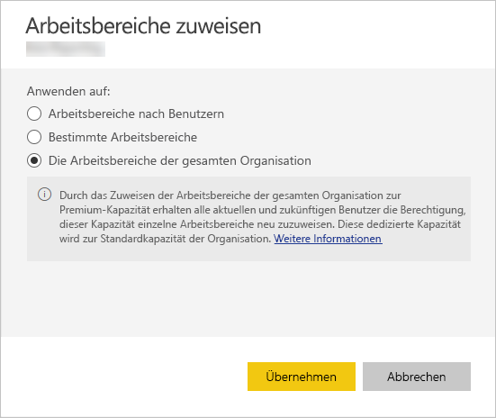

# Verwalten von Kapazitäten in Power BI Premium und Power BI Embedded

Hier erfahren Sie, wie Sie Power BI Premium- und Power BI Embedded-Kapazitäten verwalten können, um dedizierte Ressourcen für Ihre Inhalte bereitzustellen.

## Was ist Kapazität?

*Kapazität* ist der Kern von Power BI Premium und Power BI Embedded. Sie bezeichnet die Gruppe von Ressourcen, die für die ausschließliche Verwendung durch Ihre Organisation reserviert ist. Wenn Sie über dedizierte Kapazität verfügen, können Sie Dashboards, Berichte und Datasets für Benutzer in Ihrer Organisation veröffentlichen, ohne separate Lizenzen für diese erwerben zu müssen. Außerdem bietet sie eine zuverlässige, beständige Leistung für die in der Kapazität gehosteten Inhalte. Weitere Informationen finden Sie unter [What is Power BI Premium? (Was ist Power BI Premium?)](service-premium.md).

### Kapazitätsadministratoren

Wenn Sie einer Kapazität als *Kapazitätsadministrator* zugewiesen werden, haben Sie die volle Kontrolle über die Kapazität und deren Verwaltungsfeatures. Sie können über das Power BI-Verwaltungsportal weitere Kapazitätsadministratoren hinzufügen oder Benutzern Kapazitätszuweisungsberechtigungen erteilen. Sie können eine Massenzuweisung von Arbeitsbereichen zu einer Kapazität durchführen und sich Nutzungsmetriken einer Kapazität anzeigen lassen.

> [!NOTE]
> Kapazitätsadministratoren für Power BI Embedded werden im Microsoft Azure-Portal definiert.

Jede Kapazität verfügt über ihre eigenen Administratoren. Wenn Sie einen Kapazitätsadministrator für eine Kapazität zuweisen, erhält dieser dadurch nicht Zugriff auf alle Kapazitäten in Ihrer Organisation. Kapazitätsadministratoren haben nicht standardmäßig Zugriff auf alle Power BI-Administrationsbereiche, z.B. Nutzungsmetriken, Überwachungsprotokolle oder Mandanteneinstellungen. Kapazitätsadministratoren sind auch nicht berechtigt, neue Kapazitäten einzurichten oder die SKU vorhandener Kapazitäten zu ändern. Nur globale Administratoren von Office 365 oder Power BI-Dienstadministratoren haben Zugriff auf diese Elemente.

Alle globalen Administratoren von Office 365 und Power BI-Dienstadministratoren sind automatisch Kapazitätsadministratoren von Power BI Premium- und Power BI Embedded-Kapazität.

## Erwerben von Kapazität

Damit Sie von dedizierter Kapazität profitieren können, müssen Sie im Office 365 Admin Center Power BI Premium erwerben oder im Microsoft Azure-Portal eine Power BI Embedded-Ressource erstellen. Weitere Informationen finden Sie in den folgenden Artikeln:

* **Power BI Premium:** [Erwerben von Power BI Premium](service-admin-premium-purchase.md)

* **Power BI Embedded:** [Einrichten von Power BI Embedded-Kapazität im Azure-Portal](https://docs.microsoft.com/azure/power-bi-embedded/create-capacity)

Wenn Sie Power BI Premium- oder Power BI Embedded-SKUs erwerben, erhält Ihr Mandant die entsprechende Anzahl von V-Kernen zur Verwendung in Kapazitäten, die ausgeführt werden. Beispielsweise erhält der Mandant durch den Erwerb einer Power BI Premium P3-SKU 32 V-Kerne. Weitere Informationen zu SKUs finden Sie unter [Premium capacity nodes (Premium-Kapazitätsknoten)](service-premium.md#premium-capacity-nodes).

## So sieht Premium für Benutzer aus

Meistens ist es gar nicht vonnöten, dass die Benutzer selbst wissen, dass sie sich in einer Premium-Kapazität befinden. Die Dashboards und Berichte der Benutzer funktionieren einfach wie gewohnt. Arbeitsbereiche, die sich in einer Premium-Kapazität befinden, sind durch ein Diamantsymbol optisch markiert.

## Überwachen der Kapazitätsnutzung

Power BI stellt eine App zum Überwachen der Kapazitätsnutzung bereit. Weitere Informationen finden Sie unter [Überwachen von Power BI Premium-Kapazitäten in Ihrer Organisation](service-admin-premium-monitor-capacity.md).

## Verwalten der Kapazität

Nachdem Sie Kapazitätsknoten in Office 365 erworben haben, können Sie die Kapazität im Power BI-Verwaltungsportal einrichten. Sie können Power BI Premium-Kapazitäten im Portalabschnitt **Kapazitätseinstellungen** verwalten.

Sie können eine Kapazität verwalten, indem Sie deren Namen auswählen. Dadurch werden Sie zur Kapazitätsverwaltungsseite weitergeleitet.

Wenn der Kapazität keine Arbeitsbereiche zugewiesen wurden, wird eine entsprechende Meldung angezeigt, über die Sie der Kapazität [Arbeitsbereiche zuweisen](#assign-a-workspace-to-a-capacity) können.

### Einrichten einer neuen Kapazität (Power BI Premium)

Das Verwaltungsportal zeigt die Anzahl der *virtuellen Kerne* (V-Kerne) an, die Sie verwendet haben und Ihnen noch zur Verfügung stehen. Die Gesamtanzahl der V-Kerne ist abhängig von den Premium-SKUs, die Sie erworben haben. Wenn Sie beispielsweise eine P3- und eine P2-SKU erwerben, sind 48 Kerne verfügbar – 32 aus P3 und 16 aus P2.

Wenn Sie verfügbare V-Kerne haben, können Sie Ihre neue Kapazität mit den folgenden Schritten einrichten.

1. Klicken Sie auf **Set up new capacity** (Neue Kapazität einrichten).

1. Benennen Sie Ihre Kapazität.

1. Legen Sie einen Administrator für diese Kapazität fest.

1. Wählen Sie den Kapazitätsumfang aus. Die verfügbaren Optionen hängen von der Anzahl der verfügbaren V-Kerne ab. Sie können keine Option mit einer Anzahl wählen, die größer als die verfügbare Anzahl ist.

    

1. Klicken Sie auf **Einrichten**.

    

Die Kapazität wird Kapazitätsadministratoren sowie Administratoren von Power BI und globalen Administratoren von Office 365 im Verwaltungsportal angezeigt.

### Kapazitätseinstellungen

1. Sie können auf der Verwaltungsseite für Premium-Kapazitäten unter **AKTIONEN** auf das **Zahnradsymbol** klicken, um Einstellungen zu überprüfen und zu aktualisieren. 

    

1. Sie können die jeweiligen Dienstadministratoren, die SKU/Größe und Region der Kapazität sehen.

    

1. Sie können außerdem eine Kapazität umbenennen oder löschen.

    

> [!NOTE]
> Power BI Embedded-Kapazitätseinstellungen werden im Microsoft Azure-Portal verwaltet.

### Kapazitätsumfang ändern

Power BI-Administratoren und globale Administratoren von Office 365 können Power BI Premium-Kapazitäten ändern. Kapazitätsadministratoren, die keine Power BI-Administratoren oder globale Administratoren von Office 365 sind, verfügen nicht über diese Option.

1. Klicken Sie auf **Kapazitätsumfang ändern**.

    

1. Auf der Anzeige **Kapazitätsumfang ändern** können Sie nach Bedarf ein Upgrade oder Downgrade Ihrer Kapazität ausführen.

    

    Administratoren können Knoten erstellen, löschen und ihre Größe ändern, solange sie über die erforderliche Anzahl von V-Kernen verfügen.

    P-SKUs können nicht auf EM-SKUs herabgestuft werden. Sie können auf eine deaktivierte Option zeigen, um deren Erläuterung anzuzeigen.

### Verwalten von Benutzerberechtigungen

Sie können zusätzliche Kapazitätsadministratoren zuweisen sowie Benutzer mit *Berechtigungen zur Kapazitätszuweisung*. Benutzer mit Zuweisungsberechtigungen können einer Kapazität einen App-Arbeitsbereich zuweisen, wenn sie ein Administrator dieses Arbeitsbereichs sind. Außerdem können sie der Kapazität ihren persönlichen Arbeitsbereich (*Mein Arbeitsbereich*) zuweisen. Benutzer mit Zuweisungsberechtigungen haben keinen Zugang zum Verwaltungsportal.

> [!NOTE]
> Kapazitätsadministratoren für Power BI Embedded werden im Microsoft Azure-Portal definiert.

Erweitern Sie unter **Benutzerberechtigungen** **Benutzer mit Zuweisungsberechtigungen** und fügen Sie dann die gewünschten Benutzer oder Gruppen hinzu.

## Zuweisen eines Arbeitsbereichs zu einer Kapazität

Es gibt zwei Möglichkeiten, einer Kapazität einen Arbeitsbereich zuzuweisen: im Verwaltungsportal oder über einen App-Arbeitsbereich.

### Zuweisen über das Verwaltungsportal

Kapazitätsadministratoren können, genauso wie Administratoren von Power BI und globale Administratoren von Office 365, Massenzuweisungen von Arbeitsbereichen im Verwaltungsbereich für Premium-Kapazitäten im Verwaltungsportal durchführen. Beim Verwalten einer Kapazität wird Ihnen der Bereich **Arbeitsbereiche** angezeigt, in dem Sie Arbeitsbereiche zuweisen können.

1. Klicken Sie auf **Arbeitsbereiche zuweisen**. Diese Option ist an mehreren Stellen verfügbar.

1. Wählen Sie eine Option für **Übernehmen für:**.

    

   | Auswahl (Selection) | Beschreibung |
   | --- | --- |
   | **Arbeitsbereiche nach Benutzern** | Wenn Sie Ihre Arbeitsbereiche nach Benutzern oder Gruppen zuweisen, werden alle Arbeitsbereiche dieses Benutzers einer Premium-Kapazität zugewiesen, einschließlich seiner der persönlichen Arbeitsbereiche. Diese Benutzer erhalten automatisch Berechtigung zur Zuweisung von Arbeitsbereichen. Dies gilt auch für Arbeitsbereiche, die bereits einer anderen Kapazität zugewiesen wurden. |
   | **Bestimmte Arbeitsbereiche** | Geben Sie den Namen eines bestimmten Arbeitsbereichs ein, den Sie der ausgewählten Kapazität zuweisen möchten. |
   | **Arbeitsbereiche der gesamten Organisation** | Wenn Sie die Arbeitsbereiche der gesamten Organisation einer Premium-Kapazität zuweisen, werden alle App-Arbeitsbereiche und Meine Arbeitsbereiche, die sich in Ihrer Organisation befinden, dieser Premium-Kapazität zugewiesen. Des Weiteren erhalten alle aktuellen und zukünftigen Benutzer die Berechtigung, einzelne Arbeitsbereiche erneut dieser Kapazität zuzuweisen. |
   | | |

1. Klicken Sie auf **Übernehmen**.

### Zuweisen über Einstellungen von App-Arbeitsbereichen

Sie können einer Premium-Kapazität auch einen App-Arbeitsbereich über die Einstellungen dieses Arbeitsbereichs zuweisen. Um einen Arbeitsbereich in eine Kapazität zu verschieben, müssen Sie über Administratorberechtigungen für diesen Arbeitsbereich verfügen sowie über Berechtigungen zur Kapazitätszuweisung für diese Kapazität. Beachten Sie, dass Arbeitsbereichsadministratoren einen Arbeitsbereich jederzeit aus einer Premium-Kapazität entfernen können.

1. Sie können einen App-Arbeitsbereich bearbeiten, indem Sie auf die Auslassungspunkte **. . .** und dann auf **Bearbeiten des Arbeitsbereichs** klicken.

    

1. Erweitern Sie unter **Bearbeiten des Arbeitsbereichs** **Erweitert**.

1. Wählen Sie die Kapazität aus, der Sie diesen App-Arbeitsbereich zuweisen möchten.

    

1. Wählen Sie **Speichern**.

Sobald Sie die Änderungen speichern, wird der Arbeitsbereich mitsamt seinen Inhalten in die Premium-Kapazität verschoben, ohne dass die Benutzererfahrung der Endbenutzer beeinträchtigt wird.

## Product Key für den Power BI-Berichtsserver

Auf der Registerkarte **Kapazitätseinstellungen** im Verwaltungsportal von Power BI haben Sie Zugang zum Product Key für den Power BI-Berichtsserver. Dieser steht nur globalen Administratoren oder Benutzern zur Verfügung, denen die Administratorrolle für den Power BI-Dienst zugewiesen wurde. Voraussetzung ist außerdem, dass Sie eine Power BI Premium-SKU erworben haben.

Wenn Sie auf **Power BI Report Server key** (Schlüssel für den Power BI-Berichtsserver) klicken, wird ein Dialogfeld mit Ihrem Product Key angezeigt. Diesen können Sie kopieren und bei der Installation verwenden.

Weitere Informationen finden Sie unter [Install Power BI Report Server (Installation vom Power BI-Berichtsserver)](report-server/install-report-server.md).

## Nächste Schritte

Teilen veröffentlichter Apps mit Benutzern Weitere Informationen finden Sie unter [Erstellen und Verteilen einer App in Power BI](service-create-distribute-apps.md).

Weitere Fragen? [Stellen Sie Ihre Frage in der Power BI-Community.](http://community.powerbi.com/)
