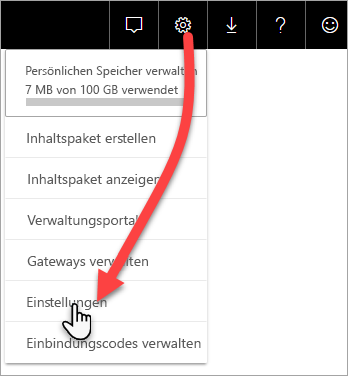
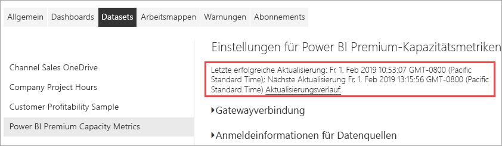

# Überwachen von Premium-Kapazitäten über die App

Die Überwachung Ihrer Kapazitäten ist entscheidend für das Treffen fundierter Entscheidungen zur optimalen Nutzung Ihrer Premium-Kapazitäten. Sie können die Kapazitäten im Verwaltungsportal oder mithilfe der App **Power BI Premium-Kapazitätsmetriken** überwachen. In diesem Artikel wird die Verwendung der Premium-Kapazitätsmetriken-App erläutert. Die App stellt ausführliche Informationen zur Leistung Ihrer Kapazitäten bereit. Einen allgemeineren Überblick durchschnittlicher Nutzungsmetriken der letzten sieben Tage finden Sie im Verwaltungsportal. Weitere Informationen zur Überwachung im Portal finden Sie unter [Monitor Premium capacities in the Admin portal (Überwachung von Premium-Kapazitäten im Verwaltungsportal)](service-admin-premium-monitor-portal.md).

Die App erhält regelmäßige Updates mit neuen Features und Funktionalitäten. Stellen Sie sicher, dass Sie die neueste Version verwenden.   
**Die neueste Version der App ist Version 1.10.1.2 (Stand: 22. Februar 2019)**.   
Wenn Sie bereits eine ältere Version installiert haben, löschen Sie sie aus Ihren Apps, und drücken Sie das STRG+F5 zum Aktualisieren. 

## Installieren der App

Sie können direkt zur [Premium-Kapazitätsmetriken-App](https://app.powerbi.com/groups/me/getapps/services/capacitymetrics) navigieren, oder Sie installieren sie wie jede andere App in Power BI.

1. Klicken Sie in Power BI auf **Apps**.   
    

2. Klicken Sie auf der rechten Seite auf **Apps abrufen**.
3. Suchen Sie in der Kategorie **Apps** nach der **Power BI Premium Capacity Metrics-App**.
4. Rufen Sie die App ab, um sie zu installieren.

Warten Sie einen Augenblick. Das Installieren und Aktualisieren der Metriken dauert einige Minuten. Wenn die App leere Metriken anzeigt, drücken Sie F5 zum Aktualisieren der Seite.

## Abrufen des Aktualisierungsverlaufs der App

Klicken Sie auf **Einstellungen** > **Datasets** > **Power BI Premium-Kapazitätsmetriken** > **Aktualisierungsverlauf**. 

Die letzte Aktualisierung wird angezeigt. Wenn Sie auf **Aktualisierungsverlauf** klicken, werden geplante und abrufbare Aktualisierungen angezeigt.

## Überwachen von Kapazitäten über die App

Nachdem Sie die App installiert haben, können Sie Metriken zu den Kapazitäten in Ihrer Organisation anzeigen. Die App stellt ein [Dashboard](#Dashboard) mit Metrikübersichten und detaillierten [Metrikberichten](#Reports) bereit.

### Dashboard

Um ein Dashboard mit einer Übersicht über die Schlüsselmetriken für Kapazitäten anzuzeigen, für die Sie als Administrator zuständig sind, klicken Sie im Bereich **Dashboards** auf **Power BI Premium-Kapazitätsmetriken**. Ein Dashboard wird angezeigt.

Das Dashboard umfasst die folgenden Metriken:

#### Oben

| Metrik | Beschreibung |
| --- | --- |
| Version | Die App-Version. | 
| Capacities | Die Anzahl der Kapazitäten, für die Sie als Administrator zuständig sind. | 
| Workspaces | Die Anzahl der Arbeitsbereiche in Ihren Kapazitäten, die Metriken melden.|
|||

#### System Summary

| Metrik | Beschreibung |
| --- | --- |
| Kapazität mit der höchsten CPU-Auslastung | Die Kapazität mit den häufigsten Fällen, in denen die CPU-Auslastung in den letzten sieben Tagen 80 % der Schwellenwerte überschritten hat. |
| Anzahl der Fälle mit der höchsten CPU-Auslastung | Die Anzahl der Fälle, in denen die benannte Kapazität in den letzten sieben Tagen 80 % der Schwellenwerte für die CPU-Auslastung überschritten hat. | 
| Kapazität mit maximaler Arbeitsspeicherauslastung | Die Kapazität mit den häufigsten Fällen, in denen in den letzten sieben Tagen der Maximalwert der Arbeitsspeicherauslastung erreicht wurde, unterteilt in Buckets von je drei Minuten.  |
| Anzahl der Fälle mit maximaler Arbeitsspeicherauslastung| Die Anzahl der Fälle, in denen die benannte Kapazität in den letzten sieben Tagen den Maximalwert der Arbeitsspeicherauslastung erreicht hat, unterteilt in Buckets von je drei Minuten. |
|||

#### Dataset Summary

| Metrik | Beschreibung |
| --- | --- |
| Datasets | Die Gesamtzahl der Datasets über alle Arbeitsbereiche in Ihren Kapazitäten.|
| Durchschnittsgröße von Datasets (MB) | Die durchschnittliche Größe von Datasets in allen Arbeitsbereichen in Ihren Kapazitäten.|  
| Anzahl von durchschnittlich geladenen Datasets | Die durchschnittliche Anzahl der im Arbeitsspeicher geladenen Datasets. |  
| Datasets – durchschnittlich aktive Datasets (%)| Die durchschnittliche Anzahl der aktiven Datasets in den letzten sieben Tagen. Ein Dataset gilt als aktiv, wenn ein Benutzer in den letzten drei Minuten mit dem Visual interagiert hat. |
| CPU – Maximalwert für Datasets (%)| Der maximale CPU-Verbrauch nach Datasetworkload in den letzten sieben Tagen. |
| CPU – Durchschnittswert für Datasets (%)| Der durchschnittliche CPU-Verbrauch nach Datasetworkload in den letzten sieben Tagen. |
| Arbeitsspeicher – Durchschnittswert für Datasets (GB) | Der durchschnittliche Arbeitsspeicherverbrauch nach Datasetworkload in den letzten sieben Tagen. |
| Arbeitsspeicher – Maximalwert für Datasets (GB) | Der maximale Arbeitsspeicherverbrauch nach Datasetworkload in den letzten sieben Tagen.|
| Entfernte Datasets | Die Gesamtanzahl der aufgrund einer hohen Speicherauslastung entfernten Datasets. |
| Anzahl von DirectQuery-/Liveverbindungen mit hoher Auslastung| Die Anzahl der Fälle, in denen DirectQuery-/Liveverbindungen innerhalb der letzten sieben Tage 80 % der Schwellenwerte überschritten haben, unterteilt in Buckets von je drei Minuten. |
| Anzahl von DirectQuery-/Liveverbindungen mit maximaler Auslastung| Die häufigste Fälle, in denen DirectQuery-/Liveverbindungen 80 % überschritten haben, unterteilt in Buckets von je einer Stunde. |
| DirectQuery-/Liveverbindungen mit maximaler Auslastung | Die maximale Anzahl der Fälle, in denen DirectQuery-/Liveverbindungen innerhalb der letzten sieben Tage 80 % der Schwellenwerte überschritten haben, unterteilt in Buckets von je drei Minuten.|
| Maximale Vorkommnisse von DirectQuery-/Liveverbindungen – lokale Uhrzeit | Die lokale Uhrzeit, zu der DirectQuery-/Liveverbindungen den Wert von 80 % am häufigsten innerhalb einer Stunde überschritten haben. |
| Aktualisierungen gesamt | Die Gesamtanzahl von Aktualisierungen in den letzten sieben Tagen. |
| Zuverlässigkeit der Aktualisierung (%) | Die Anzahl von erfolgreichen Aktualisierungen, geteilt durch die Gesamtanzahl von Aktualisierungen in den letzten sieben Tagen. |
| Durchschnittliche Dauer von Aktualisierungen (Minuten) | Der durchschnittliche Zeitraum für eine vollständige Aktualisierung. |
| Durchschnittliche Wartezeit bei Aktualisierungen (Minuten)| Der durchschnittliche Zeitraum vor dem Starten einer Aktualisierung. |
| Abfragen gesamt |  Die Gesamtanzahl der ausgeführten Abfragen in den letzten sieben Tagen. |
| Gesamtanzahl von Abfragen mit Wartezeit | Die Gesamtanzahl der Abfragen, die vor der Ausführung warten mussten. |
| Durchschnittliche Abfragedauer (ms) | Die durchschnittliche Dauer für die Ausführung von Abfragen. |
| Durchschnittliche Wartezeit für Abfragen (ms) | Die durchschnittliche Zeit, die Abfragen auf Systemressourcen warten, bevor sie ausgeführt werden. |
|||

#### Dataflow Summary

| Metrik | Beschreibung |
| --- | --- |
| Dataflows |  Die Gesamtzahl der Dataflows in allen Arbeitsbereichen in Ihren Kapazitäten.|
| Aktualisierungen gesamt | Die Gesamtanzahl von Aktualisierungen in den letzten sieben Tagen.|  
| Durchschnittliche Dauer von Aktualisierungen (Minuten) | Die Dauer für die Ausführung einer Aktualisierung. |
| Durchschnittliche Wartezeiten bei Aktualisierungen (Minuten) | Die Verzögerung zwischen der geplanten Zeit und dem tatsächlichen Start der Aktualisierung.|
| CPU – Maximalwert für Dataflows (%) | Der maximale CPU-Verbrauch nach Dataflowworkload in den letzten sieben Tagen. |
| CPU – Durchschnittswert für Dataflows (%) | Der durchschnittliche CPU-Verbrauch nach Dataflowworkload in den letzten sieben Tagen. |
| Arbeitsspeicher – Maximalwert für Dataflows (GB) | Der maximale Arbeitsspeicherverbrauch nach Dataflowworkload in den letzten sieben Tagen. |
| Arbeitsspeicher – Durchschnittswert für Dataflows (GB) | Der durchschnittliche Arbeitsspeicherverbrauch nach Dataflowworkload in den letzten sieben Tagen. |
|||

#### Paginated Report Summary

| Metrik | Beschreibung |
| --- | --- |
| Paginated Reports |  Die Gesamtanzahl der paginierten Berichte in allen Arbeitsbereichen in Ihren Kapazitäten. |
| Ansichten gesamt | Die Gesamtzahl der Fälle, in denen alle Berichte von Benutzern angezeigt wurden. | 
| Zeilen gesamt | Die Gesamtanzahl der Datenzeilen in allen Berichten.|
| Total Time | Die Gesamtzeit in Millisekunden für alle Phasen (Abrufen, Verarbeiten und Rendern von Daten) für alle Berichte. |
| CPU – Maximalwert für paginierte Berichte (%) | Der maximale CPU-Verbrauch nach Workload für paginierte Berichte in den letzten sieben Tagen. |
| CPU – Durchschnittswert für paginierte Berichte (%) | Der durchschnittliche CPU-Verbrauch nach Workload für paginierte Berichte in den letzten sieben Tagen. |
| Arbeitsspeicher – Maximalwert für paginierte Berichte (GB) | Der maximale Arbeitsspeicherverbrauch nach Workload für paginierte Berichte in den letzten sieben Tagen. |
| Arbeitsspeicher – Durchschnittswert für paginierte Berichte (GB) | Der durchschnittliche Arbeitsspeicherverbrauch nach Workload für paginierte Berichte in den letzten sieben Tagen. |
|||

### Berichte

Berichte bieten detaillierte Metriken. Um Berichte für die Kapazitäten anzuzeigen, für die Sie als Administrator zuständig sind, klicken Sie im Bereich **Berichte** auf **Power BI Premium-Kapazitätsmetriken**. Alternativ dazu können Sie auch im Dashboard auf eine Metrikzelle klicken, um zum zugrunde liegenden Bericht zu gelangen. 

Am unteren Rand des Berichts finden Sie fünf *Registerkarten*:

[**Datasets**](#datasets): Hier finden Sie ausführliche Metriken zur Integrität der Power BI-Datasets in Ihren Kapazitäten.   
[**Paginierte Berichte**](#paginated-reports): Hier finden Sie ausführliche Metriken zur Integrität der paginierten Berichte in Ihren Kapazitäten.   
[**Dataflows**](#dataflows): Hier finden Sie ausführliche Aktualisierungsmetriken für Dataflows in Ihren Kapazitäten.   
[**Ressourcenverbrauch**](#resource-consumption): Hier finden Sie detaillierte Ressourcenmetriken, einschließlich hoher Auslastung von Arbeitsspeicher und CPU.    
[**IDs und Info:**](#ids-and-info) Hier finden Sie die Namen, IDs und Besitzer von Kapazitäten, Arbeitsbereichen und Workloads.

Auf jeder Registerkarte wird eine neue Seite geöffnet, auf der Sie die Metriken nach Kapazität und Datumsbereich filtern können. Wenn keine Filter ausgewählt sind, zeigt der Bericht standardmäßig die Metriken der letzten Woche für alle Kapazitäten an, die Metriken melden. 

### Datasets

Die Seite „Datasets“ weist verschiedene *Bereiche* auf: **Aktualisierungen**, **Abfragedauer**, **Abfragewartezeiten** und **Datasets**. Verwenden Sie die Schaltflächen oben auf der Seite, um zu verschiedenen Bereichen zu navigieren.

#### Bereich „Refreshes“ (Aktualisierungen)

| Berichtsabschnitt | Metrics |
| --- | --- |
| Refreshes |  Gesamtanzahl: Die Gesamtanzahl aller Aktualisierungen für jedes Dataset.   Zuverlässigkeit: Der Prozentsatz von Aktualisierungen, die für jedes Dataset ausgeführt wurden.   Durchschnittliche Wartezeit: Die durchschnittliche Verzögerung zwischen der geplanten Zeit und dem Start einer Datasetaktualisierung in Minuten.   Maximale Wartezeit: Die maximale Wartezeit für das Dataset in Minuten.   Durchschnittliche Dauer: Die durchschnittliche Dauer der Aktualisierung des Datasets in Minuten.   Maximale Dauer: Die Dauer der Datasetaktualisierung mit der längsten Ausführungsdauer in Minuten. |
| Top-5-Datasets nach durchschnittlicher Dauer (Minuten) |  Die fünf Datasets mit der längsten durchschnittlichen Aktualisierungsdauer in Minuten. |
| Top-5-Datasets nach durchschnittlicher Wartezeit (Minuten) |  Die fünf Datasets mit der längsten durchschnittlichen Aktualisierungswartezeit in Minuten. |
| Stündliche Aktualisierungen und Arbeitsspeicherverbrauch (GB) |  Erfolgreiche Vorgänge, Fehler und Arbeitsspeicherverbrauch, unterteilt in Buckets von je einer Stunde, Angabe in Ortszeit. |
| Durchschnittliche stündliche Aktualisierungswartezeiten (Minuten) |  Die durchschnittliche Aktualisierungswartezeit, unterteilt in Buckets von je einer Stunde, Angabe in Ortszeit. Mehrere Spitzen mit langen Aktualisierungswartezeiten weisen auf eine hohe Auslastung der Kapazität hin. |
|  |  |

#### Bereich „Query Durations“ (Abfragedauer) 

| Berichtsabschnitt | Metrics |
| --- | --- |
| Abfragedauer |  Die Daten in diesem Bereich sind nach Datasets, Arbeitsbereich und in Buckets von je einer Stunde in den letzten sieben Tagen aufgeteilt.   Gesamt: Die Gesamtzahl der Abfragen, die für das Dataset ausgeführt werden.   Durschnitt: die durchschnittliche Abfragedauer für das Dataset in Millisekunden   Maximal: Die Dauer der Abfrage mit der längsten Ausführungsdauer im Dataset in Millisekunden.|
| Verteilung der Abfragedauer |  Das Histogramm der Abfragedauer ist nach der Dauer (in Millisekunden) in die folgenden Kategorien unterteilt: <= 30 ms, 30–100 ms, 100–300 ms, 300 ms bis 1 s, 1–3 s, 3–10 s, 10–30 s und > 30 s. Lange Ausführungsdauern und lange Wartezeiten sind ein Hinweis auf sich erschöpfende Kapazität. Es kann aber auch bedeuten, dass ein einzelnes Dataset Probleme verursacht und weitere Untersuchungen erforderlich sind. |
| Top-5-Datasets nach durchschnittlicher Dauer |  Die fünf Datasets mit der längsten durchschnittlichen Abfragedauer in Millisekunden. |
| Stündliche Verteilungen der Abfragedauer |  Abfrageanzahl und durchschnittliche Dauer (in Millisekunden) im Vergleich zum Arbeitsspeicherverbrauch in GB, unterteilt in Buckets von je einer Stunde, Angabe in Ortszeit. |
| DirectQuery-/Liveverbindungen (> 80 % Auslastung) |  Die Häufigkeit, mit der eine DirectQuery-Verbindung oder Liveverbindung eine CPU-Auslastung von 80 % überschritten hat, unterteilt in Buckets von je einer Stunde, Angabe in Ortszeit. |
|  |  |

#### Bereich „Query Waits“ (Abfragewartezeit)

| Berichtsabschnitt | Metrics |
| --- | --- |
| Abfragewartezeiten |  Die Daten in diesem Bereich sind nach Datasets, Arbeitsbereich und in Buckets von je einer Stunde in den letzten sieben Tagen aufgeteilt.   Gesamt: Die Gesamtzahl der Abfragen, die für das Dataset ausgeführt werden.   Anzahl der Wartevorgänge: Die Anzahl von Abfragen im Dataset, die vor der Ausführung auf Systemressourcen gewartet haben.   Durschnitt: Die durchschnittliche Abfragewartezeit für das Dataset in Millisekunden.   Maximal: Die Dauer der Abfrage mit der längsten Wartezeit für das Dataset in Millisekunden.|
| Top-5-Datasets nach durchschnittlicher Wartezeit |  Die fünf Datasets mit der längsten durchschnittlichen Wartezeit bis zum Start der Ausführung einer Abfrage in Millisekunden. |
| Wartezeitverteilungen |  Das Histogramm der Abfragedauer ist nach der Dauer (in Millisekunden) in die folgenden Intervallkategorien unterteilt: <= 50 ms, 50–100 ms, 100–200 ms, 200–400 ms, 400 ms bis 1 s, 1–5 s und > 5 s. |
| Stündliche Wartezeitverteilungen für Abfragen |  Anzahl von Wartevorgängen und durchschnittliche Wartezeit für Abfragen (in Millisekunden) im Vergleich zum Arbeitsspeicherverbrauch in GB, unterteilt in Buckets von je einer Stunde, Angabe in Ortszeit. |
|  |  |

#### Bereich „Datasets“

| **Berichtsabschnitt** | **Metriken** |
| --- | --- |
| Datasetgrößen  |  Maximale Größe: Die maximale Größe des Datasets in MB für den angezeigten Zeitraum. |
| Anzahl von entfernten Datasets |  Gesamt: Gesamtzahl der *entfernten* Datasets für jede Kapazität. Wenn eine Kapazität Arbeitsspeicherauslastung unterliegt, entfernt der Knoten mindestens ein Dataset aus dem Arbeitsspeicher. Datasets, die inaktiv sind (ohne derzeit ausgeführten Abfrage- oder Aktualisierungsvorgang), werden zuerst entfernt. Anschließend orientiert sich die Entfernungsreihenfolge an den „am seltensten verwendeten“ Datasets.|
| Anzahl von stündlich geladenen Datasets |  Die Anzahl der in den Arbeitsspeicher geladenen Datasets im Vergleich zum Arbeitsspeicherverbrauch in GB, unterteilt in Buckets von je einer Stunde, Angabe in Ortszeit. |
| Entfernte Datasets und Arbeitsspeicherverbrauch pro Stunde |  Entfernte Datasets im Vergleich zum Arbeitsspeicherverbrauch in GB, unterteilt in Buckets von je einer Stunde, Angabe in Ortszeit. |
| Prozentsätze des verbrauchten Arbeitsspeichers |  Gesamtanzahl der aktiven Datasets im Arbeitsspeicher, angegeben als Prozentsatz des gesamten Arbeitsspeichers. Das Delta zwischen den aktiven und allen definierten Datasets, die entfernt werden können. Angabe in Stunden für die letzten sieben Tage. |
|  |  |

### Paginated Reports

| **Berichtsabschnitt** | **Metriken** |
| --- | --- |
| Verwendung gesamt |  Aufrufe gesamt: Die Häufigkeit der Aufrufe des Berichts durch Benutzer.   Zeilenanzahl: Die Anzahl von Datenzeilen im Bericht.   Abrufe (durchschn.): die durchschnittlich benötigte Zeit in Millisekunden zum Abrufen von Daten für den Bericht. Eine lange Dauer kann auf langsame Abfragen oder andere Probleme mit der Datenquelle hinweisen.    Verarbeitung (durchschn.): Die durchschnittlich benötigte Zeit zum Verarbeiten von Daten für einen Bericht in Millisekunden.  Rendering (durchschn.): Die durchschnittlich benötigte Zeit zum Rendern eines Berichts im Browser in Millisekunden.   Gesamtzeit: Die für alle Phasen des Berichts benötigte Zeit in Millisekunden. |
| Top-5-Berichte nach durchschnittlicher Datenabrufzeit |  Die fünf Berichte mit der längsten durchschnittlichen Datenabrufzeit in Millisekunden. |
| Top-5-Berichte nach durchschnittlicher Berichtverarbeitungsdauer |  Die fünf Berichte mit der längsten durchschnittlichen Berichtverarbeitungsdauer in Millisekunden. |
| Stündliche Ergebnisse |  Erfolgreiche Vorgänge, Fehler und Arbeitsspeicherverbrauch, unterteilt in Buckets von je einer Stunde, Angabe in Ortszeit. |
| Stündliche Dauer |  Die Dauer des Datenabrufs im Vergleich zur Verarbeitungs- und Renderingdauer, unterteilt in Buckets von je einer Stunde, Angabe in Ortszeit. |
|  |  |

### Dataflows

| **Berichtsabschnitt** | **Metriken** |
| --- | --- |
| Refreshes |  Gesamt: Die Gesamtanzahl aller Aktualisierungen für jeden Dataflow.   Zuverlässigkeit: Der Prozentsatz der Aktualisierungen, die für jeden Dataflow ausgeführt wurden.   Durchschnittliche Wartezeit: Die durchschnittliche Verzögerung zwischen der geplanten Zeit und dem Start einer Dataflowaktualisierung in Minuten.   Maximale Wartezeit: Die maximale Wartezeit für den Dataflow in Minuten.   Durchschnittliche Dauer: Die durchschnittliche Dauer für die Aktualisierung des Dataflows in Minuten.   Maximale Dauer: Die Dauer der Dataflowaktualisierung mit der längsten Ausführungsdauer in Minuten. |
| Top-5-Dataflows nach durchschnittlicher Aktualisierungsdauer |  Die fünf Dataflows mit der längsten durchschnittlichen Aktualisierungsdauer in Minuten. |
| Top-5-Dataflows nach durchschnittlicher Wartezeit |  Die fünf Dataflows mit der längsten durchschnittlichen Aktualisierungswartezeit in Minuten. |
| Durchschnittliche stündliche Aktualisierungswartezeiten |  Die durchschnittliche Aktualisierungswartezeit, unterteilt in Buckets von je einer Stunde, Angabe in Ortszeit. Mehrere Spitzen mit langen Aktualisierungswartezeiten weisen auf eine hohe Auslastung der Kapazität hin. |
| Stündliche Aktualisierungen und Arbeitsspeicherverbrauch |  Erfolgreiche Vorgänge, Fehler und Arbeitsspeicherverbrauch, unterteilt in Buckets von je einer Stunde, Angabe in Ortszeit. |
|  |  |

### Ressourcenverbrauch

| **Berichtsabschnitt** | **Metriken** |
| --- | --- |
| CPU-Verbrauch |  Auslastung nach Arbeitsauslastung als Prozentsatz der gesamten CPU-Kapazität. Angabe in Stunden für die letzten sieben Tage. |
| Arbeitsspeicherverbrauch |  Arbeitsspeicherverbrauch in GB nach Arbeitsauslastung (durchgezogene Linien) im Vergleich zu Arbeitsauslastungsgrenzen (gepunktete Linie). Angabe in Stunden für die letzten sieben Tage. |
|  |  |

### IDs und Info

Die Registerkarte **IDs und Info** enthält die Bereiche **Kapazitäten**, **Arbeitsbereiche**, **Datasets**, **Paginierte Berichte** und **Dataflows**.

#### Bereich „Kapazitäten“

| Berichtsabschnitt | Metrics |
| --- | --- |
| SKU- und Workloadinformationen | Die SKU- und Workloadeinstellungen für die Kapazität. |
| Administratoren | Die Namen der Administratoren für die Kapazität. |
|||

#### Bereich „Arbeitsbereiche“

| Berichtsabschnitt | Metrics |
| --- | --- |
| Workspaces | Die Namen und IDs für alle Arbeitsbereiche. |
|||

#### Bereich „Datasets“

| Berichtsabschnitt | Metrics |
| --- | --- |
| Datasets | Die Arbeitsbereichsnamen und IDs für alle Datasets. |
|||

#### Bereich „Paginierte Berichte“

| Berichtsabschnitt | Metrics |
| --- | --- |
| Paginated Reports | Die Namen, Arbeitsbereichsnamen und IDs für alle paginierten Berichte. |
|||

#### Bereich „Dataflows“

| Berichtsabschnitt | Metrics |
| --- | --- |
| Dataflows | Die Dataflownamen, Arbeitsbereichsnamen und IDs für alle Dataflows. |
|||

## Überwachen einer Power BI Embedded-Kapazität

Sie können die Power BI Premium-Kapazitätsmetriken-App zum Überwachen von Kapazitäten mit *A-SKU* in Power BI Embedded verwenden. Diese Kapazitäten werden im Bericht angezeigt, sofern Sie ein Administrator der Kapazität sind. Die Aktualisierung des Berichts ist jedoch nur erfolgreich, wenn Sie Power BI bestimmte Berechtigungen für Ihre A-SKUs erteilen:

1. Öffnen Sie Ihre Kapazität im Azure-Portal.

1. Klicken Sie auf **Zugriffssteuerung (IAM)**, und fügen Sie die App **Power BI Premium** zur Rolle „Leser“ hinzu. Wenn Sie den Namen der App nicht finden, können Sie sie auch per Client-ID hinzufügen: `cb4dc29f-0bf4-402a-8b30-7511498ed654`.

    

> [!NOTE]
> Sie können die Nutzung der Power BI Embedded-Kapazität in der App oder im Azure-Portal überwachen, nicht jedoch im Power BI-Verwaltungsportal.

## Nächste Schritte

> [!div class="nextstepaction"]
> [Verwaltung und Optimierung der Power BI Premium-Kapazitätsressource](service-premium-understand-how-it-works.md)
