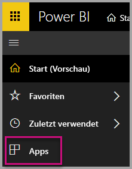
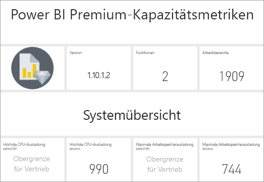
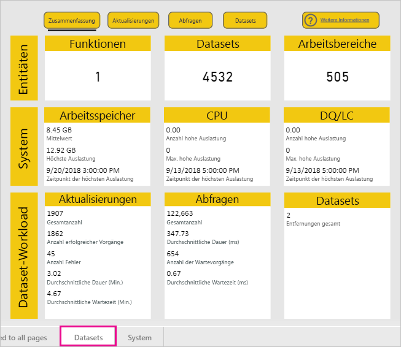
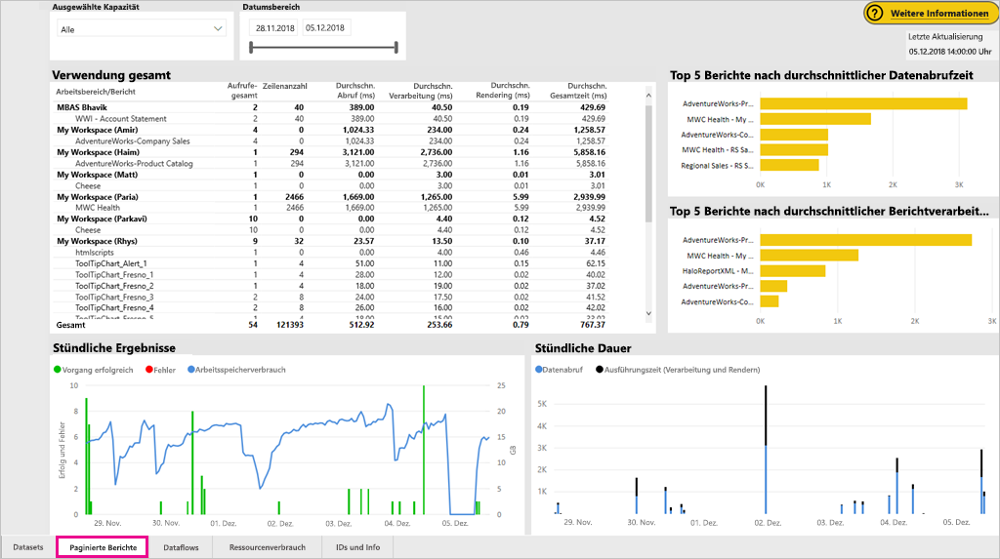
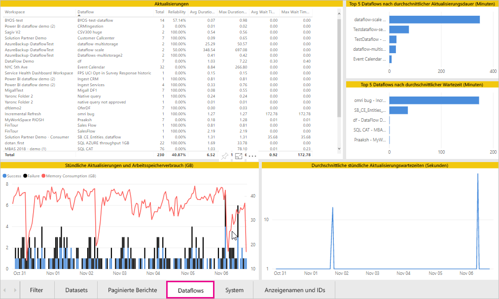
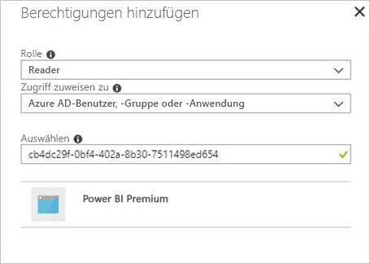
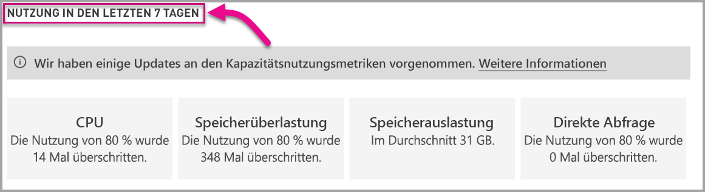

# Überwachen von Kapazitäten in Power BI Premium und Power BI Embedded

Dieser Artikel bietet einen Überblick über die Überwachung der Metriken für Ihre Power BI Premium-Kapazitäten. Die Überwachung der Kapazitätsauslastung bietet Ihnen einen fundierten Ansatz für die Verwaltung Ihrer Kapazitäten.

Sie können die Kapazität mithilfe der Power BI Premium Capacity Metrics-App oder dem Verwaltungsportal überwachen. Wir empfehlen die Verwendung der App, weil diese sehr viel umfangreichere Informationen bietet, aber dieser Artikel deckt beide Optionen ab. **Die aktuelle App-Version ist 1.8 (veröffentlicht am 7. November 2018).**

<iframe width="560" height="315" src="https://www.youtube.com/embed/UgsjMbhi_Bk?rel=0&amp;showinfo=0" frameborder="0" allowfullscreen></iframe>

## Installieren der Premium Capacity Metrics-App

Sie können direkt zur [Premium Capacity Metrics-App](https://app.powerbi.com/groups/me/getapps/services/capacitymetrics) wechseln oder diese wie andere Apps in Power BI installieren.

1. Klicken Sie in Power BI auf **Apps**.

    

1. Klicken Sie auf der rechten Seite auf **Apps abrufen**.

1. Suchen Sie in der Kategorie **Apps** nach der **Power BI Premium Capacity Metrics-App**.

1. Rufen Sie die App ab, um sie zu installieren.

Nachdem Sie die App installiert haben, können Sie Metriken zu den Kapazitäten in Ihrer Organisation anzeigen. Sehen wir uns einige der wichtigsten Metriken an, die zur Verfügung gestellt werden.

## Verwenden der Metriken-App

Wenn Sie die App öffnen, wird zunächst ein Dashboard mit einer Zusammenfassung aller Kapazitäten angezeigt, für die Sie über Administratorrechte verfügen.

Klicken Sie auf das Dashboard, um zum zugrunde liegenden Bericht zu gelangen. Der Bericht weist sechs Registerkarten auf, die in den folgenden Abschnitten ausführlicher beschrieben werden.

* **Filter**: Hier können Sie die anderen Seiten im Bericht nach einer bestimmten Kapazität filtern.

* **Datasets**: Hier finden Sie ausführliche Metriken zur Integrität der Power BI-Datasets in Ihren Kapazitäten.

* **Paginierte Berichte**: Hier finden Sie ausführliche Metriken zur Integrität der paginierten Berichte in Ihren Kapazitäten.

* **Dataflows**: Hier finden Sie ausführliche Aktualisierungsmetriken für Dataflows in Ihren Kapazitäten.

* **System**: Hier finden Sie die Metriken zur Gesamtkapazität, einschließlich Arbeitsspeicher und hoher CPU-Auslastung.

* **Anzeigenamen und IDs**: Hier finden Sie die Namen, IDs und Besitzer von Kapazitäten, Arbeitsbereichen und Workloads.

### Registerkarte „Filter“

Auf der Registerkarte **Filter** können Sie eine Kapazität, einen Datumsbereich und andere Optionen auswählen. Filter werden dann auf alle relevanten Seiten und Kacheln im Bericht angewendet. Wenn keine Filter ausgewählt sind, zeigt der Bericht standardmäßig die Metriken der letzten Woche für alle Kapazitäten an, die Sie besitzen.

* **(A)** Wählen Sie **Datasets**, **Paginierte Berichte** oder **Dataflows** aus, um Filter für die jeweilige Workload festzulegen.

* **(B)** Der Name und **(C)** die Informationen werden basierend auf Ihrer Auswahl unter **(A)** aktualisiert, sodass Sie Workloads nach Namen filtern können. Im obigen Bild wird beispielsweise **Dataflows** ausgewählt und **Dataflowname** sowie **Dataflowinformationen** angezeigt.

* **(D)** Kapazitätsinformationen zeigen an, ob Datasets, paginierte Berichte oder Dataflows für eine Kapazität aktiviert sind.

### Registerkarte „Datasets“

Verwenden Sie die Schaltflächen oben in der Registerkarte **Datasets**, um zu unterschiedlichen Bereichen zu navigieren: **Zusammenfassung**, **Aktualisierungen**, **Abfragedauer**, **Abfragewartezeit** und **Datasets**.

#### Bereich „Summary“ (Zusammenfassung)

Der Bereich **Summary** (Zusammenfassung) zeigt eine Ansicht Ihrer Kapazitäten auf der Grundlage von Entitäten, Systemressourcen und Dataset-Workloads. Er zeigt die folgenden Metriken.

| **Berichtsabschnitt** | **Metriken** |
| --- | --- |
| **Entities** (Entitäten) | * Die Anzahl von Kapazitäten, die Sie besitzen  * Die Anzahl von Datasets in Ihrer Kapazität  * Die Anzahl von Arbeitsbereichen in Ihrer Kapazität |
| **System** | * Die durchschnittliche Arbeitsspeicherverwendung in GB in den letzten 7 Tagen  * Der höchste Arbeitsspeicherverbrauch in GB in den letzten 7 Tagen, mit Angabe der Uhrzeit des Auftretens  * Die Anzahl von Vorkommen, bei denen die CPU-Auslastung in den letzten 7 Tagen 80% des Schwellenwerts überschritten hat, unterteilt in 3-Minuten-Abschnitte  * Häufigste Zeiten, zu denen die CPU-Auslastung in den letzten 7 Tagen 80% überschritten hat, unterteilt in 1-Stunden-Abschnitte und mit Angabe der Uhrzeit des Auftretens  * Die Anzahl von Vorkommen, bei denen direkte Abfragen/Liveverbindungen in den letzten 7 Tagen 80% des Schwellenwerts überschritten haben, unterteilt in 3-Minuten-Abschnitte  * Häufigste Zeiten, zu denen direkte Abfragen/Liveverbindungen 80% überschritten haben, unterteilt in 1-Stunden-Abschnitte und mit Angabe der Uhrzeit des Auftretens |
| **Dataset Workloads** (Datasetworkloads) | * Gesamtanzahl der Aktualisierungen in den letzten 7 Tagen  * Gesamtanzahl der erfolgreichen Aktualisierungen in den letzten 7 Tagen  * Gesamtanzahl der fehlerhaften Aktualisierungen in den letzten 7 Tagen  * Gesamtanzahl der fehlerhaften Aktualisierungen aufgrund von Arbeitsspeichermangel  * Die durchschnittliche Aktualisierungsdauer ist die Zeit bis zum Abschluss des Vorgangs in Minuten  * Die durchschnittliche Wartezeit für Aktualisierungen ist die durchschnittliche Verzögerung zwischen geplanter Zeit und Start des Vorgangs in Minuten  * Gesamtanzahl der ausgeführten Abfragen in den letzten 7 Tagen  * Gesamtanzahl der erfolgreichen Abfragen in den letzten 7 Tagen  * Gesamtanzahl der fehlerhaften Abfragen in den letzten 7 Tagen  * Die durchschnittliche Abfragedauer ist die Zeit bis zum Abschluss des Vorgangs in Minuten  * Gesamtanzahl der entfernten Modelle aufgrund von Speicherauslastung |
|  |  |

#### Bereich „Refreshes“ (Aktualisierungen)

Der Bereich **Aktualisierungen** enthält die folgenden Metriken.

| **Berichtsabschnitt** | **Metriken** |
| --- | --- |
| **Zuverlässigkeit der Aktualisierung** | * Gesamtanzahl: Alle Aktualisierungen für jedes Dataset  * Zuverlässigkeit: Prozentsatz der Aktualisierungen, die für jedes Dataset ausgeführt wurden  * Durchschnittliche Wartezeit: Durchschnittliche Verzögerung zwischen geplanter Zeit und Start der Datasetaktualisierung in Minuten  * Maximale Wartezeit: Maximale Wartezeit für das Dataset in Minuten   * Durchschnittliche Dauer: Durchschnittliche Dauer von Datasetaktualisierungen in Minuten  * Maximale Dauer: Dauer der längsten Datasetaktualisierung in Minuten |
| **Top 5 Datasets nach durchschnittlicher Aktualisierungsdauer** | * Die fünf Datasets mit der längsten durchschnittlichen Aktualisierungsdauer in Minuten |
| **Top 5 Datasets nach durchschnittlicher Wartezeit** | * Die fünf Datasets mit der längsten durchschnittlichen Aktualisierungswartezeit in Minuten |
| **Durchschnittliche stündliche Aktualisierungswartezeiten** | * Die durchschnittliche Aktualisierungswartezeit, unterteilt in Stunden, Angabe in Ortszeit. Mehrere Spitzen mit langen Aktualisierungswartezeiten weisen auf eine hohe Auslastung der Kapazität hin. |
| **Stündliche Aktualisierungen und Arbeitsspeicherverbrauch** | * Erfolgreiche Vorgänge, Fehler und Arbeitsspeicherverbrauch, unterteilt in Stunden, Angabe in Ortszeit |
|  |  |

#### Bereich „Query Durations“ (Abfragedauer) 

Der Bereich **Abfragedauer** enthält die folgenden Metriken.

| **Berichtsabschnitt** | **Metriken** |
| --- | --- |
| **Abfragedauer** | * Daten in diesem Bereich sind nach Datasets, Arbeitsbereich und Stunden für die letzten sieben Tage unterteilt  * Gesamt: Gesamtzahl der Abfragen, die für das Dataset ausgeführt werden  * Durchschnitt: Durchschnittliche Abfragedauer für das Dataset in Millisekunden  * Max.: Längste Abfragedauer für das Dataset in Millisekunden|
| **Verteilung der Abfragedauer** | * Das Histogramm der Abfragedauer ist nach der Dauer (in Millisekunden) in die folgenden Kategorien unterteilt: <= 30 ms, 30–100 ms, 100–300 ms, 300 ms bis 1 s, 1–3 s, 3–10 s, 10–30 s und > 30 s. Lange Ausführungsdauern und lange Wartezeiten sind ein Hinweis auf sich erschöpfende Kapazität. Es kann aber auch bedeuten, dass ein einzelnes Dataset Probleme verursacht und weitere Untersuchungen erforderlich sind. |
| **Top 5 Datasets nach durchschnittlicher Dauer** | * Die fünf Datasets mit der längsten durchschnittlichen Abfragedauer in Millisekunden |
| **Direkte Abfrage/Liveverbindungen (> 80 % Auslastung)** | * Häufigkeit einer CPU-Auslastung von über 80 % durch eine direkte Abfrage oder Liveverbindung, unterteilt in Stunden, Angabe in Ortszeit |
| **Verteilung der stündlichen Abfragedauer** | * Abfrageanzahl und durchschnittliche Dauer (in Millisekunden) im Vergleich zum Arbeitsspeicherverbrauch in GB, unterteilt in Stunden, Angabe in Ortszeit |
|  |  |

#### Bereich „Query Waits“ (Abfragewartezeit)

Der Bereich **Abfragewartezeit** enthält die folgenden Metriken.

| **Berichtsabschnitt** | **Metriken** |
| --- | --- |
| **Abfragewartezeiten** | * Daten in diesem Bereich sind nach Datasets, Arbeitsbereich und Stunden für die letzten sieben Tage unterteilt  * Gesamt: Gesamtzahl der Abfragen, die für das Dataset ausgeführt werden  * Anzahl von Wartevorgängen: Anzahl von Abfragen im Dataset, die vor der Ausführung auf Systemressourcen gewartet haben   * Durchschnitt: Durchschnittliche Abfragewartzeit für das Dataset in Millisekunden  * Max.: Längste Abfragewartezeit für das Dataset in Millisekunden|
| **Verteilung der Wartezeit** | * Das Histogramm der Abfragedauer ist nach der Dauer (in Millisekunden) in die folgenden Kategorien unterteilt: <= 50 ms, 50–100 ms, 100–200 ms, 200–400 ms, 400 ms bis 1 s, 1–5 s und > 5 s |
| **Top 5 Datasets nach durchschnittlicher Wartezeit** | * Die fünf Datasets mit der längsten durchschnittlichen Wartezeit bis zum Start der Ausführung einer Abfrage in Millisekunden |
| **Stündliche Abfragewartevorgänge und -zeiten** | * Anzahl von Abfragewartevorgängen und durchschnittliche Wartezeit (in Millisekunden) im Vergleich zum Arbeitsspeicherverbrauch in GB, unterteilt in Stunden, Angabe in Ortszeit |
|  |  |

#### Bereich „Datasets“

Der Bereich **Datasets** enthält die folgenden Metriken.

| **Berichtsabschnitt** | **Metriken** |
| --- | --- |
| **Anzahl von entfernten Datasets** | * Gesamt: Gesamtzahl von *entfernten* Datasets für jede Kapazität. Wenn eine Kapazität Arbeitsspeicherauslastung unterliegt, entfernt der Knoten mindestens ein Dataset aus dem Arbeitsspeicher. Datasets, die inaktiv sind (ohne derzeit ausgeführten Abfrage- oder Aktualisierungsvorgang), werden zuerst entfernt. Anschließend orientiert sich die Entfernungsreihenfolge an den „am seltensten verwendeten“ Datasets.|
| **Stündlich entfernte Datasets und Arbeitsspeicherverbrauch** | * Entfernte Datasets im Vergleich zum Arbeitsspeicherverbrauch in GB, unterteilt in Stunden, Angabe in Ortszeit |
|  |  |

### Registerkarte „Paginierte Berichte“

Die Registerkarte **Paginierte Berichte** zeigt ausführliche Metriken zur Integrität der paginierten Berichte in Ihren Kapazitäten an.

Die Registerkarte **Paginierte Berichte** enthält die folgenden Metriken.

| **Berichtsabschnitt** | **Metriken** |
| --- | --- |
| **Verwendung gesamt** | * Ansichten gesamt: Häufigkeit der Berichtaufrufe durch Benutzer  * Zeilenanzahl: Anzahl von Datenzeilen im Bericht  * Abrufe (durchschn.): Durchschnittlich benötigte Zeit zum Abrufen von Daten für den Bericht (in Millisekunden). Eine lange Dauer kann auf langsame Abfragen oder andere Probleme mit der Datenquelle hinweisen.   * Verarbeitung (durchschn.): Durchschnittlich benötigte Zeit zum Verarbeiten von Daten für einen Bericht in Millisekunden * Rendering (durchschn.): Durchschnittlich benötigte Zeit zum Rendern eines Berichts im Browser in Millisekunden  * Gesamtzeit: Von allen Phasen des Berichts benötigte Zeit in Millisekunden|
| **Top 5 Berichte nach durchschnittlicher Datenabrufzeit** | * Die fünf Berichte mit der längsten durchschnittlichen Datenabrufzeit in Millisekunden |
| **Top 5 Berichte nach durchschnittlicher Berichtverarbeitungsdauer** | * Die fünf Berichte mit der längsten durchschnittlichen Berichtverarbeitungsdauer in Millisekunden |
| **Stündliche Dauer** | * Datenabruf im Vergleich zur Verarbeitungs- und Renderingdauer, unterteilt in Stunden, Angabe in Ortszeit |
| **Stündliche Ergebnisse** | * Erfolgreiche Vorgänge, Fehler und Arbeitsspeicherverbrauch, unterteilt in Stunden, Angabe in Ortszeit |
|  |  |

### Registerkarte „Dataflows“

Die Registerkarte **Dataflows** zeigt ausführliche Aktualisierungsmetriken für Dataflows in Ihren Kapazitäten.

Die Registerkarte **Dataflows** enthält die folgenden Metriken.

| **Berichtsabschnitt** | **Metriken** |
| --- | --- |
| **Aktualisierung** | * Gesamt: Alle Aktualisierungen für jeden Dataflow  * Zuverlässigkeit: Prozentsatz der Aktualisierungen, die für jeden Dataflow ausgeführt wurden  * Durchschnittliche Wartezeit: Durchschnittliche Verzögerung zwischen geplanter Zeit und Start der Dataflowaktualisierung in Minuten  * Maximale Wartezeit: Maximale Wartezeit für den Dataflow in Minuten   * Durchschnittliche Dauer: Durchschnittliche Dauer von Dataflowaktualisierungen in Minuten  * Maximale Dauer: Dauer der längsten Dataflowaktualisierung in Minuten |
| **Top 5 Dataflows nach durchschnittlicher Aktualisierungsdauer** | * Die fünf Dataflows mit der längsten durchschnittlichen Aktualisierungsdauer in Minuten |
| **Top 5 Dataflows nach durchschnittlicher Wartezeit** | * Die fünf Dataflows mit der längsten durchschnittlichen Aktualisierungswartezeit in Minuten |
| **Durchschnittliche stündliche Aktualisierungswartezeiten** | * Die durchschnittliche Aktualisierungswartezeit, unterteilt in Stunden, Angabe in Ortszeit. Mehrere Spitzen mit langen Aktualisierungswartezeiten weisen auf eine hohe Auslastung der Kapazität hin. |
| **Stündliche Aktualisierungen und Arbeitsspeicherverbrauch** | * Erfolgreiche Vorgänge, Fehler und Arbeitsspeicherverbrauch, unterteilt in Stunden, Angabe in Ortszeit |
|  |  |

### Registerkarte „System“

Die Registerkarte **System** zeigt die CPU-Auslastung und den Arbeitsspeicherverbrauch für alle Kapazitäten und Workloads.

Die Registerkarte **System** enthält die folgenden Metriken.

| **Berichtsabschnitt** | **Metriken** |
| --- | --- |
| **CPU-Metriken (> 80 % Auslastung)** | * Die Anzahl von Vorkommen, bei denen die CPU-Auslastung in den letzten 7 Tagen 80% des Schwellenwerts überschritten hat, unterteilt in 3-Minuten-Abschnitte |
| **Arbeitsspeicherverbrauch** | * Arbeitsspeicherverbrauch der letzten sieben Tage, unterteilt in 3-Minuten-Bereiche |
|  |  |

### Registerkarte „Anzeigenamen und IDs“

Die Registerkarte **Anzeigenamen und IDs** zeigt die Namen, IDs und Besitzer von Kapazitäten, Arbeitsbereichen und Workloads.

## Überwachen einer Power BI Embedded-Kapazität

Sie können die Power BI Premium Capacity Metrics-App auch zum Überwachen von Kapazitäten mit *A-SKU* in Power BI Embedded verwenden. Diese Kapazitäten werden im Bericht angezeigt, sofern Sie ein Administrator der Kapazität sind. Die Aktualisierung des Berichts ist jedoch nur erfolgreich, wenn Sie Power BI bestimmte Berechtigungen für Ihre A-SKUs erteilen:

1. Öffnen Sie Ihre Kapazität im Azure-Portal.

1. Klicken Sie auf **Zugriffssteuerung (IAM)**, und fügen Sie die App „Power BI Premium“ zur Rolle „Leser“ hinzu. Wenn Sie den Namen der App nicht finden, können Sie sie auch per Client-ID hinzufügen: cb4dc29f-0bf4-402a-8b30-7511498ed654.

    

> [!NOTE]
> Sie können die Nutzung der Power BI Embedded-Kapazität in der App oder im Azure-Portal überwachen, nicht jedoch im Power BI-Verwaltungsportal.

## Grundlegende Überwachung im Verwaltungsportal

Der Bereich **Kapazitätseinstellungen** im Verwaltungsportal bietet Messanzeigen in Bezug auf die Lasten und die von Ihrer Kapazität verwendeten Ressourcen für die letzten 7 Tage. Diese vier Kacheln arbeiten mit einem Zeitfenster von 1 Stunde. Sie zeigen an, wie viele Stunden die zugehörige Metrik in den vergangenen 7 Tagen 80% überschritten hat. Diese Metrik weist auf eine potenzielle Beeinträchtigung für den Endbenutzer hin.

| **Metrik** | **Beschreibung** |
| --- | --- |
| CPU |Häufigkeit, mit der die CPU eine Auslastung von 80 % überschritten hat. |
| Speicherüberlastung |Zeigt die Speicherauslastung Ihrer Back-End-Kerne. Dies ist insbesondere eine Metrik dazu, wie oft Datasets aufgrund hoher Speicherauslastung bei Verwenden mehrerer Datasets aus dem Arbeitsspeicher entfernt werden. |
| Memory Usage |Durchschnittliche Arbeitsspeicherauslastung in Gigabytes (GB). |
| DQ/s | Häufigkeit, mit der die Anzahl von „Direkte Abfrage“- und Liveverbindungen 80 % des Grenzwerts überschritten hat.   * Die Gesamtzahl von DirectQuery-Abfragen und Liveverbindungen pro Sekunde ist eingeschränkt.* Limits: 30/s für P1, 60/s für P2 und 120/s für P3. * Die Anzahl von Abfragen des Typs „Direkte Abfrage“ und „Liveverbindung“ werden zur Drosselung hinzu gerechnet. Wenn Sie z.B. 15 direkte Abfragen und 15 Liveverbindungen in einer Sekunde haben, ist die Begrenzung erreicht. * Dies gilt sowohl für lokale als auch Cloudverbindungen. |
|  |  |

Metriken spiegeln die Auslastung in der letzten Woche wider.  Wenn Sie eine detailliertere Ansicht der Metriken wünschen, können Sie dies tun, indem Sie auf eine der Zusammenfassungskacheln klicken.  Sie gelangen zu detaillierten Diagrammen für jede der Metriken für Ihre Premium-Kapazität. Das folgende Diagramm zeigt Details zur CPU-Metrik.

Diese Diagramme sind für die letzte Woche stündlich zusammengefasst und können Ihnen helfen zu ermitteln, wann bestimmte leistungsbezogene Ereignisse in Ihrer Premium-Kapazität aufgetreten sind.

Sie können auch die für jede der Metriken zugrunde liegenden Daten in eine CSV-Datei exportieren.  Dieser Export liefert Ihnen im Drei-Minuten-Takt detaillierte Informationen für jeden Tag der vergangenen Woche.

## Nächste Schritte

Nachdem Sie die Überwachung von Power BI Premium-Kapazitäten kennengelernt haben, können Sie sich über das Optimieren von Kapazitäten informieren.

> [!div class="nextstepaction"]
> [Verwaltung und Optimierung der Power BI Premium-Kapazitätsressource](service-premium-understand-how-it-works.md)
