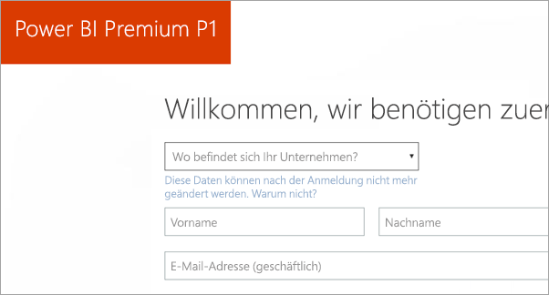
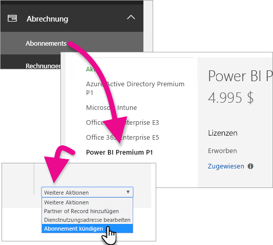
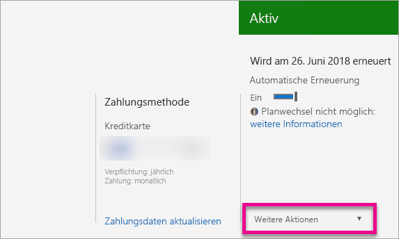

# Erwerben von Power BI Premium
Erfahren Sie, wie Sie Power BI-Premium-Kapazität für Ihre Organisation erwerben.

<iframe width="640" height="360" src="https://www.youtube.com/embed/NkvYs5Qp4iA?rel=0&amp;showinfo=0" frameborder="0" allowfullscreen></iframe>

Sie können einen Knoten mit Power BI Premium-Kapazität im Office 365 Admin Center erwerben. Darüber hinaus können Sie innerhalb Ihrer Organisation beliebige Kombinationen von Premium-Kapazitäts-SKUs (P1 bis P3) verwenden. Sie stellen unterschiedliche Ressourcenfunktionen bereit.

Weitere Informationen dazu, worum es sich bei Power BI Premium handelt, finden Sie unter [Power BI Premium – Beschreibung](service-premium.md). Informationen zu den aktuellen Preisen für Power BI finden Sie auf der Seite [Power BI – Preise](https://powerbi.microsoft.com/pricing/). Darüber hinaus können Sie Ihre Kosten für Power BI Premium mithilfe des [Power BI Premium-Rechners](https://powerbi.microsoft.com/calculator/) planen.

> [!IMPORTANT]
> Inhaltsautoren benötigen weiterhin eine Power BI Pro-Lizenz, auch wenn Sie Power BI Premium erwerben.
> 
> 

## Erstellen eines neuen Mandanten mit Power BI Premium P1
Wenn Sie noch nicht über einen Mandanten verfügen und einen erstellen möchten, können Sie gleichzeitig Power BI Premium erwerben. Der folgende Link führt Sie durch die Schritte zum Erstellen eines neuen Mandanten für die Verwendung mit Office 365 und ermöglicht es Ihnen, Power BI Premium zu erwerben. Nach dem Erstellen des Mandanten müssen Sie eine Power BI Pro-Lizenz für einen Benutzer erwerben. Wenn Sie den Mandanten erstellen, werden Sie automatisch globaler Administrator für diesen Mandanten.

Informationen zum Durchführen dieses Kaufs finden Sie im [Angebot von Power BI Premium P1](https://signup.microsoft.com/Signup?OfferId=b3ec5615-cc11-48de-967d-8d79f7cb0af1).

## Erwerben einer Power BI Premium-Kapazität für eine vorhandene Organisation
Wenn Sie über eine Organisation verfügen, müssen Sie entweder globaler Administrator oder Abrechnungsadministrator sein, um Abonnements und Lizenzen erwerben zu können. Weitere Informationen finden Sie unter [Informationen zu Office 365-Administratorrollen](https://support.office.com/article/About-Office-365-admin-roles-da585eea-f576-4f55-a1e0-87090b6aaa9d).

Gehen Sie wie folgt vor, um eine Premium-Kapazität zu erwerben.

1. Wählen Sie im Power BI-Dienst in der **Office 365-App-Auswahl** > **Administrator** aus. Alternativ können Sie zum Office 365 Admin Center wechseln. Dorthin gelangen Sie, indem Sie zu https://portal.office.com navigieren und **Administrator** auswählen.
   
    
2. Wählen Sie **Abrechnung** > **Dienste erwerben** aus.
3. Suchen Sie unter **Andere Pläne** nach Angeboten für Power BI Premium. Diese werden als P1 bis P3, EM3 und P1 (monatlich) aufgeführt.
4. Zeigen Sie mit dem Mauszeiger auf das **Auslassungszeichen (...)**, und wählen Sie dann **Jetzt kaufen** aus.
   
    
5. Führen Sie die Schritte zum Abschließen des Kaufs aus.

Sie können auch die folgenden Links aufrufen, um direkt zu den entsprechenden Seiten für den Kauf des entsprechenden Produkts zu gelangen. Weitere Informationen zu diesen SKUs finden Sie unter [Power BI Premium – Beschreibung](service-premium.md#premiumskus).

Um eine Power BI Premium-SKU zu erwerben, müssen Sie in Ihrem Mandanten ***ein globaler oder Abrechnungsadministrator sein***. Wenn Sie kein Administrator sind, tritt beim Klicken auf die unten stehenden Links ein Fehler auf.

| Links direkt zum Kauf |
| --- |
| [EM3-SKU (monatlich)](https://portal.office.com/commerce/completeorder.aspx?OfferId=4004702D-749C-4F74-BF47-3048F1833780&adminportal=1) |
| [P1-SKU](https://portal.office.com/commerce/completeorder.aspx?OfferId=b3ec5615-cc11-48de-967d-8d79f7cb0af1&adminportal=1) |
| [P1-SKU (monatlich)](https://portal.office.com/commerce/completeorder.aspx?OfferId=E4C8EDD3-74A1-4D42-A738-C647972FBE81&adminportal=1) |
| [P2-SKU](https://portal.office.com/commerce/completeorder.aspx?OfferId=062F2AA7-B4BC-4B0E-980F-2072102D8605&adminportal=1) |
| [P3-SKU](https://portal.office.com/commerce/completeorder.aspx?OfferId=40c7d673-375c-42a1-84ca-f993a524fed0&adminportal=1) |

Nachdem Sie den Kauf abgeschlossen haben, wird auf dem Bildschirm „Kaufdienste“ angezeigt, dass das Element erworben wurde und aktiv ist.

Sie können diese Kapazität jetzt im Power BI Admin Center verwalten. Weitere Informationen finden Sie unter [Verwalten von Power BI Premium](service-admin-premium-manage.md).

## Erwerben weiterer Kapazitäten
Wenn Sie sich im Abschnitt **Premium-Einstellungen** des Power BI-Verwaltungsportals befinden und Administrator sind, können Sie eine Schaltfläche **Weitere erwerben** sehen. Über diese Schaltfläche gelangen Sie zum Office 365-Portal. Sobald Sie sich im Office 365 Admin Center befinden, können Sie wie folgt vorgehen.

1. Wählen Sie **Abrechnung** > **Dienste erwerben** aus.
2. Suchen Sie unter **Andere Pläne** den Power BI Premium-Artikel aus, von dem Sie mehr erwerben möchten.
3. Zeigen Sie mit dem Mauszeiger auf das **Auslassungszeichen (...)**, und wählen Sie dann **Lizenzanzahl ändern** aus.
   
    
4. Ändern Sie die Anzahl der Instanzen, über die Sie von diesem Artikel verfügen möchten. Wählen Sie dann **Senden** aus, wenn Sie fertig sind.
   
   > [!IMPORTANT]
   > Durch das Auswählen von **Senden** wird die hinterlegte Kreditkarte belastet.
   > 
   > 

Die Seite **Kaufdienste** weist dann die Anzahl der Instanzen aus, über die Sie verfügen. Im Power BI-Verwaltungsportal geben die unter **Kapazitätseinstellungen** als verfügbar angegebenen V-Kerne die neue erworbene Kapazität wieder.

Sie können diese Kapazität jetzt im Power BI Admin Center verwalten. Weitere Informationen finden Sie unter [Verwalten von Power BI Premium](service-admin-premium-manage.md).

## Kündigen Ihres Abonnements
Sie können Ihr Abonnement über das Office 365 Admin Center kündigen. Gehen Sie wie folgt vor, um Ihr Premium-Abonnement zu kündigen.

1. Navigieren Sie zum Office 365 Admin Center.
2. Wählen Sie **Abrechnung** > **Abonnements** aus.
3. Wählen Sie Ihr Power BI Premium-Abonnement aus der Liste aus.
4. Wählen Sie in der Dropdownliste **Weitere Aktionen** den Eintrag **Abonnement kündigen** aus.
   
    
5. Auf der Seite **Abonnement kündigen** wird angegeben, ob für Sie [Gebühren wegen vorzeitiger Beendigung](https://support.office.com/article/early-termination-fees-6487d4de-401a-466f-8bc3-c0beb5cc40d3) anfallen. Auf dieser Seite wird Ihnen außerdem mitgeteilt, wann die Daten für das Abonnement gelöscht werden.
6. Lesen Sie die Informationen. Wenn Sie fortfahren möchten, wählen Sie **Abonnement kündigen** aus.

## Nächste Schritte
[Power BI – Preise](https://powerbi.microsoft.com/pricing/)  
[Power BI Premium-Rechner](https://powerbi.microsoft.com/calculator/)  
[Power BI Premium – Beschreibung](service-premium.md)  
[Verwalten von Power BI Premium](service-admin-premium-manage.md)  
[Power BI Premium – Häufig gestellte Fragen (FAQ)](service-premium-faq.md)  
[Power BI Premium – Anmerkungen zu dieser Version](service-premium-release-notes.md)  
[Microsoft Power BI Premium-Whitepaper](https://aka.ms/pbipremiumwhitepaper)  
[Planning a Power BI Enterprise Deployment whitepaper (Whitepaper zum Planen der Unternehmensbereitstellung von Power BI)](https://aka.ms/pbienterprisedeploy)  
[Power BI-Verwaltungsportal](service-admin-portal.md)  
[Verwalten von Power BI in Ihrer Organisation](service-admin-administering-power-bi-in-your-organization.md)  

Weitere Fragen? [Stellen Sie Ihre Frage in der Power BI-Community.](http://community.powerbi.com/)

