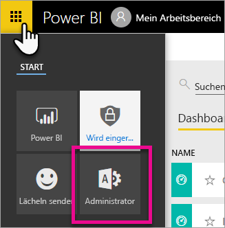
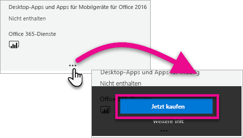
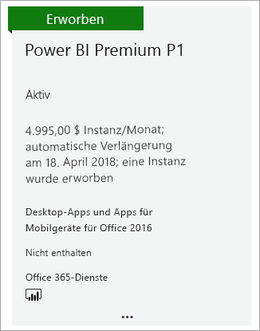
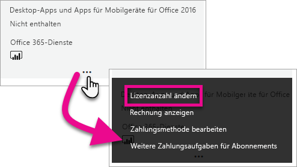
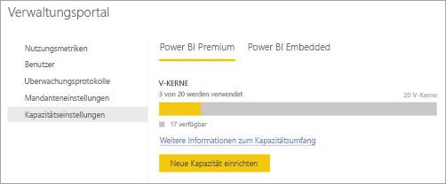

# Erwerben von Power BI Premium

> [!NOTE]
> Dieser Artikel wird gerade mit Beschreibungen neuer Features und ausführlicheren Informationen aktualisiert. Außerdem wird die Lesbarkeit verbessert. 

In diesem Artikel wird beschrieben, wie Sie eine Power BI Premium-Kapazität (P1-P3) für Ihre Organisation erwerben. Sie können eine Power BI Premium-Kapazität über das Office 365 Admin Center erwerben und Ihre Kapazitäten über das Power BI-Verwaltungsportal verwalten. Aktuelle Informationen zu Preisen und zur Planung finden Sie auf der [Seite zu den Power BI-Preisen](https://powerbi.microsoft.com/pricing/) und über den [Power BI Premium-Rechner](https://powerbi.microsoft.com/calculator/).

Auch wenn Ihre Organisation Power BI Premium verwendet, benötigen Inhaltsautoren weiterhin eine Power BI Pro-Lizenz. Stellen Sie sicher, dass Sie mindestens eine Power BI Pro-Lizenz für Ihre Organisation erwerben.

Wenn ein Power BI Premium-Abonnement abläuft, bleibt der vollständige Zugriff auf die Kapazität 30 Tage lang erhalten. Danach wird der Inhalt auf eine gemeinsam genutzte Kapazität zurückgesetzt. Modelle mit mehr als 1 GB werden in gemeinsam genutzten Kapazitäten nicht unterstützt.

## Erstellen eines neuen Mandanten mit Power BI Premium P1

Wenn Sie noch nicht über einen Mandanten verfügen und einen erstellen möchten, können Sie gleichzeitig Power BI Premium erwerben. Der folgende Link führt Sie durch die Schritte zum Erstellen eines neuen Mandanten und ermöglicht Ihnen den Erwerb von Power BI Premium: [Power BI Premium P1-Angebot](https://signup.microsoft.com/Signup?OfferId=b3ec5615-cc11-48de-967d-8d79f7cb0af1). Wenn Sie den Mandanten erstellen, wird Ihnen automatisch die globale Office 365-Administratorrolle für diesen Mandanten zugewiesen.

## Erwerben einer Power BI Premium-Kapazität für eine vorhandene Organisation

Wenn Sie über eine vorhandene Organisation (einen Mandanten) verfügen, müssen Sie über die globale Office 365-Administratorrolle oder die Rechnungsadministratorrolle verfügen, um Abonnements und Lizenzen zu erwerben. Weitere Informationen finden Sie unter [Informationen zu Office 365-Administratorrollen](https://support.office.com/article/About-Office-365-admin-roles-da585eea-f576-4f55-a1e0-87090b6aaa9d).

Führen Sie die folgenden Schritte aus, um eine Premium-Kapazität zu erwerben.

1. Klicken Sie im Power BI-Dienst auf die Office 365-App-Auswahl, und wählen Sie dann **Administrator** aus.

    

    Alternativ können Sie zum Office 365 Admin Center wechseln. Dorthin gelangen Sie, indem Sie zu https://portal.office.com navigieren und **Administrator** auswählen.

1. Wählen Sie **Abrechnung** > **Dienste erwerben** aus.

1. Suchen Sie unter **Andere Pläne** nach Angeboten für Power BI Premium. Diese werden als P1 bis P3, EM3 und P1 (monatlich) aufgeführt.

1. Zeigen Sie mit dem Mauszeiger auf die Auslassungspunkte (**...**), und klicken Sie dann auf **Jetzt kaufen**.

    

1. Führen Sie die Schritte zum Abschließen des Kaufs aus.

Nachdem Sie den Kauf abgeschlossen haben, zeigt die Seite **Dienste kaufen** an, dass das Angebot erworben wurde und aktiv ist.

## Erwerben zusätzlicher Kapazitäten

Da Sie nun über eine Kapazität verfügen, können Sie weitere hinzufügen, wenn Ihre Anforderungen steigen. Darüber hinaus können Sie innerhalb Ihrer Organisation beliebige Kombinationen von Premium-Kapazitäts-SKUs (P1 bis P3) verwenden. Die unterschiedlichen SKUs bieten unterschiedliche Ressourcenfunktionen an.

1. Klicken Sie im Office 365 Admin Center auf **Abrechnung** > **Dienste kaufen**.

1. Suchen Sie unter **Andere Pläne** den Power BI Premium-Artikel aus, von dem Sie mehr erwerben möchten.

1. Zeigen Sie mit dem Mauszeiger auf das **Auslassungszeichen (...)**, und wählen Sie dann **Lizenzanzahl ändern** aus.

    

1. Ändern Sie die Anzahl der Instanzen, über die Sie von diesem Artikel verfügen möchten. Wählen Sie dann **Senden** aus, wenn Sie fertig sind.

   > [!IMPORTANT]
   > Wenn Sie auf **Senden** klicken, wird die hinterlegte Kreditkarte belastet.

Die Seite **Kaufdienste** weist dann die Anzahl der Instanzen aus, über die Sie verfügen. Im Power BI-Verwaltungsportal geben die unter **Kapazitätseinstellungen** als verfügbar angegebenen V-Kerne die neue erworbene Kapazität wieder.

## Kündigen Ihres Abonnements

Sie können Ihr Abonnement über das Office 365 Admin Center kündigen. Gehen Sie wie folgt vor, um Ihr Premium-Abonnement zu kündigen.

1. Navigieren Sie zum Office 365 Admin Center.

1. Wählen Sie **Abrechnung** > **Abonnements** aus.

1. Wählen Sie Ihr Power BI Premium-Abonnement aus der Liste aus.

1. Klicken Sie auf **Weitere Aktionen** > **Abonnement kündigen**.

1. Auf der Seite **Abonnement kündigen** wird angegeben, ob für Sie [Gebühren wegen vorzeitiger Beendigung](https://support.office.com/article/early-termination-fees-6487d4de-401a-466f-8bc3-c0beb5cc40d3) anfallen. Auf dieser Seite wird Ihnen außerdem mitgeteilt, wann die Daten für das Abonnement gelöscht werden.

1. Lesen Sie die Informationen. Wenn Sie fortfahren möchten, wählen Sie **Abonnement kündigen** aus.

## Nächste Schritte

[Power BI-Preise](https://powerbi.microsoft.com/pricing/)
[Power BI Premium-Rechner](https://powerbi.microsoft.com/calculator/)
[Was ist Power BI Premium?](service-premium.md)
[Power BI Premium: Häufig gestellte Fragen](service-premium-faq.md)
[Microsoft Power BI Premium whitepaper (Whitepaper zu Microsoft Power BI Premium)](https://aka.ms/pbipremiumwhitepaper)
[Planning a Power BI Enterprise Deployment whitepaper (Whitepaper zur Planung einer Unternehmensbereitstellung von Power BI)](https://aka.ms/pbienterprisedeploy)

Weitere Fragen? [Stellen Sie Ihre Frage in der Power BI-Community.](http://community.powerbi.com/)