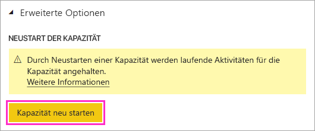

# Neustarten einer Power BI Premium-Kapazität

Als Power BI-Administrator müssen Sie eine Premium-Kapazität möglicherweise neu starten. In diesem Artikel wird erläutert, wie Sie eine Kapazität neu starten. Ferner wird auf einige Fragen zum Neustart und zur Leistung eingegangen.

## Warum stellt Power BI diese Option bereit?

Power BI bietet Benutzern die Möglichkeit, komplexe Analysen großer Datenmengen auszuführen. Leider können Benutzer u. a. durch das Überladen des Power BI-Diensts mit Aufträgen, das Schreiben zu komplexer Abfragen und das Erstellen von Zirkelbezügen Leistungsprobleme verursachen.

Durch die gemeinsam genutzte Kapazität von Power BI wird durch das Festlegen von Grenzwerten für Dateigrößen, das Aktualisieren von Zeitplänen und weitere Aspekte des Diensts ein gewisser Schutz vor Fällen wie diesen geboten. In einer Power BI Premium-Kapazität werden hingegen die meisten dieser Grenzwerte angehoben. Infolgedessen kann ein einzelner Bericht mit einem ungültigen DAX-Ausdruck oder ein sehr komplexes Modell signifikante Leistungsprobleme verursachen. Der Bericht kann bei der Verarbeitung alle in der Kapazität verfügbaren Ressourcen nutzen. 

Power BI verbessert kontinuierlich den Schutz von Benutzern der Premium-Kapazität vor solchen Problemen. Auch Administratoren stehen Tools zur Verfügung, damit diese analysieren können, wann und aus welchem Grund Kapazitäten ausgelastet sind. Weitere Informationen finden Sie in unserer [kurzen Trainingssitzung](https://www.youtube.com/watch?v=UgsjMbhi_Bk&feature=youtu.be) und unserer [längeren Trainingssitzung](https://www.microsoft.com/businessapplicationssummit/video/BAS2018-2174). Gleichzeitig müssen Sie wesentliche Probleme entschärfen können, wenn diese auftreten. Die schnellste Möglichkeit zum Beheben dieser Probleme besteht in einem Neustart der Kapazität.

## Ist der Neustartprozess sicher? Gehen meine Daten verloren?

Alle gespeicherten Daten, Definitionen, Berichte und Dashboards in Ihrer Kapazität bleiben nach dem Neustart vollständig intakt. Wenn Sie eine Kapazität neu starten, werden alle laufenden geplanten Aktualisierungen und Ad-hoc-Aktualisierungen angehalten. Die Aktualisierungen werden neu gestartet, wenn die Kapazität verfügbar ist. Benutzern, die mit der Kapazität interagieren, geht nicht gespeicherte Arbeit verloren. Sie sollten nach Abschluss des Neustarts ihren Browser aktualisieren.

## Wie starte ich eine Kapazität neu?

Führen Sie die folgenden Schritte aus, um eine Kapazität neu zu starten.

1. Navigieren Sie im Power BI-Verwaltungsportal auf der Registerkarte **Kapazitätseinstellungen** zu Ihrer Kapazität. 

1. Fügen Sie das *Featureflag* **CapacityRestart** zu Ihrer Kapazitäts-URL hinzu: https://app.powerbi.com/admin-portal/capacities/<YourCapacityId>?capacityRestartButton=true.

1. Wählen Sie unter **Erweiterte Einstellungen** > **CAPACITY RESTART** (Neustart der Kapazität) die Option **Restart capacity** (Kapazität neu starten) aus.

    

1. Wählen Sie im Dialogfeld **Capacity restart** (Neustart der Kapazität) den Eintrag **Yes, restart capacity** (Ja, Kapazität neu starten) aus.

    

## Wie kann ich solche Probleme in Zukunft verhindern?

Sie können Probleme am besten verhindern, indem Sie die Benutzer über die effiziente Datenmodellierung informieren. Weitere Informationen finden Sie in unserer [Trainingssitzung](https://www.microsoft.com/businessapplicationssummit/video/BAS2018-2170).

Zudem wird Ihnen die [Überwachung Ihrer Kapazitäten](service-admin-premium-monitor-capacity.md) in regelmäßigen Zeitabständen empfohlen, um nach Trends zu suchen, die auf zugrunde liegende Probleme hinweisen. Für die Überwachungs-App und weitere Tools sind regelmäßige Releases geplant, damit Sie Ihre Kapazitäten effektiver überwachen und verwalten können.

## Nächste Schritte

[Was ist Power BI Premium?](service-premium.md)

Weitere Fragen? [Stellen Sie Ihre Frage in der Power BI-Community.](http://community.powerbi.com/)
