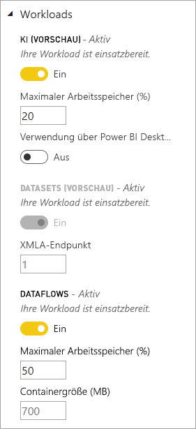

# Konfigurieren von Workloads in einer Premium-Kapazität

In diesem Artikel erfahren Sie, wie Sie Workloads für Power BI Premium-Kapazitäten aktivieren und konfigurieren. Kapazitäten unterstützen standardmäßig nur die Workload für die Ausführung von Power BI-Abfragen. Sie können auch zusätzliche Workloads für **[KI (Cognitive Services)](service-cognitive-services.md)** , **[Dataflows](service-dataflows-overview.md#dataflow-capabilities-on-power-bi-premium)** und **[Paginierte Berichte](paginated-reports-save-to-power-bi-service.md)** aktivieren und konfigurieren.

## Standardeinstellungen für den Arbeitsspeicher

Abfrageworkloads sind für Ressourcen optimiert und durch Ressourcen beschränkt, die durch Ihre Premium-Kapazitäts-SKU bestimmt werden. Premium-Kapazitäten unterstützen auch zusätzliche Workloads, die Ihre Kapazitätsressourcen nutzen können. Arbeitsspeicher-Standardwerte für diese Workloads basieren auf den Kapazitätsknoten, die für Ihre SKU zur Verfügung stehen. Die Einstellungen für maximalen Arbeitsspeicher sind nicht kumulativ. Für KI und Dataflows wird Arbeitsspeicher dynamisch bis zum angegebenen Maximalwert zugeordnet. Für paginierte Berichte ist die Zuordnung dagegen statisch. 

### Microsoft Office-SKUs für Software-as-a-Service-Szenarios (SaaS)

|                     | EM2                      | EM3                       | P1                      | P2                       | P3                       |
|---------------------|--------------------------|--------------------------|-------------------------|--------------------------|--------------------------|
| AI | N/V | N/V | Standardwert 20 % 20 % minimale | 20 % Standard, mindestens 10 % | 20 % Standard, mindestens 5 % |
| Dataflows | N/V |20% Standard; mindestens 12%  | 20 % Standard, mindestens 5 %  | 20% Standard; mindestens 3% | 20 % Standard, mindestens 2 %  |
| Paginierte Berichte | N/V |N/V | 20 % Standard, mindestens 10 % | 20 % Standard, mindestens 5 % | 20 % Standard, mindestens 2,5 % |
| | | | | | |

### Microsoft Azure-SKUs für Plattform-as-a-Service-Szenarios (PaaS)

|                  | A1                       | A2                       | A3                      | A4                       | A5                      | A6                        |
|-------------------|--------------------------|--------------------------|-------------------------|--------------------------|-------------------------|---------------------------|
| AI | N/V                      | Standardwert 20 % 100 % minimale                     | Standardwert 20 % 50 % minimale                     | Standardwert 20 % 20 % minimale | 20 % Standard, mindestens 10 % | 20 % Standard, mindestens 5 % |
| Dataflows         | 40% Standard; mindestens 40% | 24% Standard; mindestens 24% | 20% Standard; mindestens 12% | 20 % Standard, mindestens 5 %  | 20% Standard; mindestens 3% | 20 % Standard, mindestens 2 %   |
| Paginierte Berichte | N/V                      | N/V                      | N/V                     | 20 % Standard, mindestens 10 % | 20 % Standard, mindestens 5 % | 20 % Standard, mindestens 2,5 % |
| | | | | | |

## Workload-Einstellungen

### AI (Vorschauversion)

Zusätzlich zu den **Max Memory** festlegen, die KI-Workload hat mit der zusätzlichen Einstellung **Nutzung von Power BI Desktop zulassen**. Der Standardwert ist **aus**. Diese Einstellung ist für die zukünftige Verwendung reserviert und kann nicht in allen Mandanten angezeigt.

### Datasets (Vorschau)

In der Standardeinstellung die Datasets-arbeitsauslastung ist aktiviert und kann nicht deaktiviert werden. Diese arbeitsauslastung enthält, mit der zusätzlichen Einstellung **XMLA-Endpunkt**. Der Standardwert ist **1**, Bedeutung aktiviert. Diese Einstellung gibt an, dass Verbindungen von Clientanwendungen die Mitgliedschaft in Sicherheitsgruppen festlegen, die auf den Arbeitsbereich und das app-Ebenen berücksichtigt. Weitere Informationen finden Sie unter [Herstellen einer Verbindung mit Datasets mit Clientanwendungen und Tools](service-premium-connect-tools.md).

### Dataflows

Zusätzlich zu den **Max Memory** festlegen, die Datenflüsse Workload hat mit der zusätzlichen Einstellung **Containergröße**. Mit dieser Einstellung können Sie zur Optimierung der Leistung der Datenfluss-Workload für die Verarbeitung komplexer, Compute-intensiven Datenflüsse.

Wenn Sie einen Datenfluss zu aktualisieren, erzeugt die Datenfluss-arbeitsauslastung einen Container für jede Entität in den Datenfluss. Jeder Container kann Arbeitsspeicher bis zu dem Volume in dauern in der Einstellung für den Container angegeben. Der Standardwert für alle SKUs ist **700 MB**. Möglicherweise möchten diese Einstellung zu ändern, wenn:

- Datenflüsse aktualisieren sehr lange dauert oder Aktualisierung der Datenfluss schlägt fehl, auf ein Timeout.
- Datenfluss-Entitäten zu Berechnungsschritte, z. B. einen Join verwenden.  

Es handelt sich um empfohlen, die Sie verwenden die [Kapazitätsmetriken für Power BI Premium](service-admin-premium-monitor-capacity.md) app zum Analysieren der Leistung der Datenfluss-arbeitsauslastung. 

In einigen Fällen kann die Containergröße erhöhen Leistung nicht verbessern. Wenn der Datenfluss Daten nur von einer Quelle erhält ohne erhebliche Berechnungen durchgeführt werden, wird nicht wahrscheinlich Ändern der Größe der Container unterstützen. Containergröße erhöhen kann helfen, wenn die Datenfluss-arbeitsauslastung zum Zuweisen von mehr Arbeitsspeicher für die Entität Aktualisierungsvorgänge aktiviert. Wenn mehr Arbeitsspeicher belegt, können sie die Zeit reduzieren, dauert es um stark berechnete Entitäten zu aktualisieren. 

Der Wert für die Größe der Container darf den maximalen Arbeitsspeicher für die arbeitsauslastung Datenflüsse nicht überschreiten. Eine P1-Kapazität hat beispielsweise 25GB Arbeitsspeicher. Wenn die Datenfluss-arbeitsauslastung Max Memory (%) festgelegt auf 20 %, Container-Größe (MB) nicht überschreiten 5000. In allen Fällen darf die Größe des Containers die Max Memory, nicht überschreiten, auch wenn Sie einen höheren Wert festlegen. 

### Paginierte Berichte (Vorschau)

Paginierte Berichte können benutzerdefinierten Code ausgeführt wird, beim Rendern eines Berichts an. Beispielsweise kann dynamisch ändern Textfarben basierend auf Inhalte, die zusätzlichen Arbeitsspeicher dauern. Power BI Premium führt paginierte Berichte in einem Bereich innerhalb der Kapazität aus. Die Max Memory angegeben verwendet *davon, ob* die Workload aktiv ist. Wenn das Ändern der Einstellung Max. Serverarbeitsspeicher Standardeinstellung, stellen Sie sicher, dass Sie es mit niedriger festlegen auswirken nicht genug, dass die It negativ auf andere arbeitsauslastungen.

In einigen Fällen kann die arbeitsauslastung für paginierte Berichte nicht mehr verfügbar sind. In diesem Fall die arbeitsauslastung zeigt den Status "Fehler" im Verwaltungsportal, und Benutzer sehen die Timeouts für das Rendern von Berichten. Um dieses Problem zu beheben, deaktivieren Sie die Workload, und klicken Sie dann wieder aktivieren.

## Konfigurieren von Workloads

Maximieren Sie die Kapazität der verfügbaren Ressourcen, indem Sie Workloads nur dann ermöglichen, wenn sie verwendet werden. Ändern Sie Arbeitsspeichereinstellungen nur dann, wenn Sie Standardeinstellungen ermittelt haben, die Ihre Anforderungen an Kapazitätsressourcen nicht erfüllen.  

### So konfigurieren Sie Workloads im Power BI-Verwaltungsportal

1. Wählen Sie unter **Kapazitätseinstellungen** > **PREMIUM-KAPAZITÄTEN** eine Kapazität aus.

1. Erweitern Sie unter **Weitere Optionen** **Workloads**.

1. Aktivieren Sie mindestens eine Workload, und legen Sie einen Wert für **Maximaler Arbeitsspeicher** fest.   

    
    

1. Klicken Sie auf **Übernehmen**.

### REST-API

Workloads können mithilfe der REST-APIs vom Typ [Capacities](https://docs.microsoft.com/rest/api/power-bi/capacities) aktiviert und einer Kapazität zugewiesen werden.

## Überwachung von Workloads

Die [Power BI Premium-Kapazitätsmetriken-App](service-admin-premium-monitor-capacity.md) bietet Metriken für Datasets, Dataflows und paginierte Berichte zur Überwachung von Workloads, die für Ihre Kapazitäten aktiviert sind. 

## Nächste Schritte

[Optimieren der Power BI Premium-Kapazitäten](service-premium-capacity-optimize.md)     
[Self-Service-Datenaufbereitung in Power BI (Vorschau)](service-dataflows-overview.md)   
[Was sind paginierte Berichte in Power BI Premium? (Vorschau)](paginated-reports-report-builder-power-bi.md)   

Weitere Fragen? [Fragen an die Power BI-Community](http://community.powerbi.com/)