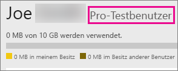

# Erwerb von Power BI Pro
Power BI Pro ist für Benutzer, die Berichte veröffentlichen, Dashboards freigeben, mit Kollegen in Arbeitsbereichen zusammenarbeiten und andere damit verbundene Aktivitäten ausüben – z.B. die Möglichkeit:

* Analysieren von Daten in Excel oder Power BI Desktop
* Freigeben von Excel Web App-Support
* Freigeben von Dashboards und Zusammenarbeiten über App-Arbeitsbereiche
* Anzeigen von freigegebenen Inhalten
* Inhalt mit Microsoft-Teams zu integrieren

IT-Administratoren haben einige Optionen zur Verwendung von Power BI Pro in Ihrer Organisation. Sie können Power BI Pro über das Office 365 Admin Center oder von Ihrem Microsoft-Vertreter oder -Partner erwerben. In diesem Artikel werden die beiden verfügbaren Testoptionen für Power BI Pro sowie die Möglichkeiten zum Erwerb als Organisation erläutert.

Weitere Informationen zu Power BI Premium und dazu, wie Power BI Pro in das Premium-Angebot passt, finden Sie unter [Power BI Premium – Beschreibung](service-premium.md).

## Preise
Aktuelle Informationen zur Preisgestaltung von Power BI Pro und eine Liste der enthaltenen Funktionen finden Sie unter [Power BI – Preise](https://powerbi.microsoft.com/pricing/).

## Power BI Pro als 60-Tage-Testversion für Einzelpersonen
Nachdem Sie sich für ein kostenloses Konto registriert haben, erhalten Sie die Möglichkeit, die Pro-Version 60 Tage lang kostenlos zu testen. Während des Testzeitraums haben Sie Zugriff auf alle Pro-Features. Power BI Pro hat alle Features der kostenlosen Version von Power BI sowie zusätzliche Features für Freigeben und Zusammenarbeit. Weitere Informationen finden Sie unter [Power BI – Preise](https://powerbi.microsoft.com/pricing). Um eine 60 Tage lang gültige kostenlose Testversion von Power BI Pro auszuprobieren, melden Sie sich bei Power BI an, und testen Sie eins dieser Features von Power BI Pro:

* [Erstellen eines App-Arbeitsbereichs](service-create-distribute-apps.md)
* [Freigeben eines Dashboards](service-share-dashboards.md)

Wenn Sie eins dieser Features ausprobieren, werden Sie aufgefordert, Ihren kostenlosen Testzeitraum zu beginnen. Sie können die Testversion auch starten, indem Sie auf das Zahnradsymbol klicken und **Persönlichen Speicher verwalten** auswählen. Klicken Sie anschließend rechts auf **Pro kostenlos testen**.

Wählen Sie dann **Test starten** aus.

> [!NOTE]
> Benutzer, die dieses ins Produkt integrierte Power BI Pro-Testangebot nutzen, werden im Office 365-Administratorportal nicht als Power BI Pro-Testbenutzer aufgeführt (sie werden als Benutzer der kostenlosen Power BI-Version angezeigt). Sie werden jedoch auf der Seite **Speicher verwalten** in Power BI als Benutzer der Power BI Pro-Testversion angezeigt.

> [!NOTE]
> Wenn Sie IT-Administrator sind und Power BI-Testlizenzen für mehrere Benutzer in Ihrer Organisation erwerben und bereitstellen möchten, ohne dass die einzelnen Benutzer den Testbedingungen einzeln zustimmen müssen, können Sie sich für eine [Power BI Pro-Testversion im Abonnement](https://portal.office.com/Signup/MainSignup15.aspx?OfferId=d59682f3-3e3b-4686-9c00-7c7c1c736085&dl=POWER_BI_PRO) registrieren. Sie müssen ein globaler Office 365-Administrator oder ein Abrechnungsadministrator sein oder einen neuen Mandanten erstellen, um sich für eine Administratortestversion zu registrieren. Weitere Informationen finden Sie unter [Erwerb von Power BI Pro](service-admin-purchasing-power-bi-pro.md).

> [!NOTE]
> Bei Verfügbarkeit von Power BI Premium und mit den Änderungen am Power BI Free-Angebot zum 1. Juni 2017 können Sie für die erweiterte Pro-Testversion berechtigt sein. Weitere Informationen finden Sie unter [Aktivierung der erweiterten Pro-Testversion](service-extended-pro-trial.md).

### Darstellung innerhalb des Diensts
Bei geöffnetem Dienst können Sie überprüfen, ob Sie über ein Pro-Testkonto verfügen. Klicken Sie dazu auf das *Zahnradsymbol*, und wählen Sie dann **Persönlichen Speicher verwalten**.

## Testversion als Office 365-Abonnement
Sie können Power BI als Testversion für Ihre Organisation beziehen. Sobald das Abonnement für Sie nutzbar ist, können Sie Ihren Benutzern Power BI-Lizenzen zuweisen. Weitere Informationen dazu, wie Lizenzen zugewiesen werden, finden Sie unter [Zuweisen von Lizenzen zu Benutzern in Office 365 Business](https://support.office.com/article/Assign-or-unassign-licenses-for-Office-365-for-business-997596b5-4173-4627-b915-36abac6786dc).

> [!NOTE]
> Es gibt eine Beschränkung auf maximal eine Testversion für Organisationseinheiten pro Mandant. Wenn also die Power BI Pro – Testversion bereits auf Ihrem Mandanten angewendet wurde, kann dies nicht erneut durchgeführt werden. Wenn Sie Hilfe benötigen, können Sie sich an den [Office 365-Abrechnungssupport](https://support.office.microsoft.com/article/Contact-Office-365-for-business-support-Admin-Help-32a17ca7-6fa0-4870-8a8d-e25ba4ccfd4b?CorrelationId=552bbf37-214f-4202-80cb-b94240dcd671&ui=en-US&rs=en-US&ad=US#BKMK_call_support) wenden.
> 

1. Navigieren Sie zum [Office 365 Admin Center](https://portal.office.com/admin/default.aspx).
2. Wählen Sie im linken Navigationsbereich „Abrechnung“ > „Abonnements“.
3. Wählen Sie auf der rechten Seite „Abonnements hinzufügen +“ aus.
4. Zeigen Sie unter „Andere Pläne“ auf die Auslassungspunkte („...“) für Power BI Free, und wählen Sie „Kostenlosen Test starten“.
   
    
5. Klicken Sie auf dem Bildschirm „Bestellung bestätigen“ auf „Jetzt testen“.
6. Klicken Sie auf der Bestellbestätigung auf „Weiter“.

Unter **Abrechnung** > **Abonnements** wird nun der Eintrag **Power BI Pro-Testversion** mit 25 verfügbaren Lizenzen angezeigt. Diese Testversion kann einen Monat lang genutzt werden.

### Darstellung innerhalb des Diensts
Bei geöffnetem Dienst können Sie überprüfen, ob Sie über ein Pro-Konto verfügen. Klicken Sie dazu auf das **Zahnradsymbol**, und wählen Sie dann **Persönlichen Speicher verwalten**. Es wird nicht angezeigt, dass es sich um einen Testbenutzer handelt.

## Erwerb des Abonnements in Office 365
Sie können Power BI Pro für Ihre Organisation im Office 365 Admin Center erwerben. Sobald das Abonnement für Sie nutzbar ist, können Sie Ihren Benutzern Power BI-Lizenzen zuweisen. Weitere Informationen dazu, wie Lizenzen zugewiesen werden, finden Sie unter [Zuweisen von Lizenzen zu Benutzern in Office 365 Business](https://support.office.com/article/Assign-or-unassign-licenses-for-Office-365-for-business-997596b5-4173-4627-b915-36abac6786dc).

1. Navigieren Sie zum [Office 365 Admin Center](https://portal.office.com/admin/default.aspx).
2. Wählen Sie im linken Navigationsbereich „Abrechnung“ > „Abonnements“.
3. Wählen Sie auf der rechten Seite „Abonnements hinzufügen +“ aus.
4. Zeigen Sie unter „Andere Pläne“ auf die Auslassungspunkte („...“) für Power BI Pro, und wählen Sie „Jetzt kaufen“.
   
    
5. Geben Sie die Anzahl der Lizenzen ein, die Sie hinzufügen möchten, und wählen Sie „Zur Kasse gehen„ oder „In den Einkaufswagen“.
   
   > [!NOTE]
   > Sie können auch noch später weitere Lizenzen hinzufügen.
   > 
   > 
6. Geben Sie die benötigten Informationen zum Abschluss des Kaufs ein.

> [!NOTE]
> Wenn Sie die Power BI Pro – Testversion bereits genutzt haben, werden Sie direkt zum Kassenbildschirm weitergeleitet, wo Sie nach der Anzahl der gewünschten Lizenzen gefragt werden.
> 
> 

Unter **Abrechnung** > **Abonnements** wird nun der Eintrag **Power BI Pro** angezeigt. Wenn Sie später mehr Lizenzen hinzufügen möchten, können Sie zu **Abonnements hinzufügen** zurückkehren und **Lizenzanzahl ändern** auswählen.

### Darstellung innerhalb des Diensts
Bei geöffnetem Dienst können Sie überprüfen, ob Sie über ein Pro-Konto verfügen. Klicken Sie dazu auf das **Zahnradsymbol**, und wählen Sie dann **Persönlichen Speicher verwalten**.

## Karenzzeit
Nach dem Ablauf einer Power BI Pro-Lizenz gibt es eine 30-tägige Karenzzeit. 

Für Power BI Pro gilt der gleiche Abonnementslebenszyklus wie für Office 365. Weitere Informationen finden Sie unter [Was geschieht mit meinen Daten und dem Zugriff darauf, wenn mein Office 365 Business-Abonnement endet?](https://support.office.com/en-us/article/What-happens-to-my-data-and-access-when-my-Office-365-for-business-subscription-ends-4436582f-211a-45ec-b72e-33647f97d8a3)

## Nächste Schritte
[Self-Service-Registrierung für Power BI](service-self-service-signup-for-power-bi.md)  
[Power BI Free in Ihrer Organisation](service-admin-service-free-in-your-organization.md)  
[Aktivierung der erweiterten Pro-Testversion](service-extended-pro-trial.md)  
[Power BI Premium – Beschreibung](service-premium.md)  
[Erwerben von Power BI Premium](service-admin-premium-purchase.md)  
[Power BI Premium-Whitepaper](https://aka.ms/pbipremiumwhitepaper)  

Weitere Fragen? [Stellen Sie Ihre Frage in der Power BI-Community.](http://community.powerbi.com/)

