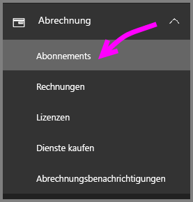
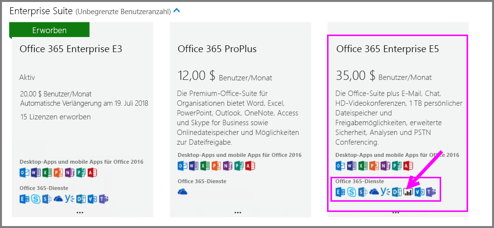
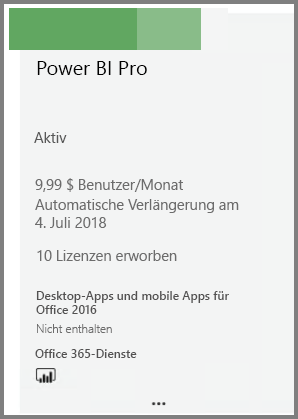
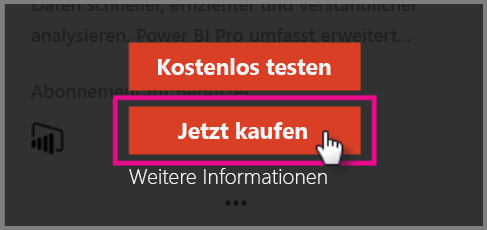
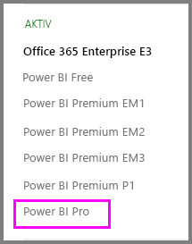

# Schnellstart: Erwerben von Power BI Pro-Lizenzen

Power BI Pro ist eine Einzellizenz, die Zugriff auf alle Inhalte und Funktionen im Power BI-Dienst ermöglicht, z.B. zur Freigabe von Inhalten und zur Zusammenarbeit mit anderen Benutzern mit Pro-Lizenz. Nur Pro-Benutzer können Inhalte in App-Arbeitsbereichen veröffentlichen und nutzen, Dashboards freigeben sowie Dashboards und Berichte abonnieren. Dieser Artikel erläutert, wie Sie Power BI Pro-Lizenzen in Office 365 erwerben.

## Voraussetzungen

Sie müssen Mitglied der Rolle [**Globaler Administrator** oder **Abrechnungsadministrator**](https://support.office.com/article/about-office-365-admin-roles-da585eea-f576-4f55-a1e0-87090b6aaa9d?ui=en-US&rs=en-US&ad=US) in Office 365 sein. 

## Schnellstart: Erwerben von Power BI Pro-Lizenzen über Office 365

Führen Sie diese Schritte aus, um Power BI Pro-Lizenzen zu erwerben:

1. Öffnen Sie das [Office 365 Admin Center](https://portal.office.com/adminportal/home#/homepage).

2. Wählen Sie im linken Navigationsbereich **Abrechnung** > **Abonnements** aus.

    

3. Klicken Sie in der oberen rechten Ecke der Seite **Abonnements** auf **Abonnement hinzufügen**.

    

4. Suchen Sie das gewünschte Abonnementangebot:

    Klicken Sie unter **Enterprise Suite** auf **Office 365 Enterprise E5**.

    

    Klicken Sie unter **Andere Pläne** auf **Power BI Pro**.

    

5. Zeigen Sie auf die drei Punkte (...) neben dem gewünschten Abonnement, und klicken Sie auf **Jetzt kaufen**.

    

6. Klicken Sie je nach bevorzugter Zahlungsart auf **Monatlich bezahlen** oder auf **Für ein volles Jahr bezahlen**.

7. Geben Sie unter **Wie viele Benutzerlizenzen möchten Sie hinzufügen?** die gewünschte Anzahl von Lizenzen ein, und klicken Sie dann auf **Jetzt auschecken**, um die Transaktion abzuschließen.

8. Überprüfen Sie, ob das erworbene Abonnement jetzt auf der Seite **Abonnements** angezeigt wird.

   

9. Um nach dem ersten Kauf weitere Lizenzen hinzuzufügen, wählen Sie auf der Seite **Abonnements** nacheinander die Optionen **Power BI Pro** und **Lizenzen hinzufügen/entfernen** aus.

## Nächste Schritte

Nachdem Sie die Lizenzen erworben haben, weisen Sie sie Benutzern in Ihrem Mandanten zu.

[Zuweisen von Lizenzen zu Benutzern in Office 365](service-admin-assigning-power-bi-pro-licenses.md)

[Zuweisen von Lizenzen zu Benutzern in Azure](service-admin-assigning-power-bi-pro-licenses-azure.md)

[Power BI – Preise](https://powerbi.microsoft.com/en-us/pricing/)
