# Erwerben und Zuweisen von Power BI Pro-Lizenzen

Power BI Pro ist eine Einzellizenz, die Zugriff auf alle Inhalte und Funktionen im Power BI-Dienst ermöglicht, z.B. zur Freigabe von Inhalten und zur Zusammenarbeit mit anderen Benutzern mit Pro-Lizenz. Nur Pro-Benutzer können Inhalte in App-Arbeitsbereichen veröffentlichen und nutzen, Dashboards freigeben sowie Dashboards und Berichte abonnieren. Weitere Informationen finden Sie unter [Power BI features by license type (Power BI-Features nach Lizenztyp)](service-features-license-type.md).

In diesem Artikel wird zunächst erläutert, wie Sie Power BI Pro-Lizenzen in Office 365 erwerben. Anschließend werden die zwei Optionen erklärt, die Ihnen zum Zuweisen dieser Lizenzen zu einzelnen Benutzern zur Verfügung stehen: Office 365 und Azure. (Entscheiden Sie sich für eine dieser Optionen.)

## Voraussetzungen

Sie müssen Mitglied der Rolle [**Globaler Administrator** oder **Abrechnungsadministrator**](https://support.office.com/article/about-office-365-admin-roles-da585eea-f576-4f55-a1e0-87090b6aaa9d) in Office 365 sein.

Sie müssen Besitzer des Azure-Abonnements sein, das Power BI für Suchvorgänge in Active Directory verwendet, um Lizenzen in Azure zuzuweisen.

## Erwerben von Lizenzen in Office 365

Führen Sie diese Schritte aus, um Power BI Pro-Lizenzen zu erwerben:

1. Öffnen Sie das [Microsoft 365 Admin Center](https://portal.office.com/adminportal/home#/homepage).

2. Wählen Sie im linken Navigationsbereich **Abrechnung** > **Abonnements** aus.

    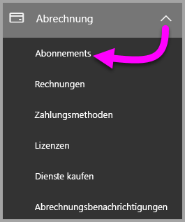

3. Klicken Sie in der oberen rechten Ecke der Seite **Abonnements** auf **Abonnement hinzufügen**.

    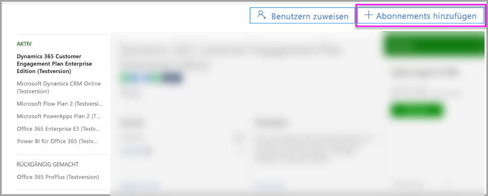

4. Suchen Sie das gewünschte Abonnementangebot:

    Klicken Sie unter **Enterprise Suite** auf **Office 365 Enterprise E5**.

    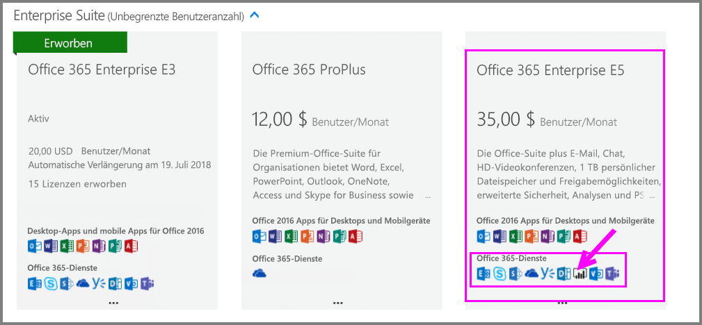

    Klicken Sie unter **Andere Pläne** auf **Power BI Pro**.

    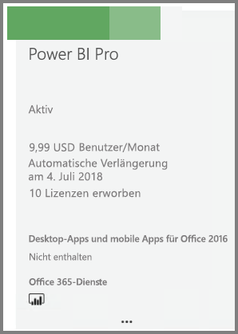

5. Zeigen Sie auf die Auslassungspunkte (**...**) des gewünschten Abonnements, und wählen Sie **Jetzt kaufen** aus.

    

6. Klicken Sie je nach bevorzugter Zahlungsart auf **Monatlich bezahlen** oder auf **Für ein volles Jahr bezahlen**.

7. Geben Sie unter **Wie viele Benutzerlizenzen möchten Sie hinzufügen?** die gewünschte Anzahl von Lizenzen ein, und klicken Sie dann auf **Jetzt auschecken**, um die Transaktion abzuschließen.

8. Überprüfen Sie, ob das erworbene Abonnement jetzt auf der Seite **Abonnements** angezeigt wird.

   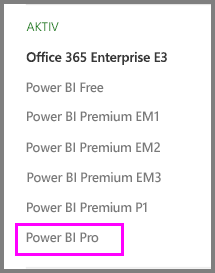

9. Um nach dem ersten Kauf weitere Lizenzen hinzuzufügen, wählen Sie auf der Seite **Abonnements** nacheinander die Optionen **Power BI Pro** und **Lizenzen hinzufügen/entfernen** aus.

## Zuweisen von Lizenzen in Office 365

Führen Sie folgende Schritte aus, um einzelnen Benutzerkonten Power BI Pro-Lizenzen zuzuweisen:

1. Öffnen Sie das [Microsoft 365 Admin Center](https://portal.office.com/adminportal/home#/homepage).

2. Erweitern Sie im linken Navigationsbereich **Benutzer**, und wählen Sie dann **Aktive Benutzer** aus.

    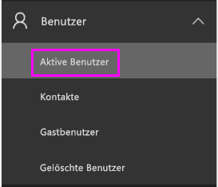

3. Wählen Sie einen Benutzer aus, und klicken Sie dann unter **Produktlizenzen** auf **Bearbeiten**.

    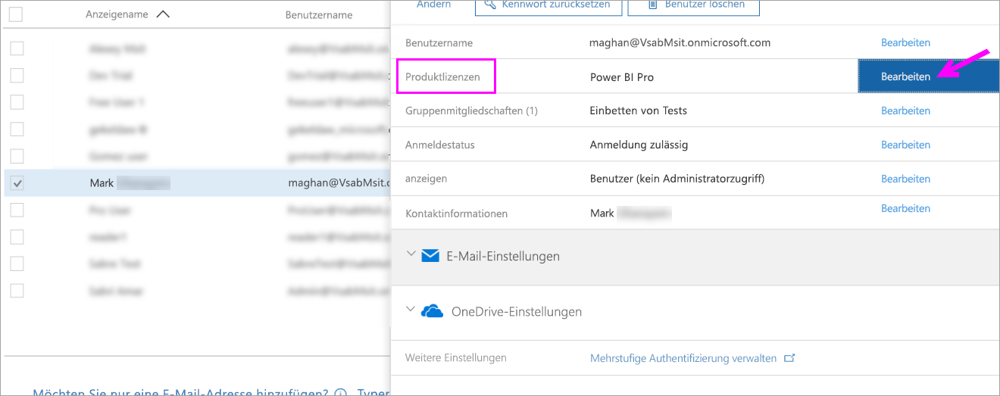

4. Legen Sie in **Power BI Pro** die Einstellung auf **Ein** fest, und klicken Sie dann auf **Speichern**.

    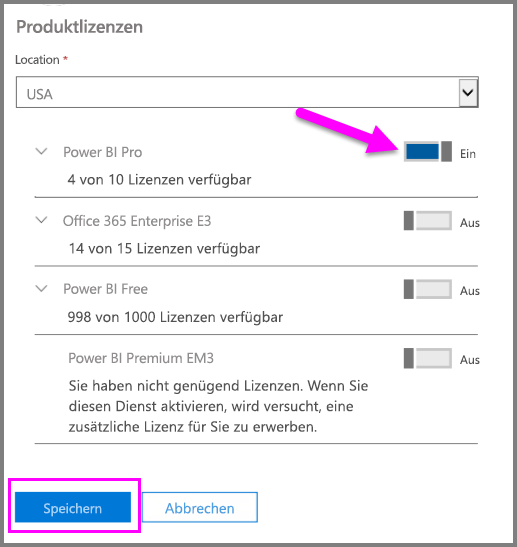

5. Überprüfen Sie unter **Status** für das ausgewählte Konto, ob die Power BI Pro-Lizenz erfolgreich zugewiesen wurde.

    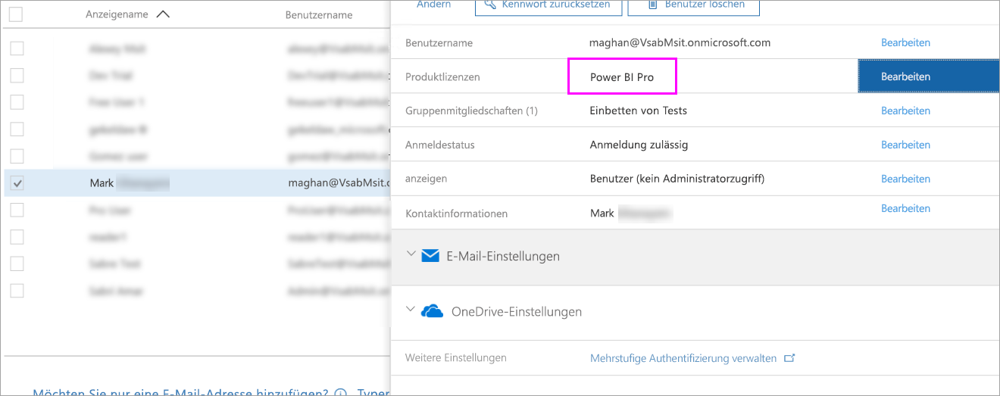

## Zuweisen von Lizenzen in Azure

Führen Sie folgende Schritte aus, um einzelnen Benutzerkonten Power BI Pro-Lizenzen zuzuweisen:

1. Öffnen Sie das [Azure-Portal](https://ms.portal.azure.com/#@microsoft.onmicrosoft.com/dashboard/private/39bc3cf7-31a4-43f6-954c-f2d69ca2f0).

2. Wählen Sie in der linken Navigationsleiste **Azure Active Directory** aus.

    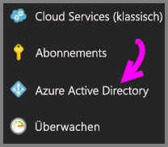

3. Wählen Sie unter **Azure Active Directory** die Option **Lizenzen** aus.

    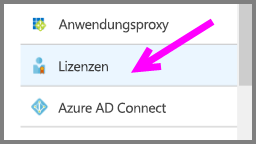

4. Wählen Sie unter **Lizenzen** die Option **Alle Produkte** und dann **Power BI Pro** aus, um die Liste der lizenzierten Benutzer anzuzeigen.

    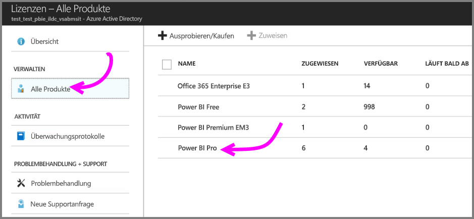

5. Klicken Sie auf **Zuweisen**, um einem weiteren Benutzerkonto eine Power BI Pro-Lizenz hinzuzufügen.

    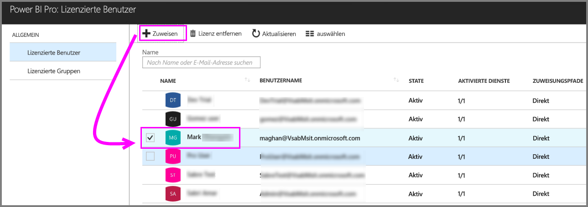

## Nächste Schritte

Nachdem Sie die Lizenzen zugewiesen haben, informieren Sie sich eingehend über Power BI Pro.

[Power BI licensing in your organization (Power BI-Lizenzierung in Ihrem Unternehmen)](service-admin-licensing-organization.md)

[Suchen nach angemeldeten Power BI-Benutzern](service-admin-access-usage.md)

Weitere Fragen? [Stellen Sie Ihre Frage in der Power BI-Community.](https://community.powerbi.com/)
