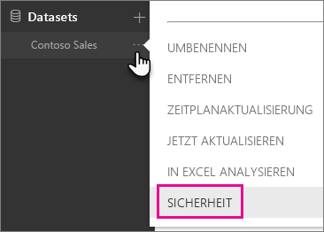
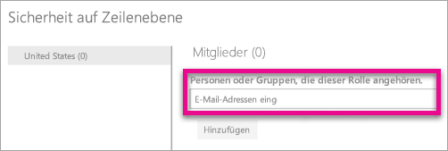
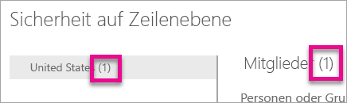
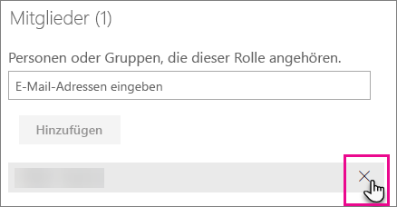
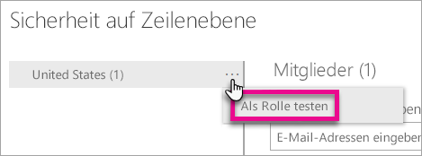
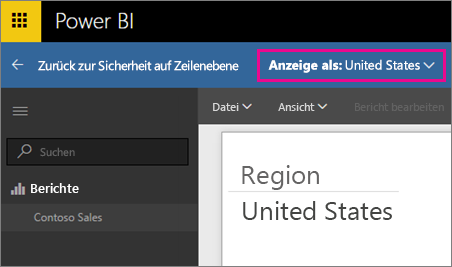
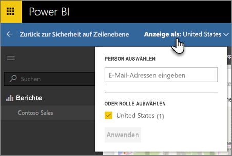

# Sicherheit auf Zeilenebene (row-level security; RLS) mit Power BI
<iframe width="560" height="315" src="https://www.youtube.com/embed/67fK0GoVQ80?showinfo=0" frameborder="0" allowfullscreen></iframe>

Die Sicherheit auf Zeilenebene (row-level security; RLS) mit Power BI kann zum Einschränken des Datenzugriffs für bestimmte Benutzer verwendet werden. Filter beschränken die Daten auf Zeilenebene. Sie können Filter für Rollen definieren.

Sie können RLS für Datenmodelle konfigurieren, die mithilfe von Power BI Desktop in Power BI importiert wurden. Sie können auch RLS für Datasets konfigurieren, die DirectQuery verwenden, z. B. SQL Server. Bisher konnte RLS nur in lokalen Analysis Services-Modellen außerhalb von Power BI implementiert werden. Für Liveverbindungen von Analysis Services konfigurieren Sie RLS auf dem lokalen Modell. Die Sicherheitsoption wird nicht für Liveverbindungsdatasets angezeigt.

[!INCLUDE [include-short-name](./includes/rls-desktop-define-roles.md)]

[!INCLUDE [include-short-name](./includes/rls-desktop-view-as-roles.md)]

## Verwalten der Sicherheitseinstellungen Ihres Modells
Zum Verwalten der Sicherheitseinstellungen Ihres Datenmodells sollten Sie wie folgt vorgehen:

1. Wählen Sie die **Ellipse (...)** für ein Dataset aus.
2. Wählen Sie **Sicherheit** aus.
   
   

Dadurch gelangen Sie zur RLS-Seite, wo Sie Mitglieder zu einer Rolle hinzufügen können, die Sie in Power BI Desktop erstellt haben. Die Sicherheit ist nur für die Besitzer des Datasets verfügbar. Wenn das Dataset zu einer Gruppe gehört, können nur Administratoren der Gruppe die Sicherheitsoption sehen. 

Sie können Rollen nur in Power BI Desktop erstellen oder ändern.

## Arbeiten mit Mitgliedern
### Hinzufügen von Mitgliedern
Sie können der Rolle ein Mitglied hinzufügen, indem Sie die E-Mail-Adresse oder den Namen des Benutzers, der Sicherheitsgruppe oder der Verteilerliste eingeben, den bzw. die Sie hinzufügen möchten. Dieses Mitglied muss sich in Ihrer Organisation befinden. Sie können keine in Power BI erstellten Gruppen hinzufügen.

Anhand der Zahl in Klammern neben dem Rollennamen oder neben „Mitglieder“ können Sie zudem sehen, wie viele Mitglieder Teil der Rolle sind.

### Entfernen von Mitgliedern
Sie können Mitglieder entfernen, indem Sie das „X“ neben ihrem Namen auswählen. 

## Überprüfen der Rolle im Power BI-Dienst
Sie können überprüfen, ob die von Ihnen definierte Rolle ordnungsgemäß funktioniert, indem Sie sie testen. 

1. Wählen Sie das **Auslassungszeichen (...)** neben der Rolle aus.
2. Wählen Sie **Daten als Rolle testen** aus.

Es werden dann die für diese Rolle verfügbaren Berichte angezeigt. Dashboards werden in dieser Ansicht nicht angezeigt. Auf der blauen Leiste oben sehen Sie, was angewendet wird.

Sie können andere Rollen oder eine Kombination von Rollen testen, indem Sie **Now viewing as** (Jetzt anzeigen als) auswählen.

Sie können auch Daten als eine bestimmte Person anzeigen oder eine Kombination der verfügbaren Rollen auswählen, um deren ordnungsgemäße Funktion zu überprüfen. 

Um zur normalen Ansicht zurückzukehren, wählen Sie **Zurück zur Sicherheit auf Zeilenebene** aus.

[!INCLUDE [include-short-name](./includes/rls-usernames.md)]

## Verwenden von RLS mit App-Arbeitsbereichen in Power BI
Wenn Sie Ihren Power BI Desktop-Bericht in einem App-Arbeitsbereich im Power BI-Dienst veröffentlichen, werden die Rollen auf Mitglieder mit Lesezugriff angewendet. Sie müssen in den Einstellungen angeben, dass Mitglieder die Power BI-Inhalte nur im App-Arbeitsbereich anzeigen können.

> [!WARNING]
> Wenn Sie den App-Arbeitsbereich so konfiguriert haben, dass deren Mitglieder über Bearbeitungsberechtigungen verfügen, werden die RLS-Rollen nicht auf diese angewendet. Benutzer können dann alle Daten einsehen.
> 
> 

[!INCLUDE [include-short-name](./includes/rls-limitations.md)]

[!INCLUDE [include-short-name](./includes/rls-faq.md)]

## Nächste Schritte
[Sicherheit auf Zeilenebene (Row-Level Security; RLS) mit Power BI Desktop](desktop-rls.md)  

Weitere Fragen? [Stellen Sie Ihre Frage in der Power BI-Community.](http://community.powerbi.com/)

