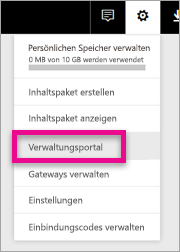
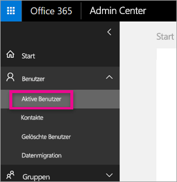
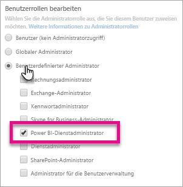
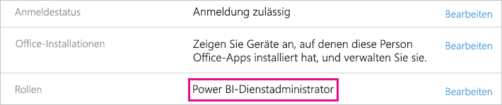

# <a name="understanding-the-power-bi-admin-role"></a>Grundlegendes zur Power BI-Administratorrolle
Erfahren Sie, wie Sie die Power BI-Administratorrolle in Ihrem Unternehmen verwenden.

<iframe width="640" height="360" src="https://www.youtube.com/embed/PQRbdJgEm3k?showinfo=0" frameborder="0" allowfullscreen></iframe>

Wenn Sie einem Benutzer die Power BI-Dienstadministratorrolle zuweisen, erhält der Benutzer Zugriff auf das Power BI-Verwaltungsportal, nicht aber auf andere Office 365-Verwaltungsfunktionen. Beispiel: die Rolle „Globaler Administrator“. Diese Rolle ist für Benutzer geeignet, die Power BI für ihr Unternehmen verwalten.

Office 365-Benutzeradministratoren können im Office 365 Admin Center oder mithilfe eines PowerShell-Skripts einem Benutzer die Rolle des Power BI-Administratoren zuweisen. Sobald ein Benutzer zugewiesen wurde, erhält er Zugriff auf das [Power BI-Verwaltungsportal](service-admin-portal.md). Dort kann der Benutzer auf Nutzungsmetriken des Mandanten zugreifen und die Verwendung von Power BI-Funktionen im Mandanten steuern.



## <a name="using-the-office-365-admin-center-to-assign-a-role"></a>Zuweisen von Rollen im Office 365 Admin Center
Um einem Benutzer die Power BI-Administratorrolle im Office 365 Admin Center zuzuweisen, gehen Sie wie folgt vor.

1. Rufen Sie das Office 365 Admin Center auf, und wählen Sie **Benutzer** > **Aktive Benutzer**.
   
    
2. Wählen Sie den Benutzer aus, dem Sie die Rolle zuweisen möchten.
3. Wählen Sie **Bearbeiten** für Rollen.
   
    
4. Wählen Sie **Angepasster Administrator** > **Power BI-Dienstadministrator**.
   
    
5. Wählen Sie **Speichern**.

Daraufhin sollte für den Benutzer **Power BI-Dienstadministrator** als Rolle aufgeführt werden. Der Benutzer hat jetzt Zugriff auf das [Power BI-Verwaltungsportal](service-admin-portal.md).



## <a name="using-powershell-to-assign-a-role"></a>Zuweisen einer Rolle mit PowerShell
Damit der PowerShell-Befehl ausgeführt werden kann, muss das Azure Active Directory-PowerShell-Modul installiert sein.

### <a name="download-azure-ad-powershell-module"></a>Herunterladen des Azure AD-PowerShell-Moduls
[Herunterladen von Azure Active Directory-PowerShell in Version 2](https://github.com/Azure/azure-docs-powershell-azuread/blob/master/Azure%20AD%20Cmdlets/AzureAD/index.md)

[Herunterladen von Azure Active Directory-PowerShell in Version 1.1.166.0 GA](http://connect.microsoft.com/site1164/Downloads/DownloadDetails.aspx?DownloadID=59185)

### <a name="command-to-add-role-to-member"></a>Befehl zum Zuweisen einer Rolle zu einem Mitglied
**Befehl in Azure AD-PowerShell v2**

Sie müssen die **ObjectId** für die Rolle **Power BI-Dienstadministrator** abrufen. Sie können den Befehl [Get-AzureADDirectoryRole](https://docs.microsoft.com/powershell/azuread/v2/get-azureaddirectoryrole) ausführen, um die **ObjectId** abzurufen.

```
PS C:\Windows\system32> Get-AzureADDirectoryRole

ObjectId                             DisplayName                        Description
--------                             -----------                        -----------
00f79122-c45d-436d-8d4a-2c0c6ca246bf Power BI Service Administrator     Full access in the Power BI Service.
250d1222-4bc0-4b4b-8466-5d5765d14af9 Helpdesk Administrator             Helpdesk Administrator has access to perform..
3ddec257-efdc-423d-9d24-b7cf29e0c86b Directory Synchronization Accounts Directory Synchronization Accounts
50daa576-896c-4bf3-a84e-1d9d1875c7a7 Company Administrator              Company Administrator role has full access t..
6a452384-6eb9-4793-8782-f4e7313b4dfd Device Administrators              Device Administrators
9900b7db-35d9-4e56-a8e3-c5026cac3a11 AdHoc License Administrator        Allows access manage AdHoc license.
a3631cce-16ce-47a3-bbe1-79b9774a0570 Directory Readers                  Allows access to various read only tasks in ..
f727e2f3-0829-41a7-8c5c-5af83c37f57b Email Verified User Creator        Allows creation of new email verified users.
```

In diesem Fall lautet die ObjectId der Rolle „00f79122-c45d-436d-8d4a-2c0c6ca246bf“.

Sie benötigen außerdem die **ObjectID** des Benutzers. Diese können Sie mit dem Befehl [Get-AzureADUser](https://docs.microsoft.com/powershell/azuread/v2/get-azureaduser) ermitteln.

```
PS C:\Windows\system32> Get-AzureADUser -SearchString 'tim@contoso.com'

ObjectId                             DisplayName UserPrincipalName      UserType
--------                             ----------- -----------------      --------
6a2bfca2-98ba-413a-be61-6e4bbb8b8a4c Tim         tim@contoso.com        Member
```

Um das Mitglied der Rolle zuzuweisen, führen Sie den Befehl [Add-AzureADDirectoryRoleMember](https://docs.microsoft.com/powershell/azuread/v2/add-azureaddirectoryrolemember) aus.

| Parameter | Beschreibung |
| --- | --- |
| ObjectId |Die ObjectId der Rolle |
| RefObjectId |Die ObjectId des Mitglieds. |

```
Add-AzureADDirectoryRoleMember -ObjectId 00f79122-c45d-436d-8d4a-2c0c6ca246bf -RefObjectId 6a2bfca2-98ba-413a-be61-6e4bbb8b8a4c
```

**Befehl in Azure AD-PowerShell v1**

Um mithilfe der Cmdlets in Azure AD v1 ein Mitglied einer Rolle zuzuweisen, führen Sie den Befehl [Add-MsolRoleMember](https://docs.microsoft.com/powershell/msonline/v1/add-msolrolemember) aus.

```
Add-MsolRoleMember -RoleMemberEmailAddress "tim@contoso.com" -RoleName "Power BI Service Administrator"
```

## <a name="limitations-and-considerations"></a>Einschränkungen und Überlegungen
Die Rolle „Power BI-Dienstadministrator“ bietet keine Berechtigungen für die folgenden Aktivitäten:

* Ändern von Benutzern und Lizenzen im Office 365 Admin Center
* Zugreifen auf die Überwachungsprotokolle. Weitere Informationen finden Sie unter [Verwenden von Überwachung in der Organisation](service-admin-auditing.md).

## <a name="next-steps"></a>Nächste Schritte
[Power BI-Verwaltungsportal](service-admin-portal.md)  
[Add-AzureADDirectoryRoleMember](https://docs.microsoft.com/powershell/azuread/v2/add-azureaddirectoryrolemember)  
[Add-MsolRoleMember](https://docs.microsoft.com/powershell/msonline/v1/add-msolrolemember)  
[Überwachen von Power BI in Ihrer Organisation](service-admin-auditing.md)  
[Verwalten von Power BI in Ihrer Organisation](service-admin-administering-power-bi-in-your-organization.md)  

Weitere Fragen? [Stellen Sie Ihre Frage in der Power BI-Community.](http://community.powerbi.com/)

