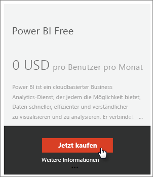
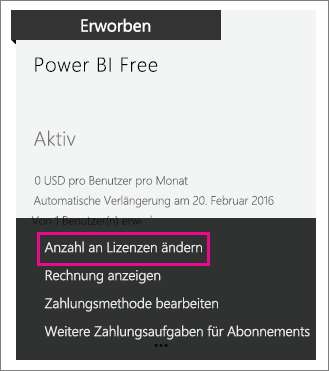

# Power BI Free in Ihrer Organisation
In diesem Artikel wird erläutert, wie Sie Power BI Free in Ihrer Organisation verwenden können. „Organisation“ bedeutet hier, dass Sie über einen Mandanten verfügen und Benutzer und Dienste in diesem Mandanten verwalten können. Als Administrator können Sie die Zuweisung von Lizenzen steuern, oder Sie können den Benutzern erlauben, sich individuell zu registrieren. Wir beschäftigen uns hier mit der Power BI Free-Lizenz und den Methoden, wie Sie eine individuelle Registrierung steuern können.

## Individuelle Registrierung und Zuweisen von Lizenzen
Die Benutzer in Ihrer Organisation können auf Power BI auf zwei verschiedene Arten zugreifen. Die Benutzer können sich individuell für Power BI registrieren, oder Sie können den Benutzern im Verwaltungsportal von Office 365 eine Power BI-Lizenz zuweisen.

Wenn Sie eine individuelle Registrierung erlauben, ersparen Sie den Organisationsadministratoren Arbeit, weil sich die an Power BI interessierten Benutzer selbstständig und kostenlos bei Power BI registrieren können.

Wenn Sie mehr Kontrolle wünschen, können Sie die individuelle Registrierung blockieren und die Power BI-Lizenzen im Office 365 Admin Center selbst zuweisen. Auf diese Weise können Sie bestimmen, wer in Ihrer Organisation auf welche Dienste zugreifen kann. Das empfiehlt sich besonders dann, wenn Sie aus Audit- und Compliancegründen nachweisen müssen, wer auf welche Software und Daten zugreifen kann.

## Beschaffen einer unbeschränkten Anzahl von Lizenzen
Unter Umständen wird Ihnen Power BI (Free) im Office 365 Admin Center unter **Abrechnung** > **Lizenzen** mit einer unbeschränkten Anzahl von Lizenzen angeboten.

Diese Gruppe von Lizenzen wird Ihnen angezeigt, nachdem sich ein Benutzer erstmals individuell für Power BI registriert hat. Im Zuge dieser ersten Registrierung wird Ihrer Organisation diese Lizenzgruppe zugeordnet, und dem betreffenden Benutzer wird seine Lizenz zugewiesen.

Wenn Sie die individuelle Registrierung blockieren und sich niemand registriert hat, wird diese Gruppe von Lizenzen nicht angezeigt. Sie können entweder die individuelle Registrierung zulassen und einen Benutzer bitten, sich zu registrieren, oder Sie können die Schritte zum Hinzufügen von Abonnements in Office 365 nutzen, die anschließend erläutert werden.

Wenn die Gruppe mit der unbeschränkten Anzahl von Power BI Free-Lizenzen angezeigt wird, können Sie diese Lizenzen Ihren Benutzern zuweisen. Weitere Informationen dazu, wie Lizenzen zugewiesen werden, finden Sie unter [Zuweisen von Lizenzen zu Benutzern in Office 365 Business](https://support.office.com/article/Assign-or-unassign-licenses-for-Office-365-for-business-997596b5-4173-4627-b915-36abac6786dc).

## Beschaffen kostenloser Lizenzen durch Hinzufügen eines Abonnements in Office 365
1. Navigieren Sie zum [Office 365 Admin Center](https://portal.office.com/admin/default.aspx).
2. Wählen Sie im linken Navigationsbereich **Abrechnung** > **Abonnements** aus.
3. Wählen Sie auf der rechten Seite **Abonnements hinzufügen +** aus.
4. Zeigen Sie unter **Andere Pläne** auf die Auslassungspunkte (...) für Power BI (Free), und wählen Sie **Jetzt kaufen** aus.
   
    
5. Geben Sie die Anzahl der Lizenzen ein, die Sie hinzufügen möchten, und wählen Sie **Zur Kasse gehen** oder **In den Einkaufswagen** aus.
   
   > [!NOTE]
   > Sie können auch noch später weitere Lizenzen hinzufügen.
   > 
   > 
6. Geben Sie die benötigten Informationen zum Abschluss des Kaufs ein.

Bei dieser Vorgehensweise erfolgt kein Kauf, obwohl Sie Kreditkarteninformationen oder Daten für den Rechnungsversand angeben müssen.

Wenn Sie später mehr Lizenzen hinzufügen möchten, können Sie zu **Abonnements hinzufügen** zurückkehren und für Power BI (Free) **Change license quantity** (Lizenzanzahl ändern) auswählen.

Jetzt können Sie diese Lizenzen Ihren Benutzern zuweisen. Weitere Informationen dazu, wie Lizenzen zugewiesen werden, finden Sie unter [Zuweisen von Lizenzen zu Benutzern in Office 365 Business](https://support.office.com/article/Assign-or-unassign-licenses-for-Office-365-for-business-997596b5-4173-4627-b915-36abac6786dc).

## Aktivieren oder Deaktivieren der individuellen Benutzerregistrierung in Azure Active Directory
Als Administrator können Sie die individuelle Registrierung der Benutzer im Rahmen von Azure Active Directory (AAD) aktivieren oder deaktivieren. Wenn Sie mit AAD-PowerShell-Befehlen umgehen können, können Sie die Möglichkeit für Ad-hoc-Abonnements selbst aktivieren oder deaktivieren. [Weitere Informationen](https://technet.microsoft.com/library/jj151815.aspx)

Die entsprechende AAD-Einstellung heißt **AllowAdHocSubscriptions**. Bei den meisten Mandanten ist diese Einstellung auf „true“ festgelegt. Das bedeutet, dass sie aktiviert ist. Wenn Sie Power BI über einen Partner erworben haben, kann die Einstellung jedoch standardmäßig auf „false“ festgelegt sein, was bedeutet, dass sie deaktiviert ist.

1. Sie müssen sich zuerst mithilfe Ihrer Office 365-Anmeldeinformationen bei Azure Active Directory anmelden. In der ersten Zeile werden Sie zur Eingabe Ihrer Anmeldeinformationen aufgefordert. Die zweite Zeile stellt die Verbindung mit Azure Active Directory her.
   
     $msolcred = get-credential   connect-msolservice -credential $msolcred
   
   
2. Nachdem Sie sich angemeldet haben, können Sie mit dem folgenden Befehl feststellen, wie Ihr Mandant derzeit konfiguriert ist.
   
     Get-MsolCompanyInformation | fl AllowAdHocSubscriptions
3. Mit dem folgenden Befehl können Sie AllowAdHocSubscriptions aktivieren ($true) oder deaktivieren ($false).
   
     Set-MsolCompanySettings -AllowAdHocSubscriptions $true

> [!NOTE]
> Diese Blockierung verhindert, dass sich neue Benutzer aus Ihrer Organisation für Power BI registrieren. Benutzer, die sich vor dem Deaktivieren neuer Registrierungen für Ihre Organisation für Power BI registriert haben, behalten ihre Lizenzen jedoch.
> 
> 

## Nächste Schritte
[Self-Service-Registrierung für Power BI](service-self-service-signup-for-power-bi.md)  
[Erwerb von Power BI Pro](service-admin-purchasing-power-bi-pro.md)  
[Registrieren für Power BI Free in einem benutzerdefinierten Azure Active Directory-Mandanten](developer/create-an-azure-active-directory-tenant.md)  
[Power BI Premium – Beschreibung](service-premium.md)  
[Power BI Premium-Whitepaper](https://aka.ms/pbipremiumwhitepaper)  

Weitere Fragen? [Stellen Sie Ihre Frage in der Power BI-Community.](http://community.powerbi.com/)

