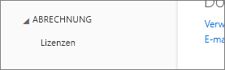
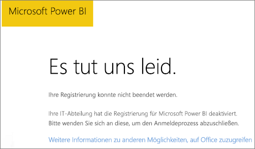
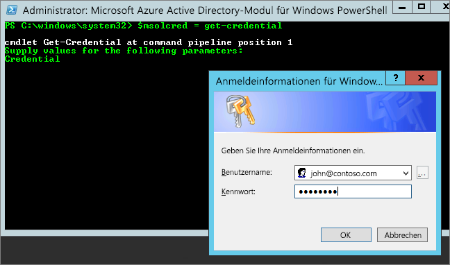

# Power BI kann einem Office 365-Partnerabonnement nicht hinzugefügt werden
Office 365 ermöglicht Unternehmen, Office 365 integriert und gebündelt mit eigenen Lösungen weiterzuvertreiben, wodurch Endkunden eine einzelne Anlaufstelle für Kauf, Abrechnung und Support zur Verfügung steht.

Wenn Sie sich für den Erwerb von Power BI in Kombination mit Ihrem Office 365-Abonnement interessieren, empfehlen wir Ihnen, sich zu diesem Zweck mit Ihrem Partner in Verbindung zu setzen. Wenn Ihr Partner Power BI nicht anbietet, stehen Ihnen verschiedene Wege offen.

1. Sie können den Dienst über einen anderen Kanal erwerben, entweder direkt bei Microsoft oder bei einem anderen Partner. Abhängig von der Beziehung mit dem Partner steht diese Option jedoch nicht allen Kunden offen. Sie können dies überprüfen, indem Sie zu **Office 365-Verwaltungsportal** > **Abrechnung** > **Abonnements** navigieren. Wenn dort **Abonnements**angezeigt wird, können Sie den Dienst direkt bei Microsoft erwerben oder sich mit einem Partner in Verbindung setzen, der Power BI anbietet.
   
    
2. Wenn **Abonnements** nicht unter **Abrechnung**aufgeführt ist, können Sie nicht direkt bei Microsoft oder einem anderen Partner kaufen. 
   
   

Wenn Sie Power BI nicht direkt erwerben können, und abhängig von dem Typ des Power BI-Abonnements, das Sie interessiert, stehen Ihnen immer noch einige Wege offen.

[Power BI (Free)](#power-bi-free)

[Power BI Pro und Premium](#power-bi-pro)

## Power BI (Free)
Wenn Sie mit der Gratisversion von Power BI zufrieden sind, können Sie sich für den kostenlosen Dienst anmelden. Standardmäßig sind individuelle Anmeldungen, sogenannte Ad-hoc-Abonnements, deaktiviert. Bei dem Versuch, sich für Power BI anzumelden, sehen Sie in diesem Fall die Meldung, dass Ihre IT-Abteilung die Anmeldung für Microsoft Power BI deaktiviert hat.

    Your IT department has turned off signup for Microsoft Power BI.

Um Ad-Hoc-Abonnements zu aktivieren können Sie sich an Ihren Partner wenden und ihn auffordern, sie zu aktivieren. Wenn Sie Administrator Ihres Mandanten sind und wissen, wie Azure Active Directory PowerShell-Befehle genutzt werden, können Sie Ad-Hoc-Abonnements selbst aktivieren. [Weitere Informationen](https://technet.microsoft.com/library/jj151815.aspx)

1. Sie müssen sich zuerst mithilfe Ihrer Office 365-Anmeldeinformationen bei Azure Active Directory anmelden. In der ersten Zeile werden Sie zur Eingabe Ihrer Anmeldeinformationen aufgefordert. Die zweite Zeile stellt die Verbindung mit Azure Active Directory her.
   
        $msolcred = get-credential
        connect-msolservice -credential $msolcred
   
    
2. Nachdem Sie angemeldet sind, können Sie den folgenden Befehl ausgeben, um die kostenlose Registrierung zu aktivieren.
   
        Set-MsolCompanySettings -AllowAdHocSubscriptions $true

## Power BI Pro und Premium
Wenn Sie ein Abonnement für Power BI Pro oder Power BI Premium erwerben möchten, müssen Sie sich mit Ihrem Partner in Verbindung setzen und herausfinden, welche Optionen sich Ihnen bieten.

* Der Partner erklärt sich bereit, Power BI in sein Portfolio aufzunehmen, sodass sie bei ihm kaufen können.
* Der Partner kann Sie auf ein Modell umstellen, bei dem Sie Power BI direkt bei Microsoft oder einem anderen Partner erwerben können, der Power BI anbietet.

Das folgende Video geht auf die Office 365-Syndizierung und den Erwerb von Power BI ein.

<iframe width="560" height="315" src="https://www.youtube.com/embed/C357phT94A8" frameborder="0" allowfullscreen></iframe>

## Nächste Schritte
[Verwalten von Azure AD mit Windows PowerShell](https://technet.microsoft.com/library/jj151815.aspx)  
[Power BI Premium – Beschreibung](service-premium.md)

Weitere Fragen? [Stellen Sie Ihre Frage in der Power BI-Community.](http://community.powerbi.com/)

