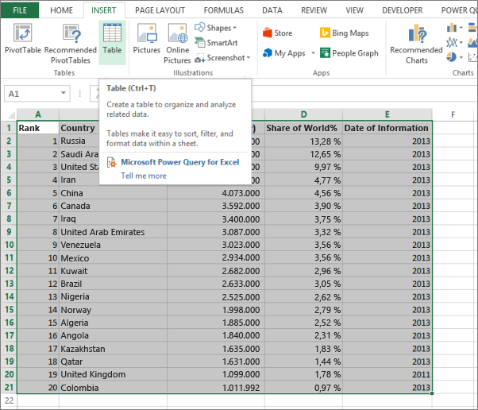
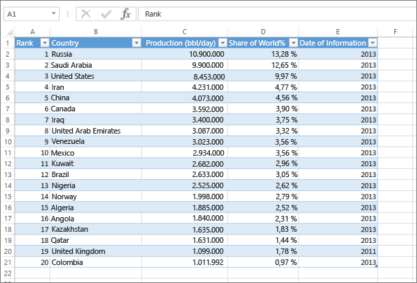

# Fehler: Wir haben in Ihrer Excel-Arbeitsmappe keine Daten gefunden

>[!NOTE]
>Dieser Artikel gilt für Excel 2007 und höher.

Beim Importieren einer Excel-Arbeitsmappe in Power BI wird möglicherweise die folgende Fehlermeldung angezeigt:

*Fehler: Wir haben in Ihrer Excel-Arbeitsmappe keine Daten gefunden. Die Daten werden möglicherweise nicht ordnungsgemäß formatiert. Sie müssen die Arbeitsmappe in Excel bearbeiten und dann erneut importieren.*

## Schnelle Lösung
1. Bearbeiten Sie die Arbeitsmappe in Excel.
2. Wählen Sie den Zellenbereich aus, der Ihre Daten enthält. Die erste Zeile sollte die Spaltenüberschriften (Spaltennamen) enthalten.
3. Drücken Sie **STRG+T** , um eine Tabelle zu erstellen.
4. Speichern Sie die Arbeitsmappe.
5. Kehren Sie zu Power BI zurück, und importieren Sie die Arbeitsmappe erneut. Wenn Sie in Excel 2016 arbeiten und die Arbeitsmappe bei OneDrive for Business gespeichert haben, klicken Sie in Excel auf „Datei > Veröffentlichen“.

## Details
### Ursache
In Excel können Sie aus einem Zellenbereich eine **Tabelle** erstellen, wodurch die Daten einfacher sortiert, gefiltert und formatiert werden können.

Wenn Sie eine Excel-Arbeitsmappe importieren, sucht Power BI nach diesen Tabellen und importiert sie in ein Dataset. Wenn keine Tabellen gefunden werden, wird diese Fehlermeldung angezeigt.

### Lösung
1. Öffnen Sie die Arbeitsmappe in Excel. 
    >[!NOTE]
    >Die hier verwendeten Abbildungen zeigen Excel 2013. Wenn Sie eine andere Version verwenden, sind die Schritte identisch, die Abbildungen können jedoch leicht abweichen.
    
    
2. Wählen Sie den Zellenbereich aus, der Ihre Daten enthält. Die erste Zeile sollte die Spaltenüberschriften (Spaltennamen) enthalten:
   
    
3. Klicken Sie auf dem Menüband auf der Registerkarte **EINFÜGEN** auf **Tabelle**. (Als Tastenkombination können Sie auch **STRG+T**drücken.)
   
    
4. Das folgende Dialogfeld wird angezeigt. Stellen Sie sicher, dass **Meine Tabelle hat Überschriften** aktiviert ist, und klicken Sie dann auf **OK**:
   
    
5. Jetzt werden die Daten als Tabelle formatiert:
   
    
6. Speichern Sie die Arbeitsmappe.
7. Kehren Sie zu Power BI zurück. Wählen Sie unten im linken Navigationsbereich „Daten abrufen“ aus.
   
    
8. Wählen Sie im Feld **Dateien** die Option **Abrufen**aus.
   
    
9. Importieren Sie die Excel-Arbeitsmappe erneut. Dieses Mal sollte der Importvorgang die Tabelle finden und erfolgreich ausgeführt werden.
   
    Wenn der Importvorgang weiterhin fehlschlägt, teilen Sie es uns mit, indem Sie im Hilfemenü auf **Community** klicken:
   
    
