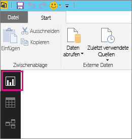
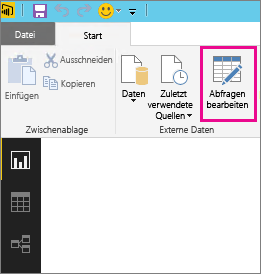
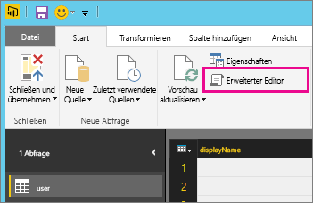
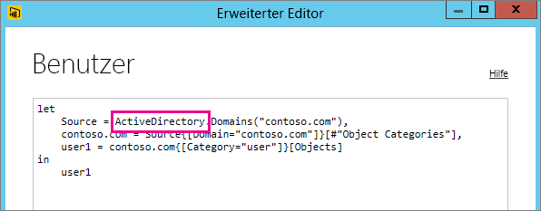

# Problembehandlung bei nicht unterstützter Datenquelle für die Aktualisierung
Bei der Konfiguration eines Datasets für die planmäßige Aktualisierung kann ein Fehler angezeigt werden.

        You cannot schedule refresh for this dataset because it gets data from sources that currently don’t support refresh.

Dies geschieht, wenn die innerhalb von Power BI-Desktop verwendete Datenquelle für die Aktualisierung nicht unterstützt wird. Sie müssen die von Ihnen verwendete Datenquelle suchen und mit der Liste der unterstützten Datenquellen unter [Aktualisieren von Daten in Power BI](refresh-data.md) vergleichen. 

## Suchen der Datenquelle
Wenn Sie unsicher sind, welche Datenquelle verwendet wurde, können Sie diese suchen, indem Sie die folgenden Schritte in Power BI Desktop ausführen.  

1. Vergewissern Sie sich in Power BI Desktop, dass Sie sich im **Berichtsbereich** befinden.  
   
2. Wählen Sie im Menüband die Option **Abfragen bearbeiten** aus.  
   
3. Wählen Sie **Erweiterter Editor**aus.  
   
4. Notieren Sie sich den für die Datenquelle aufgeführten Anbieter.  In diesem Beispiel ist der Anbieter Active Directory.  
   
5. Vergleichen Sie den Anbieter mit der Liste der unterstützten Datenquellen unter [Aktualisieren von Daten in Power BI](refresh-data.md).  Sie werden feststellen, dass Active Directory für die Aktualisierung keine unterstützte Datenquelle ist.  

## Nächste Schritte
[Datenaktualisierung](refresh-data.md)  
[Power BI Gateway – Personal](personal-gateway.md)  
[Lokales Datengateway](service-gateway-onprem.md)  
[Problembehandlung beim lokalen Datengateway](service-gateway-onprem-tshoot.md)  
[Problembehandlung für Power BI Gateway – Personal](service-admin-troubleshooting-power-bi-personal-gateway.md)  

Weitere Fragen? [Stellen Sie Ihre Frage in der Power BI-Community.](http://community.powerbi.com/)

