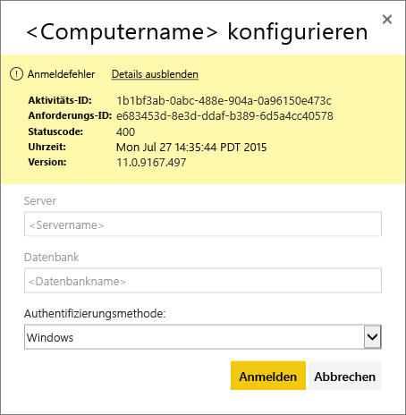
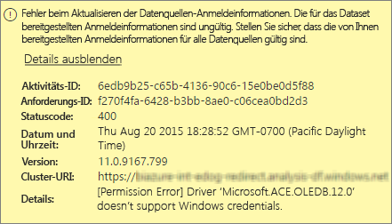
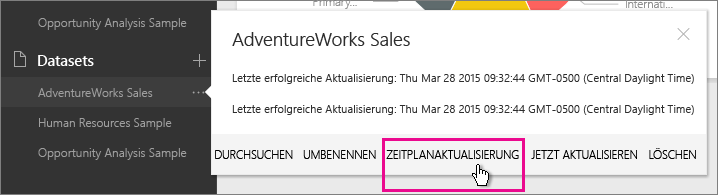
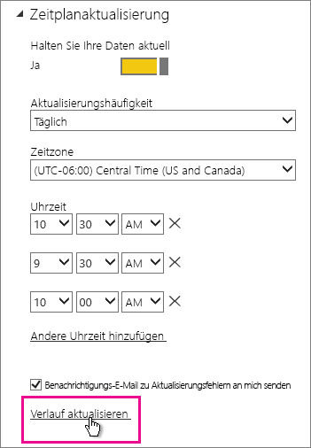
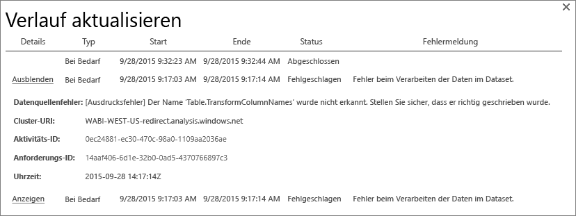
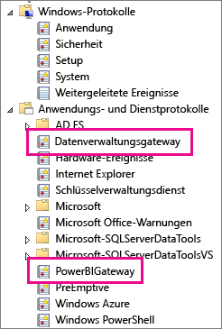
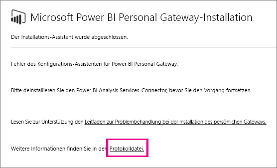
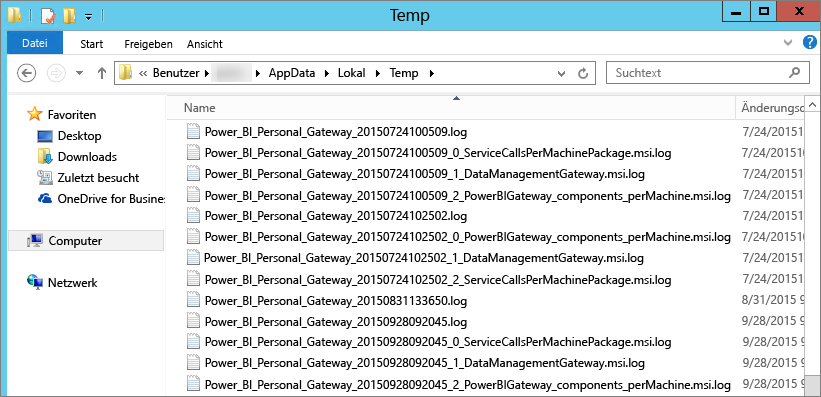

# Problembehandlung für Power BI Gateway – Personal
Im Folgenden werden einige häufige Fehler erläutert, die beim Verwenden von Power BI Gateway – Personal möglicherweise auftreten.

> [!NOTE]
> Die aktuelle Version des Gateways für den persönlichen Gebrauch ist das **lokale Datengateway (Personal)**. Aktualisieren Sie Ihre Installation mit dieser Version.
> 
> 

## Aktualisieren auf die neueste Version
Viele Probleme können auftreten, wenn die Gatewayversion veraltet ist.  Es ist ratsam sicherzustellen, dass Sie immer die aktuelle Version verwenden.  Wenn Sie das Gateway einen Monat oder länger nicht mehr aktualisiert haben, sollten Sie die aktuelle Version des Gateways installieren und prüfen, ob Sie das Problem reproduzieren können.

## Installation
**Personal Gateway unterstützt nur 64 Bit**: Wenn Ihr Computer ein 32-Bit-Betriebssystem verwendet, können Sie das persönliche Gateway nicht installieren. Es muss ein 64-Bit-Betriebssystem verwendet werden. Installieren Sie entweder eine 64-Bit-Version von Windows, oder installieren Sie das persönliche Gateway auf einem 64-Bit-Computer.

**Fehler bei der Installation von Personal Gateway als Dienst, obwohl Sie ein lokaler Administrator des Computers sind**: Bei der Installation kann ein Fehler auftreten, wenn der Benutzer Mitglied der lokalen Administratorgruppe des Computers ist, die Gruppenrichtlinien die Anmeldung dieses Benutzernamens als Dienst jedoch nicht erlauben.  Stellen Sie zunächst sicher, dass die Gruppenrichtlinien die Anmeldung von Benutzern als Dienst zulassen. Wir arbeiten an einer Korrektur für dieses Problem. [Weitere Informationen](https://technet.microsoft.com/library/cc739424.aspx)

**Timeout beim Vorgang**: Dies tritt häufig auf, wenn der Computer (physischer Computer oder VM), auf dem Sie Personal Gateway installieren, über einen Einzelkernprozessor verfügt. Schließen Sie eventuell geöffnete Anwendungen, deaktivieren Sie alle nicht benötigten Prozesse, und versuchen Sie die Installation erneut.

**Das Datenverwaltungsgateway und der Analysis Services Connector können nicht auf demselben Computer wie Personal Gateway installiert werden** – Wenn auf dem Computer bereits ein Analysis Services Connector oder ein Datenverwaltungsgateway installiert ist, müssen Sie den Connector oder das Gateway zuerst deinstallieren und dann erneut versuchen, Personal Gateway zu installieren.

> [!NOTE]
> Wenn während der Installation ein Fehler auftritt, können Sie in den Setupprotokollen möglicherweise hilfreiche Informationen zum Lösen des Problems finden. Weitere Informationen finden Sie unter [Setupprotokolle](#SetupLogs).
> 
> 

 **Proxykonfiguration:** Es treten möglicherweise Probleme beim Konfigurieren des persönlichen Gateways auf, wenn für Ihre Umgebung ein Proxy erforderlich ist. Weitere Informationen zum Konfigurieren von Proxyinformationen finden Sie unter [Konfigurieren von Proxyeinstellungen für Power BI-Gateways](service-gateway-proxy.md).

## Zeitplanaktualisierung
**Fehler: Die in der Cloud gespeicherten Anmeldeinformationen sind nicht vorhanden.**

Dieser Fehler kann z.B. in den Einstellungen für \<dataset\> auftreten, wenn Sie eine Zeitplanaktualisierung geplant und anschließend Personal Gateway deinstalliert und erneut installiert haben. Bei der Deinstallation von Personal Gateway werden die Datenquellen-Anmeldeinformationen für ein Dataset, die für die Aktualisierung konfiguriert wurden, aus dem Power BI-Dienst entfernt.

**Lösung:** Navigieren Sie in Power BI zu den Aktualisierungseinstellungen für ein Dataset. Klicken Sie in „Datenquellen verwalten“ für eine beliebige Datenquelle mit einem Fehler auf „Anmeldeinformationen bearbeiten“, und melden Sie sich dann wieder bei der Datenquelle an.

**Fehler: Die für das Dataset bereitgestellten Anmeldeinformationen sind ungültig. Aktualisieren Sie die Anmeldeinformationen mithilfe einer Aktualisierung oder im Dialogfeld „Datenquelleneinstellungen“, um fortzufahren.**

**Lösung:** Wenn Sie eine Nachricht bezüglich Anmeldeinformationen erhalten, könnte Folgendes zutreffen:

* Achten Sie darauf, dass die für die Anmeldung bei Datenquellen verwendeten Benutzernamen und Kennwörter aktuell sind. Navigieren Sie in Power BI zu den Aktualisierungseinstellungen für das Dataset. Klicken Sie in „Datenquellen verwalten“ auf „Anmeldeinformationen bearbeiten“, um die Anmeldeinformationen für die Datenquelle zu aktualisieren.
* Mashups zwischen einer Cloud-Quelle und einer lokalen Quelle in einer einzelnen Abfrage werden im persönlichen Gateway nicht aktualisiert, wenn eine der Quellen OAuth als Authentifizierungsmethode verwendet. Ein Beispiel hierfür ist ein Mashup zwischen CRM Online und einem lokalen SQL Server. Dies funktioniert nicht, da CRM Online OAuth erfordert.
  
  Dieses Fehlverhalten ist bekannt und wird derzeit untersucht. Um das Problem zu umgehen, können für die Cloudquelle und die lokale Quelle getrennte Abfragen verwendet werden, die dann in einer Merge- oder Append-Abfrage zusammengeführt werden.

**Fehler: Nicht unterstützte Datenquelle.**

**Lösung:** Wenn in den Einstellungen für die Zeitplanaktualisierung eine Nachricht zu einer nicht unterstützten Datenquelle angezeigt wird, kann das Folgendes bedeuten: 

* Die Aktualisierung der Datenquelle wird von Power BI aktuell nicht unterstützt. 
* Die Excel-Arbeitsmappe enthält kein Datenmodell, sondern nur Arbeitsblattdaten. Power BI unterstützt die Aktualisierung zurzeit nur, wenn die hochgeladene Excel-Arbeitsmappe ein Datenmodell enthält. Achten Sie beim Importieren von Daten in Excel mithilfe von Power Query darauf, die Option zum Laden von Daten in ein Datenmodell zu aktivieren. Dadurch wird sichergestellt, dass die Daten in ein Datenmodell importiert werden. 

**Fehler: [Daten können nicht verbunden werden] &lt;Abfragteteil&gt;/&lt;…&gt;/&lt;…&gt; greift auf Datenquellen mit Sicherheitsstufen zu, die nicht gemeinsam verwendet werden können. Erstellen Sie diese Datenkombination neu.**

**Lösung:** Dieser Fehler wird durch die Einschränkungen der Datenschutzstufe verursacht sowie durch die Arten der verwendeten Datenquellen.

**Fehler: Datenquellenfehler: Der Wert „\[Tabelle\]“ kann nicht in den Typ „Tabelle“ konvertiert werden.**

**Lösung:** Dieser Fehler wird durch die Einschränkungen der Datenschutzstufe verursacht sowie durch die Arten der verwendeten Datenquellen.

**Fehler: Für diese Zeile ist nicht ausreichend Platz vorhanden.**

Dieser Fehler tritt auf, wenn eine einzelne Zeile größer als 4 MB ist. Finden Sie in diesem Fall heraus, um welche Zeile in der Datenquelle es sich handelt, und versuchen Sie, die Zeile herauszufiltern oder deren Größe zu verringern.

## Datenquellen
**Fehlender Datenanbieter** – Personal Gateway unterstützt nur 64-Bit-Systeme. Auf demselben Computer, auf dem Personal Gateway installiert ist, muss eine 64-Bit-Version der Datenanbieter installiert sein. Wenn beispielsweise die Datenquelle im Dataset Microsoft Access ist, müssen Sie den 64-Bit-ACE-Anbieter auf demselben Computer wie Personal Gateway installieren.  

>[!NOTE]
>Wenn Sie die 32-Bit-Version von Excel verwenden, können Sie keinen 64-Bit-ACE-Anbieter auf dem gleichen Computer installieren.

**Windows-Authentifizierung wird für Access-Datenbanken nicht unterstützt** – Power BI unterstützt zurzeit für Access-Datenbanken nur „anonym“. Wir arbeiten an einer Lösung, Windows-Authentifizierung für Access-Datenbanken zu ermöglichen.

**Anmeldefehler beim Eingeben von Anmeldeinformationen für eine Datenquelle** – Wenn bei der Eingabe von Windows-Anmeldeinformationen für eine Datenquelle dieser oder ein ähnlicher Fehler angezeigt wird, verwenden Sie möglicherweise noch eine alte Version von Personal Gateway. [Installieren Sie die neueste Version von Power BI Gateway – Personal](https://powerbi.microsoft.com/gateway/).

  

**Fehler: Anmeldefehler beim Auswählen von Windows-Authentifizierung für eine Datenquelle, die ACE OLEDB verwendet** – Wenn beim Eingeben von Datenquellen-Anmeldeinformationen für eine Datenquelle, die den ACE-OLEDB-Anbieter verwendet, dieser Fehler angezeigt wird:

Power BI unterstützt derzeit keine Windows-Authentifizierung für eine Datenquelle, die den ACE-OLEDB-Anbieter verwendet.

**Lösung:** Zur Umgehung dieses Fehlers können Sie die anonyme Authentifizierung auswählen. Bei ACE-OLEDB-Legacyanbietern sind anonyme Anmeldeinformationen gleichbedeutend mit Windows-Anmeldeinformationen.

## Kachelaktualisierung
Falls ein Fehler beim Aktualisieren von Dashboardkacheln auftritt, lesen Sie folgenden Artikel.

[Problembehandlung für Kachelfehler](refresh-troubleshooting-tile-errors.md)

## Tools zur Problembehandlung
### Aktualisieren des Verlaufs
Mit **Verlauf aktualisieren** können Sie sehen, welche Fehler aufgetreten sind, und Sie erhalten nützliche Daten, wenn Sie eine Supportanfrage erstellen müssen. Sie können sowohl geplante Aktualisierungen als auch Aktualisierungen nach Bedarf anzeigen. Hier ist beschrieben, wie Sie zur Option **Verlauf aktualisieren**gelangen.

1. Wählen Sie im Power BI-Navigationsbereich in **Datasets** für das Dataset &gt; Menü öffnen &gt;**Aktualisierung planen** aus.
   
2. Wählen Sie unter **Einstellungen für...** &gt;**Aktualisierung planen** die Option **Verlauf aktualisieren** aus.  
   
   
   

### Ereignisprotokolle
Es gibt mehrere Ereignisprotokolle, die Informationen liefern können. Die ersten beiden, **Datenverwaltungsgateway** und **PowerBIGateway**, sind vorhanden, wenn Sie der Administrator des Computers sind.  Wenn Sie kein Administrator sind und das Personal Gateway verwenden, werden die Protokolleinträge im Protokoll **Anwendung** angezeigt.

Die Protokolle **Datenverwaltungsgateway** und **PowerBIGateway** befinden sich unter **Anwendungs- und Dienstprotokolle**.

### Ablaufverfolgung mit Fiddler
[Fiddler](http://www.telerik.com/fiddler) ist ein kostenloses Tool von Telerik, mit dem HTTP-Verkehr überwacht werden kann.  Sie können den Datenaustausch zwischen dem Power BI-Dienst und dem Clientcomputer verfolgen. So können Sie Fehler und ähnliche Informationen anzeigen.

### Setupprotokolle
Wenn **Personal Gateway** nicht installiert werden kann, wird ein Link zum Anzeigen des Setupprotokolls eingeblendet. Darin können Details zum Fehler enthalten sein. Dies sind Windows-Installationsprotokolle, auch MSI-Protokolle genannt. Sie können recht komplex und schwierig zu lesen sein. Der resultierende Fehler taucht in der Regel unten auf, das Bestimmen der Fehlerursache ist jedoch nicht trivial. Es könnte sich dabei um das Ergebnis von Fehlern in einem anderen Protokoll oder das Ergebnis eines Fehlers weiter oben im Protokoll handeln.

Sie können auch im Ordner **Temp** (%temp%) nach Dateien suchen, die mit **Power\_BI\_** beginnen.

> [!NOTE]
> Wenn Sie auf „%temp%“ zugreifen, gelangen Sie unter Umständen in einen Unterordner von „temp“.  Die Dateien mit**Power\_BI\_** befinden sich im Stamm des temp-Verzeichnisses.  Sie müssen also ggf. ein oder zwei Ebenen nach oben navigieren.
> 
> 

## Nächste Schritte
[Konfigurieren von Proxyeinstellungen für Power BI-Gateways](service-gateway-proxy.md)  
[Datenaktualisierung](refresh-data.md)  
[Power BI Gateway – Personal](personal-gateway.md)  
[Problembehandlung für Kachelfehler](refresh-troubleshooting-tile-errors.md)  
[Problembehandlung beim lokalen Datengateway](service-gateway-onprem-tshoot.md)  
Weitere Fragen? [Wenden Sie sich an die Power BI-Community](http://community.powerbi.com/)

