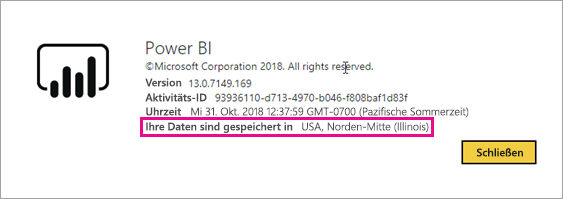
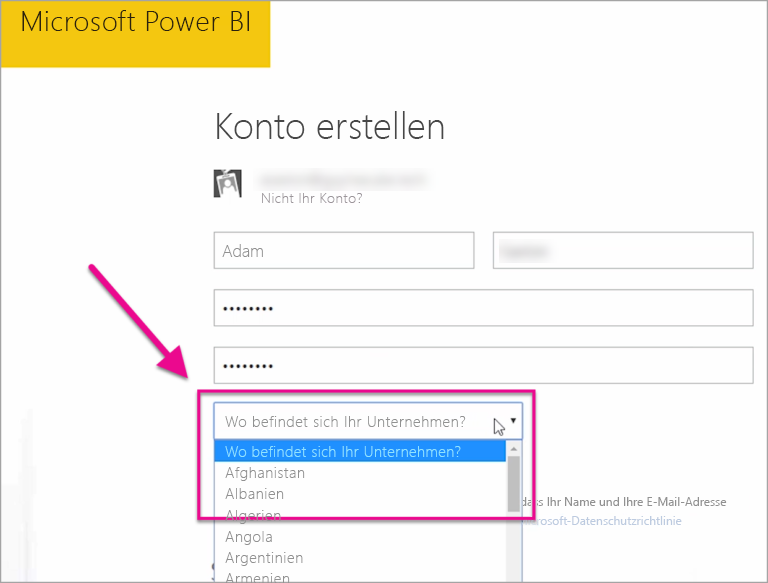

# Wo befindet sich mein Power BI-Mandant?

<iframe width="560" height="315" src="https://www.youtube.com/embed/0fOxaHJPvdM?showinfo=0" frameborder="0" allowfullscreen></iframe>

Hier erfahren Sie, wo sich der Power BI-Mandant befindet und wie dieser Ort ausgewählt wird. Die genaue Kenntnis des Orts ist wichtig, da dieser sich auf Ihre Interaktionen mit dem Dienst auswirken kann.

## So bestimmen Sie, wo sich der Power BI-Mandant befindet

Um die Region zu suchen, in der sich Ihr Mandant befindet, führen Sie die folgenden Schritte aus.

1. Klicken Sie im Power BI-Dienst im oberen Menü auf das Hilfesymbol (**?**) und dann auf **Info zu Power BI**.

1. Betrachten Sie den Wert neben **Ihre Daten sind gespeichert in**. Dies ist die Region, in der sich Ihr Mandant befindet. Dies ist auch die Region, in der Ihre Daten gespeichert werden, sofern Sie nicht dedizierte Kapazitäten in verschiedenen Regionen für Ihre Arbeitsbereiche verwenden.

    

## So wird der Datenbereich ausgewählt

Die Datenregion basiert auf dem Land, das Sie beim Erstellen des Mandanten auswählen. Dies gilt für die Registrierung für Office 365 sowie für Power BI, da diese Informationen gemeinsam verwendet werden. Wenn es sich um einen neuen Mandanten handelt, wählen Sie beim Registrieren das entsprechende Land aus der Liste aus.

Power BI wählt eine Datenregion aus, die sich möglichst nah an dem ausgewählten Land befindet – damit wird festgelegt, wo die Daten für Ihren Mandanten gespeichert werden.

> [!IMPORTANT]
> Diese Auswahl kann nach Erstellung des Mandanten nicht geändert werden.

Weitere Fragen? [Wenden Sie sich an die Power BI-Community](http://community.powerbi.com/)

