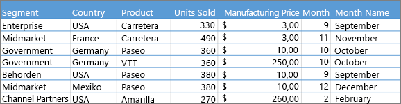
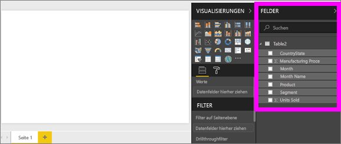
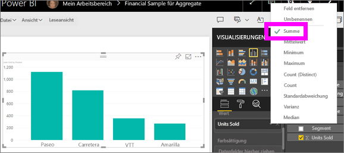
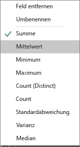
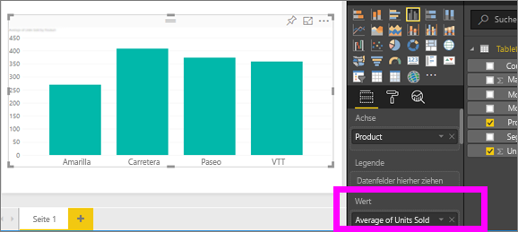
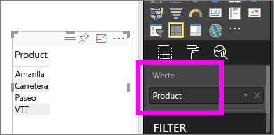
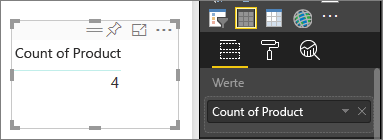
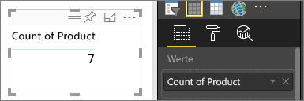
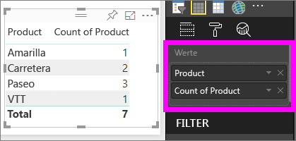

# Aggregate in Power BI-Visualisierungen
## Was ist ein Aggregat?
Unter Umständen möchten Sie Werte in Ihren Daten mathematisch miteinander kombinieren. Dabei kann es sich um die mathematische Operation zum Ermitteln von Summe, Mittelwert, Maximum, Anzahl usw. handeln. Das Kombinieren von Werten in Daten wird als *aggregieren* bezeichnet. Das Ergebnis dieser mathematischen Operation ist ein *Aggregat*. 

Wenn im Power BI-Dienst und Power BI Desktop Visualisierungen erstellt werden, können dabei Daten aggregiert werden. Häufig handelt es sich bei dem Aggregat bereits um die benötigten Werte, in anderen Fällen möchten Sie die Werte aber vielleicht auch auf andere Weise aggregieren,  z.B. mit einer Summe anstelle eines Durchschnittswerts. Es gibt verschiedene Möglichkeiten zum Verwalten und Ändern des Aggregats, das in einer Visualisierung verwendet wird.

Betrachten wir zunächst die *Datentypen*, da der Typ der Daten bestimmt, ob und wie sie aggregiert werden können.

## Datentypen
Die meisten Datasets enthalten mehr als einen Datentyp. Grundsätzlich sind die Daten entweder numerisch oder nicht numerisch. Numerische Daten können als Summe, Durchschnittswert, Anzahl, Mindestwert, Varianz usw. aggregiert werden. Sogar Textdaten, häufig als *Kategoriedaten* bezeichnet, können aggregiert werden. Wenn Sie ein Kategoriefeld aggregieren (indem Sie es in einem rein numerischen Bucket wie **Werte** oder **QuickInfos** platzieren), ermittelt Power BI die Vorkommen oder die eindeutigen Vorkommen der einzelnen Kategorien. Für bestimmte Arten von Daten, wie Datumsangaben, gibt es eigene Aggregatsoptionen: früheste, letzte, erste und letzte. 

Betrachten Sie folgendes Beispiel:
- **Units Sold** und **Manufacturing Price** sind Spalten mit numerischen Daten.
-  **Segment**, **Country**, **Product**, **Month** und **Month Name** enthalten Kategoriedaten.

   

Beim Erstellen einer Visualisierung in Power BI werden numerische Felder in einem Kategoriefeld aggregiert (die Standardeinstellung ist *Summe*).  Beispiele sind: „Units Sold ***by Product***“, „Units Sold ***by Month***“ und „Manufacturing Price ***by Segment***“. Einige numerische Felder werden auch als **Measures** bezeichnet. Measures sind im Power BI-Berichts-Editor leicht zu erkennen – sie werden in der Feldliste mit dem Symbol ∑ gekennzeichnet. Weitere Informationen finden Sie unter [Berichts-Editor: Verschaffen Sie sich einen Überblick](service-the-report-editor-take-a-tour.md).

## Warum funktionieren Aggregate nicht wie ich mir das vorstelle?
Die Verwendung von Aggregaten in Power BI kann teilweise etwas verwirrend sein. Haben Sie ein numerisches Feld, und Power BI lässt keine Änderung der Aggregation zu? Oder haben Sie ein Feld (beispielsweise ein Jahr), das nicht aggregiert werden soll, sondern für das Sie lediglich die Anzahl von Vorkommen ermitteln möchten?

In den meisten Fällen ist das Problem auf die Definition des Felds im Dataset zurückzuführen. Möglicherweise wurde das Feld als Text definiert, was erklären würde, warum keine Summe oder kein Mittelwert gebildet werden kann. [Die Kategorisierung eines Felds kann allerdings nur vom Besitzer des Datasets geändert werden.](desktop-measures.md) Wenn Sie also über Kontobesitzerberechtigungen für das Dataset verfügen (in Power BI Desktop oder in dem Programm, in dem das Dataset erstellt wurde, z.B. Excel), können Sie das Problem beheben. Andernfalls müssen Sie den Besitzer des Datasets um Hilfe bitten.  

Als Orientierungshilfe haben wir am **Ende dieses Artikels** einige Tipps und Problembehandlungsinformationen bereitgestellt.  Sollten Sie dort keine passende Antwort finden, posten Sie Ihre Frage im [Forum der Power BI-Community](http://community.powerbi.com). Dort erhalten Sie eine schnelle Antwort direkt vom Power BI-Team.

## Ändern, wie ein numerisches Feld aggregiert wird
Angenommen, Sie haben ein Diagramm, in dem die verkauften Einheiten für verschiedene Produkte addiert werden. Sie benötigen aber den Mittelwert. 

1. Erstellen Sie ein Diagramm, in dem eine Kategorie und ein Measure verwendet werden. In diesem Beispiel verwenden wir „Units Sold by Product“.  Power BI erstellt standardmäßig ein Diagramm mit der Summe der verkauften Einheiten (Measure im Feld „Wert“) für jedes Produkt (Kategorie im Feld „Achse“).

   

2. Klicken Sie im Visualisierungsbereich mit der rechten Maustaste auf das Measure, und wählen Sie den gewünschten Aggregattyp aus. In diesem Fall wählen wir „Durchschnitt“ aus. Wenn die benötigte Aggregation nicht angezeigt wird, finden Sie weiter unten unter „Zu beachtende Aspekte und Problembehandlung“ weitere Informationen.  
   
   
   
   > [!NOTE]
   > Die in der Dropdownliste verfügbaren Optionen hängen erstens vom ausgewählten Feld und zweitens von der Kategorisierung des ausgewählten Felds durch den Datasetbesitzer ab.
   > 
3. Die Visualisierung wird nun mit einem Durchschnittswert aggregiert.

   

##    Möglichkeiten zum Aggregieren von Daten

Hier sind einige der Optionen aufgeführt, die möglicherweise zum Aggregieren eines Felds zur Verfügung stehen:

* **Nicht zusammenfassen**. Ist diese Option ausgewählt, wird jeder Wert in diesem Feld separat behandelt und nicht zusammengefasst. Die Option wird häufig verwendet, wenn Sie eine Spalte mit numerischen IDs besitzen, die nicht addiert werden sollen.
* **Summe**. Mit dieser Option werden alle Werte in diesem Feld addiert.
* **Mittelwert**. Ermittelt den arithmetischen Mittelwert der Werte.
* **Minimum**. Zeigt den kleinsten Wert.
* **Maximum**. Zeigt den größten Wert.
* **Anzahl (ohne Leerstellen)**. Mit dieser Option wird die Anzahl der Werte im Feld gezählt, die nicht leer sind.
* **Anzahl (diskret)**. Mit dieser Option wird die Anzahl der verschiedenen Werte im Feld gezählt.
* **Standardabweichung**.
* **Varianz.**
* **Median**.  Zeigt den Medianwert (mittlerer Wert) an. Dies ist der Wert, der die gleiche Anzahl von Werten über und unter sich hat.  Wenn 2 Mediane vorhanden sind, erstellt Power BI einen Durchschnittswert.

Die Daten:

| Land | Menge |
|:--- |:--- |
| USA |100 |
| VEREINIGTES KÖNIGREICH |150 |
| Kanada |100 |
| Deutschland |125 |
| Frankreich | |
| Japan |125 |
| Australien |150 |

führen zu folgenden Ergebnissen:

* **Nicht zusammenfassen**: Jeder Wert wird separat dargestellt.
* **Summe**: 750
* **Mittelwert**: 125
* **Maximum**: 150
* **Minimum**: 100
* **Anzahl (ohne Leerstellen):** 6
* **Anzahl (diskret):** 4
* **Standardabweichung:** 20,4124145...
* **Varianz:** 416,666...
* **Median:** 125

## Erstellen eines Aggregats mit einem Kategoriefeld (Text)
Sie können auch nicht numerische Felder aggregieren. Wenn beispielsweise ein Feld mit Produktnamen vorhanden ist, können Sie es als Wert hinzufügen und dafür **Anzahl**, **Diskrete Anzahl**, **Erste** oder **Letzter** festlegen. 

1. In diesem Beispiel wurde das Feld **Product** in das Feld „Werte“ gezogen. Das Feld „Werte“ wird normalerweise für numerische Felder verwendet. Power BI erkennt, dass es sich um ein Textfeld handelt, legt das Aggregat auf **Nicht zusammenfassen** fest und zeigt eine einspaltige Tabelle an.
   
   
2. Wenn Sie die Aggregation von der Standardeinstellung **Nicht zusammenfassen** in **Anzahl (eindeutig)** ändern, zählt Power BI die Anzahl der verschiedenen Produkte. In diesem Fall sind dies 4.
   
   
3. Wenn Sie die Aggregation in **Anzahl**ändern, zählt Power BI die Gesamtanzahl. In diesem Fall sind es 7 Einträge für **Product**. 
   
   

4. Indem Sie das gleiche Feld (in diesem Fall **Product**) in das Feld „Werte“ ziehen und die Standardaggregation **Nicht zusammenfassen** übernehmen, gliedert Power BI die Anzahl nach Produkt.

   

## Zu beachtende Aspekte und Problembehandlung
F: Warum ist die Funktion **Nicht zusammenfassen** nicht verfügbar?

A: Das ausgewählte Feld ist wahrscheinlich ein berechnetes oder erweitertes Measure, das in Excel oder [Power BI Desktop](desktop-measures.md) erstellt wurde. Jedes berechnete Measure verfügt über eine eigene hartcodierte Formel. Sie können die verwendete Aggregation nicht ändern.  Wenn es sich z.B. um eine Summe handelt, muss es eine Summe bleiben. In der Feldliste sind *berechnete Measures* mit dem Rechnersymbol gekennzeichnet.

F: Mein Feld **ist** numerisch. Warum stehen mir nur die Optionen **Count** und **Distinct Count** zur Verfügung?

A1: Wahrscheinlich hat der Besitzer des Datasets das Feld (versehentlich oder absichtlich) *nicht* als Zahl klassifiziert. Wenn beispielsweise ein Dataset das Feld **Jahr** enthält, wurde es vom Besitzer des Datasets eventuell als Text kategorisiert, da die Wahrscheinlichkeit höher ist, dass der Inhalt des Felds **Jahr** gezählt (z.B. die Anzahl der 1974 geborenen Personen) wird, als dass sein Inhalt addiert oder sein Mittelwert berechnet wird. Als Besitzer können Sie das Dataset in Power BI Desktop öffnen und auf der Registerkarte **Modellierung** den Datentyp ändern.  

A2: Wenn das Feld mit einem Rechnersymbol gekennzeichnet ist, handelt es sich um ein *berechnetes Measure*. Jedes berechnete Measure verfügt über eine eigene hartcodierte Formel, die nur vom Besitzer eines Datasets geändert werden kann. Bei der verwendeten Berechnung kann es sich um eine einfache Aggregation wie einen Mittelwert oder eine Summe handeln, aber auch kompliziertere Aggregationen wie „prozentualer Anteil an einer übergeordneten Kategorie“ oder „laufende Summe seit Jahresbeginn“ sind möglich. Power BI bildet keine Summe und keinen Mittelwert für die Ergebnisse, sondern führt stattdessen lediglich eine Neuberechnung für die einzelnen Datenpunkte durch (unter Verwendung der hartcodierten Formel).

A3: Eine weitere Möglichkeit: Sie haben das Feld in einem *Bucket* platziert, in dem nur Kategoriewerte zulässig sind.  In diesem Fall stehen nur die Optionen „Count“ und „Distinct Count“ zur Verfügung.

A4: Dritte Möglichkeit: Das Feld wird für eine Achse verwendet. Auf der Achse eines Balkendiagramms zeigt Power BI beispielsweise jeweils einen Balken pro eindeutigem Wert an. Die Feldwerte werden also überhaupt nicht aggregiert. 

>[!NOTE]
>Eine Ausnahme sind Punktdiagramme, bei denen aggregierte Werte für die X- und Y-Achse *erforderlich* sind.

F: Warum kann ich keine Textfelder für SSAS-Datenquellen aggregieren?

A: Liveverbindungen mit SSAS MD lassen eine clientseitige Aggregation nicht zu. Dies schließt „Erste“, „Letzte“, „Mittelwert“, „Minimum“, „Maximum“ und „Summe“ ein.

F: Ich habe ein Punktdiagramm und möchte *nicht*, dass mein Feld aggregiert wird.  Wie kann ich das erreichen?

A: Fügen Sie das Feld dem Bucket **Details** (und nicht den Buckets für die X- oder Y-Achse) hinzu.

F: Wenn ich ein numerisches Feld einer Visualisierung hinzufüge, wird bei den meisten standardmäßig eine Summe gebildet, bei einigen wird hingegen standardmäßig ein Mittelwert gebildet, die Anzahl ermittelt oder eine andere Aggregation verwendet.  Warum ist die standardmäßige Aggregation nicht immer gleich?

A: Besitzer von Datasets können die Standardzusammenfassung individuell für einzelne Felder festlegen. Als Besitzer eines Datasets können Sie die Standardzusammenfassung auf der Power BI Desktop-Registerkarte **Modellierung** ändern.

F: Ich bin Besitzer eines Datasets und möchte sicherstellen, dass ein Feld nicht aggregiert wird. Wie gehe ich dazu vor?

A: Legen Sie in Power BI Desktop auf der Registerkarte **Modellierung** die Option **Datentyp** auf **Text** fest.

F: In der Dropdownliste steht die Option **Nicht zusammenfassen** nicht zur Verfügung. Was kann ich tun?

A: Entfernen Sie das Feld, und fügen Sie es anschließend wieder hinzu.

Weitere Fragen? [Wenden Sie sich an die Power BI-Community](http://community.powerbi.com/)

