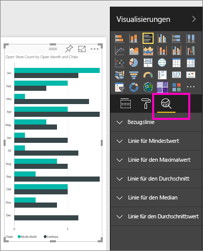
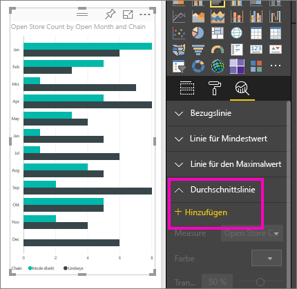
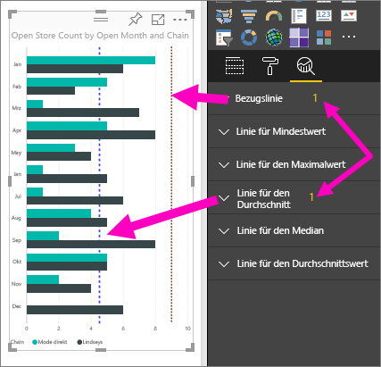
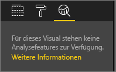

# Analysebereich im Power BI-Dienst
Mit dem Bereich **Analyse** im **Power BI-Dienst** können Sie Visualisierungen dynamische *Bezugslinien* hinzufügen und wichtige Trends und Erkenntnisse identifizieren.

> [!NOTE]
> Der Bereich **Analyse** wird nur angezeigt, wenn Sie im Zeichenbereich ein Visual auswählen.
> 
> 

## Verwendung des Bereichs „Analyse“
Mithilfe des Bereichs **Analyse** können Sie die folgenden Arten von dynamischen Bezugslinien erstellen (wobei nicht alle Linien für alle Visualisierungstypen verfügbar sind):

* Bezugslinie für X-Achse
* Bezugslinie für Y-Achse
* Linie für Mindestwert
* Linie für Maximalwert
* Durchschnittslinie
* Linie für Medianwert
* Linie für Perzentil

Um die für eine Visualisierung verfügbaren dynamischen Bezugslinien anzuzeigen, führen Sie die folgenden Schritte aus:

1. Wählen Sie eine Visualisierung aus, oder erstellen Sie eine Visualisierung. Wählen Sie dann das Symbol **Analyse** im Bereich **Visualisierungen** aus.

2. Wählen Sie für die gewünschte Linie den Pfeil nach unten aus, um die entsprechenden Optionen zu erweitern. In diesem Fall entscheiden wir uns für die **Durchschnittslinie**.
   
   

3. Wählen Sie zum Erstellen einer neuen Zeile **+ Hinzufügen** aus, und legen Sie das Measure fest, das zum Erstellen der Linie verwendet wird.  Das Dropdownmenü **Measure** enthält automatisch die verfügbaren Daten aus der ausgewählten Visualisierung. Wir verwenden **Open store count**.

5. Für jede Linie steht eine Reihe an Optionen zur Verfügung, z.B. Farbe, Transparenz, Stil und Position (bezogen auf die Datenelemente der Visualisierung). Wenn eine Bezeichnung für die Linie angezeigt werden soll, fügen Sie einen Titel hinzu, und legen Sie den Schieberegler **Datenbeschriftung** auf **Ein** fest.  In diesem Fall geben wir den Titel *Avg # Open Stores* (Durchschnittsanzahl geöffnete Stores) ein und passen einige weitere Optionen an (siehe unten).
   
   

1. Beachten Sie die Zahl, die neben dem Element **Durchschnittslinie** im Bereich **Analyse** angezeigt wird. Dieser Wert steht für die Anzahl der in Ihrer Visualisierung verwendeten dynamischen Linien und verrät auch, von welchem Typ diese sind. Wenn wir eine **Bezugslinie** als Ziel für die Store-Anzahl 9 hinzufügen, wird im Bereich **Analyse** angezeigt, dass nun auch eine **Bezugslinie** im Visual verwendet wird.
   
   
   

Sie können viele interessante Einblicke gewinnen, wenn Sie mithilfe des Bereichs **Analyse** dynamische Bezugslinien erstellen.

## Zu beachtende Aspekte und Problembehandlung

Wenn Ihre Visualisierung keine dynamischen Bezugslinien verwenden kann (hier eine Visualisierung vom Typ **Karte**), sehen Sie das Folgende, wenn Sie den Bereich **Analyse** aufrufen.
   

Die Möglichkeit zum Verwenden von dynamischen Bezugslinien ist abhängig vom verwendeten visuellen Element. Die folgende Liste zeigt, welche dynamischen Linien zurzeit für welche visuellen Objekte verfügbar sind:

Dynamische Linien sind für die folgenden visuellen Elemente in vollem Umfang verfügbar:

* Flächendiagramm
* Liniendiagramm
* Punktdiagramm
* Gruppiertes Säulendiagramm
* Gruppiertes Balkendiagramm

Für die folgenden visuellen Elemente kann nur eine *Bezugslinie* aus dem Bereich **Analyse** verwendet werden:

* Gestapelte Fläche
* Gestapelter Balken
* Gestapelte Säule
* Gestapelter Balken (100 %)
* Gestapelte Säule (100 %)

Für die folgenden visuellen Elemente ist die einzige Option zurzeit eine *Trendlinie*:

* Nicht gestapelte Linie
* Gruppiertes Säulendiagramm

Außerdem können für nicht kartesische visuelle Elemente zurzeit keine dynamischen Linien im Bereich **Analyse** anwendet werden, z. B.:

* Matrix
* Kreisdiagramm
* Ringdiagramm
* Tabelle (Table)

## Nächste Schritte
[Analysebereich in Power BI Desktop](desktop-analytics-pane.md)

Weitere Fragen? [Wenden Sie sich an die Power BI-Community](http://community.powerbi.com/)

