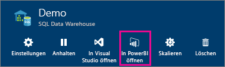
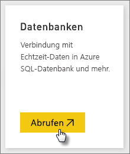
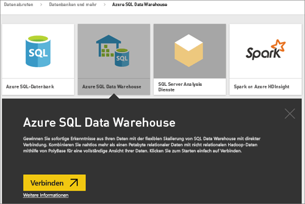
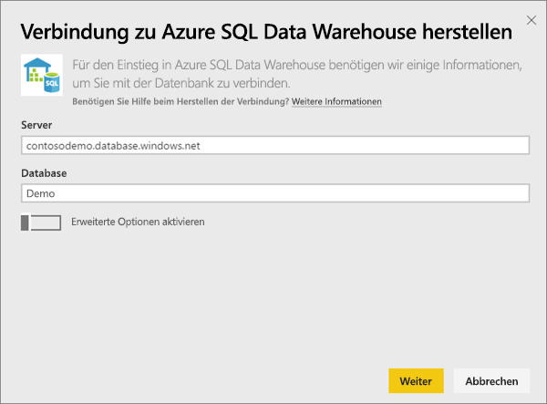
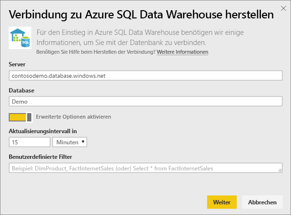
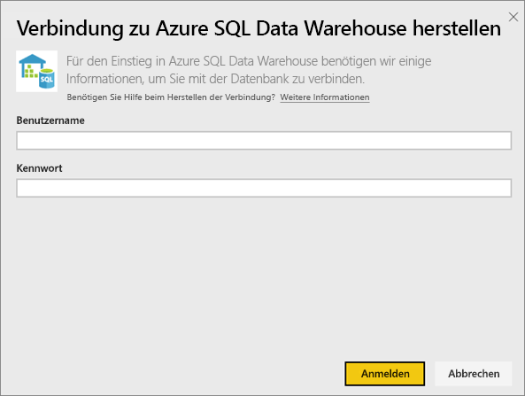
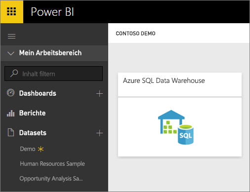
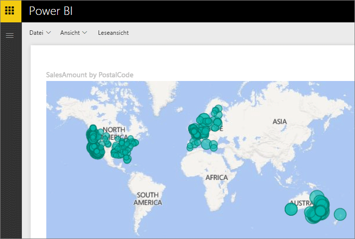
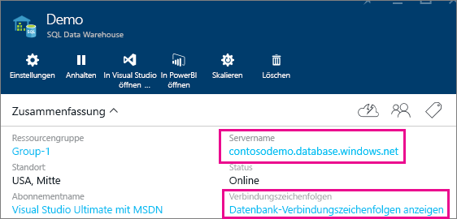

# Azure SQL Data Warehouse mit DirectQuery
Mit Azure SQL Data Warehouse mit DirectQuery können Sie dynamische Berichte auf Basis von Daten und Metriken erstellen, die bereits in Azure SQL Data Warehouse verfügbar sind. Mit DirectQuery werden Abfragen in Echtzeit zurück zu Ihrem Azure SQL Data Warehouse gesendet, während Sie die Daten durchsuchen. In Kombination mit der Skalierung von SQL Data Warehouse können Benutzer dadurch dynamische Berichte in Minutenschnelle für Terabyte von Daten erstellen. Darüber hinaus ermöglicht die Einführung der Schaltfläche **In Power BI öffnen** Benutzern, eine direkte Verbindung von Power BI zu ihrem SQL Data Warehouse herzustellen, ohne die Informationen manuell angeben zu müssen.

Bei Verwendung des SQL Data Warehouse-Connectors:

* Geben Sie beim Herstellen der Verbindung den vollqualifizierten Servernamen an (Einzelheiten finden Sie weiter unten).
* Stellen Sie sicher, dass Firewall-Regeln für den Server so konfiguriert sind, dass sie den Zugriff auf Azure-Dienste erlauben.
* Bei jeder Aktion, wie z. B. dem Auswählen einer Spalte oder dem Hinzufügen eines Filters, wird das Data Warehouse direkt abgefragt.
* Kacheln werden etwa alle 15 Minuten aktualisiert, und die Aktualisierung muss nicht geplant werden.  Dies kann in den erweiterten Einstellungen angepasst werden, wenn Sie eine Verbindung herstellen.
* Q&A steht für DirectQuery-Datasets nicht zur Verfügung.
* Schemaänderungen werden nicht automatisch übernommen.

Diese Einschränkungen und Hinweise können sich ändern, da wir die Benutzeroberfläche fortlaufend optimieren. Die Schritte zum Herstellen der Verbindung werden nachfolgend beschrieben.

## Verwenden der Schaltfläche "Open in Power BI"

> [!Important]
> Die Konnektivität mit Azure SQL Data Warehouse wurde verbessert.  Verwenden Sie Power BI Desktop für optimale Ergebnisse beim Herstellen einer Verbindung mit Ihrer Azure SQL Data Warehouse-Datenquelle.  Sobald Sie Ihr Modell und Ihren Bericht erstellt haben, können Sie diese im Power BI-Dienst veröffentlichen.  Der direkte Connector für Azure SQL Data Warehouse im Power BI-Dienst ist mittlerweile veraltet.
>

Die Schaltfläche **In Power BI öffnen** im Azure-Vorschauportal bietet die einfachste Möglichkeit zum Navigieren zwischen Ihrem SQL Data Warehouse und Power BI. Mit dieser Schaltfläche können Sie nahtlos beginnen, neue Dashboards in Power BI zu erstellen.

1. Navigieren Sie zunächst zu Ihrer SQL Data Warehouse-Instanz im Azure-Vorschauportal. Bitte beachten Sie, dass SQL Data Warehouse zu diesem Zeitpunkt nur im Azure-Vorschauportal verfügbar ist.
2. Klicken Sie auf die Schaltfläche **Open in Power BI** .
   
    
3. Wenn Sie nicht direkt angemeldet werden können oder wenn Sie nicht über ein Power BI-Konto verfügen, müssen Sie sich anmelden.
4. Sie werden auf die SQL Data Warehouse-Verbindungsseite weitergeleitet, die bereits mit den Informationen aus dem SQL Data Warehouse ausgefüllt ist. Geben Sie Ihre Anmeldeinformationen ein und klicken Sie auf "Verbinden", um eine Verbindung herzustellen.

## Herstellen einer Verbindung über Power BI
SQL Data Warehouse ist auf der Seite zum Abrufen von Daten von Power BI ebenfalls aufgeführt. 

1. Wählen Sie unten im linken Navigationsbereich **Daten abrufen** aus.  
   
    
2. Wählen Sie in **Datenbanken**die Option **Abrufen**aus.
   
    
3. Wählen Sie **SQL Data Warehouse** \> **Verbinden** aus.
   
    
4. Geben Sie die erforderlichen Informationen für die Verbindung ein. Im Abschnitt **Suchen von Parametern** wird gezeigt, wo Sie diese Daten in Ihrem Azure-Portal finden können.
   
    
   
    
   
    
   
   > [!NOTE]
   > Der Benutzername ist ein Benutzer, der in Ihrer Azure SQL Data Warehouse-Instanz definiert ist.
   > 
   > 
5. Führen Sie einen Drilldown in das Dataset durch, indem Sie die neue Kachel oder das neu erstellte Dataset (durch das Sternchen gekennzeichnet) auswählen. Dieses Dataset muss den gleichen Namen haben wie Ihre Datenbank.
   
    
6. Sie können alle Tabellen und Spalten durchsuchen. Wenn Sie eine Spalte auswählen, wird eine Abfrage zurück an die Quelle gesendet, wodurch Ihre Visualisierung dynamisch erstellt wird. Auch Filter werden in Abfragen übersetzt, die zurück an das Datawarehouse gesendet werden. Diese visuellen Objekte können in einem neuen Bericht gespeichert und wieder an Ihr Dashboard angeheftet werden.
   
    

## Suchen von Parameterwerten
Ihren vollqualifizierten Servernamen und den Datenbanknamen finden Sie im Azure-Vorschauportal. Bitte beachten Sie, dass SQL Data Warehouse zu diesem Zeitpunkt nur im Azure-Vorschauportal verfügbar ist.

> [!NOTE]
> Wenn sich Ihr Power BI-Mandant in derselben Region wie Azure SQL Data Warehouse befindet, werden keine Gebühren für ausgehenden Datenverkehr berechnet. [Mithilfe diese Anleitung](https://docs.microsoft.com/power-bi/service-admin-where-is-my-tenant-located) finden Sie heraus, wo sich Ihr Power BI-Mandant befindet.
>

## Nächste Schritte
[Was ist Power BI?](power-bi-overview.md)  
[Abrufen von Daten in Power BI](service-get-data.md)  
[Azure SQL Data Warehouse](https://azure.microsoft.com/documentation/services/sql-data-warehouse/)  

Weitere Fragen? [Wenden Sie sich an die Power BI-Community](http://community.powerbi.com/)