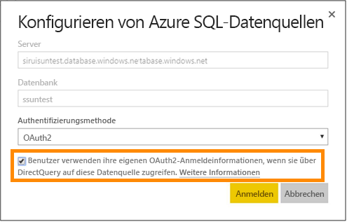
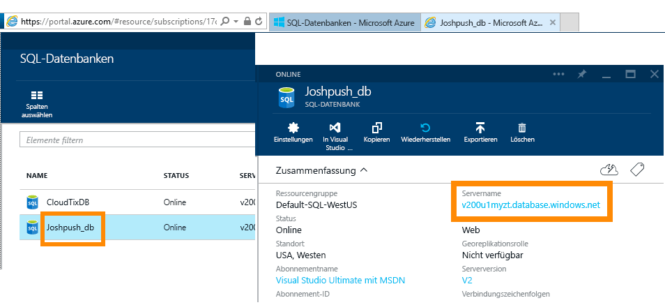
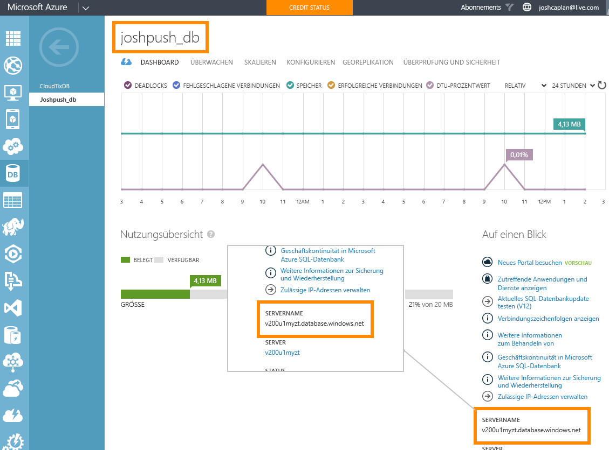

# Azure SQL-Datenbank mit DirectQuery
Erfahren Sie, wie Sie eine direkte Verbindung mit der Azure SQL-Datenbank herstellen und Berichte erstellen, in denen Livedaten verwendet werden. Sie können Ihre Daten in der Datenquelle und nicht in Power BI speichern.

Durch DirectQuery werden Abfragen zurück zur Azure SQL-Datenbank gesendet, während Sie die Daten in der Berichtsansicht untersuchen. Diese Variante wird für Benutzer empfohlen, die mit den Datenbanken und den Entitäten vertraut sind, mit denen die Verbindung hergestellt wird.

**Hinweise:**

* Geben Sie beim Herstellen der Verbindung den vollqualifizierten Servernamen an (weitere Informationen folgen später im Abschnitt)
* Stellen Sie sicher, dass die Firewallregeln für die Datenbank so konfiguriert sind, dass sie den „[Zugriff auf Azure-Dienste erlauben](https://msdn.microsoft.com/library/azure/ee621782.aspx)“.
* Durch jede Aktion, z. B. beim Auswählen einer Spalte oder dem Hinzufügen eines Filters, wird eine Abfrage zurück an die Datenbank gesendet.
* Die Kacheln werden stündlich aktualisiert (die Aktualisierung muss nicht geplant werden). Dies kann in den erweiterten Einstellungen angepasst werden, wenn Sie eine Verbindung herstellen.
* Q&A steht für DirectQuery-Datasets nicht zur Verfügung.
* Schemaänderungen werden nicht automatisch übernommen.

Diese Einschränkungen und Hinweise können sich ändern, da wir die Benutzeroberfläche fortlaufend optimieren. Die Schritte zum Herstellen der Verbindung werden nachfolgend beschrieben. 

## Power BI Desktop und DirectQuery
Zum Herstellen einer Verbindung mit der Azure SQL-Datenbank über DirectQuery müssen Sie Power BI Desktop verwenden. Dieser Ansatz bietet zusätzliche Flexibilität und Funktionalität. Mit Power BI Desktop erstellte Berichte können dann im Power BI-Dienst veröffentlicht werden. [Hier](desktop-use-directquery.md) erhalten Sie weitere Informationen zum Herstellen einer Verbindung mit der Azure SQL-Datenbank über DirectQuery in Power BI Desktop. 

## Einmaliges Anmelden

Nachdem Sie ein Azure SQL DirectQuery-Dataset im Dienst veröffentlichen, können Sie einmaliges Anmelden (Single Sign-On, SSO) über Azure AD-OAuth2 (Azure Active Directory) für Endbenutzer aktivieren. 

Um SSO zu aktivieren, rufen Sie die Einstellungen für das Dataset auf, öffnen die Registerkarte **Datenquellen**, und aktivieren Sie das Kontrollkästchen „SSO“.

Wenn die Option „SSO“ aktiviert ist und Benutzer auf Berichte zugreifen, die auf der Datenquelle beruhen, werden deren authentifizierten Azure AD-Anmeldeinformationen von Power BI in den Abfragen an die Azure SQL-Datenbank gesendet. Dadurch wird sichergestellt, dass die auf Datenquellenebene konfigurierten Sicherheitseinstellungen in Power BI berücksichtigt werden.

Die SSO-Option gilt für alle Datasets, die diese Datenquelle verwenden. Sie hat keine Auswirkungen auf das Authentifizierungsverfahren, das bei Importszenarien verwendet wird.

## Suchen von Parameterwerten
Ihren vollqualifizierten Servernamen und den Datenbanknamen finden Sie im Azure-Portal.

## Nächste Schritte
[Verwenden von DirectQuery in Power BI Desktop](desktop-use-directquery.md)  
[Erste Schritte mit Power BI](service-get-started.md)  
[Abrufen von Daten in Power BI](service-get-data.md)  
Weitere Fragen? [Wenden Sie sich an die Power BI-Community](http://community.powerbi.com/)
