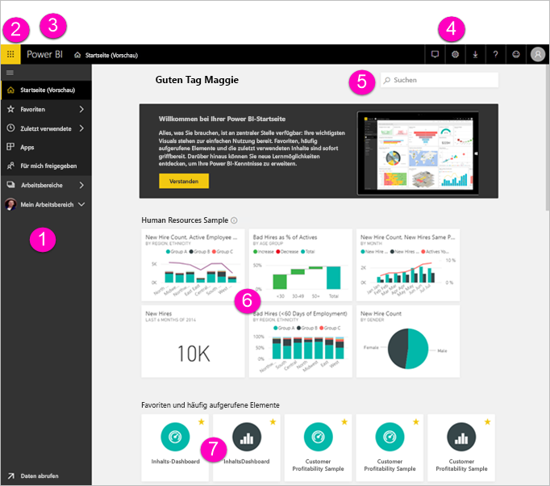
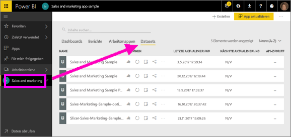
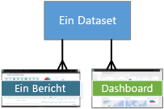
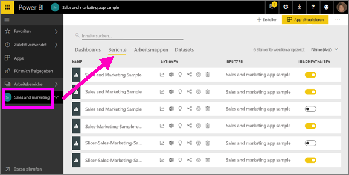
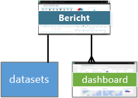
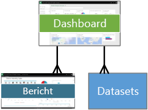
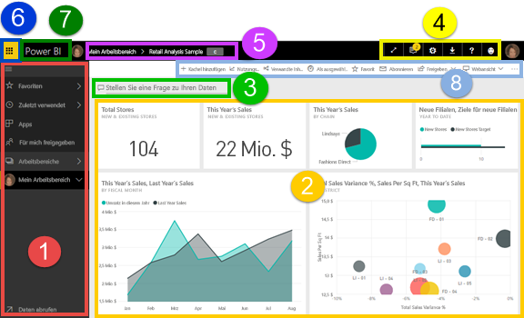
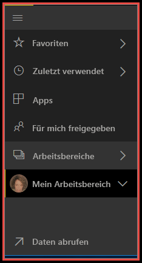

# Grundlegende Konzepte für Designer im Power BI-Dienst

Dieser Artikel soll Ihnen die Orientierung im Power BI-Dienst erleichtern: Was sind die verschiedenen Elemente, wie arbeiten sie zusammen und wie können Sie mit ihnen arbeiten. Sie profitieren mehr davon, wenn Sie sich bereits [für den Power BI-Dienst registriert](service-self-service-signup-for-power-bi.md) und [Daten hinzugefügt](service-get-data.md) haben. Als Entwerfer beginnt Ihr normaler Workflow üblicherweise mit dem Erstellen von Berichten in Power BI Desktop. Anschließend veröffentlichen Sie sie im Power BI-Dienst, wo Sie sie weiter bearbeiten können. Auf der Grundlage Ihrer Berichte erstellen Sie außerdem die Dashboards im Power BI-Dienst. 

Wenn Sie noch nicht über eigene Berichte verfügen, installieren Sie für die Zwecke dieses Artikels ein [Power BI-Beispielinhaltspaket](sample-datasets.md#the-power-bi-samples-as-content-packs).

Wenn Sie den Power BI-Dienst in einem Browser öffnen, sehen Sie zunächst den Startbildschirm. Vermutlich sind dies die Elemente, die angezeigt werden:

1. Navigationsbereich (linker Navigationsbereich)
2. Office 365-App-Startfeld
3. Power BI-Schaltfläche „Start“
4. Symbolschaltflächen, einschließlich Einstellungen, Hilfe und Feedback
5. Suchfeld
6. Kacheln aus einem bevorzugten Dashboard
7. Favoriten und häufig verwendete Dashboards und Berichte

Die Endbenutzer Ihrer Berichte und Dashboards haben das gleiche Starterlebnis im Power BI-Dienst in einem Browser.

Diese Features werden später näher erläutert. Zunächst werden einige Grundkonzepte von Power BI besprochen. Alternativ können Sie sich zuerst dieses Video ansehen.  In diesem Video gibt Will einen Überblick über den Power BI-Dienst und erklärt die grundlegenden Konzepte.

<iframe width="560" height="315" src="https://www.youtube.com/embed/B2vd4MQrz4M" frameborder="0" allowfullscreen></iframe>

## Power BI-Konzepte
Die vier wichtigsten Grundkomponenten von Power BI sind: **_Dashboards_** , **_Berichte_** , **_Arbeitsmappen_** und **_Datasets_** . Diese sind in **_Arbeitsbereichen_** angeordnet. Zunächst sollen Arbeitsbereiche erläutert werden, bevor näher auf die vier Grundkomponenten eingegangen wird.

## Arbeitsbereiche
Arbeitsbereiche sind Container für Dashboards, Berichte, Arbeitsmappen und Datasets in Power BI. Es gibt zwei Typen von Arbeitsbereichen: *Mein Arbeitsbereich* und *App-Arbeitsbereiche*. Was genau ist eine *App*? Eine Power BI-*App* ist eine Sammlung von Dashboards und Berichten, die erstellt wurden, um Schlüsselmetriken für die Power BI-Endbenutzer Ihrer Organisation bereitzustellen. Apps sind interaktiv, können von Endbenutzern aber nicht bearbeitet werden.

- *Mein Arbeitsbereich* ist der persönliche Arbeitsbereich jedes Power BI-Kunden, in dem Sie Ihre eigenen Inhalte bearbeiten. Nur Sie haben Zugriff auf Ihren „Mein Arbeitsbereich“. Sie können Dashboards und Berichte von Ihrem Arbeitsbereich aus freigeben. Wenn Sie in Dashboards und Berichte mit anderen Personen zusammenarbeiten oder eine App erstellen möchten, sollten Sie einen App-Arbeitsbereich verwenden.      
-  *App-Arbeitsbereiche* werden für die Zusammenarbeit und die Freigabe von Inhalten für Kollegen verwendet. Darüber sind hinaus werden hier Apps für Ihre Organisation erstellt, veröffentlicht und verwaltet. Betrachten Sie sie als eine Art Bereitstellungsraum und Container für Ihre Inhalte, die eine Power BI-App bilden. Sie können Ihren App-Arbeitsbereichen Kollegen hinzufügen und gemeinsam an Dashboards, Berichten, Arbeitsmappen und Datasets arbeiten. Alle Mitglieder des app-Arbeitsbereichs benötigen Power BI Pro-Lizenzen. App-Benutzer, die Kollegen, die Zugriff auf die apps, unbedingt nicht, dass Pro-Lizenzen. Erfahren Sie mehr über die [neue Arbeitsbereiche](service-create-the-new-workspaces.md).  

Weitere Informationen zum Freigeben von in der Regel beginnen Sie mit [Möglichkeiten, Dashboards Freigeben Ihrer Arbeit](service-how-to-collaborate-distribute-dashboards-reports.md).

Nun zu den Grundkomponenten von Power BI. Sie können keine Dashboards oder Berichte ohne Daten erstellen (es können zwar leere Dashboards und Berichte verwendet werden, diese wären jedoch nicht nützlich). Beginnen wir also mit **Datasets**.

## Datasets
Ein *Dataset* ist eine Sammlung von Daten, die Sie *importieren* oder mit denen Sie eine *Verbindung herstellen*. In Power BI können Sie Verbindungen mit allen Arten von Datasets herstellen, sie importieren und zentral anordnen.  

Datasets sind *Arbeitsbereichen* zugeordnet, und ein einzelnes Dataset kann Teil mehrerer Arbeitsbereiche sein. Wenn Sie einen Arbeitsbereich öffnen, werden die zugeordneten Datasets auf der Registerkarte **Datasets** aufgeführt. Jedes aufgelistete Dataset stellt eine einzelne Datenquelle dar, z. B. eine Excel-Arbeitsmappe auf OneDrive oder ein lokales tabellarisches SSAS-Dataset oder ein Salesforce-Dataset. Es werden viele verschiedene Datenquellen unterstützt, zu denen beständig neue Datenquellen hinzugefügt werden. Die Liste der [Dataset-Typen, mit denen Sie mit Power BI](service-get-data.md).

Im folgenden Beispiel ist die App „Vertrieb und Marketing“ ausgewählt, und es wurde auf die Registerkarte **Datasets** geklickt.

**EIN** Dataset...

* kann beliebig oft in einem oder mehreren verschiedenen Arbeitsbereichen verwendet werden.
* kann in vielen verschiedenen Berichten verwendet werden.
* Visualisierungen dieses einen Datasets können auf vielen verschiedenen Dashboards angezeigt werden.

  

Wählen Sie am unteren Rand der linken Navigationsleiste **Daten abrufen** aus, um die [Verbindung mit einem Dataset herzustellen oder es zu importieren](service-get-data.md). Befolgen Sie die Anweisungen zum Herstellen einer Verbindung mit der jeweiligen Quelle bzw. zum Importieren, und fügen Sie das Dataset dem aktiven Arbeitsbereich hinzu. Neue Datasets werden mit einem gelben Sternchen markiert. Das zugrunde liegende Dataset wird durch Ihre Arbeit in Power BI nicht verändert.

Datasets, die von einem Arbeitsbereichsmitglied hinzugefügt stehen die anderen Mitglieder des Arbeitsbereichs mit einem *Admin*, *Member*, oder *"Mitwirkender"* Rolle.

Datasets können aktualisiert, umbenannt, untersucht und entfernt werden. Verwenden Sie ein Dataset, um einen völlig neuen Bericht zu erstellen, oder führen Sie [Schnelleinblicke](service-insights.md) aus.  Wählen Sie **Verwandte Inhalte anzeigen**, um zu erfahren, welche Berichte und Dashboards ein Dataset bereits verwenden. Wählen Sie ein Dataset aus, um es zu untersuchen. Tatsächlich öffnen Sie das Dataset im Berichts-Editor, wo Sie beginnen können, die Daten zu untersuchen und Visualisierungen zu erstellen. Fahren wir also mit dem nächsten Thema fort – Berichte.

### Weiterführende Themen
* [Was ist Power BI Premium?](service-premium-what-is.md)
* [Abrufen von Daten in Power BI](service-get-data.md)
* [Beispieldatasets für Power BI](sample-datasets.md)

## Berichte
Ein Power BI-Bericht besteht aus mindestens einer Seite mit Visualisierungen, wie z. B. Liniendiagrammen, Maps und Treemaps. Visualisierungen werden auch als **_visuelle Elemente oder Visuals_** bezeichnet. Alle Visualisierungen in einem Bericht stammen aus einem einzelnen Dataset. Sie können Berichte von Grund auf neu in Power BI erstellen, importieren Sie sie mit Dashboards, die Kollegen für Sie freigeben oder Power BI können zu erstellen, wenn Sie mit Datasets aus Excel, Power BI Desktop, Datenbanken und SaaS-Anwendungen eine Verbindung herstellen.  Wenn Sie z. B. eine Verbindung mit einer Excel-Arbeitsmappe herstellen, die Power View-Tabellen enthält, dann erstellt Power BI einen Bericht auf Basis dieser Tabellen. Und wenn Sie eine Verbindung mit einer SaaS-Anwendung herstellen, wird ein vorgefertigter Bericht von Power BI importiert.

Es gibt zwei Modi, um Berichte anzuzeigen und mit ihnen zu interagieren: *"Leseansicht"* und *Bearbeitungsansicht*. Wenn Sie einen Bericht öffnen, wird es in der Leseansicht geöffnet. Wenn Sie über Bearbeitungsberechtigungen verfügen, und Sie sehen dann **Bericht bearbeiten** in der oberen linken Ecke, und Sie können den Bericht anzuzeigen, in der Bearbeitungsansicht.  Ist ein Bericht in einem Arbeitsbereich, alle Benutzer mit einem *Admin*, *Member*, oder *"Mitwirkender"* Rolle bearbeiten kann. Sie haben Zugriff auf alle untersuchungs-, entwerfen, erstellen und Freigabefunktionen in der Bearbeitungsansicht anzeigen, für diesen Bericht. Die Personen, denen sie den Bericht mit Teilen können untersuchen und mit den Bericht in der Leseansicht interagieren.   

Wenn Sie einen Arbeitsbereich öffnen, werden die zugeordneten Berichte auf der Registerkarte **Berichte** aufgeführt. Jeder aufgeführte Bericht stellt mindestens eine Seite mit Visualisierungen dar, die auf nur einem der zugrunde liegenden Datasets basieren. Wählen Sie einen Bericht aus, um ihn zu öffnen.

Wenn Sie eine app öffnen, sind Sie ein Dashboard angezeigt.  Wählen Sie eine Dashboardkachel (siehe weiter unten) aus, die aus einem Bericht angeheftet wurde, um auf den zugrunde liegenden Bericht zuzugreifen. Beachten Sie, dass nicht alle Kacheln aus Berichten angeheftet werden, möglicherweise müssen Sie also einige Kacheln durchprobieren, bis Sie den gesuchten Bericht finden.

Der Bericht wird standardmäßig in der Leseansicht geöffnet.  Wählen Sie einfach **Bericht bearbeiten** aus, um den Bericht in der Bearbeitungsansicht zu öffnen (falls Sie über die erforderlichen Berechtigungen verfügen).

Im folgenden Beispiel, ich app "Vertrieb und marketing" ausgewählt, und klicken Sie auf der Registerkarte für **Berichte**.

**EIN** Bericht...

* ist in einem einzelnen Arbeitsbereich enthalten.
* kann mehreren Dashboards in diesem Arbeitsbereich zugeordnet sein. Kacheln angeheftet aus, dass ein Bericht auf mehrere Dashboards angezeigt werden kann.
* kann mithilfe der Daten aus einem Dataset erstellt werden. Power BI Desktop können mehr als eine Datenquelle in einem einzelnen Dataset in einem Bericht zusammenfassen und der Bericht in Power BI importiert werden kann.

  

### Weiterführende Themen
- [Erstellen eines Berichts im Power BI-Dienst durch Importieren eines Datasets](service-report-create-new.md)
- [Berichtsoptimierung für den mobilen Power BI-apps](desktop-create-phone-report.md)

## Dashboards
Ein *Dashboard* ist ein von Ihnen **im Power BI-Dienst** oder von einem Kollegen **im Power BI-Dienst** erstelltes Objekt, das für Sie freigegeben wurde. Es handelt sich um einen einzelnen Zeichenbereich, der keine, eine oder mehrere Kacheln und Widgets enthält. Jede aus einem Bericht oder aus [Q&A](power-bi-q-and-a.md) angeheftete Kachel zeigt eine einzelne [Visualisierung](power-bi-report-visualizations.md) an, die aus einem Dataset erstellt wurde und an das Dashboard angeheftet ist. Gesamte Berichtsseiten können ebenfalls als einzelne Kachel an ein Dashboard angeheftet werden. Es gibt viele Möglichkeiten, dem Dashboard Kacheln hinzuzufügen – zu viele, um sie in diesem Übersichtsthema zu behandeln. Weitere Informationen finden Sie unter [Dashboardkacheln in Power BI](service-dashboard-tiles.md).

Warum werden Dashboards erstellt?  Hier sind nur einige der Gründe:

* Sie können auf einen Blick alle Informationen erkennen, die zum Treffen von Entscheidungen erforderlich sind.
* Sie können die wichtigsten unternehmensbezogenen Informationen überwachen.
* Sie können sicherstellen, dass sich alle Kollegen auf derselben Seite befinden und dabei dieselben Informationen anzeigen und verwenden.
* Sie können die Integrität eines Geschäfts, Produkts, Unternehmensbereichs oder einer Marketingkampagne usw. überwachen.
* Sie können eine personalisierte Ansicht eines umfangreicheren Dashboards erstellen, das alle für Sie erforderlichen Metriken enthält.

Wenn Sie einen Arbeitsbereich öffnen, werden die zugeordneten Dashboards auf der Registerkarte **Dashboards** aufgeführt. Wählen Sie ein Dashboard aus, um es zu öffnen. Wenn Sie eine App öffnen, sehen Sie ein Dashboard.  Jedes Dashboard stellt eine angepasste Ansicht einer Teilmenge der zugrunde liegenden Datasets dar.  Wenn Sie der Besitzer des Dashboards sind, haben Sie auch Bearbeitungszugriff auf das oder die zugrunde liegenden Datasets und Berichte.  Wenn das Dashboard für Sie freigegeben wurde, können Sie mit dem Dashboard und allen zugrunde liegenden Berichten interagieren, Sie können jedoch keine Änderungen speichern.

Es gibt viele verschiedene Möglichkeiten, wie Sie oder ein Kollege [ein Dashboard freigeben](service-share-dashboards.md) können. Power BI Pro ist für das Freigeben eines Dashboards und möglicherweise auch zum Anzeigen eines freigegebenen Dashboards erforderlich.

**EIN** Dashboard...

* ist einem einzelnen Arbeitsbereich zugeordnet.
* kann Visualisierungen von verschiedenen Datasets anzeigen.
* kann Visualisierungen von verschiedenen Berichten anzeigen.
* kann Visualisierungen anzeigen, die aus anderen Tools (z.B. Excel) angeheftet wurden.

  

### Weiterführende Themen
* [Erstellen Sie ein leeres Dashboard, und rufen Sie anschließend einige Daten](service-dashboard-create.md) .
* [Duplizieren eines Dashboards](service-dashboard-copy.md)
* [Erstellen einer Telefonansicht eines Dashboards](service-create-dashboard-mobile-phone-view.md)

## Arbeitsmappen
Arbeitsmappen sind eine besondere Art von Dataset. Wenn Sie den Abschnitt **Datasets** weiter oben gelesen haben, wissen Sie bereits das Wichtigste über Arbeitsmappen. Vielleicht fragen Sie sich jedoch, warum Excel-Arbeitsmappen in Power BI manchmal ein **Dataset** und manchmal eine **Arbeitsmappe** sind.

Wenn Sie **Daten abrufen** für Excel-Dateien verwenden, können Sie zwischen den Optionen *Importieren* und *Verknüpfen* für die Datei wählen. Wenn Sie „Verknüpfen“ wählen, wird die Arbeitsmappe in Power BI genauso angezeigt wie in Excel Online. Allerdings haben Sie im Gegensatz zu Excel Online einige hervorragende Funktionen zur Hand, mit denen Sie Elemente aus Arbeitsblättern direkt an Ihre Dashboards anheften können.

Sie können Ihre Arbeitsmappe in Power BI nicht bearbeiten. Wenn Sie aber Änderungen vornehmen müssen, können Sie auf „Bearbeiten“ klicken und die Arbeitsmappe in Excel online oder lokal bearbeiten. Alle vorgenommenen Änderungen werden in der Arbeitsmappe in OneDrive gespeichert.

### Weiterführende Themen
* [Abrufen von Daten aus Excel-Arbeitsmappendateien](service-excel-workbook-files.md)
* [Veröffentlichen in Power BI aus Excel](service-publish-from-excel.md)

## Dashboard in „Mein Arbeitsbereich“
Bis hierher wurden Arbeitsbereiche und die Grundkomponenten erläutert. Nun bringen wir diese zusammen und sehen uns die einzelnen Komponenten der Dashboardumgebung im Power BI-Dienst an.

### 1. **Navigationsbereich** (linker Navigationsbereich)
Verwenden Sie den Navigationsbereich, um zwischen den Arbeitsbereichen und den Grundkomponenten von Power BI zu wechseln: Dashboards, Berichte, Arbeitsmappen und Datasets.  

  

* Wählen Sie **Daten abrufen** aus, um [Datasets, Berichte und Dashboards zu Power BI hinzuzufügen](service-get-data.md).
* Mit diesem Symbol erweitern und reduzieren Sie den Navigationsbereich .
* Öffnen oder verwalten Sie Ihre wichtigsten Inhalte, indem Sie **Favoriten** auswählen.
* Zum Anzeigen und Öffnen der zuletzt abgerufenen Inhalte wählen Sie **Zuletzt verwendet** aus.
* Zum Anzeigen, Öffnen oder Löschen von Apps wählen Sie **Apps** aus.
* Hat ein Kollege Inhalte für Sie freigegeben? Wählen Sie **Für mich freigegeben** aus, um nach den gewünschten Inhalten zu suchen und diese zu sortieren.
* Klicken Sie auf **Arbeitsbereiche**, um Ihre Arbeitsbereiche anzuzeigen und zu öffnen.

Einfachklick auf diese Elemente:

* auf ein Symbol oder eine Überschrift öffnet die Inhaltsansicht.
* auf einen Rechtspfeil (>) öffnet ein Flyoutmenü für Arbeitsbereiche, Favoriten und zuletzt verwendete Elemente.
* ein Doppelpfeilsymbol zeigt die scrollfähige Liste der Dashboards, Berichte, Arbeitsmappen und Datasets für **Mein Arbeitsbereich** an.

### 2. **Zeichenbereich**
Da wir ein Dashboard geöffnet haben, werden im Zeichenbereich Visualisierungskacheln angezeigt. Wenn z.B. der Berichts-Editor geöffnet wäre, würde im Zeichnungsbereich eine Berichtsseite angezeigt werden.

Dashboards bestehen aus [Kacheln](service-dashboard-tiles.md).  Kacheln werden in der Bearbeitungsansicht, Q&A und anderen Dashboards für Berichte erstellt und können aus Excel, SSRS usw. angeheftet werden. Ein besonderer Kacheltyp namens [Widget](service-dashboard-add-widget.md) wird dem Dashboard direkt hinzugefügt. Die auf einem Dashboard angezeigten Kacheln wurden vom Ersteller/Besitzer eines Berichts eigens dort abgelegt.  Das Hinzufügen einer Kachel zu einem Dashboard wird als *anheften* bezeichnet.

Weitere Informationen finden Sie unter [Dashboards](#dashboards) (oben).

### 3. **Fragenfeld für Fragen und Antworten (F&A)**
Eine Möglichkeit zum Untersuchen der Daten besteht darin, eine Frage zu stellen, um über den Bereich für Fragen und Antworten von Power BI eine Antwort in Form einer Visualisierung zu erhalten. Mit Q&A können Inhalte einem Dashboard oder einem Bericht hinzugefügt werden.

Der Bereich für Fragen und Antworten sucht im Dataset bzw. in Datasets, die mit dem Dashboard verbunden sind, nach Antworten.  Bei einem verbundenen Dataset handelt es sich um ein Dataset, für das mindestens eine Kachel an dieses Dashboard angeheftet ist.

Sobald Sie mit der Eingabe einer Frage beginnen, gelangen Sie zur Seite für Fragen und Antworten (F&A). Während der Eingabe unterstützt Sie der Bereich für Fragen und Antworten mithilfe von Umformulierungen, AutoAusfüllen, Vorschlägen usw. dabei, die richtige Frage zu stellen und die beste Antwort zu finden. Wenn Sie eine Visualisierung (Antwort) gefunden haben, die Ihnen gefällt, fügen Sie diese einfach zum Dashboard hinzu. Weitere Informationen finden Sie unter [Fragen und Antworten in Power BI](power-bi-q-and-a.md).

### 4. **Symbolschaltflächen**
Die Symbole in der rechten oberen Ecke sind Ihre Ressourcen für Einstellungen, Benachrichtigungen, Downloads, zum Öffnen der Hilfe und zum Senden von Feedback an das Power BI-Team. Wählen Sie den doppelten Pfeil aus, um das Dashboard im **Vollbildmodus** zu öffnen.  

### 5. **Dashboardtitel** (Navigationspfad oder Breadcrumbs)
Damit Sie leichter erkennen können, welcher Arbeitsbereich und welches Dashboard gerade aktiv ist, wird in Power BI automatisch ein Navigationspfad erstellt.  In diesem Beispiel sehen Sie den Arbeitsbereich („Mein Arbeitsbereich“) und den Dashboardtitel („Retail Analysis Sample“).  Wenn ein Bericht geöffnet wäre, wurde der Name des Berichts am Ende des Navigationspfads angehängt werden.  Jeder Abschnitt des Pfads ist ein aktiver Link.  

Beachten Sie das Symbol „C“ nach dem Dashboardtitel. Dieses Dashboard besitzt das [Datenklassifizierungstag](service-data-classification.md) für „Vertraulich“. Das Tag gibt die Vertraulichkeits- und Sicherheitsstufe der Daten an. Wenn Ihr Administrator die Datenklassifizierung aktiviert hat, wird für jedes Dashboard ein Standardtag festgelegt. Dashboardbesitzer sollten das Tag entsprechend der richtigen Sicherheitsstufe des Dashboards ändern.

### 6. **Office 365-App-Startfeld**
Über das App-Startfeld können Sie mit einem Mausklick einfach auf alle Ihre Office 365-Apps zugreifen. Hier können Sie schnell Ihre E-Mails, Dokumente, Kalender und vieles mehr starten.

### 7. **Power BI-Startseite**
Wenn Sie auf **Power BI** klicken, gelangen Sie zur Power BI-Startseite zurück.

   

### 8. **Beschriftete Symbolschaltflächen**
In diesem Bereich des Bildschirms finden Sie zusätzliche Optionen für die Interaktion mit Inhalten (in diesem Fall dem Dashboard).  Neben den beschrifteten Symbolen können Sie die Auslassungspunkte auswählen, um Optionen zum Duplizieren, Drucken und Aktualisieren des Dashboards und weitere Optionen anzuzeigen.

   

## Nächste Schritte
- [Was ist Power BI?](power-bi-overview.md)  
- [Power BI-Videos](videos.md)  
- [Berichts-Editor – Verschaffen Sie sich einen Überblick](service-the-report-editor-take-a-tour.md)

Weitere Fragen? [Stellen Sie Ihre Frage in der Power BI-Community.](http://community.powerbi.com/)
