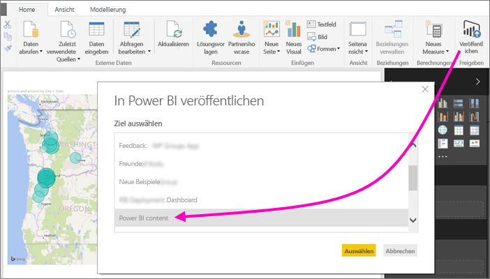
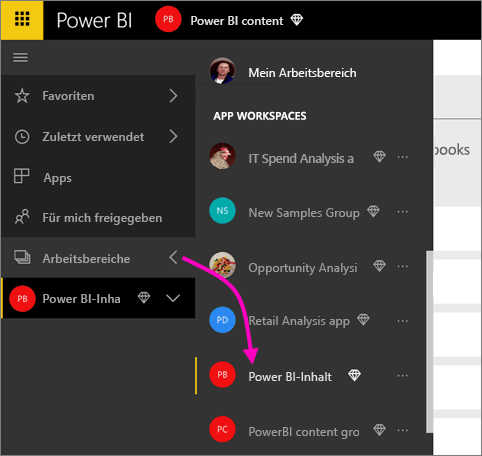
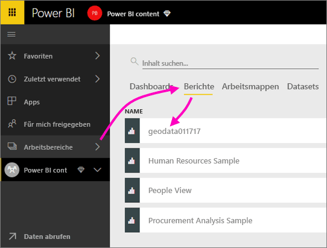
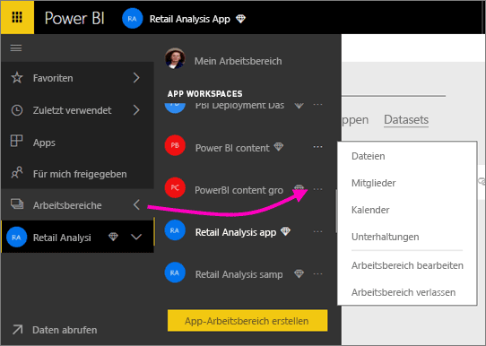
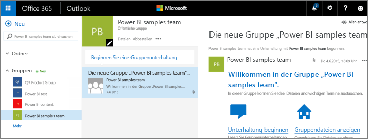
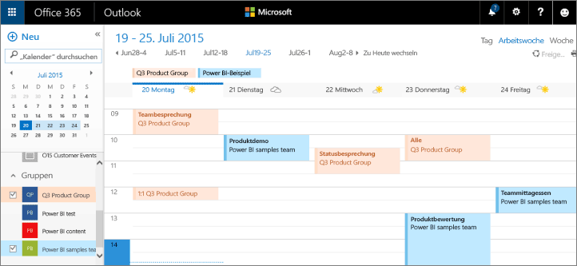

# Zusammenarbeit in Ihrem Power BI-App-Arbeitsbereich
Power BI-App-Arbeitsbereiche stellen einen hervorragenden Ort für die Zusammenarbeit mit Ihren Kollegen an Dashboards, Berichten und Datasets dar, um *Apps* zu erstellen. Die Zusammenarbeit endet jedoch nicht bei Arbeitsbereichen in Power BI. Office 365 bietet weitere Gruppendienste, z.B. das Freigeben von Dateien auf OneDrive for Business, Unterhaltungen in Exchange, freigegebene Kalender und Aufgaben usw. Weitere Informationen erhalten Sie unter [Gruppen in Office 365](https://support.office.com/article/Create-a-group-in-Office-365-7124dc4c-1de9-40d4-b096-e8add19209e9).

> [!NOTE]
> Die Vorschauversion der neuen Arbeitsbereiche ändert die Beziehung zwischen Power BI-Arbeitsbereichen und Office 365-Gruppen. Office 365-Gruppen werden nicht jedes Mal automatisch erstellt, wenn Sie einen dieser neuen Arbeitsbereiche erstellen. Erfahren Sie mehr über [das Erstellen der neuen Arbeitsbereiche (Vorschau)](service-create-the-new-workspaces.md).

App-Arbeitsbereiche stehen nur in Verbindung mit einer [Power BI Pro-Lizenz](service-features-license-type.md) zur Verfügung.

## Zusammenarbeit an Power BI Desktop-Dateien in Ihrem App-Arbeitsbereich
Wenn Sie eine Power BI Desktop-Datei erstellt haben und diese in Ihrem Power BI-App-Arbeitsbereich veröffentlichen, können dadurch alle Mitglieder in Ihrem Arbeitsbereich daran zusammenarbeiten.

1. Wählen Sie in Power BI Desktop im Menüband **Start** die Option **Veröffentlichen** aus, und wählen Sie dann im Feld **Ziel auswählen** Ihren App-Arbeitsbereich aus.
   
    
2. Wählen Sie im Power BI-Dienst den Pfeil neben „Arbeitsbereiche“ aus, und wählen Sie Ihren App-Arbeitsbereich aus.
   
    
3. Wählen Sie die Registerkarte „Berichte“ aus, und wählen Sie dann den Bericht aus.
   
    
   
    Ab hier gehen Sie wie bei jedem anderen Bericht in Power BI vor. Sie und andere Personen in Ihrem App-Arbeitsbereich können den [Bericht ändern](consumer/end-user-reports.md) und Kacheln in einem Dashboard Ihrer Wahl speichern.

## Zusammenarbeiten in Office 365
Ausgangspunkt der Zusammenarbeit in Office 365 ist der App-Arbeitsbereich in Power BI.

1. Wählen Sie im Power BI-Dienst den Pfeil neben „Arbeitsbereiche“ aus, und wählen Sie dann die Auslassungspunkte (**...**) neben dem Namen Ihres Arbeitsbereichs aus. 
   
   
2. Über dieses Menü können Sie auf verschiedene Arten mit Ihrer Gruppe zusammenarbeiten: 
   
   * [Gruppenunterhaltung in Office 365](service-collaborate-power-bi-workspace.md#have-a-group-conversation-in-office-365)
   * [Planen eines Ereignisses](service-collaborate-power-bi-workspace.md#schedule-an-event-on-the-apps-group-workspace-calendar) im Gruppenarbeitsbereichskalender
   
   Beim ersten Aufrufen des Gruppenarbeitsbereichs Ihrer App in Office 365 müssen Sie unter Umständen ein wenig warten. Lassen Sie sich 15 bis 30 Minuten Zeit, und aktualisieren Sie dann Ihren Browser.

## Gruppenunterhaltung in Office 365
1. Wählen Sie die Auslassungspunkte (...) neben dem Namen des App-Arbeitsbereichs \> **Unterhaltungen** aus. 
   
    
   
   Daraufhin wird die E-Mail- und Unterhaltungswebsite für den Gruppenarbeitsbereich Ihrer App in Outlook für Office 365 geöffnet.
   
   
2. Erfahren Sie mehr über [Gruppenunterhaltungen in Outlook für Office 365](https://support.office.com/Article/Have-a-group-conversation-a0482e24-a769-4e39-a5ba-a7c56e828b22).

## Planen eines Ereignisses im Gruppenarbeitsbereichskalender der App
1. Wählen Sie die Auslassungspunkte (**...**) neben dem Arbeitsbereichsnamen \> **Kalender** aus. 
   
   
   
   Daraufhin wird der Kalender für den Gruppenarbeitsbereich Ihrer App in Outlook für Office 365 geöffnet.
   
   
2. Erfahren Sie mehr über [Gruppenkalender in Outlook für Office 365](https://support.office.com/Article/Add-edit-and-subscribe-to-group-events-0cf1ad68-1034-4306-b367-d75e9818376a).

## Verwalten eines App-Arbeitsbereichs
Wenn Sie Besitzer oder Administrator eines App-Arbeitsbereichs sind, können Sie auch Arbeitsbereichsmitglieder hinzufügen oder entfernen. Erfahren Sie mehr über das [Verwalten Ihres Power BI-App-Arbeitsbereichs](service-manage-app-workspace-in-power-bi-and-office-365.md).

## Nächste Schritte
* [Erstellen von Apps und App-Arbeitsbereichen in Power BI](service-create-distribute-apps.md)
* Weitere Fragen? [Wenden Sie sich an die Power BI-Community](http://community.powerbi.com/)
* Feedback? Besuchen Sie [Power BI Ideas](https://ideas.powerbi.com/forums/265200-power-bi).

