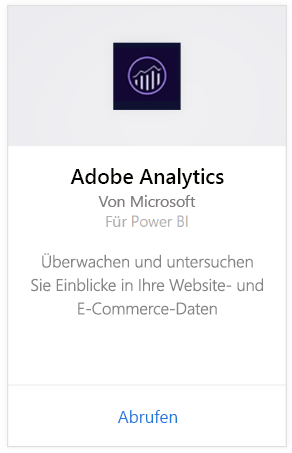
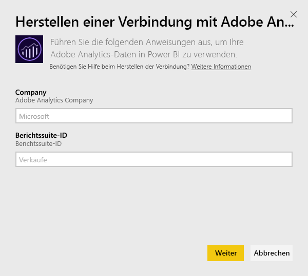
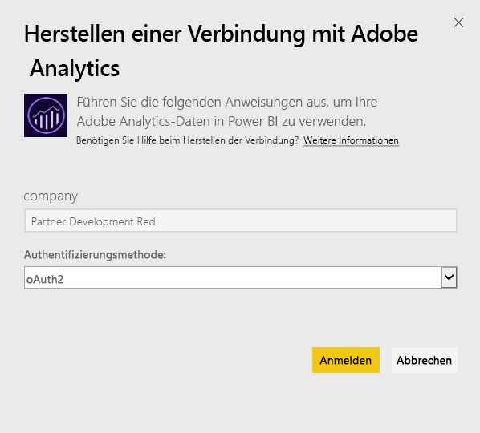
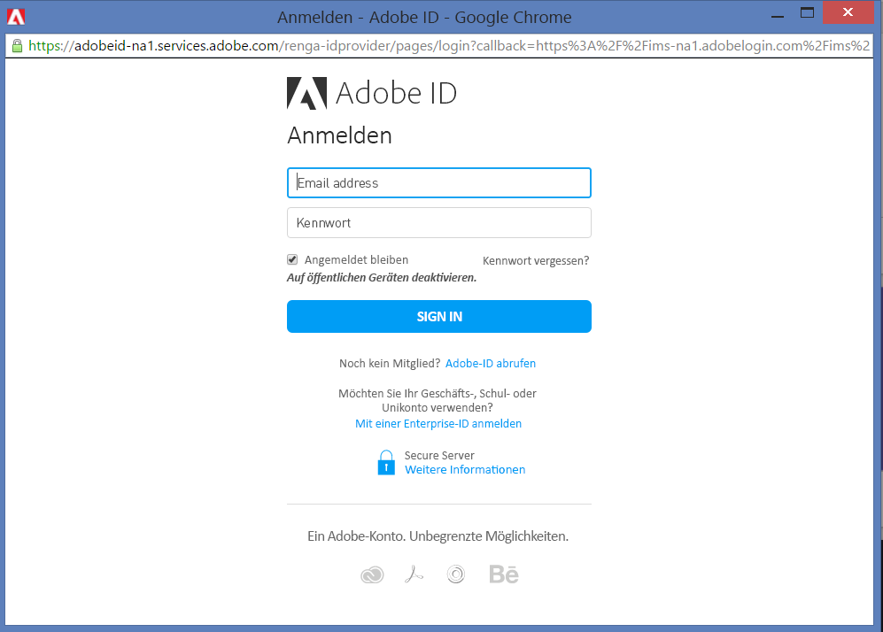
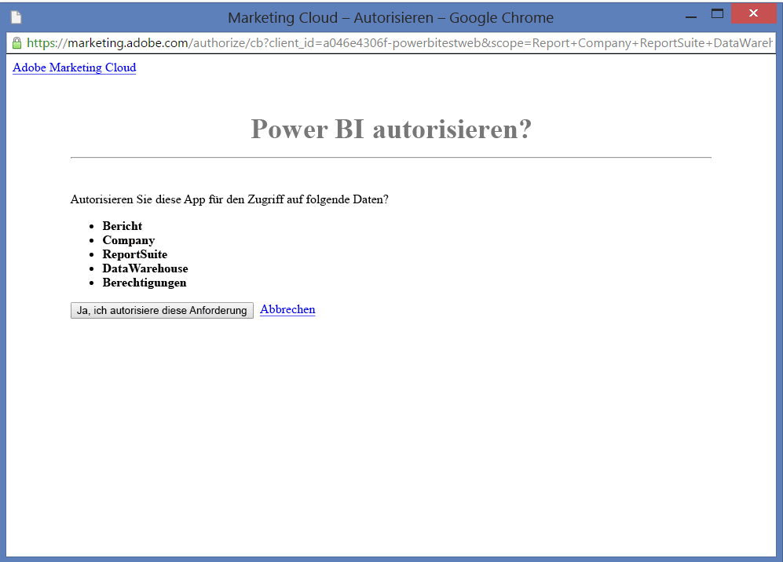
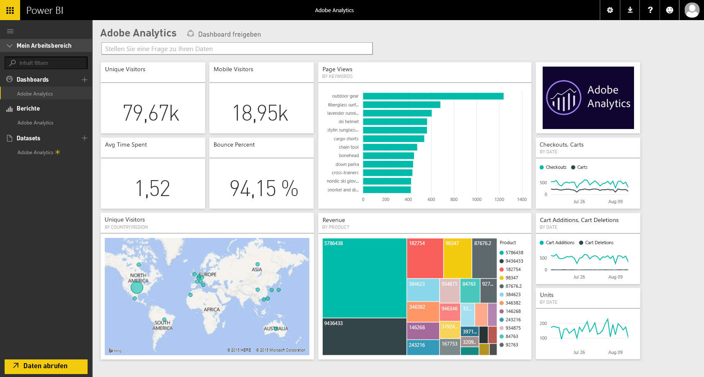
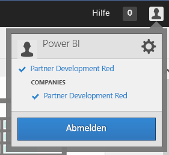
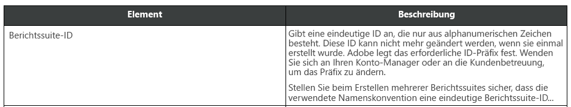

# Herstellen einer Verbindung mit Adobe Analytics mithilfe von Power BI
Das Herstellen einer Verbindung mit Adobe Analytics über Power BI beginnt mit dem Verbinden mit Ihrem Konto für die Adobe Analytics Marketing Cloud. Sie erhalten eine App mit einem Power BI-Dashboard und einer Reihe von Power BI-Berichten, die Erkenntnisse zum Datenverkehr Ihrer Website und zu Benutzerdimensionen bieten. Die Daten werden automatisch einmal täglich aktualisiert. Sie können mit dem Dashboard und den Berichten interagieren, jedoch keine Änderungen speichern.

Stellen Sie eine Verbindung mit [Adobe Analytics](https://app.powerbi.com/getdata/services/adobe-analytics) her, oder erfahren Sie mehr über die [Adobe Analytics-Integration](https://powerbi.microsoft.com/integrations/adobe-analytics) in Power BI.

## Herstellen der Verbindung
[!INCLUDE [powerbi-service-apps-get-more-apps](./includes/powerbi-service-apps-get-more-apps.md)]

1. Wählen Sie **Adobe Analytics** \> **Abrufen** aus.
   
   
2. Power BI stellt eine Verbindung mit einem bestimmten Adobe Analytics-Unternehmen und einer Berichtssuite-ID her (nicht mit dem Namen der Berichtssuite). Unten finden Sie Einzelheiten zum [Suchen dieser Parameter](#FindingParams).
   
   
3. Wählen Sie als **Authentifizierungsmethode** die Option **oAuth2** \> **Anmelden** aus. Geben Sie auf die Aufforderung hin Ihre Adobe Analytics-Anmeldeinformationen ein. 
   
    
   
    
4. Klicken Sie auf **Akzeptieren** , um Power BI den Zugriff auf Ihre Adobe Analytics-Daten zu erlauben.
   
   
5. Nachdem Sie zugestimmt haben, startet der Importvorgang automatisch. 

## Anzeigen des Dashboards und der Berichte von Adobe Analytics
[!INCLUDE [powerbi-service-apps-open-app](./includes/powerbi-service-apps-open-app.md)]

      

[!INCLUDE [powerbi-service-apps-open-app](./includes/powerbi-service-apps-what-now.md)]

## Inhalt
Power BI verwendet die Adobe Analytics Report-API zum Definieren und Ausführen von Berichten für die folgenden Tabellen:

| **Tabellenname** | **Spaltendetails** |
| --- | --- |
| Produkte |elements=  "product" (Top 25)   metrics="cartadditions", "cartremovals", "carts", "cartviews", "checkouts", "revenue", "units" |
| Browsers |elements= "browser" (Top 25)   metrics="bounces", "bouncerate", "visitors", "visits", "uniquevisitors", "totaltimespent", "pageviews" |
| Pages |elements= "page" (Top 25)   metrics="cartadditions", "cartremovals", "carts", "cartviews", "checkouts", "revenue", "units", "visits", "uniquevisitors", "pageviews", "bounces", "bouncerate", "totaltimespent" |
| JavaScript Enabled |elements=  "javascriptenabled”, “browser” (Top 25) |
| Mobile OS |elements= "mobileos"(Top 25)  metrics="bounces", "bouncerate", "visitors", "visits", "uniquevisitors", "totaltimespent", "cartadditions", "cartremovals", "checkouts", "revenue", "units", "pageviews" |
| Search Engines Keywords |elements= "searchengine" "searchenginekeyword"   metrics="bounces", "bouncerate", "visitors", "visits", "entries", "uniquevisitors", "totaltimespent", "cartadditions", "cartremovals", "carts", "cartviews", "checkouts", "revenue", "units", "pageviews" |
| Search Engine to Products |elements= "searchengine", "product"   metrics="bounces", "bouncerate", "visitors", "visits", "entries", "uniquevisitors", "totaltimespent", "cartadditions", "cartremovals", "carts", "cartviews", "checkouts", "revenue", "units", "pageviews" |
| Referring Pages |elements= "referrer" (Top 15), “page" (Top 10)   metrics="bounces", "bouncerate", "visitors", "visits", "entries", "uniquevisitors", "totaltimespent", "cartadditions", "cartremovals", "carts", "cartviews", "checkouts", "revenue", "units", "pageviews" |
| Geocountry Pages |elements= "geocountry" (Top 20), "page"   metrics="bounces", "bouncerate", "visitors", "visits", "entries", "uniquevisitors", "totaltimespent", "cartadditions", "cartremovals", "carts", "cartviews", "checkouts", "revenue", "units", "pageviews" |
| Geocountry Product |elements= "geocountry" (Top 20), "product"  metrics="bounces", "bouncerate", "visitors", "visits", "entries", "uniquevisitors", "totaltimespent", "cartadditions", "cartremovals", "carts", "cartviews", "checkouts", "revenue", "units" |
| Country and Region Lookup |elements= "geocountry" (Top 200)   metrics="bounces", "bouncerate", "visitors", "visits", "entries", "uniquevisitors", "totaltimespent", "cartadditions", "cartremovals", "carts", "cartviews", "checkouts", "revenue", "units" |
| Language |elements= "language", "browser" (Top 25)   metrics="bounces", "bouncerate", "visitors", "visits", "uniquevisitors", "totaltimespent", "pageviews", "cartadditions", "cartremovals", "checkouts", "carts", "cartviews" |
| Search Engines Look Up |elements= "searchengine" (top 100)   metrics="bounces", "bouncerate", "visitors", "visits", "entries", "uniquevisitors", "totaltimespent", "cartadditions", "cartremovals", "carts", "cartviews", "checkouts", "revenue", "units" |
| Browser Lookup |elements= "browser" (Top 25) |

## Systemanforderungen
Zugriff auf [Adobe Analytics](http://www.adobe.com/marketing-cloud/web-analytics.html) wird benötigt, einschließlich des Zugriffs auf die nachstehend beschriebenen ordnungsgemäßen Parameter.

## Suchen von Parametern
**Unternehmen**

Den Wert „Unternehmen“ finden Sie oben rechts in Ihrem Konto, sobald Sie angemeldet sind. Bei dem Wert werden Groß-/Kleinschreibung und Leerzeichen beachtet. Geben Sie ihn genau so ein , wie er in Ihrem Konto angezeigt wird.

**Berichtssuite-ID**

Die Suite-ID wird beim Erstellen der Berichtssammlung erstellt. Sie können sich an Ihren Administrator wenden, um den ID-Wert zu ermitteln. Beachten Sie, dass es sich nicht um den Namen der Berichtssuite handelt.

Aus der [Dokumentation](https://marketing.adobe.com/resources/help/en_US/reference/new_report_suite.html) von Adobe:

## Problembehandlung
Wenn Sie nach Angabe Ihrer Anmeldeinformationen eine Fehlermeldung erhalten, der zufolge Sie keine Berechtigungen haben, stellen Sie gemeinsam mit Ihrem Administrator sicher, dass Sie Zugang zur Adobe Analytics-API haben. Vergewissern Sie sich zudem, dass die bereitgestellte Adobe-ID mit Ihrer Marketing Cloud-Organisation (zugeordnet zu einem Adobe Analytics-Unternehmen) verknüpft ist.

Wenn erst nach dem erfolgreichen Verlassen des Anmeldebildschirms ein Fehler auftritt, ist seine Ursache möglicherweise, dass das Ausführen der Berichte zu lange dauert. Ein häufiger Fehler lautet etwa wie *„Fehler beim Auslesen der Daten aus dem Adobe Analytics-Bericht. Der Bericht enthielt &quot;referrer, page&quot;. Die geschätzte Dauer betrug xx Sekunden“*. Konsultieren Sie den Abschnitt „Inhalt“, und führen Sie einen Vergleich mit der Größe Ihrer Adobe-Instanz durch. Leider gibt es derzeit keine Möglichkeit zum Umgehen dieses Timeouts. Wir ziehen allerdings Updates zur Unterstützung größerer Instanzen in Betracht. Unter https://ideas.powerbi.com können Sie dem Power BI-Team Feedback geben.

## Nächste Schritte
* [Was sind Apps in Power BI?](service-install-use-apps.md)
* [Abrufen von Daten in Power BI](service-get-data.md)
* Weitere Fragen? [Stellen Sie Ihre Frage in der Power BI-Community.](http://community.powerbi.com/)

