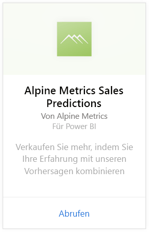
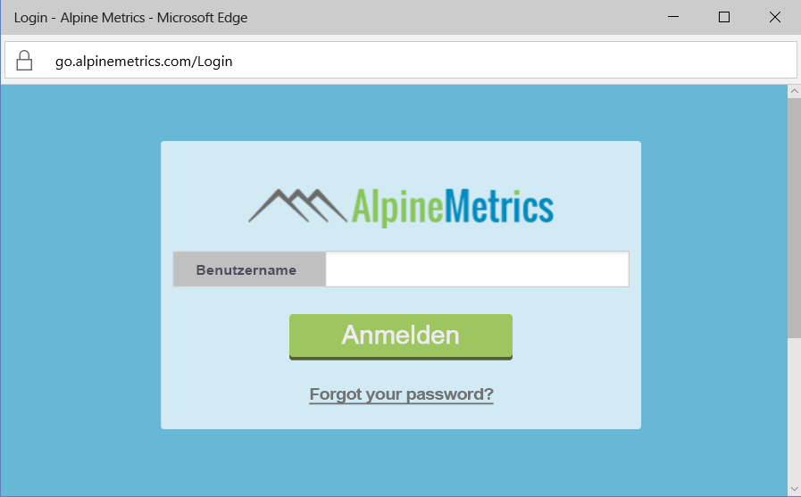
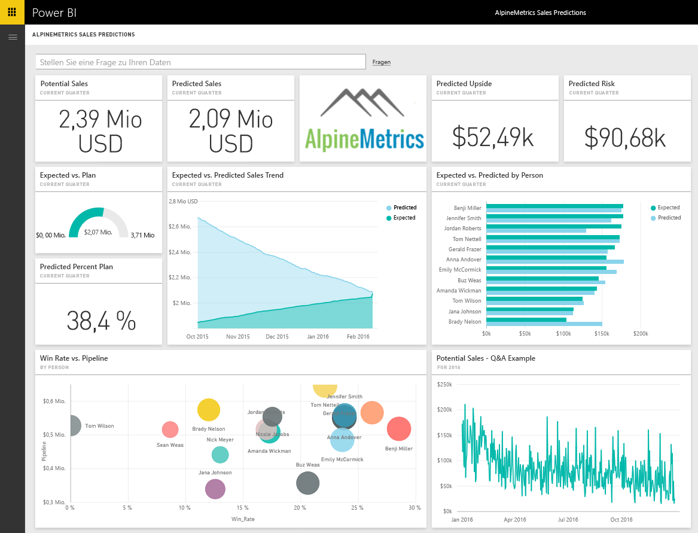

# Herstellen einer Verbindung mit Alpine Metrics Sales Predictions mithilfe von Power BI
Alpine Metrics ermöglicht dank hochmoderner Technologie die Optimierung vorhersagbarer Vertriebsprozesse in der Cloud und nach Bedarf – sowohl für kleine als auch für große Vertriebsorganisationen. Das Alpine Metrics Sales Predictions-Inhaltspaket für Power BI umfasst Metriken wie potenzielle und vorhergesagte Verkäufe und Risiken, die Ihnen einen tieferen Einblick in die Zukunft Ihrer Geschäfte bieten. 

Stellen Sie eine Verbindung mit dem [Alpine Metrics Sales Predictions-Inhaltspaket](https://app.powerbi.com/getdata/services/alpine-metrics) für Power BI her.

## Herstellen der Verbindung
1. Wählen Sie unten im linken Navigationsbereich „Daten abrufen“ aus.  
   
    
2. Wählen Sie im Feld **Dienste** die Option **Abrufen**aus.  
   
    
3. Wählen Sie **Alpine Metrics Sales Predictions** und dann **Abrufen** aus.  
   
    
4. Wählen Sie **OAuth 2** und anschließend **Anmelden** aus. Geben Sie Ihre Alpine Metrics-Anmeldeinformationen an, wenn Sie dazu aufgefordert werden.
   
    
   
    
5. Sobald Sie verbunden sind, werden ein Dashboard, ein Bericht und ein Dataset automatisch geladen. Anschließend werden die Kacheln mit Daten aus Ihrem Konto aktualisiert.
   
    

**Was nun?**

* Versuchen Sie, am oberen Rand des Dashboards [im Q&A-Feld eine Frage zu stellen](power-bi-q-and-a.md).
* [Ändern Sie die Kacheln](service-dashboard-edit-tile.md) im Dashboard.
* [Wählen Sie eine Kachel aus](service-dashboard-tiles.md), um den zugrunde liegenden Bericht zu öffnen.
* Ihr Dataset ist auf eine tägliche Aktualisierung festgelegt. Sie können jedoch das Aktualisierungsintervall ändern oder es über **Jetzt aktualisieren** nach Bedarf aktualisieren.

## Inhalt
Das Inhaltspaket umfasst Daten aus den folgenden Tabellen:  

    - Account    
    - Unternehmen    
    - Land    
    - Industry (Branche)    
    - Opportunity  
    - Person  
    - Prediction (Vorhersage)    
    - Prediction History (Vorhersageverlauf)    
    - Product  
    - Region    

## Systemanforderungen
Ein Alpine Metrics-Konto mit Berechtigungen für die obigen Tabellen wird benötigt, um dieses Inhaltspaket zu instanziieren.

## Nächste Schritte
[Erste Schritte mit Power BI](service-get-started.md)

[Power BI – Grundkonzepte](service-basic-concepts.md)

