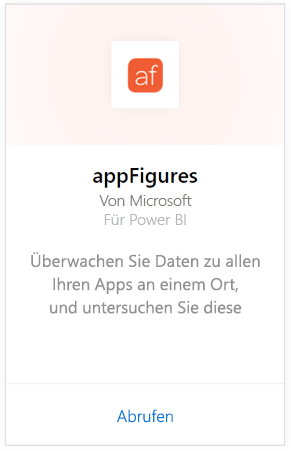
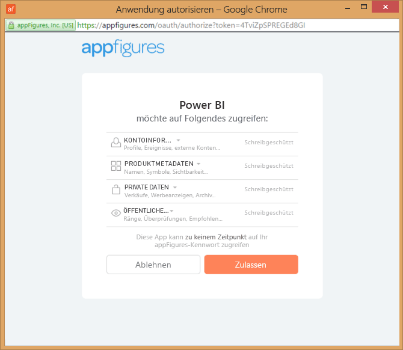
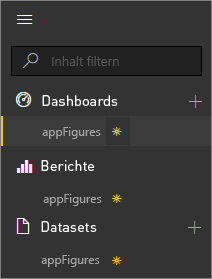
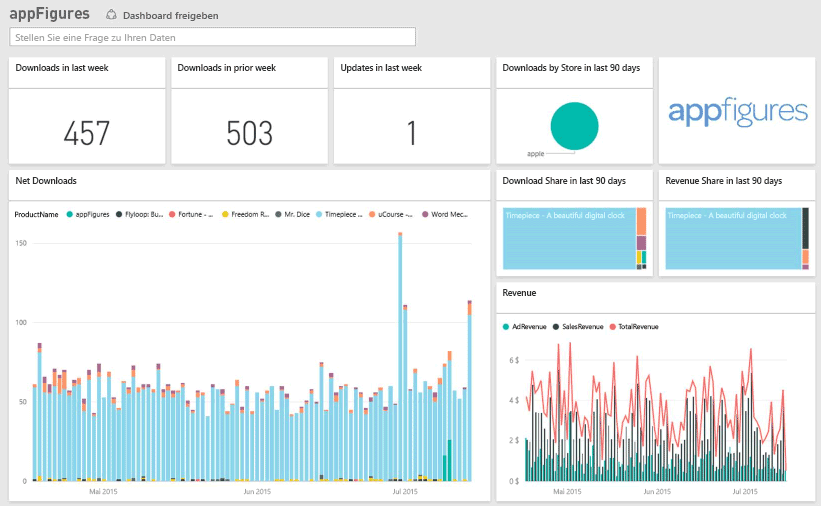
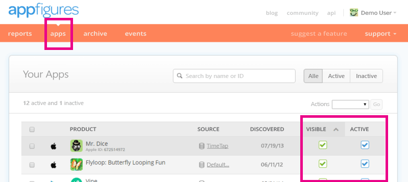

# Herstellen einer Verbindung mit appFigures mithilfe von Power BI
Die Nachverfolgung wichtiger statistischer Daten zu Ihren Apps gestaltet sich mit Power BI und dem appFigures-Inhaltspaket ganz einfach. Power BI ruft die Daten ab (einschließlich der App-Verkäufe, Downloads und Werbestatistiken) und erstellt auf Basis dieser Daten ein Standarddashboard und zugehörige Berichte.

Stellen Sie eine Verbindung mit dem [appFigures-Inhaltspaket](https://app.powerbi.com/getdata/services/appfigures) her, oder erfahren Sie mehr über die [Integration von appFigures](https://powerbi.microsoft.com/integrations/appfigures) in Power BI.

## Herstellen der Verbindung
1. Wählen Sie unten im linken Navigationsbereich **Daten abrufen** aus.
   
   
2. Wählen Sie im Feld **Dienste** die Option **Abrufen**aus.
   
   
3. Wählen Sie **appFigures** \> **Abrufen** aus.
   
   
4. Wählen Sie als **Authentifizierungsmethode** die Option **oAuth2** \> **Anmelden** aus. Geben Sie bei der entsprechenden Aufforderung Ihre appFigures-Anmeldeinformationen ein, und führen Sie den appFigures-Authentifizierungsvorgang aus.
   
   Wenn Sie die Verbindung zum ersten Mal herstellen, werden Sie von Power BI aufgefordert, den Lesezugriff für Ihr Konto zu erteilen. Klicken Sie auf **Zulassen** , um den Importvorgang zu starten. Dies kann je nach der im Konto enthaltenen Datenmenge einige Minuten dauern.
   
   
5. Nachdem die Daten von Power BI importiert wurden, werden im linken Navigationsbereich ein neues Dashboard, ein Bericht und ein Dataset angezeigt. Neue Elemente werden mit einem gelben Sternchen (\*) markiert:
   
    
6. Wählen Sie das appFigures-Dashboard aus. Dies ist der Standarddashboard, das Power BI zum Anzeigen Ihrer Daten erstellt. Sie können dieses Dashboard anpassen, damit Ihre Daten auf die gewünschte Weise angezeigt werden.
   
    

**Was nun?**

* Versuchen Sie, am oberen Rand des Dashboards [im Q&A-Feld eine Frage zu stellen](power-bi-q-and-a.md).
* [Ändern Sie die Kacheln](service-dashboard-edit-tile.md) im Dashboard.
* [Wählen Sie eine Kachel aus](service-dashboard-tiles.md), um den zugrunde liegenden Bericht zu öffnen.
* Ihr Dataset ist auf eine tägliche Aktualisierung festgelegt. Sie können jedoch das Aktualisierungsintervall ändern oder es über **Jetzt aktualisieren** nach Bedarf aktualisieren.

## Inhalt
Die folgenden Daten sind über appFigures in Power BI verfügbar.

| **Tabellenname** | **Beschreibung** |
| --- | --- |
| Länder |Diese Tabelle enthält Informationen zu Ländernamen. |
| Datumsangaben |Diese Tabelle enthält die Datumsangaben ab dem heutigen Datum bis zurück zum frühesten Veröffentlichungsdatum von Apps, die in Ihrem appFigures-Konto aktiv und sichtbar sind. |
| Ereignisse |Diese Tabelle enthält Informationen zu Downloads, Umsätzen und Werbung für die einzelnen Apps, die für den jeweiligen Tag nach Land sortiert sind. Beachten Sie, dass sich die Informationen zu App- und In-App-Käufen in dieser einzelnen Tabelle befinden. Sie können die Spalte <strong>Typ</strong> verwenden, um diese Informationen zu unterscheiden. |
| In-Apps |Diese Tabelle enthält Daten zu den verschiedenen Typen von In-App-Käufen, die aktiven, sichtbaren Apps in Ihrem appFigures-Konto zugeordnet sind. |
| Produkte |Diese Tabelle enthält Daten zu den verschiedenen Apps, die in Ihrem appFigures-Konto aktiv und sichtbar sind. |

## Problembehandlung
Wenn die Daten aus einigen Apps nicht in Power BI angezeigt werden, überprüfen Sie, ob diese Apps auf der Registerkarte **Apps** der appFigures-Website aktiv und sichtbar sind.

## Nächste Schritte
* [Erste Schritte mit Power BI](service-get-started.md)
* [Abrufen von Daten in Power BI](service-get-data.md)

