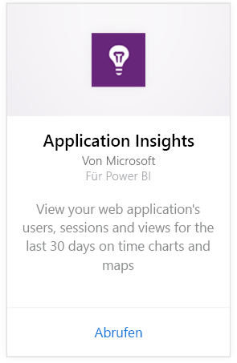
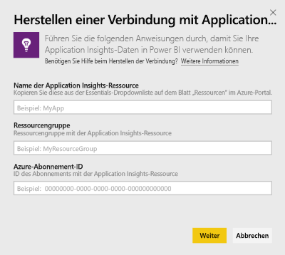
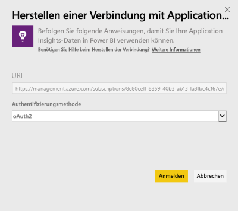
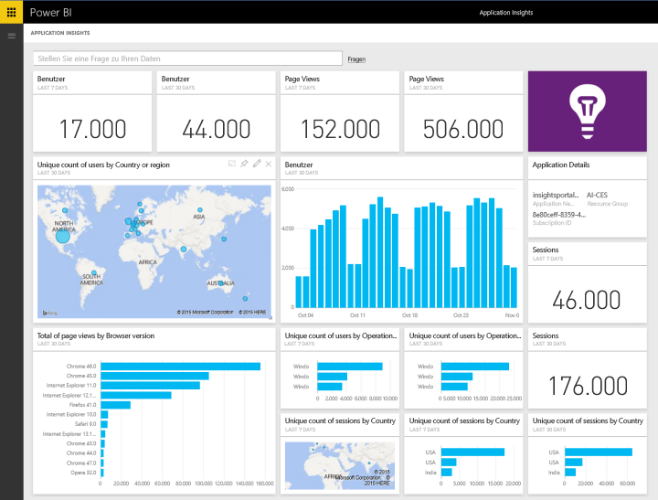
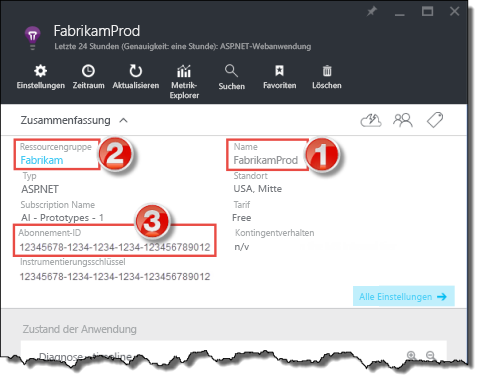
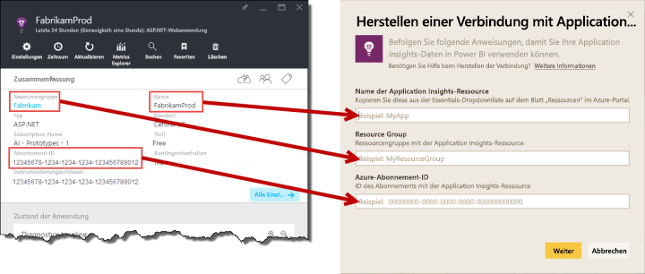

# Herstellen einer Verbindung mit Application Insights mithilfe von Power BI
Verwenden Sie Power BI, um leistungsstarke benutzerdefinierte Dashboards auf Basis der [Application Insights](/azure/application-insights/app-insights-overview/)-Telemetriedaten zu erstellen. Profitieren Sie von einer völlig neuen Sicht auf Ihre App-Telemetrie. Kombinieren Sie Metriken aus mehreren Apps oder Komponentendiensten in einem Dashboard. Diese erste Version des Power BI-Inhaltspakets für Application Insights enthält Widgets für auf die allgemeine Nutzung bezogene Metriken wie aktive Benutzer, Seitenansicht, Sitzungen, Browser- und Betriebssystemversion sowie die geografische Verteilung von Benutzern in einer Karte.

Stellen Sie eine Verbindung mit dem [Application Insights-Inhaltspaket](https://app.powerbi.com/getdata/services/application-insights) für Power BI her.

>[!NOTE]
>Die Integrationsmethode ist mittlerweile **veraltet**. Verwenden Sie die [Exportfunktion für Analyseabfragen](https://docs.microsoft.com/azure/application-insights/app-insights-export-power-bi#export-analytics-queries), um mehr über die bevorzugte Methode zum Verknüpfen von Application Insights mit Power BI zu erfahren.

## Herstellen der Verbindung
1. Wählen Sie unten im linken Navigationsbereich **Daten abrufen** aus.
   
    
2. Wählen Sie im Feld **Dienste** die Option **Abrufen**aus.
   
    
3. Wählen Sie **Application Insights**  >  **Abrufen** aus.
   
    
4. Geben Sie die Details der Anwendung ein, mit der Sie eine Verbindung herstellen möchten, einschließlich **Application Insights-Ressourcenname**, **Ressourcengruppe**und **Abonnement-ID**. Weitere Informationen finden Sie unten unter [Ermitteln Ihrer Application Insights-Parameter](#FindingAppInsightsParams).
   
        
5. Wählen Sie **Anmelden** aus, und befolgen Sie zum Herstellen der Verbindung die Anweisungen auf den Bildschirmen.
   
    
6. Der Importvorgang startet automatisch. Nach Abschluss des Vorgangs wird eine Benachrichtigung angezeigt, und im Navigationsbereich erscheint ein neues Dashboard, ein Bericht und ein Dataset (mit einem Sternzeichen gekennzeichnet).  Wählen Sie das Dashboard aus, um die importierten Daten anzuzeigen.
   
    

**Was nun?**

* Versuchen Sie, am oberen Rand des Dashboards [im Q&A-Feld eine Frage zu stellen](consumer/end-user-q-and-a.md).
* [Ändern Sie die Kacheln](service-dashboard-edit-tile.md) im Dashboard.
* [Wählen Sie eine Kachel aus](consumer/end-user-tiles.md), um den zugrunde liegenden Bericht zu öffnen.
* Zwar ist Ihr Dataset auf tägliche Aktualisierung festgelegt, jedoch können Sie das Aktualisierungsintervall ändern oder über **Jetzt aktualisieren** nach Bedarf aktualisieren.

## Inhalt
Das Application Insights-Inhaltspaket umfasst die folgenden Tabellen und Metriken:  

    ´´´
    - ApplicationDetails  
    - UniqueUsersLast7Days   
    - UniqueUsersLast30Days   
    - UniqueUsersDailyLast30Days  
    - UniqueUsersByCountryLast7Days  
    - UniqueUsersByCountryLast30Days   
    - PageViewsDailyLast30Days   
    - SessionsLast7Days   
    - SessionsLast30Days  
    - PageViewsByBrowserVersionDailyLast30Days   
    - UniqueUsersByOperatingSystemLast7Days   
    - UniqueUsersByOperatingSystemLast30Days    
    - SessionsDailyLast30Days   
    - SessionsByCountryLast7Days   
    - SessionsByCountryLast30Days   
    - PageViewsByCountryDailyLast30Days  
    ´´´ 

## Suchen von Parametern
Den Ressourcennamen, die Ressourcengruppe und die Abonnement-ID finden Sie im Azure-Portal. Wenn Sie den Namen auswählen, wird eine detaillierte Ansicht geöffnet. Verwenden Sie die Dropdownliste „Zusammenfassung“, um die benötigten Werte zu ermitteln.

Kopieren Sie diese, und fügen Sie sie in die Power BI-Felder ein:

## Nächste Schritte
[Erste Schritte mit Power BI](service-get-started.md)

[Abrufen von Daten in Power BI](service-get-data.md)

